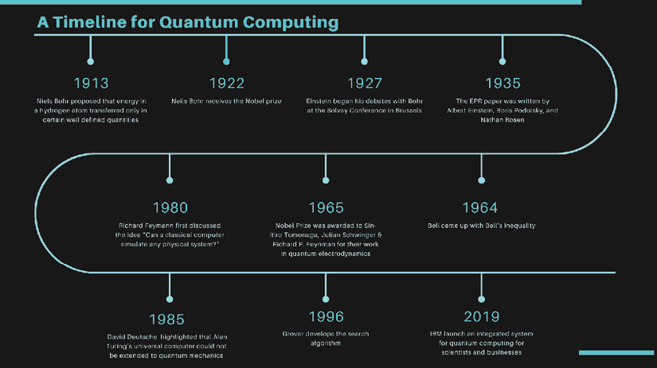
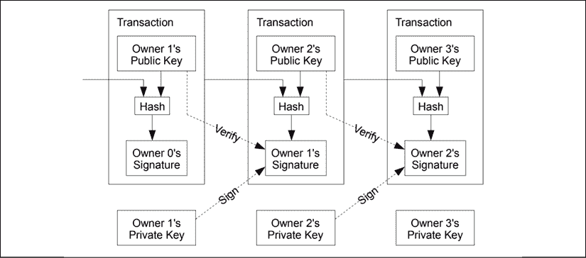

# one

# 量子计算和区块链简介

> 这是最好的时代，也是最坏的时代，

> 这是智慧的时代，这是愚蠢的时代，

> 这是信仰的时代，这是怀疑的时代，

> 这是光明的季节，这是黑暗的季节，

> 这是希望的春天，这是绝望的冬天。

我敢肯定查尔斯·狄更斯没有预见到量子计算或区块链。然而，他 160 年前的话仍然适用于我们看到的这两种技术的兴衰。量子计算已经存在了大半个世纪。相比之下，区块链在 2008 年才首次被引入世界。

与近年来冲击我们的区块链浪潮不同，量子原理已经存在了几十年。量子物理学一直是一个非常有争议的领域，并且是量子计算的基础。然而，量子计算领域最近获得了发展势头。

尽管这两种技术的时代不同，但它们有着有趣的历史。例如，大多数了解区块链的人都认为这个框架是健壮的。然而，这项技术仍然远非完美，量子计算也是如此。

过去十年中，量子计算背后的动力主要来自算法和基础设施的进步。然而，在我看来，这也是因为我们生活的数据时代，量子计算机的一些用例变得越来越清晰和相关。在这一章中，我将介绍这两种技术的历史，它们都有着有争议的过去。它们在现代社会中作为变革性技术的地位是无可争议的。

# 这本书的作用

这本书的目的是探索量子计算和区块链的重叠部分。这两种技术基本上都是基于密码学。因此，它们有可能会发生碰撞。然而，当我们审视这些技术的实际应用时，它们是相辅相成的。

在这一章中，我们将讨论量子计算和区块链的基本技术概念。我们将深入研究量子计算及其历史，然后触及与本书主题相关的区块链的一些关键概念。

我想在本书中确立的一个关键主题是*技术只是达到目的*的一种手段。虽然理解它很重要，并对其可能性感到兴奋，但只有当一项技术能够改变人们的生活时，它才是特别的。

社交媒体上有很多关于量子计算将杀死区块链的炒作。在数据时代，这两种技术都有一席之地。量子计算可以极大地提高我们解决问题的能力。在社交媒体时代，我们将需要我们的技术来处理大数据量，并了解我们分析的变量之间的相互依赖性。当量子计算成为主流时，它应该能够解决这些问题。

另一方面，描述区块链应用的一个简单方式是*去中心化数据完整性*。每个交易的不变记录由网络维护和管理。这是区块链相对于我们过去使用的数据存储机制的根本优势。

通过特定行业的章节和对量子计算、人工智能和机器学习领域思想领袖的采访，我将尝试建立这两种技术的商业相关性。通过这样做，我将证明这两种技术在我们生活的以数据为中心的世界中具有垂直协同作用。

在下一部分，我将回顾量子计算的历史。在这个过程中，我还将触及该技术的几个关键概念。

# 量子计算简介

我们正生活在一个数据时代，几种技术彼此共享共生关系。在所有令人兴奋的技术范式中，量子计算有可能带来大规模的颠覆。量子物理学的原理是量子计算的基石，已经存在了一个多世纪。

理解量子物理学的演变是有趣的，因为其中涉及到的个性和他们相互矛盾的哲学观点。然而，这一领域的历史也让我们洞察到这些概念的反直觉本质，甚至挑战了最聪明的头脑。这一章集中在量子计算的故事，并触及这项技术的一些基本原则。

# 量子力学的历史

在投资者和学术界教授的对话中，投资者通常会想，“哇，这太棒了，但那又怎样？”学者想知道，“投资者明白了吗？”。对我来说，探索量子计算就是这样一种经历，我这个书呆子想深入研究这门学科的物理、数学和技术方面。然而，我的投资者一直在问，“那么什么是有价值的呢？这对世界有什么好处？这对企业有什么好处？”。

作为这场拉锯战的结果，我提出了一个简化的量子原理解释，它奠定了量子力学的基础。为了更好地理解量子计算，我们需要首先研究关于(量子)位流的量子信息处理的基础，以及它们如何处理数据和相互作用。因此，让我们从作为量子信息处理基础的量子物理学的原则开始。

量子物理学提供了解释诸如原子、电子、光子和正电子等粒子行为的基本原理。微观粒子被定义为肉眼不可见的小块物质。

在描述量子力学历史的过程中，我将触及它的几个基本概念。科学家对这些概念的理解的发现和演变有助于形成更多关于量子计算的现代思维。随着本章的展开，这些概念与量子计算的相关性将变得清晰。然而，在这个阶段，焦点是这个复杂的领域如何持续困扰伟大的思想近 100 年。

量子力学处理最小尺度的自然；探索原子和亚原子粒子之间的相互作用。在 19 世纪大部分时间和 20 世纪早期，科学家们试图解决粒子、物质、光和颜色的令人困惑的行为。一个电子围绕着一个原子核旋转，当它吸收一个光子(光的粒子)时，它就跳到了一个不同的能级。紫外线可以提供足够的能量让*从原子中撞击出*电子，由于带负电的电子被移除而产生正电荷。来源:[https://www . nobel prize . org/prices/physics/1905/lenard/facts/](https://www.nobelprize.org/prizes/physics/1905/lenard/facts/ )

科学家们观察到，一个电子吸收一个光子通常被限制在特定的频率。一个电子吸收一种特定类型的光子会产生与受热气体相关的颜色。丹麦科学家尼尔斯·玻尔在 1913 年解释了这种行为。这个领域的进一步研究导致了量子力学基本原理的出现。来源:[https://www . nobel prize . org/prices/physics/1922/bohr/biographical/](https://www.nobelprize.org/prizes/physics/1922/bohr/biographical/ )

玻尔假设电子只允许在特定的轨道上旋转，它们吸收的颜色取决于它们旋转的轨道之间的差异。由于这一发现，他获得了 1922 年的诺贝尔奖。更重要的是，这有助于巩固电子和原子的行为不同于肉眼可见的物体(宏观物体)的想法。与定义宏观物体行为的经典物理学不同，量子力学涉及基于概率规则的瞬时转变，而不是精确的机械定律。

这为进一步研究电子等亚原子粒子的行为和相互作用奠定了基础。随着研究发现了经典物理学和量子物理学之间的更多差异，人们广泛接受了量子原理可以用来定义自然的特质(例如:黑洞)。两位伟人，阿尔伯特·爱因斯坦和斯蒂芬·霍金斯，通过他们在相对论和量子引力方面的工作，对这一领域做出了贡献。现在让我们来看看阿尔伯特·爱因斯坦是如何看待量子物理学及其概念的。来源:[https://www . nobel prize . org/prices/physics/1921/Einstein/facts/](https://www.nobelprize.org/prizes/physics/1921/einstein/facts/ )

## 爱因斯坦的量子麻烦

我们可能必须回到几年前的历史，才能理解爱因斯坦是如何在量子力学的世界中纠缠不清的(一语双关)。对于一个门外汉来说，空间只是巨大的空虚，然而当与时间结合在一起时，空间变成了一个四维难题，这已被证明是对 19 世纪和 20 世纪最伟大的头脑的巨大挑战。爱因斯坦不同意量子力学的一些原理，他对此直言不讳。

量子力学的关键原理之一是*哥本哈根解释*。这解释了粒子的状态是如何被观察到的事实所影响的；观察者因此影响了粒子的状态。爱因斯坦不同意尼尔斯·玻尔假设的量子力学的不确定性。

1927 年，爱因斯坦在布鲁塞尔的索尔维会议上开始了他与玻尔的辩论。他相信独立于观察而存在的客观现实。根据量子理论的原理，实验者对方法的选择会影响某些参数是有确定值还是模糊的。爱因斯坦无法接受*没人看月亮的时候月亮不在那里*，觉得量子理论的原理不完整。来源:[https://cp3.irmp.ucl.ac.be/~maltoni/PHY1222/mermin_moon.pdf](https://cp3.irmp.ucl.ac.be/~maltoni/PHY1222/mermin_moon.pdf )

物体的不确定性的一个有趣的方面是，作为婴儿，我们倾向于更好地理解这些原则。宝宝们经常爱玩的躲猫猫游戏就说明了这一点。他们认为观察者只有在他们观察他们的时候才存在，并没有表现出被称为*客体永恒性*的认知能力。然而，随着年龄的增长，我们的行为建立在客体永恒性的假设上。

尼尔斯·玻尔认为，在没有观察的情况下，把现实赋予宇宙是没有意义的。在测量的间隙，量子系统作为所有可能属性的模糊混合物存在——通常被称为叠加态 T2 的叠加态。描述粒子状态的数学函数是被称为*波函数*的，它在观察点坍缩成一个状态。

这两位科学家(爱因斯坦和玻尔)之间的哲学之战在 1935 年随着纠缠属性的出现而加剧。这意味着两个纠缠粒子的状态是相互依赖的(或者有关联),不管它们彼此相距多远。爱因斯坦(戏谑地)称之为*幽灵般的超距作用*。

作为对玻尔发现的回应，臭名昭著的 EPR(爱因斯坦、波多尔斯基、罗森)论文是由阿尔伯特·爱因斯坦、鲍里斯·波多尔斯基和纳森·罗森在 1935/36 年写的。这篇论文的目的是论证量子力学未能提供物理现实的完整描述。波多尔斯基负责把它翻译成英语，爱因斯坦对翻译不满意。除此之外，波多尔斯基还向《纽约时报》泄露了一份 EPR 论文的预先报告，爱因斯坦非常沮丧，再也没有和波多尔斯基说过话。来源:https://www.aps.org/publications/apsnews/200511/history.cfm

EPR 悖论确定了纠缠特性的两种可能的解释。一个粒子影响另一个粒子的状态可能是由于两个粒子共有的嵌入属性，就像一个*基因*。或者，这两个粒子可以就它们的状态进行即时交流。第二种解释被认为是不可能的，因为这违反了狭义相对论(如果粒子以超过光速的速度进行瞬时通信)和局域性原理。

局域性原理表明一个物体只受其周围环境的影响。

狭义相对论指出，物理定律对所有非加速的观察者都是一样的，爱因斯坦表明，无论观察者的速度如何，真空中的光速都是一样的。

如果纠缠存在，如果粒子可以在很远的距离上影响*彼此的状态*，那么定域性理论也被认为被突破了。因此，EPR 论文挑战了粒子可以在很远的距离内即时交流状态的假设。

因此，EPR 得出结论，这两个纠缠粒子中嵌入了隐藏变量，这给了它们在被观察时选择相关态的信息。阿尔伯特·爱因斯坦继续挑战量子力学的原理。

> “量子力学的确令人印象深刻。但是一个内心的声音告诉我，这还不是真的。这个理论说了很多，但并没有真正让我们更接近“旧理论”的秘密。无论如何，我相信他不会掷骰子。"

–*阿尔伯特·爱因斯坦*

即使有仲裁人在场，爱因斯坦和玻尔也无法达成一致。这位仲裁人是约翰·惠勒。1939 年，玻尔和惠勒开始在普林斯顿大学工作，并分享了良好的工作关系。惠勒是个和蔼可亲的人，会说德语。爱因斯坦——被流放到普林斯顿的教授——成了惠勒的邻居，这些伟大的思想有可能走到一起。惠勒看到了玻尔互补观点的优点——两个粒子可以纠缠在一起。他也同意爱因斯坦对理论的挑战，即当我们观察粒子时，我们不可避免地会改变它们。尽管做了几次尝试，约翰·惠勒还是没能提出一个让玻尔和爱因斯坦都信服的理论。

## 贝尔不等式

继爱因斯坦和玻尔等人之后，约翰·贝尔在 20 世纪下半叶进入了量子领域。他于 1928 年出生在贝尔法斯特，经过几年对量子力学理论的研究，他终于在 1963 年选择了冒险离开斯坦福大学。他把纠缠解释为出生时就被分开的同卵双胞胎的行为。如果，在一生之后，他们被带到一起，他们会有令人惊讶的共同点。他在双胞胎研究所的一项研究中发现了这一点。这导致了一种想法，也许电子的行为就像它们有基因一样。至少，它帮助一个门外汉理解了量子粒子的纠缠意味着什么。

然而，在 1964 年，贝尔随后提出了贝尔不等式。通过一系列关于电子和正电子对的实验，以及概率论，贝尔证明了 EPR 的结论是错误的。粒子必须具有嵌入其中的属性才能解释缠结的假设，似乎终究不是正确的方向。贝尔不等式通过随后的几个实验得到了支持。通过文氏图对贝尔不等式的概率解释是简单的。有一个更简单的可能的家庭实验，可以使用光子上使用的偏振透镜来解释量子力学的怪异性质。

你可以在 YouTube 上查看这个实验的视频，[https://www.youtube.com/watch?v=zcqZHYo7ONs&t = 887s](https://www.youtube.com/watch?v=zcqZHYo7ONs&t=887s)，它确实有点反直觉。

视频显示了以下内容:

*   透过偏光镜片看白色背景。它看起来是灰色的，这表明大量的光线被阻止通过镜头。
*   添加另一个偏光镜片 B，你会观察到通过它的光变少了——由背景变得更暗来表示。
*   现在，通过在 A 和 B 上添加另一个偏光镜片 C，你会期望白色背景看起来更暗。但令人惊讶的是，它看起来比只有 A 和 b 更亮。

实验结果也许可以用一种可能性来解释。如果当光子通过一个过滤器时，它的性质发生了变化，会怎么样？这可能意味着改变的光子与后续过滤器相互作用的方式也不同。

我将在本章后面用量子狭缝实验解释光粒子(光子)的另一种怪异行为。目前，亚原子粒子的行为通过量子力学的原理得到了最清晰的解释。如果要提出任何新的替代方案，它必须比现有的原则更有说服力。

## 量子计算机——一个奇特的想法

当自然中的粒子行为背后的理论被假设时，有一些人开始思考使用经典计算机模拟这些行为的含义。1965 年，诺贝尔物理学奖共同授予 Sin-Itiro Tomonaga、朱利安·施温格和 Richard P. Feynman *，以表彰他们在量子电动力学方面的基础工作，这对基本粒子物理学*产生了深远的影响。20 世纪 80 年代，理查德·费曼首次讨论了“经典计算机能模拟任何物理系统吗？”。他被认为通过名为“*用计算机模拟物理*”的讲座奠定了量子计算的基础

1985 年，英国物理学家大卫·德意志(David Deutsche)强调了一个事实，即艾伦·图灵(Alan Turing)的通用计算机理论版本不能扩展到量子力学。你可能会问图灵的计算机是什么？

1936 年，艾伦·图灵发明了一种叫做图灵机的简单版本的计算机。它有一个带几个盒子的带子，每个盒子里都有编码为“0”和“1”的比特。他的想法是机器将在带子上面运行，一次看一个方块。机器有一个代码簿，里面有一套规则，根据这些规则，每个盒子的状态(“0”和“1”)都会被设置。在过程的最后，每个盒子的状态将提供机器已经解决的问题的答案。许多人认为这为我们今天使用的计算机奠定了基础。

然而，大卫·德意志(David Deutsche)强调，图灵的理论是基于经典物理(0 和 1)的，基于量子物理的计算机会比经典计算机更强大。

当贝尔实验室的彼得·肖尔发明了在量子计算机上分解大数的算法时，理查德·费曼的想法开始受到关注。使用这种算法，量子计算机甚至可以破解最新的密码技术。

1996 年，这是继格罗弗的搜索算法。在经典的计算机中，当一个条目必须在 N 个条目的列表中被搜索时，它平均需要 N/2 次检查来恢复该条目。然而，使用 Grover 的算法，检查次数可以减少到√N。在数据库搜索中，这为搜索性能提供了二次改善。这被认为是量子计算领域的一个关键里程碑。

### 以前见过

格罗弗的算法和随后在这一领域的工作加速了围绕量子计算的兴奋和炒作。最近，科技巨头 IBM、谷歌、英特尔、微软和其他一些公司加大了在量子计算方面的工作。在 CES 2019 上，IBM 通过推出面向科学家和企业的量子计算集成系统展示了他们的实力。IBM 也有一个基于云的量子计算基础设施，程序员可以使用。更多关于科技巨头的事情将会在第 16 章、*和网络战争*中披露。

当我第一次在 CES 2019 上看到 IBM 量子计算机复制品的图片时，我的第一个想法是*似曾相识*。上一代人见证了经典计算革命的兴起，它对社会的各个方面都产生了深远的影响。我们站在另一场革命的边缘；我们将有幸亲眼目睹量子计算的发展。

# 量子的怪异之处

在我们探索量子计算之前，最好理解量子力学所描述的粒子行为。下面，我描述一个帮助我们理解量子理论反直觉本质的实验。

## 一个可怕的实验

著名的量子狭缝实验描述了光子/粒子的行为，以及它们之间以及它们自身之间是如何相互作用的。正如我们将看到的，这对试图描述他们行为的物理学家提出了挑战。

在 19 世纪，英国科学家托马斯·杨假设光粒子是以波的形式传播，而不是以粒子的形式。他做了一个简单的实验，在一块金属上切了两条缝，然后把它作为放置在光源和屏幕之间。他知道，如果光以与粒子相同的方式传播，那么穿过狭缝的粒子就会撞击屏幕。那些被金属阻挡的光线会从表面反弹，不会到达屏幕。实际上，如果光是由粒子组成的，那么屏幕看起来应该像是模板上的喷漆。*图 1* 显示了实验和狭缝的形成。

然而，他(在实验之前)假设光是由波组成的，当波通过狭缝时，会相互干涉并在屏幕上形成图案。这种模式将根据穿过狭缝的波如何相互作用来定义。

当光波相互干涉时(称为相长干涉)，屏幕会显示亮点，当波峰与波谷干涉时(称为相消干涉)，屏幕会形成暗点。因此，图案将是中心的狭缝形状，随后是左边和右边逐渐变暗的狭缝形状。杨成功地证明了光以波的形式传播。

图 1:杨氏双缝实验

### 爱因斯坦的光子——现在更奇怪了

阿尔伯特·爱因斯坦曾经更被证明在量子力学领域有很大影响。他提出光是由光子组成的——一种行为类似粒子的离散光量子。结果，重复了实验，这一次，光子一个接一个地穿过狭缝，图案仍然出现。只有在以下情况下才会发生这种情况:

*   光子以波形传播。
*   这些波形的所有可能路径都相互干扰，即使这些路径中只有一条可能发生。

这支持了在结果被观测到之前所有现实都存在，亚原子粒子可以叠加存在的理论。当放置探测器来观察穿过狭缝的光子时，图案消失了。这种对粒子的观察行为将现实瓦解为一体。

我们已经讨论了量子力学的三个原理:叠加、纠缠和干涉。这些原则是量子计算机中管理粒子的方式的基础。

图 2:量子计算时间线

量子计算的历史和关键里程碑记录在图 2 中。关键的收获是对该领域的贡献，这些贡献使这项技术接近实现大规模影响的边缘。

# 量子计算机内部

量子计算将量子比特称为量子比特(读作*提示比特*)作为它们的基本单位。在经典的计算世界中，比特有 0 和 1 两种状态。量子位存在于这两种状态中，但也存在于这两种状态的线性组合中，称为叠加态。

叠加可以比我们今天常用的确定性和概率性算法更快地解决一些问题。一个关键的技术差异是，虽然概率必须是正数(或零)，但叠加中的权重可以是正数、负数，甚至是复数。

理解量子计算机的另一个重要的量子力学原理是**纠缠**。两个粒子被称为,如果两个纠缠粒子中的一个表现随机，并告诉观察者如果对它进行类似的观察，另一个粒子会如何表现。

只有当两个观察者比较笔记时，才能检测到该属性。纠缠的特性赋予量子计算机额外的处理能力，使它们的运行速度比经典计算机快得多。

与经典计算机使用的传统晶体管相比，量子计算机既有相似之处，也有不同之处。量子计算机的研究正在向前发展，以寻找新形式的量子位和算法。例如，自 2017 年以来，使用光子的光量子计算机在研究领域取得了重大进展。使用光子量子位的光量子计算机在室温下工作。

量子计算机应满足以下要求:

*   量子位需要被放入叠加态
*   量子位应该能够相互作用
*   量子位应该能够存储数据并允许读出数据

量子计算机也展示了一些特征(典型地):

*   倾向于在低温下工作，并且对环境/噪音非常敏感
*   寿命往往较短——原因解释如下

我们将量子位状态编码成亚原子粒子；半导体量子计算机中的电子。创建量子位有几种方法，每种方法都有优缺点。最常见和最稳定的量子位是用超导线圈制造的。超导体不同于普通导体，因为电流通过导体时没有能量耗散(没有电阻)。超导体电路在接近绝对零度(即 0 开尔文，或-273 摄氏度)的温度下工作，以保持电子的状态。

另一种使用基于晶体管的经典电路的量子位结构叫做 SQUIDs。SQUID 代表 *超导量子干涉器*。它们用于跟踪和测量微弱信号。这些信号只需要产生能量水平的变化，比移动指南针所需的能量弱 1000 亿倍。它们由约瑟夫森结构成。SQUIDs 的一个关键应用领域是为人脑成像测量磁场。来源:[https://what is . techtarget . com/definition/超导量子干涉器](https://whatis.techtarget.com/definition/superconducting-quantum-interference-device )

超导量子位(以 SQUIDs 的形式)有一对叫做库珀对的电子作为它们的电荷载体。在这种架构中，基于晶体管的经典电路使用电压来管理电子行为。另外，量子电路是由波函数定义的。鱿鱼被称为人造原子，为了改变这些原子的状态，使用了激光。如本章前面所述，基于量子力学原理，只有特定频率的光才能改变亚原子粒子的状态。因此，用来改变量子位元状态的雷射必须调整到量子位元的转换频率。

超导量子位可以由一个简单的电路构成，该电路由一个电容器、一个电感器和一个微波源组成，以将量子位设置为叠加态。然而，这种简单的设计也有一些改进，在普通电感的位置增加一个约瑟夫森结是一项重大升级。约瑟夫森结是非线性电感器，允许从非等间距能谱中选择两个最低能级。这两个能级构成了量子信息处理的量子位。这是量子位电路设计中的一个重要标准——选择两个最低能级。如果没有约瑟夫森结，能级是等间距的，这对量子位来说是不实际的。来源:[https://web . physics . ucsb . edu/~ martinis group/class notes/Finland/leshouchesjunction physics . pdf](https://web.physics.ucsb.edu/~martinisgroup/classnotes/finland/LesHouchesJunctionPhysics.pdf )

和经典计算机中的门概念一样，量子计算机也有门。然而，量子门是可逆的。常见的量子门是 Hadamard (H)门，它作用于单个量子位，并触发从基态到叠加态的转换。

### 量子位的类型和属性

基于这里的特性，量子位电路有几种变体。设计这些电路时需要考虑的关键特性有:

*   **脉冲时间**:这是将一个量子比特置于叠加态所需的时间。脉冲时间越短越好。
*   **去相位时间**:这是将量子位从不需要的噪声中去耦合所花费的时间。去相位时间越短越好。较高的去相位时间导致较高的信息耗散。
*   **每个门的误差**:当有故障门时，由于门被用于产生量子位状态的转变，误差会传播到最初正确的量子位上。因此，需要定期测量每个门的误差。
*   **消相干时间**:这是量子比特的状态可以保持的持续时间。离子量子位是相干时间的最佳选择，因为它们可以保持状态几分钟。
*   **对环境的敏感性**:虽然半导体量子位在非常低的温度下运行，但电路构建中涉及的粒子对环境的敏感性很重要。如果电路对环境敏感，存储在量子位中的信息很容易被破坏。

图 3:量子位电路

IBM 最近推出了 50 量子位机器，并提供了一个云托管的量子基础设施，程序员可以在其中进行编码。量子汇编语言也有一些进步，将作为这些机器和开发人员编写的代码之间的接口。*图 3* 显示了不同的量子位电路类型。

我们现在已经讨论了量子计算的基础，所以让我们继续来看看本书关注的另一项技术:区块链。

# 区块链和密码学

与量子计算不同，区块链的历史相对较短。如果说量子计算是新兴技术的莫·法拉，那么区块链就是尤塞恩·博尔特。一些区块链属性源于密码学，为了能够享受本章的其余部分，理解一些术语是必不可少的。

理解区块链如何依赖于密码学很重要。这将有助于我们在随后的章节中理解区块链和量子计算在未来可能如何发生碰撞。区块链和密码术的一些关键术语的详细而简化的描述如下:

## 散列法

哈希是一个过程，其中一组数据被输入到一个函数中，以获得一个固定长度的字符串作为输出——称为哈希值。我们每天都在使用它们。当您创建一个带有密码的电子邮件 ID 时，密码会经过一个哈希函数，创建一个唯一的字符串，并存储在电子邮件提供商的数据库中。当您尝试再次登录时，输入的密码将通过哈希算法，得到的字符串将与存储在电子邮件提供商数据库中的字符串相匹配。如果匹配，你就可以访问你的电子邮件。

图 4:比特币的交易流程示意图。资料来源:https://bitcoin.org/bitcoin.pdf

### 比特币杂凑

比特币系统使用一个名为 Hashcash 的功能。Hashcash 工作证明算法是由 Adam Back 在 1997 年发明的。比特币散列使用两个额外的参数——随机数和计数器。 nonce 只是一个随机数，它在被输入哈希函数之前被添加到数据集合中。因此，创建的哈希是以前的哈希、新事务和一个 nonce 的组合。比特币系统要求哈希值以一定数量的零开头；随着零的数量增加，识别正确的散列值的挑战呈指数级增加。Hashcash 函数的 counter 参数用于记录增量，直到达到正确的哈希值。

## 挖掘一枚比特币

一个比特币网络中的节点努力寻找具有正确数量的零的哈希值。它们使用不同的随机数生成散列，直到生成正确的散列。这项工作需要大量的计算能力，当找到正确的哈希值时，节点将因识别正确的随机数而获得比特币奖励。

确定随机数，当通过散列函数时，该随机数产生一个难度级别内的特定散列值，这被称为挖掘。难度随着零的数量增加而增加。多年来，挖掘比特币变得越来越困难，因为需要更多的计算能力来确定随机数。目前只有 2100 万个比特币被生产出来，而在写这本书的时候，已经有大约 1750 万个比特币被开采出来。开采一个区块的奖励是 12.50 比特币，每天大约开采 144 个区块。在采矿奖励减半至 6.25 比特币之前，还有 65000 个区块需要开采。

## 一块

块只是一组一起验证的事务。如果一堆事务不能及时进入一个块，它们将被移到下一个块。挖掘一个区块获得奖励的比特币数量从 50 个开始，每挖掘 21 万个区块奖励的比特币数量减半。

## 工作证明

马库斯·雅各布松和阿里·朱尔斯在 1999 年发表的一份文件中创造了“工作证明”这个术语。*工作证明*被用于比特币系统，以确保交易通过纯粹的计算能力得到验证。在通过这种方法建立了一个区块链之后，破解这个区块也需要巨大的计算能力。

此外，在*工作证明*系统中，节点拥有的处理能力决定了该节点对网络的控制权。比如在比特币网络中，一个 CPU 相当于一票，可以在决策时行使。

## 交易

新事务被广播到所有节点进行验证。事务被收集到块中，节点忙于为它们的块寻找工作证明。当一个节点找到工作证明时，只有当块中的所有事务都有效时，它才会将块广播给接受该块的所有节点。块的接受导致网络开始在新的块上工作。

破解一个区块意味着需要识别一个新的随机数，它不仅解决了一个矿工的工作，还解决了所有后续矿工的工作。此外，当存在多个块链时，就创建它们所需的计算能力而言，最长的块链被网络接受。

其中几个概念对于理解区块链网络如何工作非常重要，现在您应该能够更有信心地探讨区块链这个话题。尽管如此，我们现在将讨论区块链的另一个关键概念:效用和安全令牌。理解安全和实用令牌之间的差异最近被证明是全球区块链社区的一个难题。

## 实用程序与安全令牌

随着基于区块链的解决方案开始筹集资金，它们被大致分为两类——公用令牌或安全令牌。实用令牌就像使用应用程序所需的忠诚度积分或数字优惠券。不严格地说，当公司赚钱时，它们被用来分配利润(或股息)。

另一方面，安全令牌从基础资产中获得其价值。例如，房地产基金可以被令牌化，并且令牌可以被交易。代币的价值来源于房地产基金的价值。同样，筹集资金的公司可以发行代币，投资者将获得公司的股份。这实际上是拥有公司的股权，并被归类为安全令牌。

虽然我说得好像实用工具和安全令牌是互斥的概念，但它们通常不是。例如，在以太(以太坊的令牌)的情况下，它更多的是一种实用工具，而不是一种安全，因为令牌在应用程序中的生态系统中使用，并且在很大程度上从以太的需求中获得其价值。SEC 开发了一种简单的方法来识别证券，因为证券令牌属于其监管范围。这叫做豪威测试。

豪威试验的名字来源于 1946 年最高法院的一项裁决:SEC 诉 W.J .豪威公司，豪威公司提供服务合同，在佛罗里达州的莱克县生产、收获和销售柑橘类作物。这些合同出售给住在豪威公司所有的酒店的游客。该公司向这些游客出售土地和服务合同。法院被问及土地购买和服务合同是否构成投资合同。法院同意了，于是豪威测验诞生了。

根据豪威测试，一项交易将是一项投资合同(因此是一种证券)，如果:

1.  这是金钱的投资
2.  人们期望从投资中获得利润
3.  钱的投资是在一个共同的企业

1.  任何利润都来自发起人或第三方的努力

我们以 2014 年的以太坊众筹为例。钱被投资了(尽管是以比特币的形式)——至少有几个人进行了投资，认为代币在一段时间内会升值，他们可以套现获利。在以太坊众筹中，投资者将资本集中在一个计划中，这被 SEC 视为普通企业。以太的价值增长预计将通过 Vitalik 和公司的工作实现。因此，根据豪威测试，乙醚应该是安全的。

以太坊众筹在 2014 年发生的方式，很容易将其归类为安全令牌。然而，以太坊现在是一个大型应用程序社区的氧气。因此，我们可以说以太是一个代币的例子，它最初像证券一样筹集资本，但由于公司和技术的发展，它今天更多的是一种公用事业。以太坊是去中心化的，因为它有社区，不再仅仅依靠公司最初的创始人。

最近，我参加了一个圆桌会议，讨论将令牌分类为效用或安全的挑战。我会把它描述成一个进度条；它的一端是安全令牌，另一端是实用令牌。根据令牌如何获得其值以及社区如何使用它，它会向进度条的一端或另一端移动。安全性与实用性不应该被视为令牌的二元状态。

我们已经讨论了量子计算机的背景，也触及了一些有趣的区块链概念。我们的想法是，在未来的章节中，在进入跨行业的实际应用之前，将这些基本思想作为构建模块。加密元素是这两种技术的基础。那是不是意味着量子计算让区块链过时了？我们将在以后的章节中触及那个问题。

# 结论

玻尔、爱因斯坦、艾伦·图灵和其他几个人大约一个世纪前的旅程现在已经导致了量子计算机的发明。这个领域的炒作和头条新闻一天比一天大。然而，这项技术的大规模工业应用还需要几年(如果不是几十年的话)的时间。在这一章中，我想带读者经历一次旅程，介绍量子计算中的关键人物、原理、事件和技术组件。

理解为什么量子位不同于当今计算世界主要依赖的位是很重要的。这一章提供了量子方法和真实世界的应用，我们将在以后的章节中触及。使用光子的光量子计算机的应用也将在下一章讨论。

我们简要介绍了区块链和密码学的使用。这一点也很关键，这样我们就可以看到两种技术之间的技术重叠。区块链社区必须将这种重叠视为一个机会，而不是一个主要的障碍。我坚信这两种技术将会继续存在，并且肯定会通过跨行业的互补来丰富我们的生活。

量子计算机在各个行业都有一些实际应用，包括医疗保健、物流、金融和一般的网络安全。我们将在本书中详细介绍这些内容。

# 参考文献

1.  [https://www.coinmama.com/guide/history-of-ethereum](https://www.coinmama.com/guide/history-of-ethereum)
2.  [https://medium . com/@ aa kash _ 13214/the-scalability-tri lema-in-区块链-75fb57f646df](mailto:https://medium.com/@aakash_13214/the-scalability-trilemma-in-blockchain-75fb57f646df)
3.  [https://www . apri orit . com/dev-blog/578-区块链-攻击载体](https://www.apriorit.com/dev-blog/578-blockchain-attack-vectors)
4.  [https://www . investopedia . com/articles/personal-finance/050515/how-swift-system-works . ASP](https://www.investopedia.com/articles/personal-finance/050515/how-swift-system-works.asp)
5.  [https://medium . com/alt coin-magazine/how-to-tell-if-cryptocurrences-is-securities-using-the-howey-test-da 18 cffc 0791](https://medium.com/altcoin-magazine/how-to-tell-if-cryptocurrencies-are-securities-using-the-howey-test-da18cffc0791)
6.  [https://blog . advids . co/20-区块链-用例-各种行业中的例子/](https://blog.advids.co/20-blockchain-use-case-examples-in-various-industries/)