# 2

# 量子计算——关键讨论点

在最近的一次活动中，有人问我一个问题，关于量子计算机可以解决经典计算机不能解决的问题。观众也很想知道为什么量子计算机能够做经典计算机一直难以做到的事情。量子计算机有可能模拟自然和其中的复杂性。经典计算机还没有扩展到那种程度，因为比特以两种状态存在。量子系统以叠加态存在的能力允许它们处理指数的问题。为了理解量子计算机如何在多个行业实现跨越式创新，理解量子计算背后的量子物理基本原理至关重要。

量子物理学的许多原理已经发展了一个多世纪，它们有一种特殊的古怪，因为它们对于处理行为和宏观物体物理学的人来说，往往是反直觉的。我试图抓住量子计算的核心原则(正如他们今天所理解的那样)，这些原则可以解释量子物理所处理的亚原子元素的行为。详细理解它们的最好方法是学习这些概念背后的物理学和数学。然而，这本书的目的是看量子计算的实际应用。所以，我收集了现实生活中的例子，并依靠很少的数学和物理来解释这些概念。本章的其余部分将讨论这些概念，从叠加开始。

# 叠加

叠加是量子计算机区别于经典计算机的特性之一。量子计算机的量子位可以以 0 和 1 以及这两种状态的线性组合存在。量子计算机可以实现一种特殊的叠加，允许同时出现更多的逻辑状态。这有助于解决问题，如因式分解大数，这通常是经典计算机难以解决的。传统计算机在模拟密码术所需的排列和组合数量的能力方面受到限制。

量子计算机在密码学中应用的一个例子涉及 RSA 加密。RSA 加密涉及两个大质数相乘以得到一个更大的数。下面的例子应该会把这些挑战带到生活中。

## 指数级的挑战

棋盘和大米的故事带来了应对指数增长的挑战。当一盘棋被呈给一个苏丹时，他给了这盘棋的发明者任何他想要的奖励。发明家提议在第一个方块中得到一粒米，在第二个方块中得到两粒米，在第三个方块中得到四粒米，以此类推。每增加一个方块，米粒的数量就会增加一倍。苏丹没有看到他在处理什么，并同意支付米粒。

几天后，发明家回来了，向苏丹核实了一下。苏丹的顾问们意识到需要大量的大米来偿还发明者。棋盘的第 64 格将需要 2 63 粒米，即 9223372036854775808 粒米。

图 1:棋盘和米粒

## 五枚硬币拼图

线性回归是一种统计建模技术，用于从自变量 A 和 b 得出因变量 *x* 的值。函数 *f(x)* 表示 *x* 、 *a* 和 *b* 之间的关系。

大多数现实世界的问题往往不像从几个自变量中得出因变量那么简单。通常，自变量 a 和 b 是相关的。假设 a 和 b 相互作用，它们的相互作用影响了合成变量 *x* 。在计算 *x* 时，需要考虑 a 和 b 相互作用的所有可能组合。假设 *x* 依赖于更多的变量，而不是两个变量。这些变量之间可能的相互作用使得这个问题很难用传统的计算机来建模。

让我们考虑一个涉及五个硬币的游戏。游戏的目的是在投掷后获得最小或最大的分数。每个硬币都有一个值，可以是正的或负的，可以是正面或反面，也可以翻译成正的或负的。游戏中的总分数是通过每枚硬币的*状态*(正面或反面)，乘以硬币的价值，并将每枚硬币的分数相加得出一个总数。

<colgroup><col> <col> <col> <col></colgroup> 
| 角标识 | **状态(头= +1，尾= -1)** | **值** | **状态*值** |
| coin1 | one | four | four |
| coin2 | -1 | three | -3 |
| coin3 | one | three | three |
| coin4 | one | five | five |
| coin5 | -1 | -1 | one |
|  |  | 总数 | 10 |

表 1:详述五枚硬币拼图

如果我们想在这个设置中得到最低的可能总数，我们需要正面(+1)表示所有值为负的硬币，反面(-1)表示所有值为正的硬币。

这样我们总共得到-16，如*表 2* 所示。使用相同的逻辑，如果我必须得到最高的总数，我需要正面对所有硬币，正面对所有硬币，反面对所有硬币，总共+16。

<colgroup><col> <col> <col> <col></colgroup> 
| 角标识 | **状态(头= +1，尾= -1)** | **值** | **状态*值** |
| coin1 | -1 | four | -4 |
| coin2 | -1 | three | -3 |
| coin3 | -1 | three | -3 |
| coin4 | -1 | five | -5 |
| coin5 | -1 | one | -1 |
|  |  | 总数 | -16 |

表 2:在五枚硬币游戏中获得最低分数

现在，让我们再添加一个变量。我们称之为相关变量。coin1 和 coin2 之间的相关性可以用 C(1，2)来表示。我们既要把硬币看成单个的，也要把它们看成成对的。在这种情况下，我们将有更多的变量需要处理。

为了简单起见，如果我们必须找到只有前两个硬币的总数:

总计= S1W1 + S2W2 + (C(1，2)*S1*S2)

然而，如果我们想用两个硬币确定最低总数，我们需要用两个硬币的头和尾状态进行试验，以获得总数的最小值。两枚硬币对应四个州(HH，HT，TH，TT)。如果我们再增加一枚硬币，国家的数量将增加到八个(HHH、HHT、泰国、THH、HTT、泰国、THT、TTT)。要考虑的州数是 2 N ，其中 *N* 是用来计算总数的硬币数。正如我们在国际象棋的例子中看到的，这将很快成为传统计算机难以解决的问题。在量子计算世界中，利用叠加态可以更有效地存储状态信息。量子位可以同时处于头尾两种状态。

量子计算机处理这样的量子表示，并识别硬币的状态，以达到最低值。这个过程包括在量子位叠加的情况下启动系统，并调整状态以关闭叠加效应。当相关变量被同时输入系统时，叠加态将被关闭，每个硬币的经典态将被选择(正面或反面)。

满足对指数计算能力的需求是量子计算给问题解决领域带来的一个巨大变化。在真实世界的场景中，如模拟癌细胞行为到放射治疗，模拟股票价格行为到市场风险因素，或找到从源头到目的地的最短和最快的飞行路线，量子计算可以提供几个不同程度的答案。

正如我们在*第 14 章*、*采访 IBM* 合伙人 Dinesh Nagarajan 中所讨论的，量子门充当了帮助量子比特从一种状态转换到另一种状态的操作符。量子门的基本形式是一个 2×2 的酉矩阵，它是可逆的，并保持规范和概率振幅。概率振幅是一个复数，它提供了量子系统的波函数和该系统的观测结果之间的关系。

简单来说，处于 0 或 1 基态的量子位在通过一个门时可以被置于叠加态或激发态。使用量子门与量子位交互并提供结果的算法称为量子算法。当量子计算机在电路图中表示时，导线表示电子在电路中的流动，每个门表示电子运动模式的变化。因此，量子门被有效地用来驱动系统产生一个结果。与经典计算算法不同，量子算法通常提供概率结果。

**导读**:有一些现实世界的问题目前还没有解决，或者通过近似的方法解决了。一旦量子计算机成为主流，这些复杂问题中的一些可以更有效、更精确地解决。

现在让我们进入下一个量子纠缠概念。

# 纠缠——幽灵般的远距离行动

纠缠的量子特性被爱因斯坦称为*超距幽灵行动*。如果一个系统中的一个粒子不考虑另一个粒子就无法描述，那么这个系统中的两个粒子就是纠缠的。在量子计算机中，量子位展示了这一特性。因此，观察到一个量子位元组态的机率，将取决于观察到另一半纠缠量子位元组态的机率。量子比特的这种特性存在于量子系统中，即使纠缠对相隔很远。这意味着，如果一个量子位以顺时针方向旋转，它的纠缠对可以以逆时针方向旋转，即使相隔数英里。

最近，中国科学家展示了在 1200 公里外的纠缠。来源:[https://phys . org/news/2018-01-真实世界-洲际-量子使能-micius.html](https://phys.org/news/2018-01-real-world-intercontinental-quantum-enabled-micius.html)

这个实验是在一颗卫星和地球之间进行的，其中纠缠粒子被用来进行瞬时通信。让纠缠发生在长距离上的挑战在于，粒子在通过光纤网络传输时经常会丢失。然而，科学家最近在世界上第一颗名为 Micius 的量子卫星上使用激光束，通过中国三个不同的地球站使用纠缠光子进行通信。以前量子通讯的尝试被限制在几百公里之内；这主要是由于光纤中出现的数据信道损耗。

除了远距离通信，量子隐形传态(基于纠缠)是密码学中的一个重要概念。量子隐形传态是在两个纠缠的量子位之间传输信息的过程，这两个量子位可能相距很远。与传统的安全数据传输方式相比，这种方法依赖于量子位的纠缠，而不是复杂的加密功能。量子隐形传态可能意义重大，因为它可能很快成为安全互联网或任何通信网络的基础元素。在下一节，我们将讨论一个布洛赫球，它有助于将量子位的状态可视化。

## 布洛赫球体

以费利克斯·布洛赫命名的布洛赫球，是一个三维的几何表示，将量子位的状态表示为球表面上的点。这也有助于我们理解一个量子位的状态在通过一个门(操作)时是如何变化的。因为它代表一个量子位，它并不意味着演示纠缠特性，其中需要考虑多个量子位之间的相互作用。这一节必然是数学的，但它将是本书中唯一在这种程度上使用数学的一节。

布洛赫球的极点代表了 bit 的经典状态: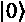和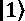。

图 2:布洛赫球体

由布洛赫球图解表示的量子位的状态，可以给出为:

等式 1:计算机科学家的量子计算，N. Yanofsky 和 M. Mannucci，剑桥出版社，2008 年。

在这个表示中，对应于量子位的纬度，对应于量子位的经度。布洛赫球面上的任何一点都可以用和可以取的值的范围来表示，由和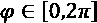给出。

这意味着:

*   当时，表示经典位的状态。
*   当时，代表经典位的另一种状态。这是因为φ代表经度，在极点是没有意义的。

如果取 0 和之间的其他值，这将导致量子位的叠加态。因此，虽然从方程式导出的布洛赫球的极点代表传统位元的状态，但是量子位元的状态可以由球上的任何一点给出。

布洛赫球如何表现一个量子位状态的可能变化，尤其是当它们被观测到时？从第 14 章*的讨论继续，采访 IBM 合伙人 Dinesh nagara Jan*，我们知道量子位的状态会坍缩到观察到的经典态。角度代表量子位元的状态会塌缩到两种状态之一的机率。如果代表布洛赫球的箭头更靠近球的北极，则状态折叠到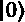，反之亦然。在下一节中，我们来看看量子计算史上最有影响力的算法之一。

## 肖尔算法

彼得·肖尔和他的工作可能对量子计算的发展影响最大。1994 年，他提出了一个多项式时间量子算法来识别素数因子。理查德·费曼[1982，1986]已经提出了量子计算比经典计算机更强大的想法。然而，肖尔是第一个将量子计算机的实际应用公之于众的人。利用他的算法证明了对一个大数的质因数的识别，他激励了一代科学家专注于利用量子计算机可能实现的算法加速。

长期以来，因式分解一直是一个数学难题。想想 35 这个数字。它有两个质因数:5 和 7。同样，数字 142 有两个质因数:11 和 13。如果有一个大的奇数 *N* 的质因数需要被识别，我们将需要把 *N* 除以直到的所有质数来识别因数。这是一种强力方法，计算量很大。现代 RSA 加密技术依靠质因数来加密我们所有的数据。我们的登录密码、信用卡详细信息和其他敏感信息依赖于分解的计算困难来防止黑客攻击。

目前，RSA 2048 的数字高达 617 位十进制数字。虽然因式分解过程已经通过 RSA 位排名上升，但破解 RSA 2048 数字还需要几年时间。Shor 算法提供了简化因式分解的理论模型。

如果计算模指数函数的周期，数的因式分解可以简化。让我们举一个例子来理解模运算和周期的概念。这将帮助我们通过因式分解算法。

*a (mod b)* 的结果是 A 除以 b 后的余数，几个例子如下:

12 (mod 5) = 2

21 (mod 7) = 0

18 (mod 7) = 4

下一步是理解周期的概念。比如说 *N* 是我们需要求其因子的数，x 是 *N* 的素数。我们使用以下幂函数:

x〔t0〕a〔t1〕mod(n)

现在，我们来看一下因子分解算法，举个例子。

说 *N* = 91，x = 3(与 *N* 互质)。当两个数互质时，它们的**最大公约数** ( **gcd** )为 1，应用上面的幂函数得出周期:

3 0 对(91) = 1

31]模式(91 的模式)= 3

3 2 对(91) = 9

31]对(91) = 27

3 4 对(91) = 81

3 5 对(91) = 61

3 6 对(91) = 1

3 7 对(91) = 3

如您所见，序列在 6 个增量 a 后开始重复自身。这是周期，在本例中为“6”。在因式分解中，确定周期是一个很难解决的问题。然而，一旦这样做了，就可以使用以下方法得出这些因子:

作为 r = 6， *N* =91，x = 3 i n 这个例子，我们可以得出:

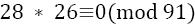

根据因子分解算法:

gcd(28，91)或 gcd(26，91)将是 91 的非平凡因子，其中 gcd 代表*最大公约数*。在这种情况下，gcd(26，91) = 13。一旦确定了这一点，另一个因素就可以确定为 7。

这是因子分解算法如何工作的一个简单例子。Shor 提出，这个因子分解算法中的一些步骤发生在量子计算机中，而预处理和后处理发生在经典计算机中。以下是描述该算法的步骤:

**第一步**:在上面的例子中，使用经典计算机选择 3 作为 91 的互质。

**第二步**:创建两个量子寄存器。寄存器 1 将存储 a 的增量，在 x a Mod (N)中。寄存器 2 将存储 x a Mod (N)的结果。

**步骤 3** :对寄存器 1 进行量子傅里叶变换，并行计算周期 r = 6。

**步骤 4** :一旦确定了周期，使用经典计算机找到 gcd 并得出非平凡因子 91。

Shor 的算法提供了一种使用量子计算进行模幂运算和识别周期的方法。序列 x a Mod (N)中的每个元素都对序列周期的幅度有贡献。对于所有计算的周期，除了正确的一个，这些贡献的自旋在不同的方向，因此彼此抵消。真正的周期，序列的贡献，指向相同的方向，并以很高的概率被选为正确的值。我们现在来看看 Grover 的算法，它提高了非结构化数据的搜索性能。

## 格罗弗算法

Lov Grover 在 1996 年发表了一篇论文，描述了 Grover 的算法。Grover 算法在非结构化搜索中的应用提供了二次加速。如果你想在数据库中找到一个项目，如果数据没有排序，使用量子计算机实现的 Grover 算法可以提供比经典计算机更好的性能。

当必须从数据库中的 *N* 个名字中识别出一个名字时，如果这些名字被排序，传统计算机可以执行二分搜索法在对数时间内找到这个名字。如果名字没有被排序，那么搜索将包括扫描到 *N* -1 个名字来找到正确的名字。

如果 S a 是我们试图从 *N* 元素的数据库中找到的元素，使用格罗弗算法可以帮助解决尝试的问题。量子位是这样准备的，使用哈达玛门使所有的数字处于均匀的叠加状态。在这个阶段测量量子位会显示所有的结果都是同样可能的:

图 3:实现一致的振幅

以下等式表示所有弦的统一幅度:

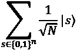

现在，oracle gate 用于翻转 s a 的幅度，并保持其余部分不变:

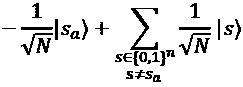

该图现在可以表示为:

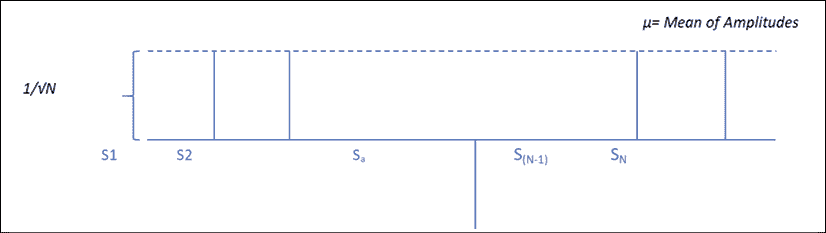

图 4:翻转匹配的振幅字符串

现在期望元素 S a 的幅度已经翻转(为负)。因此，振幅的平均值将会降低。这就是 Grover 扩散算子被引入以绝对增加 S a 的幅度的地方。

这个运算符所做的只是翻转平均值处的振幅。这导致 S a 的幅度增加到大约的量级。振幅如下图所示:

图 5:均值处的翻转幅度

重复应用 oracle 门和 Grover 扩散门的过程，直到幅度足够大。还必须注意，S a 的幅度不要太大，以至于平均幅度变为负值，这又会开始降低 S a 的幅度。当振幅几乎为 1 时，量子位的测量将提供的正确答案。可以证明，当该过程重复大约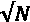时，提供了精确的结果。

**要点**:Shor 和 Grover 算法为量子计算奠定了基础，并确定了这些算法可以帮助解决的实际用例。

我们现在将转向量子退火，这是一种用于解决优化问题的技术。

## 量子退火

我们已经看到通过使用门的操作实现的量子比特的叠加如何能够解决现实世界的问题。还有其他方法可以达到最佳解决方案。量子退火是利用量子涨落达到全局最小值的过程。量子隧道效应有助于量子退火器中状态之间的转换。

在量子退火过程中，优化所需的信息被建模到物理系统中。这个过程包括将几个相关变量的优化问题编码成一个物理系统(用叠加态的量子位表示)。

问题的解用系统的最小能态来表示，用来实现这个的最简单的函数叫做哈密顿量。例如，由量子隧道效应驱动的量子退火可以解决物流方面的问题。

### 量子隧道效应

量子隧道是一种量子属性，其中粒子穿过高能系统。在经典物理学中，当电子遇到电场时，如果电场比电子强，它就会被排斥。使用量子退火解决的问题依赖于粒子的量子隧道特性。

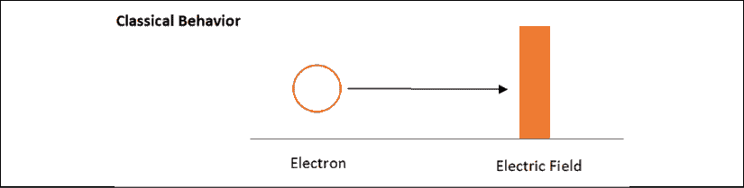

图 6:接近电场的电子

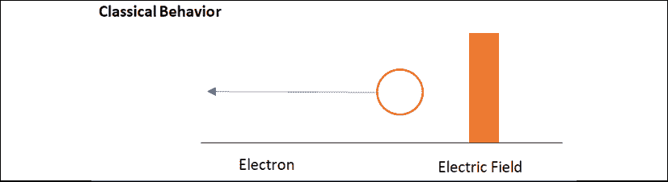

图 7:被电场排斥的电子

图 8:向电场移动的电子波

图 9:穿过电场的电子波

隧道效应是弗里德里希·洪特在 1927 年观察到的一种特性。如果一个以波的形式传播的电子遇到一个排斥它的电场，它仍然有可能穿过电场并发现自己在电场的另一边(*图 9* )。当粒子逃离不稳定的原子核时，亚原子粒子在放射性衰变中显示出隧道特性。

量子退火是一个依赖于粒子隧穿特性的过程。让我们看一个可以使用量子退火的实际例子。

### 旅行推销员

旅行推销员问题是量子隧道的一个很好的应用。假设我们有一个销售人员在全国销售商品。他穿越这个国家的最佳路线将取决于这个国家城市的数量。如果国家有三个城市(A、B 和 C)，最佳路线可能是 A - > B - > C 或 A - > C - > B 或 B - > A - > C 或 B - > C - > A 或 C - > A- > B 或 C - > B - > A。可能路线的数量(6)取决于此处城市的数量(3)。可能路线的数量可由城市数量的阶乘给出，如下所示:

3! = 3 * 2 * 1 = 6

当城市数量翻倍为 6 时，可能的路线数量将为 6！= 720，猛增。除了城市数量的增加，可能还有其他问题，比如某个时间点的交通堵塞，或者一条特别糟糕的道路。因此，最佳路线不一定是最短的路线。我们首先需要设置系统来确定最佳解决方案。

让我们把这个系统准备成这个问题的许多可能解的量子叠加。该系统现在可以被视为一个山峰和山谷的景观。峰值是高能状态，并且是昂贵的。另一方面，谷代表低能态。当我们在一个山谷和另一个山谷之间转换时，每个解决方案的概率都会发生变化。能量越低的选项越有可能成为解决方案，直到概率最高的解决方案被确定为最优解决方案。

在模拟退火中，热量用于越过波峰和波谷之间的过渡。有了量子退火器，量子隧道效应使我们能够让高能 T2 峰穿过隧道，而不是像模拟退火那样爬过隧道。

量子退火由外部磁场驱动，外部磁场在模拟退火中扮演温度的角色:量子退火以高磁场(高温)开始，以低磁场(低温)结束。

量子退火是将优化所需的信息输入物理系统的过程。问题的解决方案将由系统的基态(最低能量状态)来定义。用于这一过程的函数称为哈密顿函数，它管理系统能级的信息。

我们可以使用哈密顿量来管理基于约束框架的系统的能级。在旅行推销员问题中，我们可以将更高的能量水平分配给更长的距离、糟糕的道路、交通堵塞和道路封闭。最佳路线将是具有最低能量水平的路线。考虑到这一点，我们如何识别能量最低的解决方案？

哈密尔顿函数，以及我们为增加能级而加入的项，会在能量空间产生波峰和波谷。我们需要找到波谷，而不必爬上峰值能量水平。如上所述，这可以通过量子隧道来实现。虽然这允许我们从一个波谷到另一个波谷，但我们如何确定最低的波谷呢？一种称为绝热量子计算的量子技术可以用于此目的。

术语*绝热*来自热力学理论，意思是不改变热量的*。在这个过程中，系统在基态被初始化，然后慢慢演化成更复杂的哈密顿量，其基态对解进行编码。*

每个哈密尔顿函数通过给所有不正确的配置分配一个*能量惩罚*来编码变量的正确分配。景观中的峰具有较高的罚分，而谷具有较低的罚分。最低能级的最优解一般特征值为 0。我们可以让系统随着时间进化:

H(s)=(1s)H0+sH1

在时间 s = 1 时，哈密顿量为 H(1) = H s ，如果演化缓慢，系统将处于基态。特征值和特征向量在几个真实世界的算法中使用。它们被用于旋转体的物理建模，振动系统的振荡，以及投资银行的风险建模。

霍夫曼和昆泽(1971 年)将特征值定义如下:

> 特征值是与线性方程系统(换句话说，矩阵方程)相关的一组特殊标量，有时也称为特征根、特征值(霍夫曼和昆泽 1971 年)、特征值或潜在根(马库斯和明克 1988 年，第 144 页)。

参考:[http://mathworld.wolfram.com/Eigenvalue.html](http://mathworld.wolfram.com/Eigenvalue.html)

量子退火可以用来解决最优化问题。然而，我们可能不必等待量子计算机使用量子退火和量子隧道的原理来实现结果。富士通已经创建了一个“*量子激励的数字退火器*”，以解决金融风险管理和金融投资组合再平衡中具有挑战性的优化问题。

**要点**:量子退火可以用于优化多个行业的问题。金融、物流、医疗保健和智能城市都是这项技术可以用来优化复杂问题的领域。

尽管量子技术有这些惊人的可能性，退相干仍是一个重大挑战。接下来让我们来看看。

## 消相干

我们在*第一章*、*量子计算和区块链介绍*中讨论了量子狭缝实验，我们看到光子穿过狭缝，表现得像波一样(干涉自己)，尽管它们是一次发送一个。当一个粒子表现出波的性质，并与自身发生干涉时，我们说它是相干的。退相干是系统中相干性的丧失或抑制。

当粒子的状态被观测到时，解释粒子行为的波函数就坍缩了。这种退相干过程被认为是量子物理和经典物理之间的桥梁，在这个过程中，处于叠加态的粒子在被观察时会坍缩到两个经典态中的一个。实验可以在叠加态的电子上进行，如果观察者正在测量自旋的 z 分量，实验将输出自旋的 z 分量的确定值。x 分量仍然可以保持叠加。这与玻尔的解释一致，即量子世界的性质在被观察时就存在了。

我们知道，宏观物体，如人类，不会表现出这种属性——只有在被观察时才会采用给定的状态。当然，当我们知道我们被观察时，我们都会表现出善良的特征，有时反之亦然，但对于固有属性如*活着*或*死了*就不是这样了！更严重的问题是，量子世界中的事物如何能同时以多种状态存在，直到被观察到？

欧文·薛定谔设计了一个思维实验来说明这个概念的反直觉本质和看起来的荒谬性:

一只猫、放射性物质和毒气被放在一个盒子里。如果检测到放射性，装有毒气的瓶子就会破裂，猫就会死去。放射性物质很小，可能在一段时间内检测不到。因此，在任何时候，盒子外面的人都无法确定猫是死是活。因此，根据量子逻辑，猫可以被认为是既活着又死了！

薛定谔质疑这怎么可能是量子世界中的情况，而在宏观世界中显然不是这样。然而，到目前为止，所有的量子实验都证实了一个理论，即在被观察到之前，量子物体确实能够以两种状态存在。

## 量子纠错

**量子纠错** ( **QEC** )是使量子系统结果可靠的关键过程。在量子计算的初期，有效地修正量子计算机而不触发计算的退相干被认为是非常不直观的。量子系统中缺乏可靠的错误校正是一个主要的障碍，因为量子算法使用的是干涉，而干涉是脆弱的。这种干扰使得量子算法对系统中的不精确性以及系统与世界其他部分之间的耦合非常敏感。

一些常见的错误原因包括:

1.  系统初始状态的准备
2.  量子位的退相干可能由于与环境的相互作用而发生
3.  大门不准确
4.  测量过程中的缺陷

彼得·肖尔和安德鲁·斯蒂安开发了第一套量子纠错码。Peter Shor 发现 9 个量子位可以放在一起对一个量子位进行纠错，而 Steane 发现了 7 个量子位的纠错方法。

由于环境干扰造成的量子信息损失可以使用信息分布来解决。如果信息分布在几个量子位而不是一个量子位上，信息就更安全。在经典计算中，使用重复码的纠错使用三位来存储一位信息的副本。因此，除非其中两个副本容易出错，否则信息是完整的。虽然这在经典计算机中是一个简单的过程，但在量子计算机中，将信息从一个量子位复制到另一个量子位要复杂得多。

正是 Shor 提出了一种方法，将重复码方法推广到量子计算机中。他提出的解决方案是用基态的重复码对量子位进行编码。

后选量子计算是由伊曼纽尔·克尼尔开发的，并证明了大规模的量子计算可以通过错误检测而不是错误纠正来实现。量子计算机将具有错误检测电路，并且如果检测到错误(噪声)已经超过阈值，则算法的相关子例程被重置并重新运行。这解决了高水平的容错，但是具有高的资源需求。

另一种处理量子错误的有用方法是使用称为稳定器的量子纠错码。对于量子系统的开发者来说，这些都是非常有用的工具。稳定器代码规范有许多应用，包括准备电路、校正电路和容错逻辑门的设计。使用稳定器来定义量子纠错码有助于使用校正电路对编码数据应用逻辑运算。Andrew Steane 开发的 7 量子位方法使用 7 个物理量子位构建一个逻辑量子位，具有纠正单个 X 或 Z 错误的能力。

**要点**:关键要点是量子计算中的纠错是一项重要的工作。QEC 的复杂性和解决这些问题的各种选择值得写一整本书。这是量子计算的一个关键方面，它帮助量子计算从理论转变为实际可能性。

# 结论

为了理解本书中的采访，以及从中得出的关键推论，读者很好地理解这一章是至关重要的。出于同样的原因，我用实际的例子描述了量子计算的概念，并与经典计算进行了比较。不钻研底层物理(如果不是数学的话)，很难理解量子计算的一些概念。在这种情况下，本章对物理学基本概念的简化将有助于理解构成量子系统的微观元素行为的怪异之处。简化版本可能会让量子科学家畏缩，但我坚信简化叙述对于任何技术成为主流都是至关重要的。

# 参考文献

1.  [https://www2 . physics . ox . AC . uk/sites/default/files/errorcorrectionsteane 06 . pdf](https://www2.physics.ox.ac.uk/sites/default/files/ErrorCorrectionSteane06.pdf)
2.  [https://journals.jps.jp/doi/full/10.7566/JPSJ.88.061009](https://journals.jps.jp/doi/full/10.7566/JPSJ.88.061009)
3.  [https://arxiv . org/pdf/quat-ph/9508027 . pdf](https://arxiv.org/pdf/quant-ph/9508027.pdf)
4.  [http://science.sciencemag.org/content/356/6343/1140](http://science.sciencemag.org/content/356/6343/1140)
5.  [https://people . cs . umass . edu/~ stru bell/doc/quantum _ tutorial . pdf](https://people.cs.umass.edu/~strubell/doc/quantum_tutorial.pdf)
6.  [https://cs.uwaterloo.ca/~watrous/LectureNotes/CPSC519.Winter2006/05.pdf](https://cs.uwaterloo.ca/~watrous/LectureNotes/CPSC519.Winter2006/05.pdf)
7.  [https://grove-docs.readthedocs.io/en/latest/vqe.html](https://grove-docs.readthedocs.io/en/latest/vqe.html)
8.  [https://quantumexperience.ng.bluemix.net/qx/tutorial?sectionId =初学者指南&page = 004-The _ 怪异 _ 奇妙 _ 世界 _ 量子位~ 2f 001-The _ 怪异 _ 奇妙 _ 世界 _ 量子位](https://quantumexperience.ng.bluemix.net/qx/tutorial?sectionId=beginners-guide&page=004-The_Weird_and_Wonderful_World_of_the_Qubit~2F001-The_Weird_and_Wonderful_World_of_the_Qubit)
9.  [https://medium . com/@ Jonathan _ hui/QC-cracking-RSA-with-shors-algorithm-BC 22 CB 7b 7767](mailto:https://medium.com/@jonathan_hui/qc-cracking-rsa-with-shors-algorithm-bc22cb7b7767)
10.  [https://www.scottaaronson.com/blog/?p=208](https://www.scottaaronson.com/blog/?p=208)
11.  [https://Quantum experience . ng . bluemix . net/proxy/tutorial/full-user-guide/004-Quantum _ Algorithms/070-Grover ' s _ algorithm . html](https://quantumexperience.ng.bluemix.net/proxy/tutorial/full-user-guide/004-Quantum_Algorithms/070-Grover's_Algorithm.html)
12.  [https://www . cs . CMU . edu/~ odonnell/quantum 15/read 04 . pdf](https://www.cs.cmu.edu/~odonnell/quantum15/lecture04.pdf)

1.  [https://medium . com/@ quantum _ wa/quantum-annealing-CDB 129 e 96601](mailto:https://medium.com/@quantum_wa/quantum-annealing-cdb129e96601)