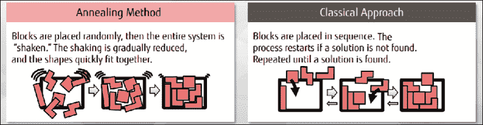
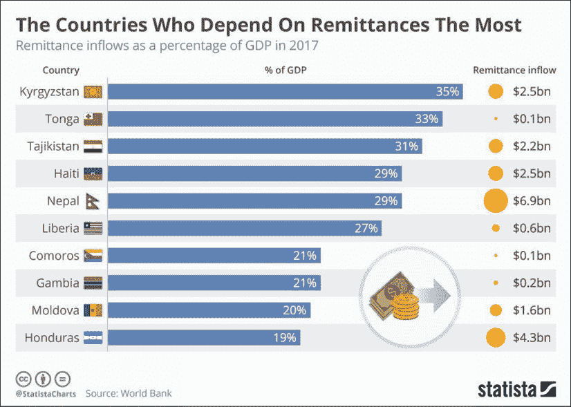
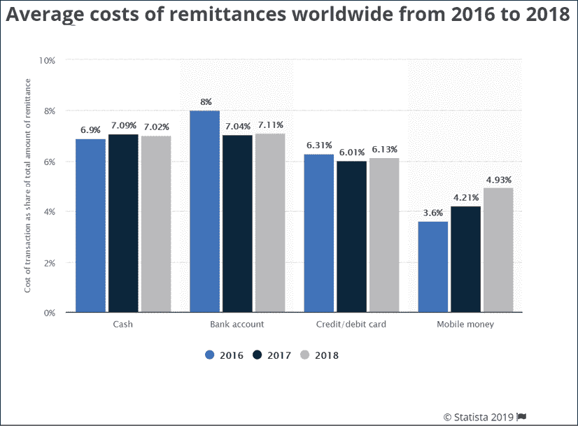

# four

# 对金融服务的影响

金融服务行业在拥抱创新和前沿技术方面历来行动迟缓。部分原因是银行、资产管理公司和保险公司认为自己从事的是提供金融产品的业务。他们认为技术是成本中心，不是他们业务的核心。然而，这种方法受到了商业领域两个关键变化的挑战。

2008 年的经济衰退见证了金融服务公司与创新技术互动的几个关键转变。经济衰退后，银行面临巨大的监管压力。这意味着他们必须小心他们提供给客户的金融产品的创造性。银行必须向监管机构报告更多关于其产品和服务的细节。因此，创新产品变得稀缺。后台技术和流程产生了大量的管理费用。仅在英国，银行每年就要花费 50 亿英镑用于监管合规。随着监管压力的增加，风险管理流程和技术出现激增。

另一个变化是金融科技公司的崛起，这些公司被称为金融科技公司。金融科技公司是一些富有创新精神的年轻公司，它们使用数字化方法，以更加以客户为中心的方式提供金融服务。他们年轻，没有遗留技术的负担。这帮助他们在很短的时间内创造了新的商业模式、技术解决方案和运营模式。

当银行和金融服务公司正在努力应对监管压力时，敏捷的金融科技公司趁虚而入。在银行意识到这一点之前，它们看到自己的收入受到了金融科技公司的挑战，这些公司发展迅速，客户基础也在不断扩大。另一方面，监管程序正在产生底线压力。解决方案是让金融服务公司将技术转化为竞争优势。

过去 5 年，金融服务公司采用人工智能和区块链等新技术，取得了不同程度的成功。在这一章中，我将讨论量子计算在金融服务中的潜在应用，并触及一些适合这项技术的行业应用。

随着银行与金融科技力量的角力，它们希望找到解决问题的灵丹妙药。区块链是在金融科技热潮兴起后推出的，银行出于几个原因抓住了这项技术。一个是创造一种他们可以拥抱创新和引领技术的感觉。他们还认为区块链可以为他们带来跨多个银行流程的巨大运营效率。银行正在对区块链进行从客户入职开始的流程试验，在这里将对交易的实时结算进行**了解你的客户** ( **KYC** )检查。这将最终成为他们的竞争优势。

随着银行探索用新兴技术应对金融科技挑战的方法，世界各地的区块链上出现了生态系统。这些生态系统有可能挑战传统资本市场的基础。区块链生态系统浪潮基于金融服务去中心化的原则。我们今天的资本市场是高度集中的，非中介化的，最需要它们的人往往无法获得。区块链将改变这一切，并提供大规模的金融包容性。至少，这是愿景。这给银行带来了另一个重大挑战。

在这一章中，我将谈到区块链在不同领域和应用中的试验，以及有成功案例的领域。由于业务模式和全球范围内的互动，金融服务是一个天生复杂的行业。多项银行职能中涉及的数据复杂性需要能够帮助充分利用数据的技术。因此，讨论量子计算对金融服务的影响也很重要。

# 量子计算应用

在我职业生涯的过去 10 年里，我一直忙于风险管理和基金管理。2010 年，我刚从巴克莱资本(Barclays Capital)的前台技术部门进入风险管理部门时，我注意到了两个关键机会。

第一，风险管理是一个数据饥渴的领域，第二，技术还没有充分渗透到这个领域(与前台系统相比)。在过去的十年里，我见证了不同银行的风险技术发展到今天的样子。

投资银行的风险管理和报告涉及大量的数据处理。该领域的作用是观察公司在市场中的财务状况，并评估这些状况的风险。2008 年衰退后，银行被要求持有基于投资组合相关风险计算的储备资本。**风险价值** ( **风险值**)方法是用于计算公司在公司风险偏好定义的置信水平下可能出现的最坏损失。

风险管理有几个分支，如市场风险、信用风险、操作风险和行为风险。然而，我们将重点关注市场风险和信用风险是如何工作的，主要是因为它们是非常数据和计算密集型的。这使得它们成为量子计算解决方案的理想候选。

## 市场风险

市场风险是模拟市场波动对公司交易头寸影响的因素。银行可以在市场交易的各种产品中建立头寸。每个产品都有定价机制。风险管理职能部门的作用是识别影响产品定价变量的市场风险因素。

让我们举一个金融债券的例子。它是一种简单的债务产品，通过用利率贴现未来现金流来定价。现金流通常以息票支付的形式固定，用于贴现现金流的变量是利率。债券的价格可以通过使用来自彭博等公司的利率数据来计算。由于利率是用来贴现现金流的，如果利率上升，债券价格就会下降，反之亦然。

当一家银行持有一个债券的多头头寸时，如果利率上升，债券的价格就会下跌。因此，当市场风险因素影响所使用的利率时，债券头寸的市场风险通过模拟债券价格来计算。这是一个简单的例子。

通常有几个变量用于计算金融产品的价格。当有多种风险因素影响这些变量时，计算风险的计算量会很大。我们还发现这些变量中的一些是相互关联的；当一个变量发生变化时，它会导致另一个变量发生变化。需要对这些互动进行建模，以对产品和与头寸相关的风险进行定价。

如果头寸增加了投资组合的风险，风险经理会发现这一点，并确保前线办公室采取对冲头寸来降低投资组合的整体风险。所有这些数据都用来计算风险值和公司的资本要求。该过程涉及大量数据、复杂的计算和模拟以及尖端的数据分析。

在一级银行中，每天有数百万份头寸被输入风险引擎。这些头寸每天使用市场数据进行重新定价，并通过将风险因素应用于这些重新定价的头寸来计算风险。这些变量之间的相关性使得经典模拟技术更难评估风险。因此，银行有时会选择近似价格，因此风险也是一个近似值。

每天早上计算的近似值适用于银行的正常情况。然而，在危机情况下，当一家银行发现自己在处理当天的市场灾难时，现有的系统和流程严重不足。他们需要能够更快、更准确地为风险定价，以便采取必要的市场行动。了解市场压力情景下的风险有助于银行更有效地对冲现有头寸，或者清算造成巨大敞口的头寸。

银行使用的现有技术提供了估算风险的方法。使用量子计算来模拟市场风险可以提供两个关键优势:

*   可以更准确地计算风险，因为可以在中模拟不同变量之间的相关性。
*   可以近乎实时地计算风险，以应对日间压力情景。

使用相关性建模更准确地衡量风险非常重要。举个简单的例子，让我们假设一家银行在英国航空公司有大量头寸。银行通常会模拟英国退出欧盟对富时 100 指数的直接影响，因此也会模拟英国航空公司的影响。然而，英国退出欧盟对全球经济前景有影响。英国退出欧盟公投当天，石油和其他几种大宗商品价格下跌。油价下跌对航空公司来说是个好消息。因此，模拟市场风险对股票头寸的直接影响非常重要。但理解市场走势和其他可能影响银行市场地位的因素之间的相关性也很重要。

我将在本章后面更详细地谈到银行面临的技术限制。这也应该有助于你理解量子计算技术是如何帮助市场风险计算的。

市场风险并不是量子计算唯一可以用的地方。信用风险也许是一个更成熟、计算更密集的领域，也能从这项技术中受益。

## 信用风险

信用风险是指与公司交易的对手方违约的风险。有几个变量可以用来模拟一家公司或一个人是否会违约。这通常通过信用评级来捕捉，并使用违约概率来建模。随着有关交易对手的不同信用信息被捕获，信用评级会变得更好或更差。

有不同等级的信用评级，AAA 是最好的，CCC 是最差的。这些信用评级与机构交易更相关。信用评分在零售银行业务中更为常见。基于几个变量，交易对手(机构或零售)的信用评级可能上升或下降，这可能决定银行是赚钱还是赔钱。让我们举一个零售银行的例子。债券评级参考:[https://www.investopedia.com/terms/b/bondrating.asp](https://www.investopedia.com/terms/b/bondrating.asp )

约翰和玛丽是一家银行的两位客户，他们的信用状况各不相同。两人都在向银行申请抵押贷款。在抵押申请过程中，银行会检查他们的信用档案和信用评分。让我们假设约翰有几个信用额度，像信用卡和个人贷款，他也已经拖欠了 3 年的债务。Mary 有一个更干净的信用档案，没有违约，并且有一套管理良好的信用额度。他们都在申请一套价值 20 万英镑的公寓抵押贷款。抵押贷款的其他方面对两个申请人来说都是一样的。

银行通常会以更高的利率为约翰的抵押贷款定价，玛丽会得到更好的待遇。这也正是机构空间中发生的事情。根据交易对手的信用评级，对产品进行定价。当交易对手违约概率较高时，信用等级较低，产品定价较高。

然而，银行需要每天评估这些信息。如果交易对手的产品定价为 X，如果交易对手的信用评级突然被降级，银行的风险敞口就增加了。这需要反映在银行留出的资本中，这可以在**信用风险** ( **CVAR** )和经济资本计算中获得。许多银行使用蒙特卡罗模拟来计算 CVAR 和经济资本。

与市场风险技术的局限性非常相似，信用风险算法也有局限性，量子计算有可能解决这些局限性。在市场崩溃的情况下，更快的计算速度至关重要。精确计算有助于在更精细的级别评估风险。

让我们假设 A 银行在 B 银行有一个活跃的头寸。这可能意味着在某个时间点 A 银行期望 B 银行结算。因此，B 银行的信用风险需要定期计算。但 B 银行可能对其大部分业务所在的英国有很大敞口。如果英国退出欧盟遭受重创，B 银行可能很难向 a 银行付款。在这种情况下，B 银行有巨大风险敞口的也可能是 C 银行，而不是英国退出欧盟。因此，了解资金网络并能够准确计算 B 银行的信用风险非常重要。

在进入量子计算如何帮助这些领域之前，让我们首先更详细地了解一下技术和工艺限制。

## 技术限制

既然我们已经了解了产品价格、风险和 VaR 建模中涉及的数据处理挑战，让我们看看现有技术在处理这些挑战时的局限性。我们在前面几节中简要地提到了局限性。在深入研究量子计算如何有所帮助之前，更详细地理解它们是很重要的。

有几个真实的场景，其中一些风险管理过程需要在白天执行。它们被称为日内报告流程。当一天中出现市场崩溃或压力事件时，需要计算日内风险值，以确保银行在压力情景下获得资本。然而，这些处理引擎中的一些非常慢，以至于它们需要几个小时来执行所谓的“*重新计算*”。

蒙特卡洛模拟已经能够提供对预期回报的准确估计。然而，当时标较短时，它们往往不太准确。他们需要大量的计算能力，当数据量增加时，这个问题就会被放大。

另一个挑战是现有计算方法处理相关变量的能力有限。这又回到了*第二章*、*量子计算——关键讨论点*中的讨论。我们触及了经典计算框架的局限性，以处理从几个变量 *X1* 、 *X2* 、 *X3* 、.. *Xn* 。如果 *Y* 的计算涉及捕捉 *X1* 、 *X2* 、 *Xn* 之间的相关性。，这使得经典计算机更加困难。这是量子计算可以发挥作用的两个场景。

随着量子计算算法越来越受欢迎，有几家公司正在寻找弥合经典计算和量子计算之间差距的方法。量子激发的技术在性能上提供了一个很好的飞跃。

其中一些解决方案已经可以在工业环境中使用，其中一个已经问世的关键解决方案是富士通的量子激励退火算法。使用该算法，他们已经能够减少风险模型的延迟。现在让我们来看看量子计算如何帮助风险管理的细节。

## 量子启发的数字退火

我们在*第二章* *量子计算-讨论要点*中讨论了绝热量子退火的方法，及其在解决组合概率问题中的应用。量子退火是一种处理经典计算机难以解决的现实世界问题的方法。富士通和日立等技术服务提供商正在研究使用经典计算机的数字退火，并从量子计算原理中获得灵感。这些数字退火解决方案已经在金融服务行业的真实场景中得到应用。

例如，富士通开发了一种使用“Ising”的数字退火机。伊辛模型是由威廉·楞次于 1920 年提出的。这个模型描述了一大堆可以以两种不同状态存在的原子是如何相互作用的。这些原子排列在多维晶格中，一个原子的状态会影响相邻原子的状态。该解决方案的云实施于 2018 年 5 月上线。他们称之为"*富士通量子计算数字 Annealer 云服务*"

在富士通的数字退火装置中，磁铁中的原子被用来模拟退火装置将要解决的问题。原子的状态代表变量的状态。与每个单个原子相关的能量和自旋关联可以被精确地计算。原子之间的相互作用以及它们对彼此自旋的影响决定了问题的解决方案。使用低能量状态确定问题解决方案的能力类似于量子退火，这将在下一节详细解释。

富士通与多伦多大学和总部位于加拿大温哥华的 **1QB 信息技术** ( **1QBit** )合作，为这一新架构共同创建了量子启发算法。

## 量子退火

这种设置就像量子退火系统，其中粒子的状态代表问题中涉及的变量。在经典计算设置中使用伊辛模型，帮助富士通在复杂计算中实现了类似量子的效率。这种方法还可以扩展到资产管理中的投资组合再平衡和零售银行业务中的自动柜员机补充。

*图 1* 描述了退火方法背后的原理，以确定几个变量的正确拟合:

图 1:退火方法与经典方法的对比。

与量子计算机不同，数字退火机在室温下工作，因此可以更长时间地保持状态。

这也可以通过几种量子计算算法来实现。**量子近似优化算法** ( **QAOA** )可以在多项式时间内得出优化问题的解决方案，而经典方法需要指数时间。

具有指数时间复杂度的算法比多项式时间算法增长得更快。表示运行时间的变量在多项式时间中是基数，在指数时间中是指数。下面是一个简单的例子。如果`n`代表运行时变量:

多项式:n 2

指数:2 n

如果`n`是 1000，多项式方程传递 1000 2 ，就是 1000000，指数传递 2 1000 ，就是 1.071509e+301(实际上很大)。

所以量子算法可以计算的速度远高于经典技术。量子退火也可以用来处理组合优化问题，旨在确定局部最小值。

如*第二章*、*量子计算——重点讨论离子点*所述，退火(数字和量子)是一个热涨落允许系统在不同的局部极小值之间跳跃的过程。在量子退火中，由于量子隧道特性，这些跳跃是可能的。当能垒很高时，量子隧道允许更有效地探索能源领域。使用量子位实现基于量子退火的优化解决方案的过程如下:

1.  使用门(像哈密顿)，将输入数据建模为一组量子位的状态。
2.  将量子位设置成叠加态。
3.  应用一个算法来达到一个包含正确答案的系统状态。
4.  利用量子干涉，增加测量正确状态的概率。

1.  测量结果的量子位。

下图显示了绝热演化结合量子隧穿如何帮助识别低能溶液状态:

图 2:绝热量子退火

量子退火为银行内部的风险建模过程提供了极大的效率。然而，量子计算机仍处于起步阶段，退相干使其在现阶段不适合企业使用。正如在*第二章*、*量子计算-讨论要点*中所讨论的，由于量子计算机的环境，退相干会导致信息的丢失。

D-Wave Systems 和 IBM 已经尝试使用他们的量子计算机来解决一些金融服务建模的挑战。他们通过量子退火程序运行有限的金融数据实例，发现其性能与经典计算机相当。富士通对数字 Annealer 的测试在几秒钟内就为金融服务问题提供了答案。这些问题在过去需要几个小时到几天。一个这样的例子是在项目组合管理中，我们将在下一节中讨论。

## 动态投资组合选择

在讨论量子计算对金融投资组合管理的影响之前，我们先试着理解一下问题陈述。在资产管理行业，投资组合经理做出投资决策，建立股票、债券、商品和其他资产类别的投资组合。动态投资组合选择是一个过程，其中投资组合在不同资产类别之间的分配代表了投资者的风险偏好。执行投资组合再平衡以确保定期管理分配。

一些投资者更喜欢高风险的投资组合，以期获得更高的回报。他们通常会配置更高比例的不稳定证券。如果风险偏好降低，高等级、低波动性资产的配置就会增加。资产管理公司通常设有风险/投资委员会，定期确保投资组合的分配符合投资者的偏好。

许多资产管理公司需要几天的时间来完成这一过程，通常每季度执行一次。然而，在市场压力大、波动大的时期，这是不够的。如果更经常地进行再平衡，投资组合可能会产生稳定的回报。

一个简单的例子是一个假想的投资组合，其中我们有 50%的股权(股票)和 50%的债务。让我们假设股票表现良好是因为，比如说，许多科技公司首次公开募股(T1)(**首次公开募股(T3))，以及市场参与者的非理性繁荣。在那种情景下，由于科技股价格的市场变动，投资组合中股票的比重将会增加。想要将股票配置保持在 50%的投资组合经理可能需要卖出一些股票，重新平衡投资组合。这是一个足够简单的解决方案。**

让我们在想象的投资组合中再增加一个资产类别。这个投资组合现在有 40%的股票、40%的债务和 20%的大宗商品。假设，由于中东地缘政治紧张局势，石油(投资组合中持有的)价格上涨。投资组合经理必须重新平衡配置。然而，石油市场的上涨通常会导致航空股的下跌(也在我们想象的投资组合中)。因此，投资组合中一个集群的变动导致了另一个集群的变动。这就是被称为**相关性**的。

在现实世界中，不是三个这样的集群，而是跨资产类别的更细粒度的行业分配，它们之间具有相关性。要模拟增加投资组合中一组投资对另一组投资的影响是一项困难的任务。与信用风险和市场风险问题非常相似，通过将一组相关变量建模到计算机中来获得最佳解决方案需要量子算法。

除了数学上的挑战，投资组合经理还需要考虑现实世界中的摩擦，比如交易成本。一个投资组合通常需要 30 只左右的股票才能实现最佳的多样化。如果交易成本很高，定期重新平衡这样的投资组合将会非常昂贵。

重新平衡后，需要衡量投资组合的表现，以获得最佳回报。这通常使用夏普比率等绩效指标来完成。夏普比率被定义为每单位波动率或总风险中超过无风险利率的平均回报。来源:[https://www.investopedia.com/terms/s/sharperatio.asp](https://www.investopedia.com/terms/s/sharperatio.asp )

有几种方法可以执行投资组合再平衡。**分级风险平价** ( **HRP** )方法是资产管理行业的最新发展。HRP 是一种基于风险的投资组合优化算法。它使用机器学习技术来识别投资组合的基础层次相关结构。相似资产的组合争夺资本，形成多样化的投资组合。

富士通开发的受量子启发的数字 Annealer 用于从资产价格变化方差矩阵创建分层关联结构。对 500 多只股票的相关性进行聚类可以立即进行，而在传统的资产管理设置中是每季度进行一次。

富士通的数字 Annealer 也展示了其优化投资组合的夏普比率提高 60%的能力。虽然频繁的投资组合再平衡会产生交易成本影响，但在高波动时期执行这项任务至关重要。

所讨论的例子是数字退火装置，然而，使用量子退火装置也可以达到同样的优化水平。正如上一节所解释的，由于退相干，量子计算机尚未实现主流能力。如果数据丢失到嘈杂的环境可以管理，量子退火可以解决几个优化问题。

投资组合优化的过程也使用了一种叫做**主成分分析** ( **PCA** )的机器学习算法。那是什么意思？如前所述，投资组合优化包括使用几个相关变量对理想分配进行建模。然而，如果我们能够减少变量的数量，并且它们之间没有相关性，不是更容易吗？这正是 PCA 帮助我们的。

PCA 是一种使用称为特征提取的原理的技术。使用主成分分析进行优化，我们可以删除投资组合中最不重要的变量。所用的其余变量彼此独立，这意味着相关性不需要在中明确建模。更具体地描述 PCA 超出了本书的范围，但有兴趣的人可以在[https://towardsdatascience . com/a-one-stop-shop-for-principal-component-analysis-5582 FB 7 E0 a9 c](https://towardsdatascience.com/a-one-stop-shop-for-principal-component-analysis-5582fb7e0a9c)阅读更多内容。

使用特征值和特征向量执行 PCA 的成本非常高。对于 N × N 矩阵，计算成本为 O(N 2 )。银行可以有几百万的股票，这意味着 N 可能是几百万。然而，使用量子 PCA 算法，已经证明执行相同计算的成本是 O(Log N) 2 。这应该有助于 PCA 成为金融服务领域的主流，因为它极大地简化了投资组合优化。参考:S. Lloyd，M. Mohseni，P. Rebentrost，*量子主成分分析*，《自然物理学》10，631 (2014)。来源:[https://www.nature.com/articles/nphys3029?platform=oscar&草稿=期刊](https://www.nature.com/articles/nphys3029?platform=oscar&draft=journal )

我们讨论了量子计算在风险管理和投资组合管理的资本市场业务中的应用。受量子启发的数字 annealers 目前正在英国的 Natwest 银行进行测试，用于管理他们的 ATM 网络。让我们在下一节讨论这个问题。

## 自动柜员机充值

让我们来看一个零售银行场景，量子计算可以在其中发挥作用。补充 ATM 中的现金约占操作 ATM 总成本的 35-60%。在当今时代，高街银行受到无现金、无分支银行业务模式的挑战，高效运营是保持竞争优势的基础。根据英格兰银行的数据，英国有 65，000 多台自动取款机，每年取款超过 25 亿次。参考:[https://www . statista . com/statistics/445117/cash-machines-in-the-United kingdom-by-bank/](https://www.statista.com/statistics/445117/cash-machines-in-the-united-kingdom-by-bank/ )

非常重要的是，银行可以模拟 ATM 中的现金量，同时最大限度地减少网络中的现金流动。英国最大的 ATM 网络中有大约 6000 台 ATM，经典计算机还不能实时计算出补充模型。

为补给建模所需的计算成本如此之高，以至于无法使用经典计算机实现该问题的实时解决方案。

该模型需要提出一个优化的分配计划，考虑到一个社区中任何异常或现金需求的突然增加。这有几个性质，就像我们在*第二章*、*量子计算-关键讨论点*中讨论的旅行推销员问题。

这是另一个非常适合量子退火的组合优化问题。一些英国银行已经在与富士通(根据以下最近的公告)进行对话，以使用他们的数字 Annealer 进行实时 ATM 补充建模。来源:[https://www . Fujitsu . com/global/digitalannealer/pdf/WP-da-financialsector-ww-en . pdf](https://www.fujitsu.com/global/digitalannealer/pdf/wp-da-financialsector-ww-en.pdf )

像 Natwest 和 BBVA 这样的银行已经在探索量子计算来解决他们的一些计算和数据密集型问题。有趣的是，日立和富士通等公司采用经典计算基础设施开发量子技术。这有助于行业算法、计算甚至哲学思维过程的转变。随着该行业准备被量子计算机颠覆，这一过渡过程将是必要的。现在我们已经讨论了量子计算在金融服务中的应用，让我们看看区块链及其用例。

# 区块链应用

在最近与一位技术专家转型 CEO 的对话中，我问了这样一个问题:“你为什么在你的应用中使用区块链？”。他说，“我没必要。我可以使用传统的数据库，并为我的每个客户提供一个版本。当其中一个创建事务时，我可以编写代码来识别它，并触发将一个副本写入所有其他数据库。然后，我会建立一个机制，如果其中一个客户端更改了记录，我会向整个网络发出警报，并希望它能以某种方式作为一个框架工作。或者，我可以让区块链为我做这一切。”

我喜欢这个答案。通常，其他人会继续捍卫区块链技术及其优于传统数据管理系统的优点。这个回答应该会让你对区块链作为数据寄存器的能力有一个简单的看法，或者如它著名的名称，账本。就金融服务行业而言，区块链没有尝试过的领域非常少。我将介绍该技术已经取得良好发展的领域，然后接触区块链可以用来创建未来意义上的金融生态系统的领域。

## 反洗钱和了解客户(KYC)

反洗钱和 KYC 流程在金融服务业中至关重要，尤其是在过去 10 年监管压力增大的情况下。由于缺乏治理和控制，银行内部合规职能部门的投资飙升，因为他们遭受了监管机构的惩罚性赔偿。2012 年，汇丰因洗钱被罚款 19 亿美元。他们被证明是毒枭和流氓国家的渠道。他们的网络被一些客户使用，这些客户的身份或交易没有经过银行系统和流程的验证。来源:[https://www . Reuters . com/article/us-HSBC-probe/HSBC-to-pay-1-90 亿-u-s-fine-in-laundry-case-idus bre 8 ba 05m 2012 12 11](https://www.reuters.com/article/us-hsbc-probe/hsbc-to-pay-1-9-billion-u-s-fine-in-money-laundering-case-idUSBRE8BA05M20121211 )

如*第一章*、*量子计算和区块链介绍*所述，区块链可以充当身份账本，在全球范围内提供自主身份服务。这对社交媒体、电子邮件等在线服务的访问、银行、政府(选举)、税务规划、难民管理以及身份至关重要的其他几个领域都有影响。在本章的背景下，区块链目前作为 KYC 和反洗钱工具正获得越来越多的关注。作为一名客户，当我去银行开立活期账户时，银行会从我这里拿到几份文件，以确保我是我所说的那个人。所有这些文件都经过核实并储存在银行的系统和档案中。现在，如果我想去另一家银行申请抵押贷款，我必须通过同样的 KYC 程序。有时，这些过程需要数周时间，因为要花费资源来验证客户的身份。这将随着基于区块链的 KYC 和反洗钱而改变。

由于区块链可能是生态系统中不可改变的交易分类账，印度的几家银行和公司已经联合起来，为 KYC 和反洗钱目的试验这项技术。在这种模式中，几家银行和金融服务公司加入了一个区块链网络。当他们检查客户的身份时，他们使用加密技术在网络上登记客户的详细信息。

> “利用这项技术的一个方法是帮助创建一个生态系统。作为实现这一目标的一个步骤，我们与 Infosys 一起非正式地建立了印度贸易联系”

–*ibhijit Singh，ICICI 银行技术主管。*

当另一家公司需要 KYC 的客户详细信息时，这些客户信息可以通过网络共享。该公司将获得客户的许可，并节省几天重复 KYC 过程。

新加坡也一直在引领几个区块链用例的原型开发。新加坡**金融管理局** ( **MAS** )，新加坡的监管机构，已经为创新的蓬勃发展创造了一个合作的环境。汇丰银行、UFJ 东京三菱银行和 OCBC 银行已经测试了 KYC 区块链。

一些中央银行发起了一些倡议，正在研究一个数字国民身份平台以及银行业电子 KYC 和反洗钱系统。客户端上线是我们讨论的区块链的一个有趣的用例。但目前的行业在这方面做得很好，没有大规模破坏。如果有一个领域，区块链可以将一个主要基于纸张的价值链数字化，那就是贸易金融。下一节将详细介绍区块链在贸易融资中的应用。

## 贸易融资

2018 年 6 月，我计划推出我的 Rhetoriq 播客，第一季聚焦于区块链和金融普惠。我们希望关注的领域之一是贸易融资，主要是因为我们知道价值链尚未数字化。贸易融资涵盖全球企业开展贸易和商业所使用的产品。全球贸易价值链在很大程度上是基于纸张的，实体的，并没有从数字时代中受益。贸易融资的另一个重大机遇是，全球大多数贸易路线都涉及多个利益相关方的交易对手和中介。

监管者、代理商、物流供应商、银行家、出口商、进口商和海关官员都参与了全球贸易路线的运作。价值链中的大多数利益相关者检查和验证，并将交易传递到下一个阶段。流程的每一步都涉及到对前一步的成功验证。

然而，大多数贸易价值链通常涉及一对一的互动和握手。双方之间的交互是不可见的。这导致贸易路线上的重复劳动，而且贸易状况往往缺乏透明度。

世界各地的银行和金融服务公司为贸易和商业的繁荣提供信用证和融资。因此，确保全球贸易价值链的运作效率更高符合它们的利益。几家公司和财团已经联合起来解决这个问题。

我的 Rhetoriq 播客的嘉宾之一是 Sweetbridge 的 David Henderson。他讨论了解决贸易融资关键问题的挑战，并强调需要解决一个狭窄的问题领域，以使产品在商业环境中成功工作。

we.trade、Marco Polo 和 Batavia 是贸易金融领域著名的区块链公司。we.trade 是一个由银行组成的财团，专注于欧洲范围内的中小型企业贸易。该财团包括 KBC、法国兴业银行、德意志银行、汇丰银行、国民银行、荷兰合作银行、意大利联合信贷银行、桑坦德银行和北欧银行。

2019 年 3 月，马可波罗在他们的平台上进行了第一次实时贸易融资交易。该平台运行在 R3 的 Corda 区块链上，并被德国商业银行和 LBBW 用于技术公司福伊特与泵和阀门制造商 KSB 之间的两笔交易。

巴达维亚由 IBM 领导，三家银行参与了该网络。然而，在 2018 年第四季度，其中三家银行转移到 we.trade 网络，将其称为 we.trade 和巴达维亚的合并。随着越来越多的 interledger 协议成为主流，一些较小的区块链应该能够与较大的共存。

对于区块链来说，贸易金融行业是一个容易实现的目标，因为它不会受到遗留系统的影响。这不同于区块链财团试图利用的其他一些银行功能。由于价值链为该技术提供了一个全新的机会，与其他金融服务用例相比，它更有可能成为区块链的成功故事。

将区块链引入贸易融资将提高效率。近乎实时地跟踪货物可以让贸易融资提供者充分了解情况。它可以减少世界上几个贸易走廊的大规模腐败。通过引入不可变的交易注册功能，它还可以为参与交易的个人带来金融包容性。

大多数致力于这个用例的公司都是在一个有限和安全的环境中进行的。真正的好处只有在向更大的社区和几条世界贸易路线开放时才能实现。随着区块链生态系统的发展，贸易账本的好处也会增加。

我们已经讨论了国际贸易和区块链在这一特定领域的作用。现在让我们看看区块链如何帮助国际货币转移。

## 汇款

在银行业，汇款被定义为外籍员工将钱汇回自己国家的过程。多年来，汇款市场一直在稳步增长。2018 年，向中低收入国家发送了创纪录的 5290 亿美元。这比 2017 年的汇款量增长了 9.6%。

大多数发展中国家将汇款视为其最大的外部资金来源。2017 年，印度以 690 亿美元的汇款流入量位居受益国榜首。2017 年，中国汇款 640 亿美元，亚太地区占全球汇款流入量的 53%。关于这个市场的更多细节可以从世界银行的网站上获得。参考:[https://www . world bank . org/en/news/press-release/2019/04/08/record-high-remediations-sent-global-in-2018](https://www.worldbank.org/en/news/press-release/2019/04/08/record-high-remittances-sent-globally-in-2018 )

理解汇款对一些中低收入国家 GDP 的影响很重要。*图 3* 强调了许多新兴经济体对汇款的依赖。其中一些国家 30%或更多的 GDP 依赖于汇款流入。

图 3:最依赖汇款的国家

由于汇款市场的巨大规模和世界上几个国家对这一现金来源的依赖，许多公司将注意力转向了这一市场。像西联汇款和速汇金这样的传统汇款公司采用代理模式进入市场。西联汇款在 200 多个国家有 500，000 名代理，速汇金有 350，000 多名代理。

中间商使得价值链效率低下，成本高昂。汇款的成本仍然很高，这为使用区块链的颠覆性公司创造了机会。*图 4* 显示了 2016 年至 2018 年间交易成本的趋势。TransferWise 等几家专注于汇款的公司已经使这一价值链变得更加高效和用户友好。然而，这个市场仍然需要提高效率。

图 4:2016-2018 年全球平均汇款成本

我们已经从零售的角度对汇款市场有了一个简单的了解。在今天的国际汇款过程中，银行与代理银行有关系，以便向海外的一方付款。因此，当公司想把钱从世界的一个地方转移到另一个地方时，就会存在低效率。

例如，让我们以公司 A 为例，他想把资金从他们在美国的花旗银行账户转移到他们的供应商公司 B 在印度的 IDBI 银行账户。花旗银行可能与 IDBI 银行没有直接关系，ICICI 可能是印度的代理银行。这意味着，这笔钱在到达供应商的 IDBI 银行账户之前必须通过 ICICI。

这种方法有几个缺点:

*   代理行收取佣金以促进支付
*   钱的每一次跳跃都增加了这个过程的时间
*   在任何一个时间点上，资金的去向往往很不透明

由于这些低效率，使用区块链去中介化价值链，降低交易成本，并为货币转移状态带来近乎实时的透明度是非常有用的。我们知道，比特没有边界。因此，当使用区块链进行汇款时，参与的双方将在他们的钱包之间进行对等交易。

这个过程不需要中间人来促成交易。它只要求钱的发送者和接收者都在区块链上，每一笔交易都在区块链上注册。跟踪交易在机构环境中至关重要，因为它可以帮助银行和交易中涉及的其他机构管理现金流。

2019 年初，Ripple 已将其合作伙伴关系扩展到全球 200 多家银行，以实现跨境交易。IBM 推出了一个名为 IBM World Wire 的跨境支付基础设施，该设施使用了 Stellar 区块链。另一个值得注意的名字是 JP 摩根，他们已经宣布使用他们专有的 Quorum 区块链研究 JPM 硬币。在区块链领域的几个机构实验中，我密切关注了 SWIFT 的试点。在区块链和汇款的背景下，试点意义重大，这主要是因为 SWIFT 在跨境支付中的作用。

### 迅速的实验

SWIFT 实验是在许可的区块链上创建跨境支付信息基础设施原型的关键举措。SWIFT 是全球银行间金融电信协会的缩写银行使用 SWIFT 的报文传送基础设施快速、准确地交流资金转账。

SWIFT 是机构间国际资金转移背后的关键机制之一。SWIFT 网络上有超过 10，000 家成员机构，每天发送超过 2，500 万条报文。在 2017 年和 2018 年之间，SWIFT 进行了一项区块链试点，以了解将区块链用于其基础设施的可行性。

在对**分布式账本技术** ( **DLT** )进行了近一年的可行性研究后，收获如下:

*   跨境支付可以在 DLT 的基础设施上运行。
*   可以使用 DLT 进行日内和实时流动性管理。
*   大约 34%的国际支付成本是由于代理行的流动性不足。DLT 可以在这方面提高效率。
*   银行内部的基础设施需要进一步发展，以便更有效地利用 DLT。
*   SWIFT 试点中使用了 528 个通道。在现实世界中，需要定义超过 100，000 个通道，DLT 应该处理这些量。
*   银行的后台依赖于遗留的技术和操作，这些技术和操作还不适合与 DLT 互通。

SWIFT 实验的结果对银行业来说是一个严峻的警告，他们将区块链视为他们的银弹。它表明，没有任何技术可以修复破损的流程和缺乏标准的遗留系统。

我们研究了应对机构跨境支付领域的努力。现在让我们来看看零售汇款领域的活动。

### 零售汇款

零售汇款是一个 5000 亿美元的待开发市场。然而，零售汇款面临的挑战是，很少有公司拥有足够广泛的客户群，从而具有全球相关性。这就是为什么脸书将基于加密货币的支付加入 WhatsApp 的实验非常令人兴奋。在全球拥有超过 15 亿用户的情况下，这可能是一个有效的零售汇款平台。WhatsApp 支付(非加密货币)已经在印度进行试点，印度是其最大的市场，拥有 2 亿用户。

在几个非洲经济体中，区块链正被用于加速金融普惠计划。金融普惠是提供金融服务的过程，比如借钱给历史上无法获得金融服务的人。Wala Foundation、Humaniq 和 Sela Technology Solutions 等公司正在使用区块链在该地区提供金融包容性。他们通常会对客户进行 KYC 检查，并为他们提供区块链钱包。这帮助没有银行账户的人找到了一种以数字方式持有和转移资金的方式。在这样做的过程中，他们也为自己创造了一个经济身份，因为他们所有的交易都在区块链上进行。

在新兴市场，使用区块链为零售客户汇款比在发达国家更有吸引力。在发达国家，区块链可以用来节省交易成本。在非洲和拉丁美洲，汇款可被用作一种手段，将资金转移出不稳定的经济，以保持所创造的价值。

例如，津巴布韦或委内瑞拉的客户担心由于当地的经济形势，他的银行余额会在一天内损失 50%,他可以立即将资金转移到比特币。这是委内瑞拉的一个已知趋势，该国采用了央行支持的数字货币，以避开制裁和全球股市的负面情绪。他们此举的有效性值得商榷，但它仍然是区块链的一个应用。现在让我们看看世界各地的央行数字货币计划。

## 央行支持的数字货币

央行支持的数字货币一直是全世界感兴趣的话题，特别是在 2017 年底和 2018 年全年。区块链最初的叙事是关于去中心化和去中介化。然而，区块链社区开始意识到价值网络中中间人的目的是建立信任。中间人有时会从中分一杯羹以达到目的。就央行支持的数字货币而言，中间人可以帮助建立治理和秩序。

一段时间以来，世界各地的许多央行都在玩弄数字货币的概念。MAS 一直在通过其试点和原型进行试水。尽管有加密货币禁令，印度储备银行也一直在探索这个想法。然而，最轰动的公告出现在 2018 年，当时委内瑞拉推出了他们的数字货币。

委内瑞拉总统尼古拉斯·马杜罗(Nicolas Maduro)宣布他们使用石油作为数字货币时，他的视频在网上疯传，这是由现实世界的资产支持的。Petro 预售于 2018 年 3 月启动，第一天筹集了约 7.35 亿美元。Petro 的主要方面如下:

*   雨果·查韦斯曾预见到“由原材料支撑的强势货币”。
*   2017 年 12 月宣布，Petro 将补充委内瑞拉的玻利瓦尔，并帮助克服美国的制裁。
*   政府将生产和控制石油的供应。
*   石油的价值将与一桶委内瑞拉石油的成本挂钩，他们已经承诺用 50 亿桶石油来兑换货币。
*   按照预售时的油价，1 亿 Petros 可以帮助筹集大约 60 亿美元。这将帮助委内瑞拉支付部分债务。

尽管有这些特点，Petro 仍然没有成功。Petro 有两个主要目标。一是通过将石油价格与国家的石油财富挂钩来抑制玻利瓦尔(委内瑞拉货币)的贬值。另一个关键目标是规避国际市场上的制裁。

Petro 未能实现这两个目标。这有几个原因:

*   政府已经计划了几项措施来丰富石油生态系统，允许采矿，并以更多的储备作为支持。然而，这些措施没有一项得到执行。
*   国际社会对委内瑞拉经济的情绪低落。因此，由该国资产支持的加密货币被视为一个高风险的选择。
*   2018 年，唐纳德·特朗普对石油公司实施制裁。
*   加密社区没有参与进来，因为他们认为 Petro 是一个非常集中的生态系统。

最终，被预测为 Petro 的力量(由国家的石油储备支持)的那个方面对它不利。这对未来规划数字货币的央行和监管者来说是一个教训。货币的好坏取决于其背后的资产。

然而，印度的数字货币故事略有不同。在委内瑞拉，这是为了解决债务问题和规避制裁，而在印度，这更多是为了问责、透明和效率。由于印刷和管理纸币的不可持续成本，印度央行正在探索数字货币。每年有 17 亿印度卢比(约 1 亿美元)被用于创造和管理卢比。

这是转向数字货币的部分动机。更大的动机是识别该国每个公民的基础设施已经以 Aadhaar 的形式存在。如果卢比走向数字化，任何持有 Aadhaar 卡的人都可以创建一个数字钱包，并进入银行系统。这将创造大规模的金融包容性，并成为一个让世界从中汲取灵感的飞跃时刻。

2019 年 5 月，新加坡金融管理局与加拿大银行完成了数字货币概念验证。埃森哲和摩根大通参与了将**加元** ( **加元**)兑换**新加坡元** ( **新加坡元**)的实验。**哈希时间锁定契约** ( **HTLC** )的原理被用来确保一个全有或全无的保证。HTLC 使用智能合约来同步组成交易的所有行为，以便它们要么全部发生，要么都不发生。

该方法的一些要点如下:

*   MAS 网络建立在 Quorum 区块链上，加拿大银行网络建立在 Corda 上。
*   分类帐间付款用于在两个区块链之间传送资金。
*   HTLC 方法可用于不可信网络中的多方交易。然而，在通常由机构使用的许可区块链中，如果交易的一个环节失败，可能会有不同的模型来回滚成功的交易环节。
*   他们还探索了中间人(代理银行)参与交易的模式。

显然，这个领域还处于起步阶段。然而，如果基础设施能够处理高交易量，潜力是巨大的。这可以从中国的 CBDC 倡议中清楚地看出。作为对脸书 Libra 倡议的回应，几位中国领导人敦促该国推出其数字货币。与美国的贸易战加速了这种想法，因此，在写这一章的时候，中国 CBDC 的发布日期已被定为 11 月 11 日。如果中国成功推出 CBDC，许多亚洲经济体将紧随其后。

即使是中国的 CBDC，由于技术限制，他们也只是有限地使用区块链。要确保技术规模化，还有很多工作要做。围绕这一点的监管框架以及对中断或未履行交易的例外处理必须在全球范围内进行建模、理解和达成一致。区块链的另一个令人兴奋的发展是安全令牌，它将现实世界的资产数字化，并帮助这些资产的交换民主化。让我们在下一节看看它们。

## 安全令牌

我在*第一章*、*量子计算和区块链介绍*中提到了效用与安全令牌的难题。在这里，我们将讨论在金融监管者眼中证券意味着什么，比如**证券交易委员会** ( **SEC** )。证券交易委员会使用“豪威测试”来评估某样东西是否是一种证券。这是最高法院在 1946 年对一个房地产案件进行判决时使用的一种测试方法，此后一直被用来鉴别证券。

豪威测试通常会问三个问题:

1.  有没有钱的投入？
2.  投资的是普通企业吗？

1.  是否有从发起人或第三方的工作中获利的预期？

在第一个问题中，明确使用了“金钱”一词。然而，这个问题后来扩大到也包括其他资产。这种思维框架的结果是，几个总部设在美国的 ico 不得不处理 SEC 手中的惩罚性赔偿。

他们中的许多人认为他们是公用事业令牌，因为他们帮助建立了一个生态系统，但在监管者眼中，他们是带着公用事业令牌面具的安全令牌。随着这一论点的继续，2018 年和 2019 年安全令牌及其周围生态系统的崛起值得关注。

作为一名**风险投资** ( **VC** )投资者，我经常会遇到关于这一资产类别流动性的问题。当我向投资者推销我的基金时，有人问我“我什么时候可以退出对你基金的投资？”。或者“你能在明年年底前归还我的钱吗，因为我打算在那时购买一套房产？”。我的回答是，请不要根据你对风险投资基金的投资来规划你的流动性。

在风险资本、私募股权和房地产等资产类别中，流动性是一个关键问题。证券代币为这些资产类别带来了急需的流动性。2016-2017 年的 ICO 热潮，真正关注的是早期风险投资。当时我对这种可能性感到非常兴奋，因为它将筹款民主化到了前所未有的程度。它将筹资全球化，并向风险投资界提出了挑战。然而，它失败了，因为它缺少两个关键方面:

*   它专注于一种资产类别，这种类别的基础资产(早期私人股本)的内在价值很难评估。因此，当泡沫最终破裂时，人们失去了所有的钱。如果基础资产有内在价值，损失就会有限。
*   它没有治理和控制来支持融资生态系统，最终成为人类贪婪的猎物。

我相信这个模型仍然有它的优点，但是，需要一个强大的框架来支持它。然而，随着更多的监管控制得到考虑，生态系统更加成熟，以及基础资产具有更好的内在价值，安全令牌有更好的机会成为主流。

2019 年初，DX Exchange 宣布推出他们的区块链平台，对纳斯达克股票进行令牌化。世界各地已经有几个专注于房地产资产令牌化的项目。这使得人们可以向房地产投资更少的金额，但更重要的是，如果投资者想出售他们的股份，可以提供流动性。

在我最近的一次小组讨论中，我开玩笑地提到，在我的一生中，有一天我可以用我在印度红树林里的象征性芒果来换取白金汉宫的象征。理论上已经可以使用安全令牌。

区块链在金融服务中的另一个关键发展是“*去中心化的死亡*”随着区块链故事多年来的展开，该技术的一个关键“*推介*”是区块链将分散和去中介化华尔街。从这个意义上来说，它被认为是极具颠覆性的，华尔街的几个大牌跳槽到区块链公司来实现它。

然而，在 2018 年和 2019 年，大多数事件都指向我的一个关键趋势:去中心化是一个神话。价值网络不可能像最初描绘的那样容易分散。随着区块链生态系统的发展，我们已经看到集中式交易所比分散式交易所发展得更快。我们现在已经开始看到总部位于瑞士的 Flovtech 等公司为这些交易所提供流动性。

我为 Flovtech 这样的初创公司感到非常高兴，因为它们为在交易所上市的小型和新的另类硬币带来了流动性。然而，这恰恰表明权力下放运动失败了。区块链驱动的价值网络曾被誉为新的资本市场，然而，它们只是旧资本市场的数字化和流动性更强的版本。获得许可的区块链、央行数字货币、集中式交易所和流动性提供商都指向集中式区块链经济。

# 结论

金融服务业正面临来自两大关键力量的大规模破坏:监管和技术创新。随着银行意识到技术不再是其业务的非核心部分，它们开始探索获得竞争优势的新方法。在金融服务领域实现卓越运营的一个关键领域是在中台和后台流程中使用正确的技术。

过去，银行和金融服务公司一直依赖经济高效的方法来获得最佳解决方案。无论是在风险管理、投资组合管理，还是任何其他数据和计算密集型问题中，他们经常为了实现时间敏感、经济高效的解决方案而牺牲准确性。在需要准确性的情况下，这意味着需要更多的计算能力或更多的时间来找到解决方案。

由于金融科技公司引领了技术采用的竞赛，银行现在已经避开了传统的创新方法。世界各地的银行，如 BBVA、巴克莱和星展银行都采取了数字友好的方法来取悦他们的客户。虽然这可能有助于他们的顶线，但必须使用尖端技术以可行的成本保持底线。

量子计算强调使用新时代的方法来解决计算密集型问题。它们可以在短时间内提供结果，这在一些银行场景中是至关重要的。无论是通过净额结算协议优化利率互换，还是在财政部的场景中计算优质流动资产，量子计算机都可以提供实时解决方案。

将机器学习原理与量子计算算法相结合，可能会给银行带来颠覆性的结果。在投资组合优化中使用量子 PCA 可以帮助简化处理成千上万个相关变量以达到最终模型的过程。

过去几年，金融科技的重点一直是面向客户的用例，我坚信，对于这些技术密集型金融服务提供商来说，这是一个错失的机会。这是因为，如果它们不专注于通过人工智能、区块链和量子计算等前沿技术实现卓越运营，它们很快就会被银行超越。

对于银行来说，关注金融科技尚未实现的目标——规模——至关重要。凭借其掌握的数据量和庞大的客户群，银行应该能够利用这些技术来收复失地。

在本章中，我们探讨了量子计算和区块链等新兴技术在金融服务中的应用。健康和财富往往是技术应该着力创造跨越时刻的核心行业。在下一章中，让我们关注这些技术在医疗保健和制药领域的应用。