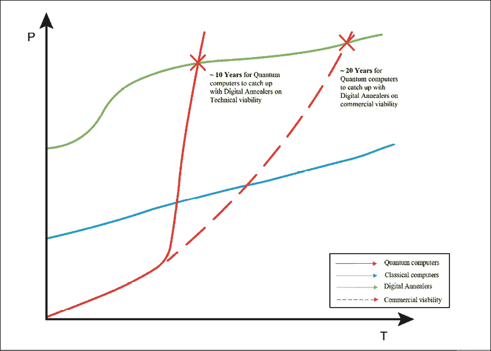

# five

# 采访富士通研究员 Dave Snelling 博士

在本书的前几章，我提供了一个关于量子计算和区块链的技术细节的观点。我讨论了这两种技术在不同行业中的用例。我讨论了这些技术在几个方面的共同之处，以及为什么我觉得它们会发生冲突的技术原因。然而，当我们从商业利益的角度来看事情时，我们看到它们在很大程度上是相互协同的。

这本书的第一个目标是建立这两个突破性技术背后的技术概念。一旦我们讨论了这一点，本书的重点就转移到了这些技术的*上。我想证明，随着时间的推移，这些技术将在我们的生活中占据越来越大的位置。然而，这仍然是一幅不完整的画面，因为我们缺乏那些直接使用这些技术来实现这一点的人的观点。*

在这一章和随后的章节中，我公布了我采访量子计算专家的内容。这些采访让我大开眼界，尤其是当我们讨论大规模改变人们生活的可能性时。在这一章中，我捕捉到了我和富士通的 Dave Snelling 之间的讨论。

Dave 在富士通担任过几个角色。他是富士通研究员和杰出工程师，人工智能项目总监，也是富士通 EMEA 办公室首席技术官的一员。他在大学期间学习高性能计算后开始了他的职业生涯。经过几次短暂的职业跳跃，包括学术界的一次，他在 22 年前加入了富士通。

我第一次见到戴夫是在富士通在伦敦贝克街的办公室举办的一次活动上。Dave 介绍了数字 annealers 在金融和物流领域的影响。在他的报告之后，当我被介绍给戴夫时，他被称为富士通数字 Annealer 背后的大脑。有那么一会儿，我以为这可能是和一位科学家的一次长谈。结果是一次聊天，戴夫滔滔不绝地讲述数字退火机的实际应用。

我马上意识到我必须为我的书采访戴夫。几周后，我们再次见面，这一次，我向戴夫简要介绍了我写这本书的计划。我们在富士通办公室见了面，戴夫很友好地以一种更全面的方式提供了他对量子计算的看法。聊天中最精彩的部分是戴夫拿起我的平板电脑，画了一张图，代表量子计算机、经典计算机和数字退火机在未来二十年将如何发展。

然后，我们安排了一次采访，戴夫就他如何看待量子技术在不同行业的应用发表了自己的看法。以下是采访实录:

阿伦:戴夫，非常感谢同意接受这次采访。让我们先简单介绍一下你是如何进入量子计算的，以及你在量子计算领域的探索。

戴夫:没有给你我的简历，我第一次离开研究生院就开始了。我在研究生院做高性能计算，来到欧洲，在同一领域创办了一家公司。这家初创企业随后破产了，就像多年来很多企业一样。那是在 1983-84 年。在那之后我做了一点咨询工作，然后我在莱斯特大学和曼彻斯特大学教书，直到 1997 年，主要是教新颖的计算和面向对象的设计。

然后我加入了富士通，支持他们在欧洲中期天气预报中心(ECMWF)的超级计算项目。从那以后我一直在富士通工作。我在富士通的最初几天主要是在实验室度过的。我花了很多时间研究各种不同的东西，从高性能计算开始。

我开始研究网格计算，也就是云计算的前身。在我在实验室的最后一段时间，以及在我向业务部门过渡的过程中，我一直围绕着人工智能工作。大约两年前，富士通宣布了它的数字 Annealer。我必须很快地学习量子计算，我过去的经验对此很有帮助。因此，我在富士通推动量子计算研究，但最初我是从商业方面着手的。

我的技术背景对于真正理解我所谓的真正量子计算面临的挑战是必要的。我还能够从技术和业务战略的角度来解决数字 Annealer 可以解决的用例。这就是我现在的处境。在过去的一年里，我一直是富士通数字 Annealer 国际业务技术方面的专家。

当然，我的一个主要职责是阻止我的营销人员和我们自己的销售人员把一个产品当成另一个产品来卖(他笑着说)。我还确保在我们所有的内部和外部沟通中，我们都清楚我们销售的不是量子计算机。这是一台数字退火机，但它很擅长解决一些问题。

那些问题是什么？我们如何绘制它们的地图等等？我就在那里。

阿伦:非常感谢你。这很好地引导我们进入下一个问题。你能告诉我们数字退火机的情况和它是如何出现的吗？

戴夫:我可以告诉你数字退火机的背景。它是由日本富士通实验室的一个团队开发的。我们有一个团队在定制技术设计的历史。该团队将*组合优化*问题确定为要解决的关键目标，这可能是受 D-Wave 早期的一些发展的启发。这给了富士通一个信号，组合优化问题的定制解决方案市场即将出现。

早在 2011 年，D-Wave 就开发了量子计算机(128 量子位)，该计算机使用量子退火技术专注于优化问题。

组合优化问题是应用数学技术在有限的一组可能的解中寻找最优解的问题。可能解的集合通常由一组限制来定义，并且该集合对于穷举搜索来说太大了。一个例子是旅行推销员问题，其中总的旅行距离必须最小化，而每个客户只被访问一次。来源:[https://www . science direct . com/topics/computer-science/combinational-optimization-problem](https://www.sciencedirect.com/topics/computer-science/combinatorial-optimization-problem)

事实上，它现在正在出现。所以，时机刚刚好。然后，我们用纯科学的技术方法着手处理它。我们如何做到这一点？数字退火机是致力于开发解决量子应用的组合优化子集的技术的结果。

这就变成了一项技术，包裹着一套完整的服务。富士通现在跨多个阶段提供这些服务，从确定问题是否适合组合优化开始。然后，我们确保手头的问题足够大，以保证有一个非常高性能的解决方案。小的组合优化问题不需要数字退火程序。还有一些问题太大了。当然，我们正在努力及时解决这些问题。因此，该流程从识别一个行业问题开始，然后真正的挑战是将行业内的业务问题映射到一个*二次无约束二元优化问题*。

二次无约束二元优化问题曲波已成为一个统一的模型，用于表示广泛的组合优化问题，并用于连接面临这些问题的各种学科。一种新的量子退火计算机将曲波映射到具有特定大小和边缘密度限制的物理量子位网络结构上，这种计算机对将底层曲波结构转换为具有更少节点和边缘的等效图的方法产生了越来越大的兴趣。来源:[https://dl.acm.org/citation.cfm?id=3160134](https://dl.acm.org/citation.cfm?id=3160134)

**阿伦**:有意思。在此基础上，我们为什么需要这款数字退火炉。为什么我们不能用传统的机器学习技术解决这些组合优化问题呢？

Dave :组合优化问题的本质是它们并不适合精确的解决方案。我最喜欢的例子是典型的背包问题。我可能在之前的一次谈话中告诉过你这一点，但为了你的读者，我将再次告诉你。

背包问题:我们有 27 件物品(这是一个精心挑选的数字！).27 件物品要拿起来放在背包里，而我只能带一定的重量。我想在那里得到最大的价值。有些项目只是有它们自己的内在价值，但也有项目之间相互作用的可能性。例如，金戒指和钻石有各自的价值，但作为一枚钻石戒指，它们的价值更大。这种互动是积极的。

也有负面影响。在我们的物品清单中，我们还有一只鸡和一只狐狸。消极的互动是真实的——他们不太可能相处融洽。你知道你不想把它们都放在你的背包里，因为那样你就有了一只死鸡和一只脏兮兮的狐狸:比你只拿其中一个的价值要低。

这类问题中复杂的相互作用根本无法用我们今天拥有的现代技术以任何易处理的方式来解决。事实上，如果你每秒钟能称重 1000 个背包，尝试所有可能的组合，你将需要 500 万亿千年才能找到最佳组合。

我一直很喜欢这个说法，因为每秒 1000 包和 500 万亿千年是人们会停下来理解的数字。所以这类问题是一个组合优化问题。超过一定范围后，即使使用数字退火仪，也无法确定精确的解决方案。所以，你要找的是一种启发式方法。

一种**启发式**技术，通常简称为**启发式**，是任何一种解决问题、学习或发现的**方法**，它采用一种实用的**方法**，不能保证是最优的或完美的，但足以实现眼前的目标。来源:[https://www . 101 computing . net/heuristic-approach-to-problem-solution/](https://www.101computing.net/heuristic-approaches-to-problem-solving/)

数字退火炉使用的方法是模拟退火，这是一种非常有效的寻找局部最小值然后寻找更深的最小值的方法。

**图形处理单元** ( **GPU** )是一种专用电子电路，旨在快速操纵和改变内存，以加速在帧缓冲器中创建图像，用于输出到显示设备。来源:[https://en.wikipedia.org/wiki/Graphics_processing_unit](https://en.wikipedia.org/wiki/Graphics_processing_unit)

因此，对于这类问题，我们可以在传统机器或 GPU 上使用启发式方法。我们有一个运行在 GPU 上的数字退火器仿真器。它在 GPU 上比在数字退火机上慢几千倍，但它在解决小问题方面做得很好，因为它可以模拟数字退火机评估从一个状态到下一个状态的所有可能变化的方式。如您所知，每个状态都被描述为一串位。数字退火器评估如果改变这些位中的每一位会发生什么，并同时评估所有这些位。现在，这大约是 130，000 路并行，并且都在同一个芯片上。

如果你试图用一个 CPU 集群让 130，000 个内核互相通信，你会有一个巨大的机器。您可能会联想到这种机器的许多问题，其中一个最大的问题是，您不能让所有内核在每个周期都相互通信，而在数字退火窑中，可以同时评估和比较这 130，000 种不同的情况。

当你尝试在 GPU 上做同样的事情时，你会比在 CPU 上做得好一点，但你仍然没有连接。这就是你在数字退火机上看到的——对于一个特殊的问题，非常紧密的耦合。它只对 8，192 位的二进制域进行模拟退火。

此外，还有一个冷却循环，当模拟退火装置从一种可能的解决方案转移到另一种解决方案时，它会缓慢地改变灵敏度。自动冷却是硬件的一部分。

模拟退火炉需要冷却时间表。如果温度太低，退火炉将不能逃脱局部最小值。当温度过高时，它会很难收敛到一个局部极小值。需要根据退火炉的灵敏度来计划冷却循环。

除此之外，还有一些内置的硬件来检测你何时陷入局部最小值。然后，您可以编码您对该检测的敏感程度，然后硬件将自动暂时升高温度并再次开始搜索。你上升到一个更高的温度，以摆脱局部最小值，然后开始再次冷却，当然记得你在哪里。

有些情况下，如果你知道你的问题有一个最小值，你就可以得到实际的最小值。例如，在纯约束优化问题中，退火程序可以找到匹配所有约束的任何解决方案。

Arun :你用你的数字退火机试过背包问题吗？

戴夫:哦，是的，我们有。我们已经运行了经典的组合优化问题集，例如图着色、最大割、背包和旅行推销员。背包问题对我来说就像金融中的投资组合优化。因此，如果我能解决背包问题，我相信，我们就能解决金融中的投资组合优化问题。我把什么(*股票*、*债券*、*衍生品*、*现金*、*商品和什么比例*)放入我的投资组合？

权重是我允许投资组合的最大预算，波动性是不同资产(如*股票*和*债券*)之间的行为方式。这些资产中有些可以协同工作，有些则可以相互对抗。在他们相互对抗的情况下，这是一件好事，因为你希望他们创造所需的多样化。因此，在这种情况下有优化。

旅行推销员问题本身应该避免，因为纯粹的旅行推销员问题已经有了几十年的研究和数学证明，很容易解决。如果你把变体放在上面，它们会更有趣。我们与宝马合作的一个项目是焊接汽车底盘的底部。你有几条缝需要焊接。完成所有这些焊接的最快方法是什么？

传统的旅行推销员和焊接问题之间有一些不同。当你去一个城市(焊接点)时，你必须在那里呆多久就呆多久。因此，有一段时间是和在城市里联系在一起的。在焊接的例子中，因为接缝是二维的，所以你会在地图的其他地方出现，这有点像虫洞。

这是一个延时虫洞，你可以从一端进去，从另一端出来。现在，当你有了这些变化(来自经典的旅行推销员问题)，并把这些约束放入你的问题中，你就不再有一个可以在笔记本电脑上解决的经典旅行推销员问题，因为它变得更加复杂了。

然而，这样的问题完全在数字退火装置的解决范围之内。DA 可以处理多达 90 条焊缝，它甚至可以与多个焊接机器人共享彼此的工作空间。所以，这就像两个机器人一起工作，告诉对方，“当你在那边的时候，让我为你做几件事。”用这种方式工作，机器人可以工作得更快。在提高制造过程的效率方面，我们已经取得了巨大的成功。

宝马和富士通正在研究一种数字退火机驱动的解决方案，以提高宝马制造流程的效率。David 在上面的解释中提到了该计划，在该计划中，数字 Annealer 处理的问题类似于旅行销售人员的问题。宝马工厂有几个机器人负责一辆车上的几项任务。数字退火炉被用来使机器人更有效地装配汽车。

**Arun** :你能透露一下你在那个特定用例中实现的效率方面的统计数据吗？

Dave :对于这个特殊的用例，宝马已经发布了一份新闻稿。

新闻稿披露了以下内容:

> “目前，解决这一挑战的原型量子计算解决方案可以计算七条焊缝的优化路线。通过与富士通量子计算数字退火机合作，一家主要的汽车原始设备制造商已经测试并优化了 22 个 seam，经济高效地增加了使用相同资源生产的汽车数量，这将增加到 64 个 seam(具有 8，192 位规模)，带来了颠覆性的变化。”

**阿伦**:太好了。我有一个关于数字退火炉应用的问题。在过去的六个月里，自从我们开始讨论这个问题，我遇到了一些使用量子计算解决难题的人。这些问题包括模拟选举、交通管理、气候模拟，甚至经济衰退模拟。在所有这些不同的应用中，哪些是唾手可得的呢？你关注的其他令人兴奋的领域是什么？

**戴夫**:正如之前提到的，我们正在关注制造业——就像与宝马的合作一样，我们正在优化制造流程。从我们知道如何解决这个问题的意义上来说，这是一个唾手可得的果实，如果你能增加产量以满足需求，也就是说，不必建立一个新的工厂，这将产生巨大的影响。投资组合优化是我们正在研究的金融领域的另一个重大影响领域。

第二个领域是偿付能力资本要求(SCR)。重要的是能够找到一个投资组合，给你一个足够安全的 SCR。我认为这可能是我们试图通过数字退火程序完成的最复杂的计算。

阿伦:我更像是一个资本市场人士，而不是保险专家。我知道 SCR 相当于风险价值(VaR)，对吗？

**Dave** :类似，但它来自监管要求驱动的保险领域。使用 SCR，我们平衡一个近似值，然后计算平衡投资组合(资产)的实际 SCR。数字退火程序实际上并不解决 SCR，而是它的代理。我们已经测试过，代理的行为与实际的 SCR 完全一样。我们对这种过程很满意。

我们会考虑风险值，但我们还没到那一步。我们正在帮助我们的一个客户评估更频繁的再平衡或更高质量的再平衡对业务的价值，或者从一开始就能够使用更大的资产池来生成他们的投资组合。然而，我现在还不能给你任何性能数据。

Arun :我有一个关于频繁再平衡解决方案的问题。如果你愿意的话，这项技术(数字退火装置)可以让你瞬间恢复平衡。但这样做的交易成本将使其在财务上不可行。在你重新平衡和提供重新平衡建议的过程中，你是否也考虑了交易成本？

戴夫:我们对的做法是:你可以进行评估，并单独决定是否做出改变。因此，你可以每天进行评估，当财务上可行时，你就可以执行投资组合再平衡。我们也做了一些探索，限制投资组合在任何时候发生变化的百分比。

我们可以通过这样一种方式进行再平衡，即只有大约 10%的资产发生变化，并且每个资产只变化 2%或 3%。再平衡可能是一个平稳的过程，而不是完全混乱的。否则，你每次都在创建一个新的投资组合。但是我们也可以对约束条件进行编码，比如说，*给我一个新的平衡投资组合，其中只有 5%的资产变化小于 10%* 。这种灵活性和约束管理赋予我们处理交易成本的能力。

阿伦:真有意思。你在物流部门正在解决的问题是什么？

戴夫:我们已经在日本使用数字 annealers 进行交通管理，在那里，你可以同时进行几个点对点的旅程，而不是点对点的旅程。你可以想象一个出租车网络，走着经常走的路线，并且都经过城镇的同一个地区。如果你能告诉你的一些出租车走稍微长一点的路线来减少拥堵，总的来说，每个人都可以快 40%的路程。这在他们进行研究的东京是可行的，因为出租车司机会按他们说的去做。这在伦敦可能行不通。

Arun :数字退火机也不能在印度的公路上使用。如你所知，在印度，人们用直觉而不是交通规则来驾驶，所以会有更多的混乱，annealer 可能很难应付。路上的车辆和人的数量是伦敦的好几倍，所以这也是计算密集型的。

戴夫:是的，但是这种方法在军事行动和自动驾驶汽车网络中是可行的。它不是今天的市场，而是可能发生的事情。就实际运输而言，一个更大的问题不是货车朝哪个方向行驶。而是我们在货车上放什么？这与一个场景有关，在这个场景中，一辆货车载着一些东西在城市间分发，数字退火程序用于优化货车的路线。

这是一个比货车的最短路线更有趣、更具挑战性的问题。其中一个例子是自动柜员机补充。现在，这显然是一个正在消失的市场，但每个国家至少有一家银行将被要求在几乎每个城镇都有现金可用。因此，这种应用程序至少有一个客户。但问题不在于如何最有效地将现金送到车站。而是你在哪个自动取款机里放了多少现金？

根据分发了多少现金,你现在可能想减少去那个地方给自动取款机充值的次数。因为你真正想做的是在 ATM 里过夜保持最少的现金量。

还有一整类的问题围绕着轮班调度，其基础是图着色。我的一个潜在客户有一个工程师网络。如果这些工程师一定要出去修东西，你派哪个工程师？你让哪个工程师轮班？你在一周的哪一天发送它们，这样你就满足了所有的约束，比如它们都必须一周工作 37 小时？

我们也有一些限制，比如这些工程师每周需要休息两天。他们都必须上晚班。当我建模的时候，我对这个问题的第一个版本远远超出了我在数字 Annealer 中的位数。所以，这个问题需要划分。这是我们(富士通)围绕这些解决方案的服务的一部分。

即使我们去我们的百万位目标机器，我们可能不得不划分问题。围绕分区的大型解决方案将成为我们业务的一部分。我知道 D-Wave 的人有很好的软件，可以为连接不良或弱连接的退火炉子进行分区。D-Wave 第二代每一位只有 15 个最近邻。

在我们的芯片上，我们有一个 8K 路连接到 64 位精度的每一位。但是，当我们选择芯片时，我们将面临类似的挑战。这与机械工程 CAD(计算机辅助设计)和 CAM(计算机辅助制造)在我们尝试进行模拟时面临的挑战是一样的，比如对手机组件周围的能量场进行模拟。你必须做 3D 建模来建立你的网格，然后划分网格，把它放到你的集群超级计算机上。多个数字退火程序的划分是同一类问题。

Arun :它(分区解决方案)已经投入使用了吗？或者你正在计划或开发它？

戴夫:集群机器还没有上线，它还在实验室里。聚类软件仍在开发中。它的目标是在 2020 年发布。所以，这并不遥远。

阿伦:我很期待。我们已经触及了物流、金融服务、交通管理和劳动力管理。你在医疗保健方面做什么吗？

戴夫:是的。药品是描述它的最好方式。您使用退火程序的方式不是为了确定最终的解决方案。它是为解决方案寻找一个代理，就像我们在保险示例中对 SCR 所做的那样。假设这是一个癌细胞，你知道你想用放射性药物锁定它。要做到这一点，你需要弄清楚如何设计你的药物，使其只针对那个细胞。事实证明，解决这个问题所需的分子模拟数量是巨大的。

每一次模拟都要花费几个小时(数百个小时，取决于许多因素)的计算机时间，而且相关的成本也很高。数字退火机的策略是我们从一个基本的分子结构开始，我们可以添加一些东西。例如，我们可以从一个苯环开始(C 6 H 6 )。在苯分子中，你有一个由六个碳组成的环，每个碳与一个氢原子相连。你可以换出氢气，所以你有 6 个不同的地方放 50 种不同的东西。也就是 6 的 50 次方种组合。

我们通过缩小范围来解决这个问题，使用分子键能来确定产生可行分子的最佳候选者。这并不完美，但总比没有强。相邻分子之间可能的相互作用也需要考虑在内。他们之间的联系也很重要，因为这是一个约束。

这种模型在药物设计中特别有价值。这是我们正在关注的一个领域。从市场的角度来看，(数字 annealer 的进入)还需要一点时间。制药行业乐于进行大规模的化学测试，并且在采用新技术方面进展缓慢，因此这将是一个渗透挑战。这就是你的医疗保健。

Arun :蛋白质折叠是一个主要的建模挑战，如果我们做对了，我们可以加快药物发现过程。戴夫，谢谢你提到这一点。你认为量子计算的哪些领域会首先实现？

戴夫:在我看来，量子计算世界有三大类。有 gate 计算机，然后我们有 annealers 数字和量子。此外，还有我称之为*的模拟*量子设备，可以用来解决量子物理学中的问题。在*模拟*类别中，你连接上量子设备来描述自然中的一个问题。

它只是将自然编程到计算机中，这将在 gate 计算机之前产生一些结果。退火炉将首先产生结果，因为我们现在正在用数字退火炉，量子退火炉将不会太远。但是这些模拟量子设备将介于两者之间。他们会在我们让星门计算机破解 RSA 算法之前开始。物理学将会有重大发现。这主要是因为他们制造了一个量子设备，当它在做它正在做的事情时，它在回答一个更大的问题。

**阿伦**:有意思。上次我们见面时，你给我画了一张图表。我不确定你是否记得？[有些粗糙的边缘图如下所示:]

图 Dave Snelling 的草图，解释了计算范例的趋势

戴夫:是的，我喜欢。图表上有一个点，数字解决方案和量子解决方案的交叉点。一个是它们在可解性方面的交叉，然后在定价方面的交叉。数字退火机最终将被商品化，这将使它们的价格逐渐下降，这将使你的商业生存曲线进一步向右移动。

Arun :那你为什么觉得这种趋势是有益的呢？我想你已经说过了。我们能简单讨论一下基于门的计算机和量子退火机的应用之间的区别吗？

Dave :基于 gate 的最大优点是非常简单。理论上，基于门的量子计算机将是图灵完全的。所以，任何你能用图灵机描述的东西，你都可以装上量子门。你或许可以在量子门机器上编码一个图灵机，然后你就完成了。

图灵机是数学家艾伦·图灵在 1936 年想到的一种假想机器。尽管很简单，但这台机器可以模拟任何计算机算法，不管它有多复杂。来源:[https://www . cl . cam . AC . uk/projects/raspberrypi/tutorials/turing-machine/one . html](https://www.cl.cam.ac.uk/projects/raspberrypi/tutorials/turing-machine/one.html)。图灵完全编程语言或计算设备相当于图灵机，因为它可以实现任何算法。

以下只是我的看法。在某些方面，我认为基于门的计算机分散了市场对基于量子的解决方案的开发，特别是在我谈到的模拟空间。在这个模拟空间里，我们可能有更容易摘到的果子，可以通过建造特殊用途的机器来得到。

现在一种特殊用途的机器是量子退火炉。他们在编码一个直接的哈密顿算符，然后最小化能量，这样你就可以把你的问题编码出来。组合优化恰好适合退火。从这个意义上说，数字和量子退火炉解决了一个非常特殊的问题。

我们有一个在 annealer 上分解整数的算法。它不能扩展到 RSA 级别，但确实有效。如果有人真的要建造一个紧密耦合的百万位数字 annealer，你可能已经很接近了。但是我们不会构建一个紧密耦合的。我们将构建一个集群，然后集群使它很难被用作(RSA 的)破解程序。

**Arun** :这么多解决未解决问题的机会，你去行业销售 annealer 的主要挑战是什么？

**Dave** :当我们与客户交谈时，走向市场的策略是非常精确的，数字退火机只解决一种问题。我们面临的最大挑战是让人们远离他们所听说的量子人工智能和量子机器学习。

**阿伦**:有意思。所以，这是我经常听到的话。我们似乎被基于门的机器分散了注意力。

但是他们没有意识到的是，量子计算给了我们一种在计算机中模拟自然的方法。你不需要把物理转化成数学，然后转化成计算机科学运算，你只需要把物理模型转化成机器。在翻译过程中(从物理到数学再到计算机)，我们会丢失大量高质量的信息，但在量子世界中，这种情况不会发生。

戴夫:嗯，我完全同意这一点，因为这就是我一直在谈论的*模拟*量子计算机。现在我们几乎需要给*模拟*加上引号，因为否则人们可能不一定理解我称它们为模拟的背景。量子退火器处于中间位置，因为它们是一种通用模拟设备。但是，如果你能建造一个模拟装置，匹配你的蛋白质(在医疗保健的例子中)，然后让它达到最终的低能量状态，你就拥有了一切。

Arun :我们之前见面时，你提到物流可能是一些组合优化问题的最大市场。我亲眼目睹了几个复杂的金融服务问题。例如，我们在金融服务领域有风险管理，这需要大量的数据。我们在这个空间中处理成千上万的数据点。如果我们可以使用退火装置解决风险管理挑战，为什么物流领域的优化会变得更加困难？是数据的维度增加了物流的难度吗？

戴夫:从实用的角度来看，在物流中编码是受约束驱动的。而投资组合优化空间，例如，主要由目标函数驱动。通常，当你描述一个退火问题时，你有目标函数。这就是你想要优化的。因此，当你试图优化投资组合平衡时，你是在试图最小化你的风险。然后你对其设置两个约束，一个是最大回报，另一个是最小花费。

你也可以把它编码成一个双重目标函数，用一个风险参数来平衡风险和回报。在此之后，您可以根据总预算对其进行约束。这是情况的一个方面。

在物流领域，基本上都是约束。编码过程中的约束往往会增加问题的复杂性。这是因为您通常通过将二次项构建为问题解决方案的一部分来对约束进行编码。你在用部分信息空间给代码你的约束，所以用这个信息空间给你的目标函数编码确实有点难度。另外，有时候你在物流方面的约束会导致更高阶的多项式而不是二次。

Arun :转到另一个话题，我在看半导体行业。量子位电路有更多的选择，而不仅仅是用于经典计算机的硅基半导体模型。有不同类型的材料被使用，不同的模型被使用。那么你认为这会对这个行业产生什么影响呢？如果不同类型的量子位电路进入图像，它会杀死半导体垄断吗？

戴夫:在约瑟夫森结的量子空间中，出现了许多奇异的技术，它们完成了自己的炒作周期，之后是平静期。我记得约瑟夫森路口是几十年前的事了。然后它们就消失了，现在它们又回到了这个量子保护伞下。你也有高温超导体。他们可能会受欢迎程度忽高忽低。

约瑟夫森结是通过在两层超导材料之间夹入一薄层非超导材料制成的。这种装置是以布莱恩·约瑟夫森的名字命名的，他在 1962 年预言超导电子对可以从一个超导体“穿隧”到另一个超导体。来源:[https://www . scientific American . com/article/what-are-josephson-juncti/](https://www.scientificamerican.com/article/what-are-josephson-juncti/)

阿伦:戴夫，最后一个问题。量子至上——你认为有人接近它了吗？

戴夫:不，根据传统的定义，他们不是。量子至上还有其他定义，比如说*你在量子计算机上解决问题的速度能比在计算机上快吗？*从这个意义上说，是的，他们中的许多人都接近量子霸权。

事实是，在半毫秒内解决一个问题是非常令人印象深刻的。但如果你能在笔记本电脑上用 2 秒钟解决它，那么它真的改变了你的商业模式吗？不。那是量子至上吗？有，但是没有。

如果是解决一个每个月都需要解决的问题，并且在常规集群上需要 6 个小时，那么你需要数字退火机还是量子设备？这只是一个简单的经济问题。它不是由时间窗口驱动的。因此，量子至上肯定是一个时髦词，至少在商业层面上讨论时是这样。一旦有人想说他们已经用量子计算机做了以前没有人能做的事情——他们可以宣称*量子优势*，你知道这将只是一个营销旗帜。

这里(我)有一点愤世嫉俗，你不能把它归因于富士通。围绕量子优势的大肆宣传是为了确保这类研究的资金。公司和研究团队利用这一点来吸引关注和获得研究资金。我特别渴望看到我们之前讨论过的模拟空间中的一些优势。

我希望看到一些有意义的突破的其他领域是量子通信、量子传感(例如:重力传感)和量子成像。这些是使用纠缠的量子计算的令人敬畏的用例。例如，重力传感器对重力非常敏感。你可以感觉到有人在墙后行走，可以在量子设备上看到他们的重力信号。英国量子研究组织目前正在这个领域做大量的工作[1]。

Arun :我一直在与从业者交流，不久将与英国研究机构交流。他们中的大多数都是学术界人士。这本书主要关注这些技术的实际意义；然而，捕捉研究世界的发展方向是很好的。

戴夫:当然。就我个人而言，我现在并不关注研究领域。我忙着尝试做一个从业者的角色，解决行业问题。

阿伦:谢谢你，戴夫，占用了你这么多时间。非常感谢各位的真知灼见。

戴夫:不客气。我期待着看到完成的书。

# 结论

我与 Dave Snelling 的对话非常有见地，从中可以获得一些启示。主要的收获是数字退火器如何在几年内为量子计算机和退火器铺平道路。从技术能力角度和商业可行性角度来看，这种转变都很有趣。

我想强调的另一个关键点是 David 对技术的关注。基于 Gate 的计算机，那又怎样？量子至上，那又怎样？这样的例子不胜枚举。这对技术专家来说是一个重要的教训:确定一个要解决的问题，然后向解决方案部署技术资源是非常重要的。我经常发现技术人员在寻找问题，创造解决方案，而这从来都不是创新的好地方。

很明显，戴夫对量子计算机的可能性充满热情。在本章中，我们讨论了几个行业的用例。然而，大卫也警告我们，围绕量子霸权的炒作可能会过于兴奋。

我个人受到戴夫简化叙述的能力的启发。对于一个有这么多年实验室经验和长期技术背景的人来说，他讲故事的能力是惊人的。最后但同样重要的是，他在分享他对这个行业的观点和想法时是多么的脚踏实地和开放，我真的很感动。

# 参考文献

1.  [http://uknqt.epsrc.ac.uk/about/uknqt-hubs/](http://uknqt.epsrc.ac.uk/about/uknqt-hubs/)