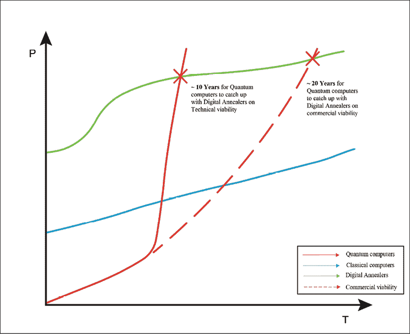
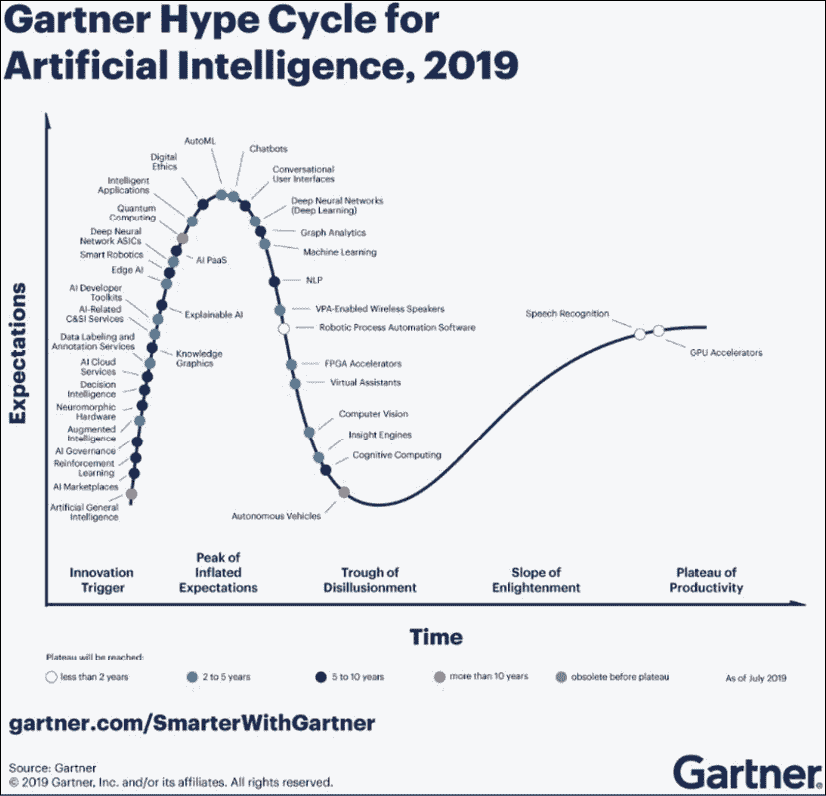

# 17

# 结论——蓝天

> 生活就像一盒巧克力，你永远不知道你会得到什么。

*——弗勒斯甘*

考虑到阿甘的至理名言，写这本书的机会绝对已经“像一盒巧克力”。现在我已经读到了这本书的最后一章，我可以说这是一次有益的、令人谦卑的、令人惊奇的学习经历。

在《每日金融科技》( Daily Fintech)发表了两年每周一篇的博文后，我知道我可以写作。我曾计划在 2020 年开始写作生涯。但是写书的机会比我预期的早了一年。我知道生活扔给了我一个曲线球，我已经准备好打出公园。

在过去的几年里，我的许多朋友一直在撰写人工智能、区块链和量子计算方面的书籍。当我看量子技术书籍的作者时，我看到了物理学家和计算机科学家。我绝对不是其中之一。我必须为这本书写一篇论文，重点是我所擅长的领域。

在我与一位硅谷企业家关于量子计算的早期对话中，她提到一个人需要拥有物理学、数学和计算机科学的博士学位才能完全掌握量子技术。我知道这是一个轻松的评论，但也有一些真理。因此，当我在开发这本书的论文时，我知道我必须坚持我的优势。

我的优势来自于我在过去 5 到 6 年里作为风险投资者的经历。多年来，我作为风投的经历教会了我两个关键的教训。第一个是，技术只是达到目的的一种手段，关注“*是至关重要的，那又怎样？*“第二个教训是，技术人员应该能够保持叙述简单。

在我开始风险投资生涯之前，我在银行工作，是一名数据和技术专家。这通常涉及到与董事总经理和首席执行官的合作。这些高度成功的个人中，许多人将技术视为银弹。他们觉得有一种特殊的技术可以解决他们的业务模式和流程效率低下的问题。我不得不不断向他们强调，技术只是达到目的的一种手段。

因此，作为一名风险投资人，我的一个重点关注领域是超越炒作。我必须专注于我正在评估的技术的商业应用和可行性。仅在 2019 年，我就有幸观察了 400 多家科技初创企业。如果我们把过去五年考虑在内，这个数字会超过 2000。对于风投行业的大多数人来说，这是非常典型的。

这一经历让我有了一个独特的视角，可以超越我所目睹的围绕量子技术的炒作。每当我在这个领域听到一个概念，我会问的第一个问题是，“那么它将解决什么问题？”我对这本书的态度正是如此。

我不想广泛涉及量子计算背后的数学或物理学，因为我没有能力谈论这些。然而，我知道如何透过一项技术的宣传来关注它带来了什么，以及潜在的商业应用。

作为一名风投，我养成的另一个关键品质是保持叙述简单。我经常看到拥有强大技术背景的企业家努力摆脱他们的行话。科学领域有人能够应付这样的语言和解释，但当一项技术正在成为主流时，与更广泛的生态系统建立联系是必不可少的。这种联系只能通过简化围绕技术的叙述来实现。

这些技术的受益者，无论是企业还是消费者，都应该能够与技术的应用相关联。例如，作为一家银行的消费者，你只关心从他们那里得到的抵押贷款利率、信用额度和存款利率。你不关心他们是否使用蒙特卡罗方法或历史模拟来评估他们的信用风险。

这本书本质上是所有这些思考过程的顶点。简化像量子计算这样复杂的东西是极其困难的。同时，从应用角度探索量子计算是一次令人愉快的经历。在这一章中，我将把我在这本书中试图涵盖的量子技术的不同维度集合在一起。

我们先来关注一下房间里的大象。量子计算到底有多炒作？每一项技术都会经历起起落落，量子计算也不例外。基于我们在本书中讨论的内容，让我们考虑一下量子计算的现状。

# 有炒作吗？

量子计算所依赖的量子力学原理已经存在一个多世纪了。正如我们在本书前几章所讨论的，量子计算机的概念是由理查德·费曼在 20 世纪 80 年代提出的。从那以后，每当有像肖尔或格罗弗的算法这样的突破性算法出现时，它都会增加炒作。

同样，在中国的量子卫星计划(Micius)等成功进行的概念验证中，乐观情绪高涨。这只是人类天生的反应方式，因为这些发明的新颖性增加了多巴胺水平。这也是让生态系统保持乐观并寻求新突破的原因，尽管可能性很小。

回忆一下我对戴夫·斯奈林的采访，以及他为我画的那幅画:

图 Dave Snelling 的草图，解释了退火的趋势

与人工智能领域非常相似，自 20 世纪 30 年代以来，量子计算已经经历了几次兴衰。在我与富士通的 Dave Snelling 的讨论中，他提到量子计算机离主流采用还有 15-20 年的时间。我们讨论了量子退火器的某些特定能力如何比基于门的量子计算机更快地发生。

因此，我们可能会比戴夫的时间表更早一点看到优化问题的解决方案。请参见上图中的图示。像富士通这样的组织也在致力于通过数字退火来弥合经典计算机和量子计算机之间的差距。在本书中，我们重点介绍了一些数字退火机的应用，其中许多已经进入商业环境。

然而，这项技术的一个一致的方面是“量子超级能力”，一些玩家试图利用这一点。量子优势甚至被谷歌这样的公司用来为他们围绕这项技术的倡议制造公关。即使是 Gartner 也不能幸免于这种炒作。他们下面的图表描绘了随着时间的推移对人工智能的期望:

图 2:2019 年嘉德人工智能炒作周期

前面的“炒作图”显示了 Gartner 对由量子计算机驱动的机器学习距离达到顶峰炒作还有多远的看法。我个人不相信这个领域会在未来十年内达到顶峰。在这项技术成为主流之前，我们将在未来的 10 到 15 年内看到更多的高峰和低谷。

戴夫·斯内林和我为这本书采访的许多其他人提供了他们对量子优势的想法。例如，戴夫认为，量子优势不仅仅是处理速度的问题。它必须是关于量子计算机在合理的时间内解决经典计算机无法解决的问题的能力。

谷歌声称在几天内完成一次计算，而传统计算机需要 10，000 年，这可能不一定能让科学界满意。因此，当有公司声称要实现量子优势时，我们必须持保留态度。

围绕量子计算大肆宣传的一个理想结果是，它有助于提高对该技术可能带来的风险的认识。在我与 IBM 的 Dinesh Nagarajan 的讨论中，他强调了这项技术可能对互联网使用的现有加密技术带来的风险。他还强调，在大公司中，技术变革通常需要 7-8 年时间。

因此，围绕该技术的一些炒作可能有助于量子计算获得这些公司董事会急需的关注，这些公司在后量子世界中是脆弱的。随着技术的发展，这些组织可以做好准备变得敏捷，并准备好面对威胁。

这并不是为我们在当今数据驱动的世界中拥有的一些酷技术的非理性繁荣辩护。考虑到这项技术的可能性，很难不兴奋。然而，重要的是要了解我们在量子计算方面的现状，并在此基础上设定现实的预期。现在，让我们来看看书中涉及的一些有趣的技术用例。

# 有功德吗？

最近在 Twitter 上有一个关于量子技术优点的对话，我被扯了进去。提出的问题是，我是否看到了量子技术的价值和现实世界的应用。答案是肯定的，因为至少在去年，我已经看到一些量子计算初创公司开始将他们的解决方案商业化。然而，我会保持谨慎，不要对这些解决方案过于兴奋。

这些公司中的大多数都有能够对我们生活的各个方面产生突破性影响的解决方案。但是他们还没有在真实的环境中证明自己。我在过去 12 个月中接触到的解决方案遍布不同领域，包括医疗保健、气候技术、金融服务，甚至石油和天然气。这些问题大多是经典计算机难以解决的。

尽管这项技术已经非常成熟，但不可否认的是它还是有潜力的。健康和财富是创新能够产生巨大影响的两个关键领域。在新兴市场尤其如此，那里有数十亿人无法获得良好的医疗或金融服务。让我们简单地谈一下我们在书中讨论过的用例，包括面试和其他章节。

## 医疗保健

我们谈到了量子计算可以用来改善药物发现过程的用例。这有两个角度。一是该技术可以缩短药物上市时间，因为它可以模拟药物是否有效的场景。这一过程在传统计算机上效率不高。

此用例的第二个方面是，与使用传统计算机相比，可以更有把握地评估药物对特定健康状况的适合性。将这两个方面放在一起，我们可以开始看到更好的药物更快地投放市场。

量子计算机还可以帮助诊断和治疗复杂的健康问题，如癌症。在为癌症患者开出正确的治疗方案时，医生需要考虑几个变量。使用量子计算机可以给我们一个考虑到不同变量之间相关性的解决方案。

如今，这一过程大多是手工进行的，在决定治疗方法之前，医生会评估病情的严重程度、受影响的身体部位以及癌细胞对健康细胞的潜在影响。看了健康之后，让我们简单地接触一下财富用例。

## 金融服务

这是一个我职业生涯大部分时间都在从事的行业。因此，我对金融服务行业面临的数据挑战有了第一手的经验。回到富士通的数字 Annealer，我们已经看到了受量子方法启发的实际应用。

事实证明，Annealer 在解决投资组合再平衡和风险管理等问题时，比传统计算机要快得多。尽管即时进行投资组合再平衡的财务可行性仍不明朗，但这样做的能力肯定是有用的。尤其是在市场压力条件下，如果投资组合经理想要快速重组他们的投资组合并降低风险，即时完成这一任务的能力将是一大福音。

我曾在一个受监管的环境中工作，在那里实时执行一些风险分析的需求至关重要。大多数对冲决策依赖于隔夜计算的风险报告能力。当市场出现危机时，能够即时或当天做出这些决定并对投资组合做出相应的调整，将在金融领域带来巨大的优势。

金融服务也是一个领域，在计算有效的风险回报时，需要考虑许多相关的变量。例如，在理解衰退的可能性时，这种相关变量问题也是真实的。世界各地的量子专家也在高度自信地模拟这些可能性。

看了金融服务之后，让我们简单考虑一下量子计算对物流的影响。

## 物流

物流是一个经典计算机最难解决的领域。我们讨论了最短飞行路径问题和旅行推销员问题。这些优化问题可以用数字和量子退火器来解决。

我们谈到了空中客车公司正在与量子计算界进行的实验。他们正试图模拟空气与飞机机翼的相互作用。更好地了解飞行的空气动力学可以增加起飞和着陆时的燃油效率。对于一个处于气候紧急状态的世界来说，这可能是一个巨大的胜利，当然也会为实现更高效率的公司带来更高的利润。

## 气候

这让我们很好地进入了量子计算机与气候相关的用例。让我们以化肥工业为例。氮肥是应用最广泛的肥料，也是农业中需求量最大的肥料。然而，目前的制造过程是能源密集型的，碳排放量很高。

具有讽刺意味的是，大自然处理固氮的方式要简单得多，也更节能。由于无法在实验室条件下模拟固氮作用，我们试图模仿这种更有效的制造过程的努力受挫。有几个正在进行的研究项目试图利用量子计算机模拟固氮作用。这将是人类的巨大胜利，因为我们迫切需要转向更可持续的工业流程。

我们还讨论了其他创新用例，如气候建模。今天，气候模拟与模拟我们世界的巨大复杂性相去甚远。有一些人工智能初创公司正在寻求解决这个问题。我们必须考虑大量相互关联的变量，从碳排放到洋流。我们还必须考虑反馈回路，如冰川融化；这种现象导致全球冰层覆盖减少。冰反射太阳光。因此，更少的冰意味着更多的热量被地球吸收，反过来融化更多的冰，等等。如果我们希望有效地模拟我们不断变化的气候，我们将需要更强大的技术来处理这种复杂性，最好是实时处理。

量子计算机可以考虑这些变量之间的相关性，并以更高的可信度为我们提供一个更清晰的视角。我们还讨论了其他潜在的用例，例如使用量子计算机模拟碳捕获。现在让我们来谈谈量子计算机在选举建模中的应用。

离开全球气候，让我们简单考虑一下量子计算将如何影响我们的政治气候。

## 选举

过去五年见证了全球民主进程的重大转变，社交媒体在政府选举中发挥了重要作用。这可能不会像医疗、金融市场或气候变化那样成为大问题，但在美国、欧洲、印度或中国等主要经济体掌权的决策者有能力改变数十亿人的生活。

Max Henderson 友好地提供了他在 QxBranch 工作的见解，在那里他一直在使用量子退火进行选举建模。今年晚些时候，随着 2020 年美国大选的展开，我将热切地关注他。

这应该会让你看到这项技术的潜力。是的，现在还为时尚早。是的，有挑战。但可能性简直令人难以置信，我很高兴人类将随着这种突破性创新走向更光明的未来。现在，让我们看看在我们看到这种创新真正扎根之前必须克服的障碍。

# 前方的道路崎岖不平

从某种意义上来说，这一部分的标题是一种暗示。有时候，人们对量子技术的可能性持怀疑态度，因为我们需要清除一些重大障碍。如果不承认所涉及的“如果”和“但是”,我们就不能谈论美好的未来以及随之而来的所有酷的应用程序。

我们采访了致力于纠错的 Sam McArdle，因为这是量子计算机走向主流的主要障碍。错误纠正的发生是因为存储信息的量子粒子与外部环境相互作用，因此随着时间的推移丢失了它们所保存的信息。

与传统计算机不同，量子计算机依赖于量子位。为了容错，量子位中保存的信息不能复制到其他量子位中。这是量子粒子的一个限制和特征，使得这个领域既具有挑战性又令人兴奋。然而，如果没有找到让量子粒子像光子一样携带信息的方法，很难看到量子计算机成为主流。

在今天的量子计算机中，每一个无错误的逻辑量子位可以有一千个有噪声的量子位。为了处理这些机器中的错误，需要高水平的冗余。然而，为了更好地采用量子计算机，这需要改变。在我们与 Sam 的讨论中，我们提到了 NISQ 技术，这些噪声量子位可以用于某些商业应用的计算。

这是目前正在探索的领域，如化学研究，噪音可以是一个特点，而不是一个破坏。化学反应可以用嘈杂的量子位来模拟，这些量子位代表了它们在现实中可能发生的嘈杂环境。

在我们梦想一个量子计算机可以发挥重要作用的世界之前，这些挑战需要得到解决。这本书的一个关键主题是量子计算机如何对大多数数据和数字值交互所依赖的现有加密技术构成威胁。让我们简单看一下。

# 碰撞路线

我第一次了解到量子计算机可以通过我们今天使用的加密技术的潜在场景时，我非常震惊。在那个时候，量子计算成为了我的一个主要技术范式，它有可能像个人电脑或互联网一样大。

量子技术将互联网置于风险中的可能性是一个挑战，但在我看来，普通人对这种可能性缺乏认识是一个更大的问题。我们生活在这样一个时代，数据和货币交易变得无摩擦、不可见，因此也变得无意识。

我们也正在进入机器时代，到 2030 年，70%的潜在 175 数据将来自机器。自动驾驶汽车、可穿戴设备和传输信息的家用电器都在创造大量高度敏感的个人信息。这确实是一个可怕的命题，在量子计算机能够扩展的那一刻，这些机器中的大多数都将面临被黑客攻击的风险。

另一方面，区块链是一项非常新的发明，已经在世界各地引发了一系列应用。这些应用程序中有许多存储价值、数据，有些甚至存储具有法律约束力的信息。今天大多数区块链解决方案使用 RSA 或 ECC 算法来保护数据交互。他们中的一些人甚至声称这些安全机制是他们的差异化。

然而，除非这些区块链应用转向量子加密，否则它们可能很快就会过时。我们讨论了 lattice-b 密码术和基于代码的密码术，它们可以被归类为后量子密码术。量子计算的潜在风险将使用户远离这些解决方案，即使量子技术不是主流。

结合我们现在看到的区块链冬天，这可能意味着整个生态系统需要反思。有一些区块链或分布式账本技术平台，如 IOTA 和 QRL，声称它们是量子证明。然而，他们代表了区块链社区的少数派；那些为应对风险做好更充分准备的人。

监管机构、政府和大公司需要协同努力，让互联网上的关键应用程序量子化。国家标准与技术研究院正在进行一项后量子密码技术的研究，以保护互联网。

在我与 Dinesh Nagarajan 的讨论中，他提到组织“加密敏捷”是至关重要的。网络繁荣带来了敏捷软件开发方法。量子时代将需要具有加密灵活性的解决方案。这意味着他们的基础设施、平台和应用层需要能够交换和改变他们使用的加密技术。这种能力将确保他们能够在短时间内升级加密技术，并为任何潜在的网络风险做好准备。

我们讨论了组织在应对量子威胁方面面临的挑战。组织需要经历一个成熟的周期，从而达到加密敏捷性的状态。然而，这些大型组织中的大多数都习惯于用 7 到 8 年的时间来升级他们的技术平台。因此，有些紧张的是，如果在那段时间内有任何重大的量子计算突破，这些组织还没有准备好。

本质上，不仅仅是区块链生态系统与量子技术发生了冲突。互联网上的世界也处于这种冲突之中。因此，必须确定和部署可持续的数据和价值交换网络解决方案。

我们还需要各大洲的领导力和治理能力，以便在不断发展的技术创新以及这种创新如何对数据驱动的世界造成新的网络威胁方面保持正轨。当在技术或平台中检测到威胁时，需要确定控制措施，以确保企业和消费者使用它们是安全的。

我们正在进入一个没有几十年时间来保护数据的时代。如果我们要跟上量子计算的步伐，我们必须能够在几年内完成，如果不是几个月的话。说到这里，现在让我们来看看世界各国是如何为量子计算做准备的。

# 民族国家和生态系统

当你有技术优势掌握敌国的国防机密时，你会退缩吗？如果这项技术让你能够控制互联网、医疗保健信息和大型金融交易信息，这难道不会诱使你投资这项技术吗？

这正是为什么中国在人工智能和量子计算上投入了数十亿美元。他们的 Micius 计划显然是量子通信领域的领导者。这刺激了世界各地的行动，美国、欧洲、英国、加拿大，甚至印度都加入了量子计算的行列。他们每个人都为量子计算研究拨款约 10 亿美元。

政府参与地区量子计算生态系统的发展是件好事。这将有助于确保最佳实践得到普遍共享，并且在整个生态系统中遵循某些标准。例如，在英国，有四个由不同学术机构领导的量子计算中心。初创公司、企业和投资者与这些中心合作，充分利用研究能力。

尽管做出了这些努力，但这些国家之一在量子竞赛中领先的风险不容忽视。即使在今天，我们也不确定这些国家中是否有人真正破解了量子难题。如果他们中的一个已经成功实现了量子优势，他们很可能会对此保持沉默。在这个时代拥有技术优势类似于在战后时代拥有核武器优势。

未来的地缘政治战争可能会以更微妙的方式进行，数据是石油，技术是武器。当你对敌国拥有网络优势时，你可以破坏关键基础设施，如电网、交通网络、银行服务、医院和所有其他依赖互联网的系统。

这可能导致大规模的混乱，使资本市场下跌几天，并给受影响的国家带来数十亿美元的损失。

让我们希望各国在他们的对手弄清楚如何造成这种破坏之前，建立起适当的防御和控制。

# 天空是蓝色的

我本质上是一个乐观主义者，尽管我的风投工作要求我必须对科技初创公司做出现实的评估。我仍然不得不乐观地预测，他们将突破技术、运营和市场壁垒。这样做，他们将有助于我的基金和我的投资者获得高回报。

做风投最大的好处在于，这份工作就像是通向未来的一扇窗户。这是因为我们可以提前接触到各行各业的创新公司。即使他们中的一小部分成功地大规模破坏了价值链和生态系统，几年后世界可能会是一个不同的地方。通过投资这样的创新，我们可以看到这种从新生状态的转变。

在量子技术公司，我有机会做到这一点。2019 年可能是我们第一次有几家量子技术公司敲我们的门寻求资金。他们是第一批行动者，但他们也有一份不令人羡慕的工作，那就是为他们的解决方案渗透或创造一个市场。我确信在 2020 年，这个空间将开始变得不同。

到 2020 年，这些先行者中的许多人将更接近于确定其产品和服务的市场适合度。其中一些甚至可以在商业环境中进行试点和实际部署。这将是令人兴奋的几年，我们将看到兴奋、挫折、突破、障碍和疯狂的增长。

在量子计算承诺提供的过山车之旅中，人类的一个属性将持续存在——希望。这是一个希望，我们都在为世界更美好的未来而努力。这是一个希望，尽管困难重重，我们将到达我们的目的地，为我们自己、我们的组织、我们的国家、我们的世界和人类本身实现我们的愿景。