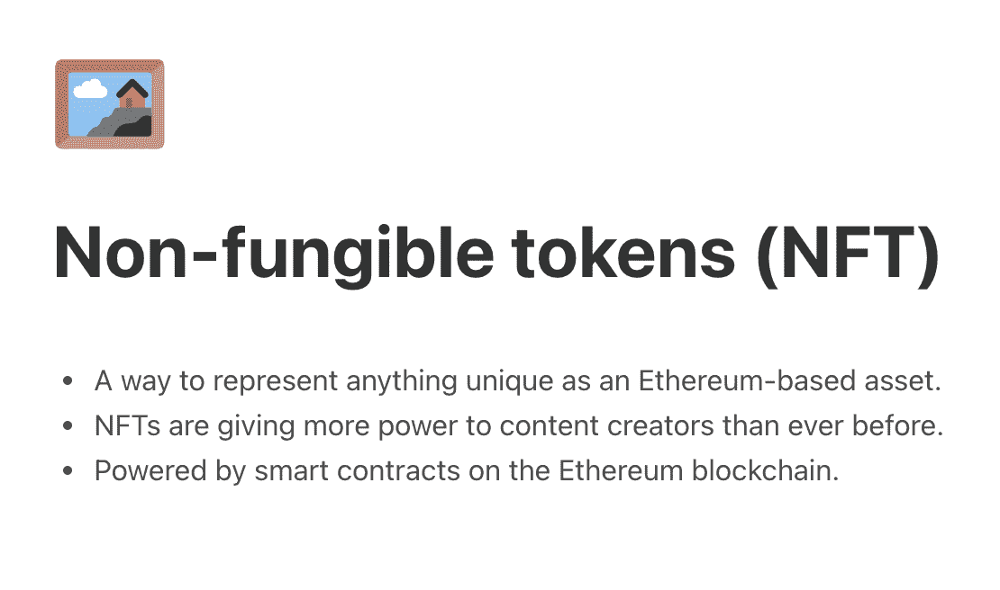
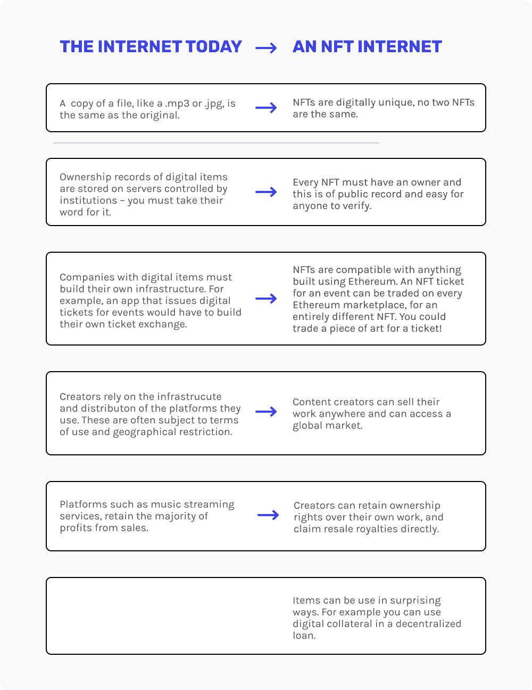
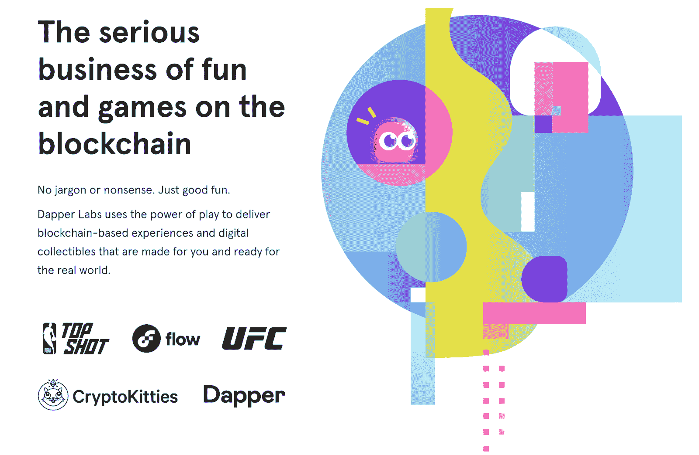
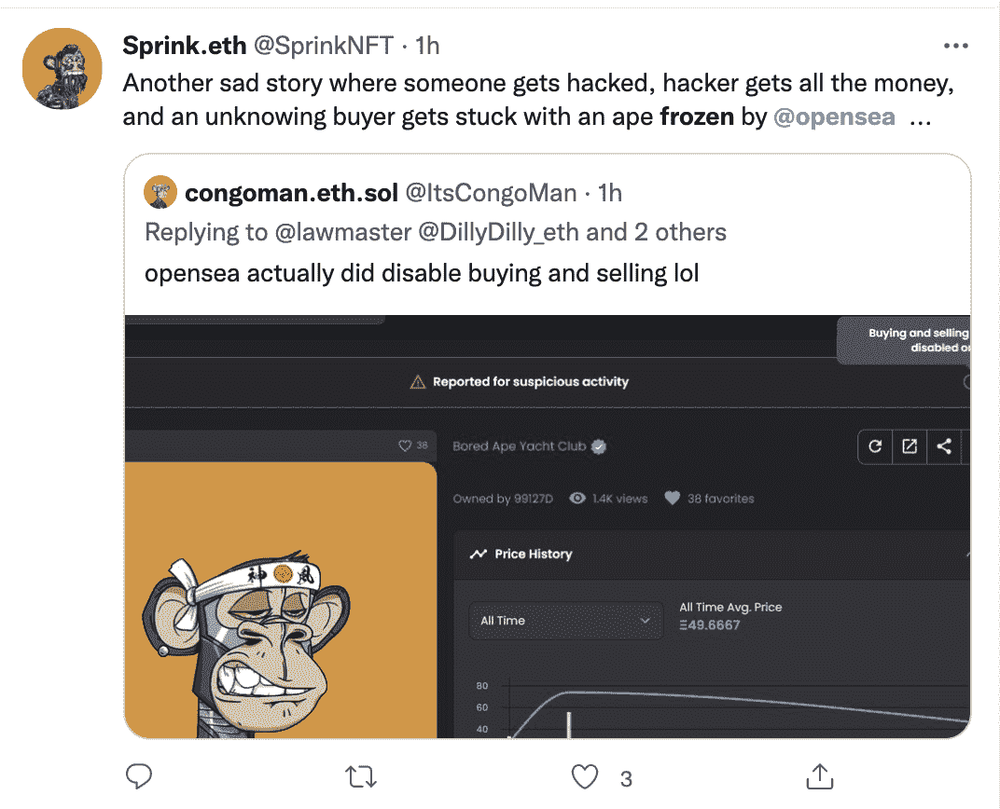

# NFTs 简史

> 原文：<https://www.web3.university/tracks/build-your-first-nft/brief-history-of-nfts>

随着企业家和开发人员过渡到在 Web 3.0 的世界中进行构建，您将很难不同时提到 NFTs。虽然人们很容易将非艺术作品仅仅贴上数字艺术的标签，但它们的用途远远超出了数字收藏品和用于社交媒体影响力的个人资料图片。

尽管 NFT 对商业和文化的最终影响还有待观察，但它们越来越受欢迎，这让任何有好奇心的人都有理由更深入地了解现有的生态系统。

在本文中，我们将简要探讨 NFTs 的过去、现在和未来，并强调我们如何走到今天的关键发展。

## 什么是 NFT？

与传统的加密货币不同，NFT 也称为不可替代的令牌，是独特的数字产品，由区块链管理所有权。NFT 的每个单元都可以被认为是独一无二的。这些可以包括收藏品、游戏物品、数字艺术品、活动门票、域名，甚至是实物资产的合同所有权记录。

从更高的技术层面来看，NFT 是存储在区块链上的不可互换的数据单元，这使得它们能够抵抗篡改、破坏或复制。因此，非功能性测试可以通过区块链进行验证，从而赋予它们外在价值。

“不可替代”是指一项资产的独特品质和特征，使其完全独立，不可从其他资产复制。相反，货币可以是一个很好的可替代资产的例子。在处理货币时，一张 5 美元的钞票总会被另一张 5 美元的钞票(甚至是 5 张 1 美元的钞票)所替代。

虽然不可替代的令牌看起来很复杂，但是您可以将它们视为一种工具，使用区块链来共享几乎任何形式的媒体。

What are non-fungible tokens? ([Image source](https://ethereum.org/en/nft/))

## 过去:第一个 NFT 是什么时候创造的？

正如创新技术经常出现的情况一样，NFTs 不会凭空出现，一夜之间变得家喻户晓。这自然会引出一个问题:第一个 NFT 是什么时候创造的？

那得看你问谁了。一些人认为，2012 年创造的彩色硬币可能是第一枚的合法所有者。正如投资者安德鲁·斯坦沃(Andrew Steinworld)在他的[媒体页面](https://medium.com/@Andrew.Steinwold/the-history-of-non-fungible-tokens-nfts-f362ca57ae10)上分享的那样:

有人可能会说有色硬币是最早存在的非功能性货币。彩色硬币由小面值的比特币制成，可以小到一个 satoshi，这是比特币的最小单位....

彩色硬币体现了比特币功能的巨大飞跃，然而，它们的缺点是，如果每个人都同意它们的价值，它们只能代表特定的价值。比特币的脚本语言从来没有打算在其网络中实现这种类型的行为，因此彩色硬币的力量只取决于它们最弱的参与者。”

其他人可能会认为凯文·麦考伊的“[量子](https://hyperallergic.com/652671/kevin-mccoy-quantum-first-nft-created-sells-at-sothebys-for-over-one-million/)”NFT 在 2014 年 5 月 2 日铸造的硬币区块链上，是“第一个 NFT 头衔”的合法拥有者

2017 年，Dapper Labs 在以太坊上推出了一个名为“CryptoKitties”的项目，这是第一个得到广泛认可的 NFTs 实现，基于以太坊的新 [ERC-721 标准](https://eips.ethereum.org/EIPS/eip-721)推出。这些数字猫在 2017 年的加密热潮中变得非常受欢迎，[当时售价高达 600 Eth(或 17.2 万美元)](https://medium.com/dapp-com/10-most-expensive-nfts-hundreds-of-thousands-for-a-crypto-kitty-b152a7983036)，吸引了全球主流的关注。

从那时起，我们看到了成千上万的 NFT 项目的崛起，取得了巨大的成功。从 [Beeple 在 NFT 拍卖的价值 6900 万美元的作品](https://www.theverge.com/2021/3/11/22325054/beeple-christies-nft-sale-cost-everydays-69-million)到 [Bored Ape 游艇俱乐部](https://hypebeast.com/2021/10/bored-ape-yacht-club-nft-3-4-million-record-sothebys-metaverse)的收藏，NFT 空间已经改变了许多人的生活，并继续塑造着 Web 3.0 的新世界。[创造一个 NFT](https://blog.alchemy.com/blog/how-to-create-an-nft) 变得越来越容易。

## 现在:以太坊和 NFTs，一个爱情故事

虽然 NFT 的起源还在争论中，以太坊继续在它们成为主流的过程中发挥着关键作用，绝大多数 NFT 项目都使用以太坊区块链来创建、托管和分发 NFT。以太坊生态系统是仅次于比特币的最常用的区块链，它也非常有利于 NFTs，是第一个支持 [ERC-721 标准](https://blog.alchemy.com/blog/comparing-erc-721-to-erc-1155)的区块链。

正如[以太坊组织](https://ethereum.org/en/nft/)所强调的:“ *NFTs 和以太坊解决了当今互联网中存在的一些问题。随着一切变得更加数字化，有必要复制物理项目的属性，如稀缺性、唯一性和所有权证明。更不用说数字产品通常只能在其产品环境中工作。例如，你不能转售你购买的 iTunes mp3，或者你不能用一家公司的忠诚度积分换取另一个平台的信用，即使这个平台有市场。*

The differences between an NFT internet and the internet today. ([Image source](https://ethereum.org/en/nft/))

随着对加密货币的兴趣持续高涨，NFT 为那些可能不了解加密货币运行的技术复杂性的人提供了一个独特的机会。对许多人来说，“获得”NFTs 比完全理解比特币更容易。

此外，CryptoKitties 和 CryptoPunks 等项目的成功激励了其他区块链加大对 NFT 基础设施的投资，并进一步扩展 NFTs 跨链的功能和访问。虽然以太坊仍然是大多数涉及非功能性交易的区块链，但也有许多其他生态系统涌现出来，以支持非功能性交易的市场需求。

例如，Dapper Labs 最初在以太坊上建立了 CryptoKitties，但后来推出了 Flow，这是一个新的开发人员友好的区块链，也支持广受欢迎的 NBA Top Shot 收藏品。类似地，其他区块链如 Solana、Polygon 和 Avalanche 正在快速创新，在 NFTs 领域内形成良性竞争。
T3】

([Image source](https://www.dapperlabs.com/))

## 未来:NFTS 所有权的分散与集中和分散

随着 NFT 行业的不断成熟，我们无疑会看到更多超越艺术的独特实现和用例。游戏、音乐、艺术和所有权的世界将继续被颠覆。自然，对于 NFTs 作为一个生态系统的方向会有必要的讨论。提出的一些问题并不容易。

例如，如果 NFTs 应该完全去中心化，我们如何处理当前严重依赖使用 AWS 服务器来托管元数据和平台的情况？为了实现 web3 的承诺，NFT 的市场也必须分散吗？

像 OpenSea 这样的公司应该有道德义务锁定涉嫌违规的账户吗？或者被黑的可能性是我们都应该预料到的吗？

其他生态系统的发展将如何促进 NFTs 的易用性和易用性？像 Phantom 和 Rainbow Wallet 这样的移动第一世界，有很多机会让新玩家从 NFT 淘金热中分得一杯羹。

([Image source](https://twitter.com/SprinkNFT/status/1470426559718690816))

NFT 版税会让创作者不再需要中间人来创作艺术和音乐吗？

所有权细分的令人兴奋的发展将如何改变普通消费者的投资方式？从试图拥有美国宪法的一部分到拥有最昂贵的密码朋克的一部分，可能性真的是无穷无尽的。

虽然非功能性测试仍处于起步阶段，但很明显，它们将继续在我们今天生活的世界中发挥重要作用。

## 建设面向未来的 NFTs

如果您正在寻找更多的资源来学习 NFTs 或构建自己的资源，我们可以满足您的需求！我们在 Alchemy 的主要目标之一是帮助教育区块链开发人员关于该领域可用的工具，并提供资源帮助您成为更好的开发人员。这里有几个教程可以帮助你开始制作你自己的 NFT，我们已经发布到 Web3 大学:

[如何建造 NFT](https://www.web3.university/article/how-to-create-an-nft)

[NFT·明特:如何创建全栈 DApp](https://www.web3.university/article/nft-minter-tutorial-how-to-create-a-full-stack-dapp)

[如何查看手机钱包中的 NFT](https://www.web3.university/article/how-to-view-your-nft-in-your-mobile-wallet)

此外，我们刚刚发布了一个 NFT API，它将帮助您获取这些元数据，而不依赖于通过 web3.js 或 ethers.js 提供的有限工具集！

[炼金术的 NFT API](https://docs.alchemy.com/alchemy/enhanced-apis/nft-api)

最后，我们随时准备为我们的[炼金术不和谐](http://www.alchemy.com/discord)提供全天候帮助。请过来打声招呼——我们很乐意帮助您成为一名成熟的区块链开发人员！