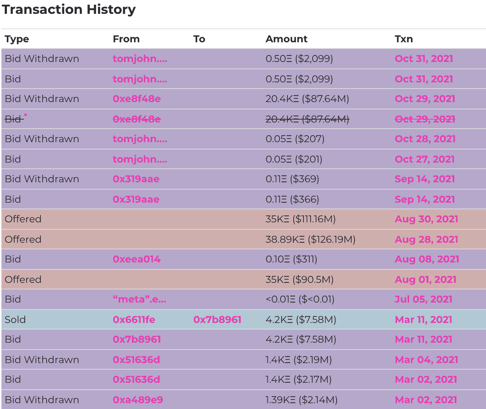
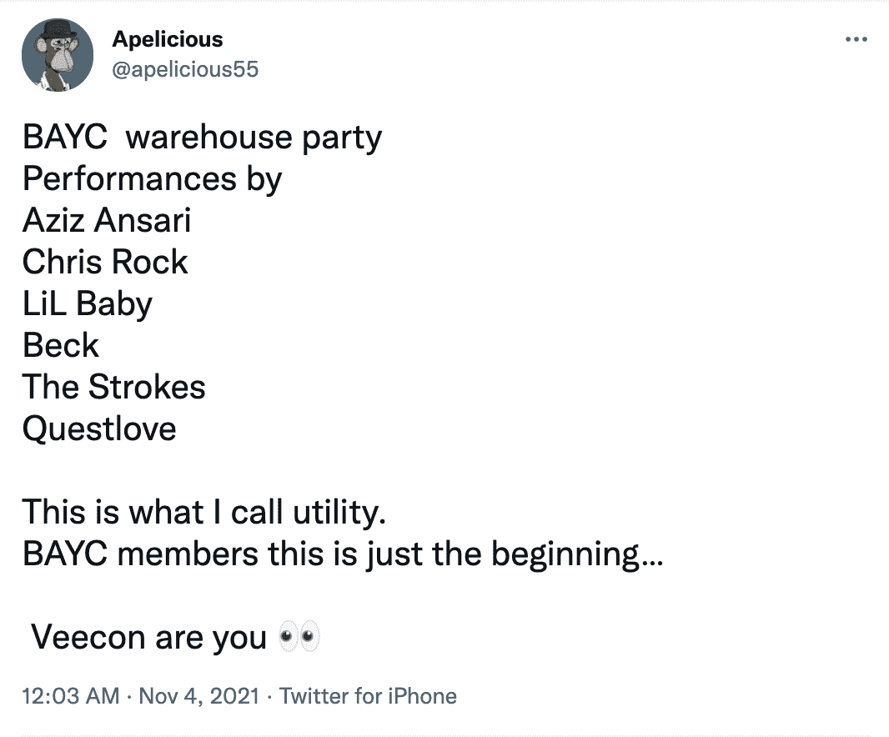
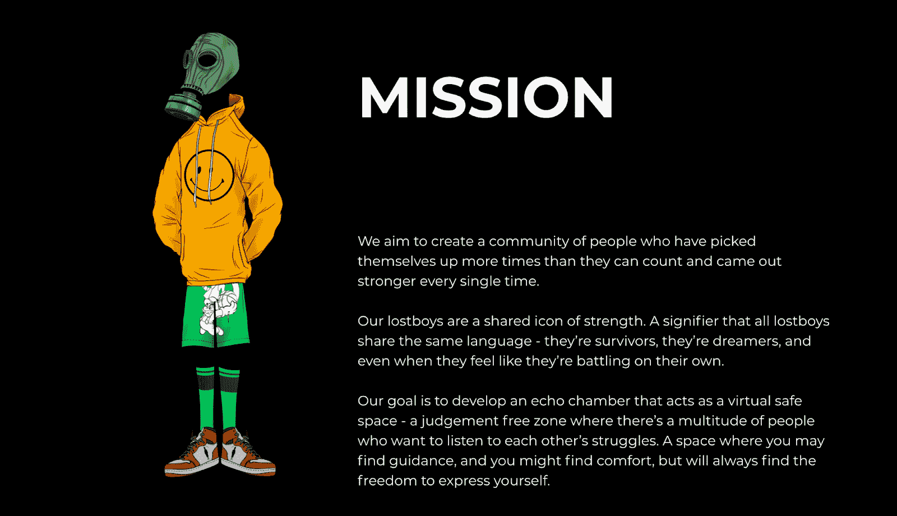
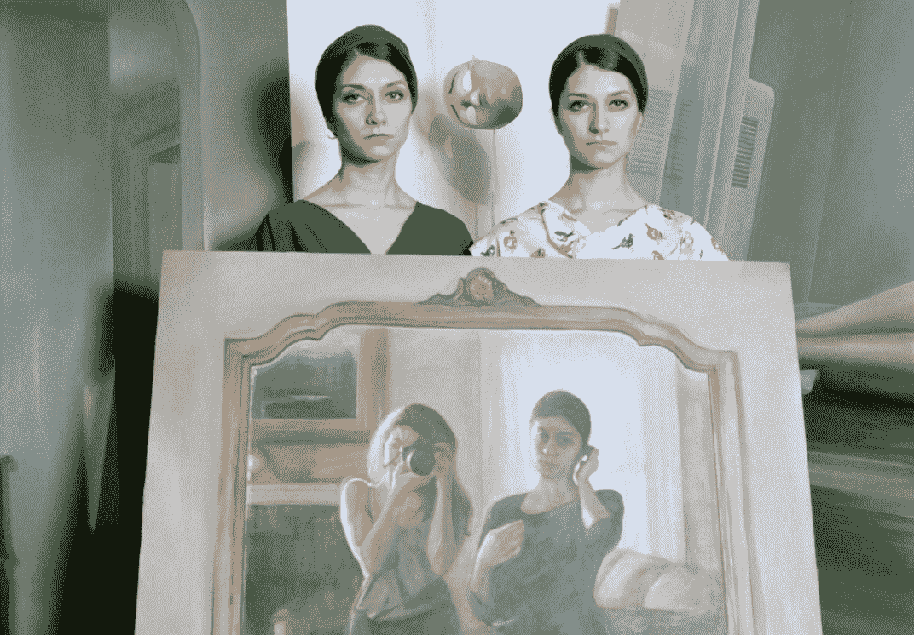

# NFT 是用来做什么的？

> 原文：<https://www.web3.university/tracks/build-your-first-nft/what-are-nfts-used-for>

随着 Web3 世界的不断形成，不可替代令牌(NFT)在加密货币的主流采用中发挥着关键作用，并有助于塑造去中心化、所有权、金融等的未来。

尽管有些人认为 NFT 只不过是“JPEGs”，但事实是 NFT 生态系统中的创新远远超出了艺术甚至收藏品的范畴。NFT 迎合了我们对社会地位的内在渴望和对社区的渴望，是在线和现实世界互动新方式的基石。

在本文中，我们将探索 NFT 已经并将继续塑造我们的世界的许多独特方式，更具体地说，它对开发人员和技术人员在 Web3 时代的构建意味着什么。

## 不仅仅是艺术:3 个独特的非艺术作品使用案例

### 1.国家森林公园在区块链有永久的、公开的历史

国家森林小组依靠各种区块链生存，这些是开放的数字分类账，所有人都可以使用。因此，使用像 [Etherscan](https://etherscan.io/) 这样的区块链探索者可以非常容易地了解某个特定 NFT 的历史。它是什么时候铸造的？谁参与了最后一次销售？

虽然大多数 NFT 目前生活在以太坊区块链，其他连锁店如和 Solana 也建立了受欢迎的 NFT 生态系统。

最终，区块链的透明度有助于减少欺诈和盗窃，因为在公共广场上一切都可以被看到。

The highest known sale of a CryptoPunk (4,200 ETH) currently belongs to CryptoPunk 3100 ([Image source)](https://www.larvalabs.com/cryptopunks/details/3100#)

‍

A public look at bids, offers, and sales of CryptoPunk 3100 ([Image source](https://www.larvalabs.com/cryptopunks/details/3100#))

虽然经常被引用的统计数据(近 10%的艺术品是赝品)可能被夸大了，但被错误归类的艺术品和收藏品是艺术生态系统的自然组成部分。你能分辨出《蒙娜丽莎》的某个版本是不是假的吗？

例如，你如何证明你是一张罕见的棒球卡或豆豆娃的合法拥有者？由于非功能性森林公园位于公共区块链，因此有一个公开透明的过程来确定谁是什么的所有者。

正如凯尔·查卡在《纽约客》杂志上写的那样，“想象一下数字豆豆娃，但是每一个都只有一个副本。对于艺术作品来说，N.F.T .格式的功能有点像一个标注作品出处的博物馆标签——一个专有的邮票，贴在仍然可以在互联网上自由流通的数字作品上。

就像在网上免费下载一首歌并不能给你所有权一样，在你的桌面上下载一张图片也不能给你图片、视频或任何其他媒体的所有权。公开的所有权历史有助于增强 NFTs 的价值。

### 2.NFT 有多种新颖的用例

除了艺术和个人资料图片，NFT 还有能力为持有者提供额外的价值，许多创作者在短时间内推动了可能性的界限。

从收藏品，到未来空投的资格，甚至到进入现实世界的场地，NFT 允许创作者和收藏家以以前不一定可能的方式参与和互动。

在音乐行业，艺术家 3lau 最近宣布他将根据他新歌的表现向他的粉丝发放版税，这引起了人们的关注。

正如《滚石》杂志 10 月份分享的那样:“他将把 50%的流媒体播放权赠送给 333 名粉丝。这位 DJ/制片人在与《滚石》杂志的独家对话中解释说，这部新颖的商业剧旨在展示 Royal 的能力——这是一个仍不完整的区块链市场，他在 2021 年 NFT 大繁荣之后匆忙建立起来的。"

NFTs 的另一个独特而强大的用例？活动和音乐会。

最近的 [Bored Ape 游艇俱乐部活动](https://boredapeyachtclub.com/)，被大多数人认为是一个巨大的成功，可以通过拥有一只 Bored Ape 或者成为被邀请参加该活动的少数几个人之一来参加。拥有一只无聊的猩猩不仅能让你参加一个令人惊奇的活动，还能让你独家接触网络，和其他拥有无聊猩猩的人联系。
T3】

The Bored Ape Yacht club event in NYC. ([Image source](https://twitter.com/_jeffnicholas_/status/1456092262828494851/photo/1))

这次活动包括许多令人惊讶的客人和一线名人，这在 BAYC 持有者中很受欢迎。

在许多情况下，NFT 提供了接触以前无法接触到的事件和个人的机会。

例如，几名幸运的 NBA 顶级射手卡持有者[收到了比赛门票，并在穿过的球衣上签名](https://www.si.com/nba/2021/03/17/nba-top-shot-crypto-daily-cover)。多名 NBA 球星也直接与 NBA 顶级球员交易特定的卡。特别是对于 NBA 球迷来说，很明显这种直接互动对于职业篮球运动来说是非常重要的。

另一个 NFT 项目“迷失的男孩”旨在为精神健康筹集资金，并为那些在艰难时刻挣扎的人提供一个安全的社区。拥有一个“迷失男孩”为持有者提供了他们自己独特的音乐曲目，以及获得额外的额外津贴。

The Lost Boy mission. ([Image Source](https://lostboy.io/)) 

随着 NFTs 的采用继续变得更加主流，将会有更多的方式让持有能够为投资者的生活增加价值。

## 3.NFT 有益于创造者

除了为持有者提供效用，非森林交易也为创造者提供了一个独特的发展机会。

利用 Opensea 等 NFT 市场和智能合约，创作者能够根据 NFT 的每次销售从他们的作品中赚取版税，为创作者永久创造稳定的收入和收益。受欢迎的 NFT 项目的开发商也将长期受益，而不是寻求快速赚钱。

直接接触到那些对项目的成功感兴趣的粉丝，让创作者有能力接收来自支持者的反馈。艺术家、摄影师和创作者可能没有机会在全球范围内展示他们的作品，但他们被推到了聚光灯下，这在很大程度上是 NFT 社区的结果。

18 岁的艺术家维克多·朗罗伊(FEWOCiOUS)是 NFT 最成功的艺术家之一。

正如[《时尚先生》在 6 月份分享的](https://www.esquire.com/entertainment/a36878931/fewocious-crypto-nft-art-christies-profile/)“自 2020 年打入 NFT 市场以来，朗罗伊已经赚了将近 1800 万美元。他的数字艺术作品“永恒的美丽”以惊人的 55 万美元售出。现在，他是佳士得有史以来最年轻的艺术家，也是第一个闯入其网站的艺术家——在最近的一次 Zoom 电话会议上，他以完美的青少年风格回应了两项令人难以置信的记录:“这就像……哇。“对一个 18 岁的人来说还不错。

NFTs 也帮助了 Issac“漂移”Wright，这位前伞兵通过他在全球各地的大胆摄影迅速成名。他在社交媒体上的关注和出售他的照片完全改变了他的生活，他仍然积极参与 NFT 生态系统。

Issac "Drift" Wright posing for one of his daring photographs. ([Image source](https://www.instagram.com/p/CMf3RTXDo5P/)) 

“艾萨克·赖特是一名光荣退休的陆军特种作战老兵，已有六年历史，他开始拍摄照片来应对精神疾病，特别是创伤后应激障碍和抑郁症。他的工作包括用前所未见的视角捕捉世界，”他的网站说。

摄影师 Justin Aversano 感受到了 NFT 社区的力量，他们帮助他的 Twin Flames 项目到达世界各地的观众，并最终在 Christies 拍卖行着陆。

由[报道解密](https://decrypt.co/82730/how-nft-photo-sensation-twin-flames-landed-at-christies) :

“Twin Flames 是为了纪念 Aversano 在子宫内去世的双胞胎兄弟而设计的，它收集了 100 张照片，每张都是一对不同的双胞胎。

这些照片于 2017 年至 2018 年间在世界各地拍摄，展示了各种各样的主题，展示了他们各自选择的地点和服装，所有这些主题都因双胞胎的共同属性而结合在一起。”

他原本希望整体出售这个项目，但在联系了加密货币和 NFT 的相关人士后，他重新考虑了这个想法。

"Twin Flames #83, Bahareh & Farzaneh" by Justin Aversano ([Image source)](https://decrypt.co/82730/how-nft-photo-sensation-twin-flames-landed-at-christies)

‍
“2021 年，贾斯汀联系了 GmoneyNFT 和一些参与加密朋克运动的人，他们鼓励他放弃对整个项目的依赖。贾斯汀告诉我，他意识到他可以让这个项目“集中存在于物理世界，分散存在于数字世界。“因此，将这些图像制作成独立的非功能性文件的计划诞生了”。
‍

尽管还处于起步阶段，NFT 已经允许全球的创作者大规模地与他们的支持者联系，并且在许多情况下以做他们喜欢的事情为生。随着创造者经济的增长，NFTs 的许多用例也会增长。

## 如何参与

NFTs 的创新才刚刚开始，现在是时候参与进来了！在 Alchemy，我们的主要目标之一是帮助培训区块链开发人员了解该领域可用的工具，并提供资源帮助您成为更好的开发人员。

这里有几个教程可以帮助你开始制作自己的 NFT:

> [如何建造 NFT](https://blog.alchemy.com/blog/how-to-create-an-nft)

> [NFT·明特:如何创建全栈 DApp](https://blog.alchemy.com/blog/nft-minter-tutorial-how-to-create-a-full-stack-dapp)

> [如何查看手机钱包中的 NFT](https://blog.alchemy.com/blog/how-to-view-your-nft-in-your-mobile-wallet)

此外，我们刚刚发布了一个 NFT API，它将帮助您获取这些元数据，而不依赖于通过 web3.js 或 ethers.js 提供的有限工具集！

> [炼金术的 NFT API](https://docs.alchemy.com/alchemy/enhanced-apis/nft-api)

最后，我们随时准备为我们的[炼金术不和谐](http://www.alchemy.com/discord)提供全天候帮助。请过来打声招呼——我们很乐意帮助您成为一名成熟的区块链开发人员！