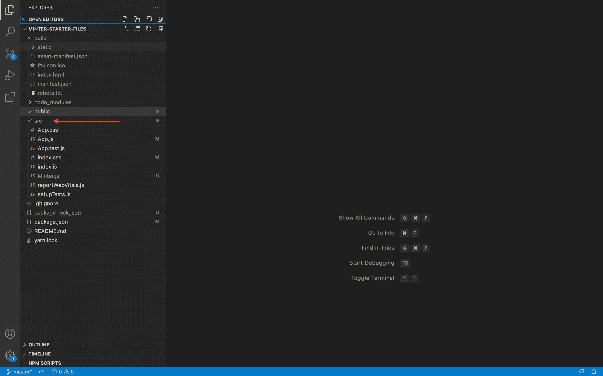
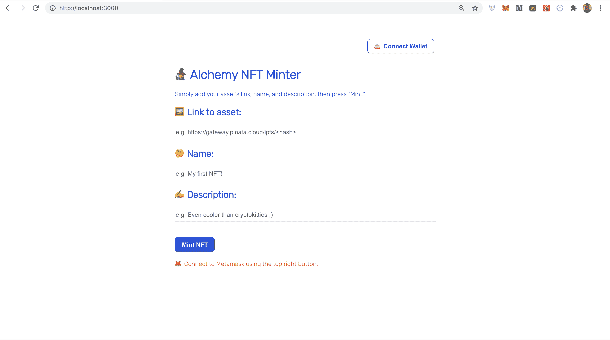
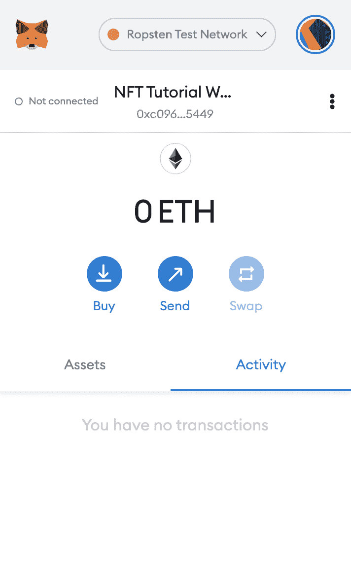
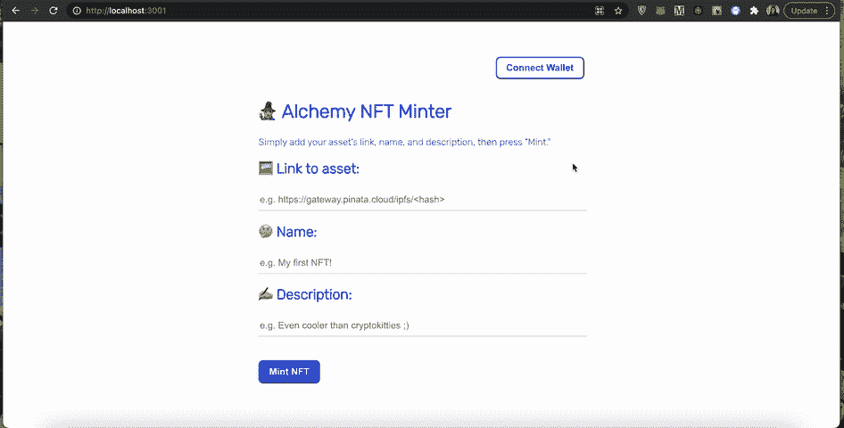
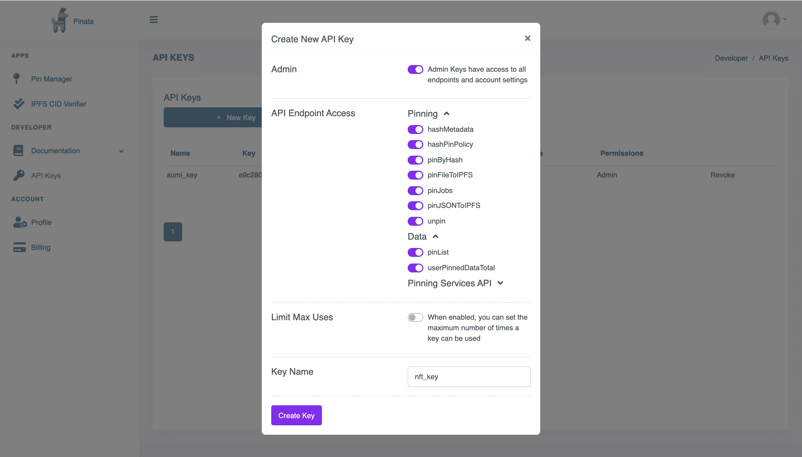
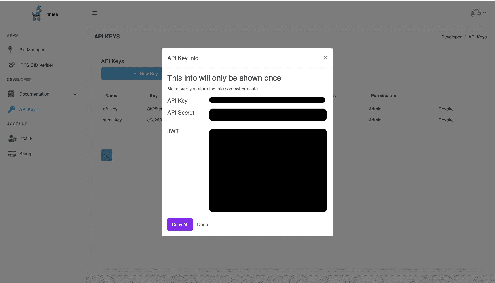
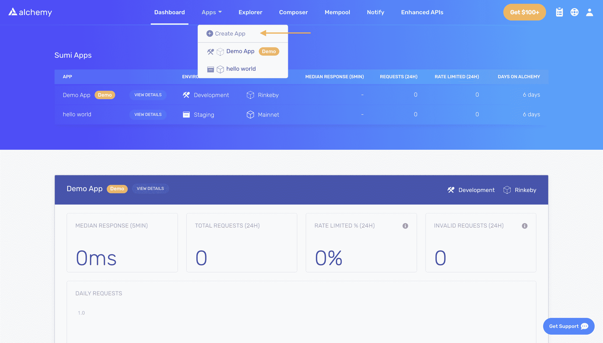
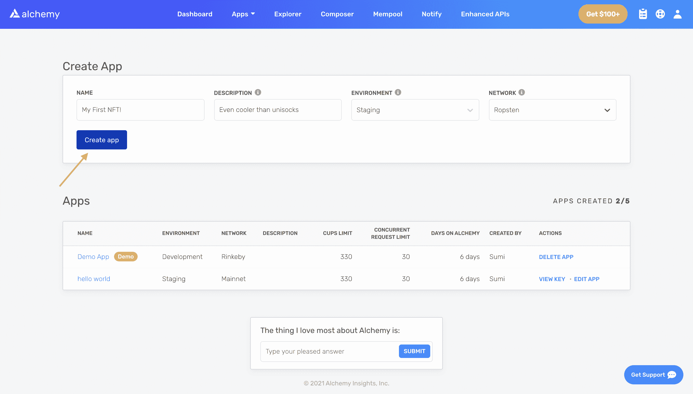
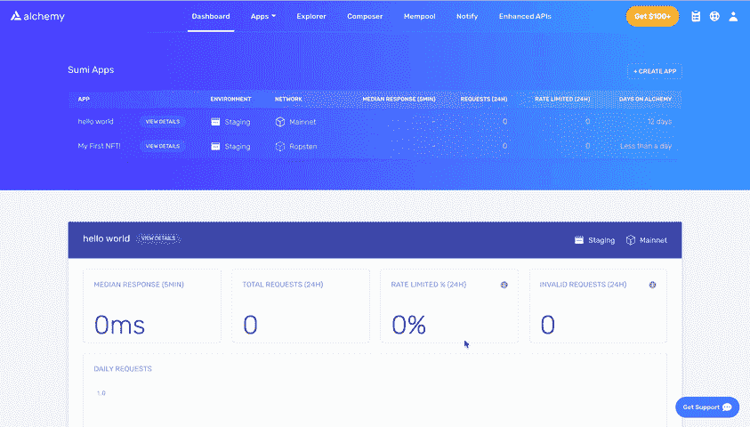

# 如何构建全栈 NFT dApp

> 原文：<https://www.web3.university/tracks/build-your-first-nft/building-a-full-stack-nft-dapp>

在本教程中，您将构建一个 NFT minter，并学习如何通过使用 Metamask 和 Web3 工具将智能合约连接到 React 前端来创建全栈 dApp。

对于来自 Web2 背景的开发人员来说，最大的挑战之一是弄清楚如何将智能联系人连接到前端项目并与之交互。

通过构建一个 NFT minter(一个简单的用户界面，您可以在其中输入指向您的数字资产的链接、标题和描述)，您将学习如何:

*   通过前端项目连接到元掩码
*   从前端调用智能契约方法
*   使用元掩码签署事务

在本教程中，我们将使用 [React](https://reactjs.org/) 作为我们的前端框架。因为本教程主要关注 Web3 开发，所以我们不会花太多时间来分解 React 基础知识。相反，我们将专注于为我们的项目带来功能

> 作为先决条件，你应该对 React 有一个初级的了解——知道组件、道具、useState/useEffect 和基本的函数调用是如何工作的。如果你以前从未听说过这些术语，你可能想看看这个[介绍反应教程](https://reactjs.org/tutorial/tutorial.html)。对于更多的视觉学习者，我们强烈推荐网络忍者的这个优秀的[全现代反应教程](https://www.youtube.com/playlist?list=PL4cUxeGkcC9gZD-Tvwfod2gaISzfRiP9d)视频系列。

事不宜迟，我们开始吧！

## 步骤 0:制作 NFTs 101

在我们开始研究任何代码之前，理解如何制作 NFT 是很重要的。它包括两个步骤:

1)您在以太坊区块链上发布了一份 NFT 智能合约。通常这是一份 [ERC-721](https://eips.ethereum.org/EIPS/eip-721) 或 [ERC-1155](https://eips.ethereum.org/EIPS/eip-1155) 智能合约。

> 两个 NFT 智能联系标准之间的最大区别是，ERC-1155 是多令牌标准，包括批量功能，而 ERC-721 是单令牌标准，因此一次仅支持传输一个令牌。

2)您调用 NFT 智能合约上的铸造函数来铸造 NFT。*铸造*就是在区块链上发布你的不可替代代币的唯一实例的行为。

通常，这个铸造函数需要您传入两个变量作为参数，第一个是 recipient，它指定将接收新铸造的 NFT 的地址，第二个是 NFT 的 tokenURI，它是一个字符串，解析为描述 NFT 元数据的 JSON 文档。

> NFT 的元数据真正赋予了它生命，允许它拥有属性，如名称、描述、图像(或不同的数字资产)和其他属性。这里是一个 tokenURI 的例子，它包含一个 NFT 的元数据。

在本教程中，我们将关注第 2 部分，使用我们的 React UI 调用现有的 NFT 的智能合同生成函数。

这里有一个链接指向我们将在本教程中调用的 ERC-721 NFT 智能合约。如果你想了解我们是如何制作的，我们强烈推荐你看看我们的另一个教程，[“如何制作一个 NFT”](https://docs.alchemyapi.io/alchemy/tutorials/how-to-create-an-nft)

酷，现在我们了解了如何制作 NFT，让我们克隆我们的起始文件！

## 步骤 1:克隆启动文件

首先，转到[NFT-minter-tutorial](https://github.com/alchemyplatform/nft-minter-tutorial)github 存储库获取这个项目的启动文件。将该存储库克隆到您的本地环境中。

> 不知道如何克隆存储库？从 Github 查看本指南。

当你打开这个克隆的 **nft-minter-tutorial** 库时，你会注意到它包含两个文件夹: **minter-starter-files** 和 **nft-minter** 。

*   minter-starter-files 包含了这个项目的启动文件(本质上是 React UI)。在本教程中，**我们将在这个目录下工作**，你将学习如何通过将这个 UI 连接到你的以太坊钱包和 NFT 智能合约来实现它。
*   nft-minter 包含了完整的教程，如果你遇到困难，它可以作为你的**参考** **。**

接下来，在您最喜欢的代码编辑器中打开您的 **minter-starter-files** 副本(在 Alchemy，我们是 [VSCode](https://code.visualstudio.com/download) 的忠实粉丝)，然后导航到您的 **src** 文件夹:



We will work inside the "src" folder


我们将要编写的所有代码都将存在于 **src** 文件夹下。我们将编辑 **Minter.js** 组件，并编写额外的 javascript 文件来赋予我们的项目 Web3 功能。

## 步骤 2:查看我们的初始文件

在我们开始编码之前，检查一下启动文件中已经为我们提供了什么是很重要的。

#### 让您的 react 项目运行起来

让我们从在浏览器中运行 React 项目开始。React 的美妙之处在于，一旦我们的项目在浏览器中运行，我们保存的任何更改都会在浏览器中实时更新。

要让项目运行，导航到根目录下的 **minter-starter-files** 文件夹，并在您的终端中运行 **npm install** 来安装项目的依赖项:

```js
-- CODE language-js line-numbers --
cd minter-starter-files
npm install

```

安装完成后，在您的终端中运行 **npm start** :

```js
-- CODE language-js line-numbers --
npm start

```

这样做应该会在您的浏览器中打开 [http://localhost:3000/](http://localhost:3000/) ，在这里您会看到我们项目的前端。它应该包括 3 个领域:一个地方输入链接到您的 NFT 的资产，输入您的 NFT 的名称，并提供一个描述。



What your UI should look like


如果你尝试点击“连接钱包”或“薄荷 NFT”按钮，你会发现它们不起作用——这是因为我们仍然需要对它们的功能进行编程！:)

#### Minter.js 组件

> **注意:**确保你在 **minter-starter-files** 文件夹，而不是 **nft-minter** 文件夹！

让我们回到编辑器中的 **src** 文件夹，打开 **Minter.js** 文件。理解这个文件中的所有内容非常重要，因为它是我们将要处理的主要 React 组件。

在这个文件的顶部，我们有我们的状态变量，我们将在特定事件后更新。

```js
-- CODE language-js line-numbers --
//State variables
const [walletAddress, setWallet] = useState("");
const [status, setStatus] = useState("");
const [name, setName] = useState("");
const [description, setDescription] = useState("");
const [url, setURL] = useState("");

```

> 没听说过 React 状态变量或者状态钩子？查看[这些](https://reactjs.org/docs/hooks-state.html)文档。

以下是每个变量所代表的含义:

*   **walletAddress** -存储用户钱包地址的字符串
*   **状态** -一个字符串，包含一条显示在 UI 底部的消息
*   **name** -存储 NFT 名字的字符串
*   **描述** -存储 NFT 描述的字符串
*   **url** -链接到 NFT 数字资产的字符串

在状态变量之后，你会看到三个未实现的功能: **useEffect** 、 **connectWalletPressed** 和 **onMintPressed** 。你会注意到所有这些函数都是异步的，这是因为我们将在它们中进行异步 API 调用！它们的名字与其功能齐名:

```js
-- CODE language-js line-numbers --
  useEffect(async () => { //TODO: implement

  }, []);

  const connectWalletPressed = async () => { //TODO: implement

  };

  const onMintPressed = async () => { //TODO: implement

  };

```

*   这是一个 React 钩子，在你的组件被渲染后被调用。因为它有一个空数组 **[]** prop 传入其中(见第 3 行)，它将只在组件的*第一个* render 上被调用。在这里，我们将调用我们的钱包监听器和另一个钱包函数来更新我们的 UI，以反映钱包是否已经连接。
*   **connectWalletPressed** -将调用此函数将用户的 Metamask 钱包连接到我们的 dApp。
*   这个函数将被调用来铸造用户的 NFT。

在这个文件的末尾，我们有了组件的 UI。如果您仔细扫描这段代码，您会注意到，当相应文本字段中的输入发生变化时，我们会更新我们的 **url** 、**名称**和**描述**状态变量。

你还会看到，当分别点击 id 为 **mintButton** 和 **walletButton** 的按钮时，会调用 **connectWalletPressed** 和 **onMintPressed** 。

‍

最后，让我们来看看 Minter 组件添加到哪里。

如果您转到 **App.js** 文件，它是 React 中充当所有其他组件的容器的主要组件，您会看到我们的 Minter 组件被注入到第 7 行。

在本教程中，我们将只编辑 Minter.js 文件并在 src 文件夹中添加文件。

既然我们已经了解了我们在做什么，让我们来设置我们的以太坊钱包吧！

## 第三步:设置你的以太坊钱包

为了让用户能够与您的智能合约交互，他们需要将他们的以太坊钱包连接到您的 dApp。

#### Download Metamask

在本教程中，我们将使用 Metamask，这是浏览器中的一个虚拟钱包，用于管理您的以太坊帐户地址。如果你想了解更多关于以太坊交易的工作原理，请查看以太坊基金会的页面。

你可以在这里免费下载并创建一个元掩码账户[。当你正在创建一个账户时，或者如果你已经有了一个账户，请确保切换到右上角的“Ropsten 测试网络”(这样我们就不用处理真钱了)。](https://metamask.io/download.html)



Sample Metamask wallet


#### 从水龙头中加入 Ethers

为了铸造我们的 NFT(或者在区块链以太坊签署任何交易)，我们需要一些假的 Eth。要获取 Eth，您可以进入 [Ropsten 水龙头](https://faucet.ropsten.be/)，输入您的 Ropsten 账户地址，然后点击“发送 Ropsten Eth”你应该很快就会在你的 Metamask 账户中看到 Eth！

#### 检查你的余额

为了再次检查我们的余额，让我们使用 [Alchemy 的 composer 工具](https://composer.alchemyapi.io/?composer_state=%7B%22network%22%3A0%2C%22methodName%22%3A%22eth_getBalance%22%2C%22paramValues%22%3A%5B%22%22%2C%22latest%22%5D%7D)发出一个 [eth_getBalance](https://docs.alchemyapi.io/alchemy/documentation/alchemy-api-reference/json-rpc#eth_getbalance) 请求。这将返回我们钱包中 Eth 的数量。在您输入元掩码帐户地址并单击“发送请求”后，您应该会看到如下响应:

```js
-- CODE language-js line-numbers --
{"jsonrpc": "2.0", "id": 0, "result": "0xde0b6b3a7640000"}

```

> **注:**此结果在魏未 eth。卫是 Ethers 的最小单位。从卫到 eth 的换算是:1 eth = 10 卫。因此，如果我们将 0xde0b6b3a7640000 转换为十进制，我们会得到 1*10 ⁸，等于 1 eth。

唷！我们的假钱都在那里！🤑

## 步骤 4:将元掩码连接到您的 UI

现在我们的 Metamask 钱包已经设置好了，让我们将 dApp 连接到它吧！

因为我们想要指定给 [M-V-C](https://en.wikipedia.org/wiki/Model%E2%80%93view%E2%80%93controller) 范例，所以我们将创建一个单独的文件，其中包含我们管理 dApp 的逻辑、数据和规则的函数，然后将这些函数传递给我们的前端(我们的 Minter.js 组件)。

#### connectWallet 功能

为此，让我们在您的 **src** 目录中创建一个名为 **utils** 的新文件夹，并在其中添加一个名为 **interact.js** 的文件，该文件将包含我们所有的钱包和智能合约交互功能。

在我们的 **interact.js** 文件中，我们将编写一个 **connectWallet** 函数，然后导入并调用我们的 **Minter.js** 组件。

在您的 **interact.js** 文件中，添加以下内容

让我们来分析一下这段代码的作用:

首先，我们的函数检查您的浏览器中是否启用了 **window.ethereum** 。

> window.ethereum 是 Metamask 和其他钱包提供商注入的一个全局 API，允许网站请求用户的 ethereum 帐户。如果获得批准，它可以从用户连接的区块链读取数据，并建议用户签署消息和交易。查看[元蒙版文档](https://docs.metamask.io/guide/ethereum-provider.html#table-of-contents)了解更多信息！

如果 **window.ethereum** *不存在*，则意味着元掩码没有安装。这导致返回一个 JSON 对象，其中返回的**地址**是一个空字符串，并且**状态** JSX 对象告知用户必须安装元掩码。

> 我们编写的大多数函数都将返回 JSON 对象，我们可以用这些对象来更新我们的状态变量和 UI。

现在，如果**window . ether eum**T2 在场，那么事情就变得有趣了。

使用 try/catch 循环，我们将通过调用[window . ether eum . request({ method:" eth _ request accounts " })尝试连接到 Metamask](https://docs.metamask.io/guide/rpc-api.html#eth-requestaccounts)调用此函数将在浏览器中打开 Metamask，从而提示用户将其钱包连接到您的 dApp。

*   如果用户选择连接，**方法:" eth_requestAccounts"** 将返回一个数组，其中包含连接到 dApp 的所有用户帐户地址。总之，我们的 **connectWallet** 函数将返回一个 JSON 对象，该对象包含该数组中的*第一个* **地址**(见第 9 行)和一个**状态**消息，该消息提示用户向智能合约写入一条消息。
*   如果用户拒绝连接，那么 JSON 对象将为返回的**地址**和反映用户拒绝连接的**状态**消息包含一个空字符串。

#### 将 connectWallet 函数添加到 Minter.js UI 组件中

既然我们已经编写了这个 **connectWallet** 函数，让我们将它连接到我们的 **Minter.js.** 组件。

首先，我们必须通过添加以下内容将函数导入到我们的 **Minter.js** 文件中

**从“”导入{ connectWallet }。/utils/interact . js "；**到 Minter.js 文件的顶部。你的前 11 行 **Minter.js** 现在应该是这样的:

```js
-- CODE language-js line-numbers --
import { useEffect, useState } from "react";
import { connectWallet } from "./utils/interact.js";

const Minter = (props) => {

  //State variables
  const [walletAddress, setWallet] = useState("");
  const [status, setStatus] = useState("");
  const [name, setName] = useState("");
  const [description, setDescription] = useState("");
  const [url, setURL] = useState("");

```

然后，在我们的 **connectWalletPressed** 函数中，我们将调用我们导入的 **connectWallet** 函数，就像这样:

```js
-- CODE language-js line-numbers --
  const connectWalletPressed = async () => {
    const walletResponse = await connectWallet();
    setStatus(walletResponse.status);
    setWallet(walletResponse.address);
  };

```

注意我们的大部分功能是如何从 **interact.js** 文件的 **Minter.js** 组件中抽象出来的？这就是我们遵守 M-V-C 范式的原因！

在 **connectWalletPressed** 中，我们简单地对我们导入的 **connectWallet** 函数进行 await 调用，并使用它的响应，通过它们的状态钩子更新我们的**状态**和 **walletAddress** 变量。

现在，让我们保存这两个文件( **Minter.js** 和 **interact.js** )并测试我们的 UI。

在 [http://localhost:3000/](http://localhost:3000/) 页面打开浏览器，点击页面右上角的“连接钱包”按钮。

如果您安装了 Metamask，系统会提示您将钱包连接到 dApp。接受连接邀请。

您应该会看到钱包按钮现在反映出您的地址已连接！亚丝丝🔥

接下来，尝试刷新页面...这很奇怪。我们的钱包按钮提示我们连接元掩码，即使它已经连接...



The problem on page reload


不过不要担心！通过实现一个名为**getCurrentWalletConnected**的函数，我们可以很容易地解决这个问题，它将检查一个地址是否已经连接到我们的 dApp，并相应地更新我们的 UI！

#### getCurrentWalletConnected 函数

在您的 **interact.js** 文件中，添加以下**getCurrentWalletConnected**函数:

这段代码*非常*类似于我们之前刚刚编写的 **connectWallet** 函数。

主要区别在于，我们没有调用方法 **eth_requestAccounts** ，它为用户打开元掩码以连接他们的钱包，这里我们调用方法 **eth_accounts** ，它只是返回一个数组，包含当前连接到我们的 dApp 的元掩码地址。

为了查看这个函数的运行情况，让我们在我们的 **Minter.js** 组件的 **useEffect** 函数中调用它。

就像我们对 **connectWallet** 所做的那样，我们必须将这个函数从我们的 **interact.js** 文件导入到我们的 **Minter.js** 文件中，如下所示:

```js
-- CODE language-js line-numbers --
import { useEffect, useState } from "react";
import {
  connectWallet,
  getCurrentWalletConnected //import here
} from "./utils/interact.js";

```

现在，我们简单地在我们的 **useEffect** 函数中调用它:

```js
-- CODE language-js line-numbers --
useEffect(async () => {
    const {address, status} = await getCurrentWalletConnected();
    setWallet(address)
    setStatus(status); 
}, []);

```

注意，我们使用对**getCurrentWalletConnected**调用的响应来更新我们的 **walletAddress** 和 **status** 状态变量。

添加此代码后，请尝试刷新我们的浏览器窗口。该按钮应该说你已经连接，并显示你连接的钱包的地址预览-即使在你刷新！😅

#### 实现 addWalletListener

dApp 钱包设置的最后一步是实现钱包监听器，这样当我们的钱包状态改变时，例如当用户断开连接或切换帐户时，我们的 UI 就会更新。

在你的 **Minter.js** 文件中，添加一个函数 **addWalletListener** ，如下所示:

让我们快速分析一下这里发生了什么:

首先，我们的函数检查 **window.ethereum** 是否启用(即安装了 Metamask)。

*   如果不是，我们只需将我们的 **status** 状态变量设置为 JSX 字符串，提示用户安装元掩码。
*   如果启用了它，我们在第 3 行设置监听器**window . ether eum . on(" accounts changed ")**，监听 Metamask wallet 中的状态变化，包括当用户将附加帐户连接到 dApp、切换帐户或断开帐户时。如果至少有一个账户被连接，则状态变量 **walletAddress** 被更新为监听器返回的**账户**数组中的第一个账户。否则， **walletAddress** 被设置为空字符串。

最后，我们必须在我们的 **useEffect** 函数中调用它:

```js
-- CODE language-js line-numbers --
useEffect(async () => {
    const {address, status} = await getCurrentWalletConnected();
    setWallet(address)
    setStatus(status);

    addWalletListener(); 
}, []);

```

瞧啊。我们已经完成了所有钱包功能的编程！既然我们的钱包已经准备好了，让我们来想想如何铸造我们的 NFT 吧！

## 步骤 5: NFT 元数据 101

因此，请记住我们刚刚在本教程的步骤 0 中讨论的 NFT 元数据-它赋予 NFT 生命，允许它具有属性，如数字资产、名称、描述和其他属性。

我们需要将这个元数据配置为一个 JSON 对象并存储它，这样在调用我们的智能契约的 **mintNFT** 函数时，我们可以将它作为 **tokenURI** 参数传递。

“资产链接”、“名称”、“描述”字段中的文本将包含我们的 NFT 元数据的不同属性。我们将把这个元数据格式化为一个 JSON 对象，但是有几个选项可以用来存储这个 JSON 对象:

*   我们可以把它存放在以太坊区块链；然而，由于以太坊的性质，这样做将会非常昂贵(我们正在谈论数百美元以上)。❌
*   我们可以把它存储在一个中央服务器上，比如 AWS 或者 Firebase。但这将挫败我们的分权精神。❌
*   我们可以使用 IPFS，一种分布式协议和对等网络，在分布式文件系统中存储和共享数据。由于这种协议是去中心化和免费的，它是我们的最佳选择！✅

为了在 IPFS 上存储我们的元数据，我们将使用 [Pinata](https://pinata.cloud/) ，一个方便的 IPFS API 和工具包。在下一步中，我们将详细解释如何做到这一点！

## 第六步:使用 [Pinata](https://pinata.cloud/) 将你的元数据固定到 IPFS

如果您没有 Pinata 帐户，请在此注册一个免费帐户[，并完成验证您的电子邮件和帐户的步骤。](https://pinata.cloud/signup)

#### 创建您的 Pinata API 密钥

导航到[https://pinata.cloud/keys](https://pinata.cloud/keys)页面，然后选择顶部的“新密钥”按钮，将管理小部件设置为启用，并命名您的密钥。



Create your Pinata API key


然后你会看到一个弹出窗口，显示你的 API 信息。确保把这个放在安全的地方。



Make sure to save your API key and secret in a safe place


现在我们的密钥已经设置好了，让我们把它添加到我们的项目中，这样我们就可以使用它了。

#### 创建一个. env 文件

我们可以安全地将 Pinata 密钥和秘密存储在环境文件中。让我们在您的项目目录中安装 [dotenv 包](https://www.npmjs.com/package/dotenv)。

在您的终端中打开一个新的选项卡(与运行本地主机的选项卡分开),确保您位于 **minter-starter-files** 文件夹中，然后在您的终端中运行以下命令:

```js
-- CODE language-js line-numbers --
npm install dotenv --save

```

接下来，创建一个**。通过在命令行中输入以下命令，将 env** 文件放在您的 **minter-starter-files** 的根目录中:

```js
-- CODE language-js line-numbers --
vim .env

```

这将弹出您的**。vim 中的 env** 文件(一个文本编辑器)。要保存它，请按顺序在键盘上按“ESC”+“:”+“q”。

接下来，在 VSCode 中，导航到您的。env 文件，并向其中添加您的 Pinata API 密钥和 API 秘密，如下所示:

```js
-- CODE language-js line-numbers --
REACT_APP_PINATA_KEY = REACT_APP_PINATA_SECRET = <pinata-api-secret></pinata-api-secret> 
```

保存文件，然后就可以开始编写将 JSON 元数据上传到 IPFS 的函数了！

#### 实现 pinJSONToIPFS

对我们来说幸运的是，Pinata 有一个专门用于将 JSON 数据上传到 IPFS 的 API 和一个我们可以使用的方便的带有 axios 示例的 JavaScript，只需稍加修改。

在您的 utils 文件夹中，让我们创建另一个名为 pinata.js 的文件，然后从。env 文件如下:

```js
-- CODE language-js line-numbers --
require('dotenv').config();
const key = process.env.REACT_APP_PINATA_KEY;
const secret = process.env.REACT_APP_PINATA_SECRET;

```

接下来，将下面的附加代码粘贴到 pinata.js 文件中。别担心，我们会分解每件事的含义！

```js
-- CODE language-js line-numbers --
require('dotenv').config();
const key = process.env.REACT_APP_PINATA_KEY;
const secret = process.env.REACT_APP_PINATA_SECRET;

const axios = require('axios');

export const pinJSONToIPFS = async(JSONBody) => {
    const url = `https://api.pinata.cloud/pinning/pinJSONToIPFS`;
    //making axios POST request to Pinata ⬇️
    return axios 
        .post(url, JSONBody, {
            headers: {
                pinata_api_key: key,
                pinata_secret_api_key: secret,
            }
        })
        .then(function (response) {
           return {
               success: true,
               pinataUrl: "https://gateway.pinata.cloud/ipfs/" + response.data.IpfsHash
           };
        })
        .catch(function (error) {
            console.log(error)
            return {
                success: false,
                message: error.message,
            }

    });
};

```

那么这段代码具体做什么呢？

首先，它导入了 [axios](https://www.npmjs.com/package/axios) ，这是一个基于 promise 的 HTTP 客户端，用于浏览器和 node.js，我们将使用它向 Pinata 发出请求。

然后我们有我们的异步函数 **pinJSONToIPFS** ，它把一个 **JSONBody** 作为它的输入，并且在它的头中有 Pinata api key 和 secret，所有这些都向它们的 **pinJSONToIPFS** API 发出 POST 请求。

*   如果这个 POST 请求成功，那么我们的函数返回一个 JSON 对象，其中 **success** boolean 为 true，而 **pinataUrl** 是我们的元数据被固定的地方。我们将使用这个返回的 **pinataUrl** 作为智能合约的 mint 函数的 **tokenURI** 输入。
*   如果这个 post 请求失败，那么我们的函数将返回一个 JSON 对象，其中 **success** boolean 为 false，一个 **message** 字符串传递我们的错误。

与我们的 **connectWallet** 函数返回类型一样，我们返回 JSON 对象，这样我们就可以使用它们的参数来更新我们的状态变量和 UI。

## 步骤 7:加载您的智能合约

既然我们已经有了通过 pinJSONToIPFS 函数将 NFT 元数据上传到 IPFS 的方法，我们将需要一种加载智能合约实例的方法，这样我们就可以调用它的 mintNFT 函数。

> 正如我们之前提到的，在本教程中，我们将使用[现有的 NFT 智能合同](https://ropsten.etherscan.io/address/0x4C4a07F737Bf57F6632B6CAB089B78f62385aCaE)；然而，如果你想了解我们是如何制作的，或者自己制作一个，我们强烈推荐你看看我们的另一个教程，[“如何制作一个 NFT”](https://docs.alchemyapi.io/alchemy/tutorials/how-to-create-an-nft)

#### 合同 ABI

如果您仔细检查了我们的文件，您会注意到在我们的 **src** 目录中，有一个 **contract-abi.json** 文件。ABI 对于指定契约将调用哪个函数以及确保函数将以您期望的格式返回数据是必要的。

我们还需要一个 Alchemy API 密匙和 Alchemy Web3 API 来连接以太坊区块链并加载我们的智能合约。但首先，你需要一个炼金术账户。

#### 如果你还没有炼金术账户，请在这里免费注册。

创建 Alchemy 帐户后，您可以通过创建应用程序来生成 API 密钥。这将允许我们向 Ropsten 测试网络发出请求。

将鼠标悬停在导航栏中的“应用程序”上，点击“创建应用程序”,导航至 Alchemy Dashboard 中的“创建应用程序”页面



Create a new app


给你的应用命名(我们选择了“我的第一个 NFT！”)，提供简短描述，为环境选择“Staging”(用于您的应用程序记账)，为您的网络选择“Ropsten”。



Configure your app details


点击“创建应用程序”就可以了！你的应用应该出现在下表中。

太棒了，现在我们已经创建了我们的 HTTP Alchemy API URL，像这样把它复制到你的剪贴板…



Copy your Alchemy API key


…然后让我们将它添加到我们的**中。env** 文件。总之，你的。env 文件应该如下所示:

```js
-- CODE language-js line-numbers --
REACT_APP_PINATA_KEY = REACT_APP_PINATA_SECRET = <pinata-secret>REACT_APP_ALCHEMY_KEY = https://eth-ropsten.alchemyapi.io/v2/ <alchemy-key></alchemy-key></pinata-secret> 
```

现在我们已经有了我们的合同 ABI 和我们的 Alchemy API 密钥，我们准备好使用 [Alchemy Web3](https://github.com/alchemyplatform/alchemy-web3) 加载我们的智能合同。

#### 设置您的 Alchemy Web3 端点和合同

首先，如果你还没有的话，你需要在终端中导航到主目录 **nft-minter-tutorial** 来安装 [Alchemy Web3](https://github.com/alchemyplatform/alchemy-web3) :

```js
-- CODE language-js line-numbers --
cd ..
npm install @alch/alchemy-web3

```

接下来让我们回到我们的 **interact.js** 文件。在文件的顶部，添加以下代码以从您的导入您的 Alchemy 密钥。env 文件并设置您的 Alchemy Web3 端点:

```js
-- CODE language-js line-numbers --
require('dotenv').config();
const alchemyKey = process.env.REACT_APP_ALCHEMY_KEY;
const { createAlchemyWeb3 } = require("@alch/alchemy-web3");
const web3 = createAlchemyWeb3(alchemyKey); 

```

> [Alchemy Web3](https://github.com/alchemyplatform/alchemy-web3) 是围绕 [Web3.js](https://web3js.readthedocs.io/en/v1.2.9/) 的一个包装器，提供增强的 API 方法和其他重要的好处，让 Web3 开发者的生活更加轻松。它的设计只需要最少的配置，因此您可以立即在您的应用程序中使用它！

接下来，让我们将合同 ABI 和合同地址添加到我们的文件中。

```js
-- CODE language-js line-numbers --
require('dotenv').config();
const alchemyKey = process.env.REACT_APP_ALCHEMY_KEY;
const { createAlchemyWeb3 } = require("@alch/alchemy-web3");
const web3 = createAlchemyWeb3(alchemyKey); 

const contractABI = require('../contract-abi.json')
const contractAddress = "0x4C4a07F737Bf57F6632B6CAB089B78f62385aCaE";

```

一旦我们有了这两个，我们就可以开始编写我们的 mint 函数了！

## 步骤 8:实现 mintNFT 函数

在您的 **interact.js** 文件中，让我们定义我们的函数， **mintNFT** ，它将创建我们的 NFT。

因为我们将进行大量异步调用(调用 Pinata 将我们的元数据固定到 IPFS，调用 Alchemy Web3 加载我们的智能合约，调用 Metamask 签署我们的事务)，所以我们的函数也将是异步的。

我们函数的三个输入将是我们数字资产的 **url** 、**名称**和**描述**。在 **connectWallet** 函数下面添加以下函数签名:

```js
-- CODE language-js line-numbers --
export const mintNFT = async(url, name, description) => {
}

```

#### 输入错误处理

自然，在函数开始时进行某种输入错误处理是有意义的，所以如果输入参数不正确，我们就退出这个函数。在我们的函数中，让我们添加以下代码:

```js
-- CODE language-js line-numbers --
export const mintNFT = async(url, name, description) => {
 //error handling
 if (url.trim() == "" || (name.trim() == "" || description.trim() == "")) { 
   return {
    success: false,
    status: "❗Please make sure all fields are completed before minting.",
   }
  }
}

```

本质上，如果任何输入参数是空字符串，那么我们返回一个 JSON 对象，其中 **success** boolean 为 false，而 **status** 字符串表示 UI 中的所有字段都必须是完整的。

#### 将元数据上传到 IPFS

一旦我们知道我们的元数据被正确格式化，下一步就是把它打包成一个 JSON 对象，并通过我们编写的 **pinJSONToIPFS** 上传到 IPFS！

为此，我们首先需要将 **pinJSONToIPFS** 函数导入到我们的 **interact.js** 文件中。在 **interact.js** 的最顶端，我们来补充一下:

```js
-- CODE language-js line-numbers --
import {pinJSONToIPFS} from './pinata.js'

```

回想一下， **pinJSONToIPFS** 接受一个 JSON 体。所以在我们调用它之前，我们需要将我们的 **url** 、**名称**和**描述**参数格式化成一个 JSON 对象。

让我们更新代码，创建一个名为**元数据**的 JSON 对象，然后用这个**元数据**参数调用 **pinJSONToIPFS** :

```
-- CODE language-js line-numbers --
export const mintNFT = async(url, name, description) => {
 //error handling
 if (url.trim() == "" || (name.trim() == "" || description.trim() == "")) { 
        return {
            success: false,
            status: "❗Please make sure all fields are completed before minting.",
        }
  }

  //make metadata
  const metadata = new Object();
  metadata.name = name;
  metadata.image = url;
  metadata.description = description;

  //make pinata call
  const pinataResponse = await pinJSONToIPFS(metadata);
  if (!pinataResponse.success) {
      return {
          success: false,
          status: "😢 Something went wrong while uploading your tokenURI.",
      }
  } 
  const tokenURI = pinataResponse.pinataUrl;  
}

```js

注意，我们将对 **pinJSONToIPFS(元数据)**调用的响应存储在 **pinataResponse** 对象中。然后，我们分析这个对象是否有错误。

如果有错误，我们返回一个 JSON 对象，其中 **success** boolean 为 false，我们的 **status** string 表示我们的调用失败。否则，我们从 **pinataResponse** 中提取 **pinataURL** ，并将其存储为我们的 **tokenURIvariable** 。

现在是时候使用我们在文件顶部初始化的 Alchemy Web3 API 来加载我们的智能合约了。将以下代码行添加到 **mintNFT** 函数的底部，以在**窗口设置契约。contract** 全局变量:

```
-- CODE language-js line-numbers --
window.contract = await new web3.eth.Contract(contractABI, contractAddress);

```js

我们的 **mintNFT** 函数中最后要添加的是以太坊交易:

```
-- CODE language-js line-numbers --
//set up your Ethereum transaction
 const transactionParameters = {
        to: contractAddress, // Required except during contract publications.
        from: window.ethereum.selectedAddress, // must match user's active address.
        'data': window.contract.methods.mintNFT(window.ethereum.selectedAddress, tokenURI).encodeABI()//make call to NFT smart contract 
 };

//sign the transaction via Metamask
 try {
    const txHash = await window.ethereum
        .request({
            method: 'eth_sendTransaction',
            params: [transactionParameters],
        });
    return {
        success: true,
        status: "✅ Check out your transaction on Etherscan: https://ropsten.etherscan.io/tx/" + txHash
    }
 } catch (error) {
    return {
        success: false,
        status: "😥 Something went wrong: " + error.message
    }

 }

```js

如果您已经熟悉以太坊交易，您会注意到其结构与您所看到的非常相似。

首先，我们设置我们的事务参数。

*   **到**指定了收件人地址(我们的智能合同)
*   **from** 指定交易的签名人(用户连接到元掩码的地址:**window . ether eum . selected address**)
*   **数据**包含对我们的智能契约 **mintNFT** 方法的调用，该方法接收我们的 **tokenURI** 和用户的钱包地址**window . ether eum . selected address**作为输入

然后，我们发出 await 调用， **window.ethereum.request** ，要求 Metamask 对事务进行签名。注意，在这个请求中，我们指定了我们的 eth 方法(eth_SentTransaction)并传入了我们的 **transactionParameters** 。此时，Metamask 将在浏览器中打开，并提示用户签署或拒绝交易。

*   如果交易成功，该函数将返回一个 JSON 对象，其中 boolean **success** 被设置为 true，而 **status** 字符串提示用户查看 Etherscan 以获得关于他们交易的更多信息。
*   如果事务失败，函数将返回一个 JSON 对象，其中 **success** boolean 被设置为 false，而 **status** 字符串传递错误消息。

总之，我们的 **mintNFT** 函数应该是这样的:

```
-- CODE language-js line-numbers --
export const mintNFT = async(url, name, description) => {

    //error handling
    if (url.trim() == "" || (name.trim() == "" || description.trim() == "")) { 
        return {
            success: false,
            status: "❗Please make sure all fields are completed before minting.",
        }
    }

    //make metadata
    const metadata = new Object();
    metadata.name = name;
    metadata.image = url;
    metadata.description = description;

    //pinata pin request
    const pinataResponse = await pinJSONToIPFS(metadata);
    if (!pinataResponse.success) {
        return {
            success: false,
            status: "😢 Something went wrong while uploading your tokenURI.",
        }
    } 
    const tokenURI = pinataResponse.pinataUrl;  

    //load smart contract
    window.contract = await new web3.eth.Contract(contractABI, contractAddress);//loadContract();

    //set up your Ethereum transaction
    const transactionParameters = {
        to: contractAddress, // Required except during contract publications.
        from: window.ethereum.selectedAddress, // must match user's active address.
        'data': window.contract.methods.mintNFT(window.ethereum.selectedAddress, tokenURI).encodeABI() //make call to NFT smart contract 
    };

    //sign transaction via Metamask
    try {
        const txHash = await window.ethereum
            .request({
                method: 'eth_sendTransaction',
                params: [transactionParameters],
            });
        return {
            success: true,
            status: "✅ Check out your transaction on Etherscan: https://ropsten.etherscan.io/tx/" + txHash
        }
    } catch (error) {
        return {
            success: false,
            status: "😥 Something went wrong: " + error.message
        }
    }
}

```js

这是一个巨大的功能！现在，我们只需要将我们的 **mintNFT** 函数连接到我们的 **Minter.js** 组件...

## 步骤 9:将 mintNFT 连接到我们的 Minter.js 前端

打开您的 **Minter.js** 文件并更新 **import { connectWallet } from”。/utils/interact . js "**；顶部的一行是:

```
-- CODE language-js line-numbers --
 import { connectWallet, mintNFT } from "./utils/interact.js";

```js

最后，实现 **onMintPressed** 函数对您导入的 **mintNFT** 函数进行 await 调用，并更新 **status** 状态变量以反映我们的事务是成功还是失败:

```
-- CODE language-js line-numbers --
const onMintPressed = async () => {
    const { status } = await mintNFT(url, name, description);
    setStatus(status);
};

```

## 步骤 10:将您的 NFT 部署到实时网站

‌Ready 把你的项目直播给用户互动？查看此[教程](https://app.gitbook.com/@alchemyapi/s/alchemy/tutorials/nft-minter/how-do-i-deploy-nfts-online)，将您的 Minter 部署到一个实时网站:

## 第十一步:席卷区块链世界🚀

JK，你坚持到了教程结束！概括地说，通过制造 NFT 铸币机，您成功地学会了如何:

*   通过前端项目连接到元掩码
*   从前端调用智能契约方法
*   使用元掩码签署事务

和往常一样，如果你有任何问题，我们在这里帮助解决[炼金术不和谐](https://discord.gg/gWuC7zB)。我们迫不及待地想看到您如何将本教程中的概念应用到您未来的项目中！🧙‍♂️