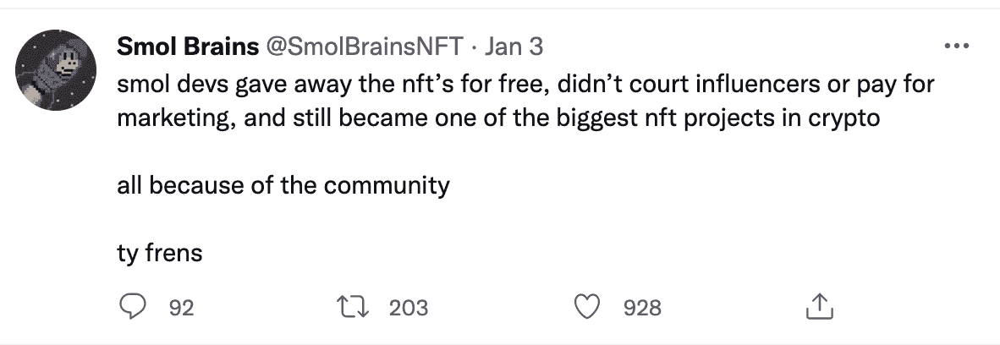

# 构建成功的 NFT 项目

> 原文：<https://www.web3.university/tracks/build-your-first-nft/building-a-successful-nft-project>

随着 NFT(不可替代代币)继续流行，许多 web3 开发者、成长型营销者和企业家都渴望试水。

但是，如何才能创造一个长期成功的 NFT 项目呢？这篇文章将涵盖一些经过实践检验的真正的技巧，帮助你走向成功。

## 1.你的 NFT 社区第一

你的社区将最终决定你的 NFT 项目的成功。无论你是一名试图通过出售 NFT 赚钱的独立艺术家，还是一个希望亲身体验 NFT 空间的 web2 品牌，你的收藏家都应该是重中之重。

创建一个强大的社区说起来容易做起来难。这里有一些 NFT 的小贴士可以帮助你开始。

### 现在就开始建立一个社区。

无论是发展你的品牌，建立一个不和电报，还是与你的潜在买家定期接触，现在就开始吧。

永远不会有推出你的社区的最佳时机。

你现在在品牌建设上投入了越多的努力，你就越有机会[卖出一个成功的 NFT 项目](https://www.alchemy.com/overviews/how-to-create-a-successful-nft-project)并建立一个长期的忠实追随者。

将时间投入到你的听众所花的地方。

你不必出现在每一个社交媒体平台上，拥有一个完美的网站，或者创建一个病毒式的 YouTube 频道来出售 NFT 的收藏。

#### NFT 社区建设小贴士

*   找到优质投资者花时间的地方，对他们的渠道进行投资。
*   联系 NFT 买家和密码爱好者
*   购买和支持原创，1/1 NFT 艺术
*   加入 Twitter 共享空间，分享您的想法

虽然 Discord 是对加密和 NFTs 感兴趣的人比较喜欢的平台之一，但是 Twitter、抖音和 Telegram 也值得你去尝试..

### 与有声望的影响者和公司合作。

许多 NFT 项目陷入了雇佣“大牌”区块链影响者、名人或社交媒体人物来推广他们的故事的陷阱。

不幸的是，这并不总是按照计划进行。

与声誉良好的秘密社交媒体影响者和有诚信历史且不以支持诈骗而闻名的公司合作至关重要。

不要让一个“大牌”损害你项目的声誉。选择相信你的项目和整个 NFT 空间的合作伙伴。

做你的研究，只和你信任的人一起工作。

### 在你的收藏下降之前，使用这些 NFT 营销技巧。

不要等到发布前一周才大肆宣传你的发布——尽快开始分享你的 NFT 收藏至关重要。

*   创建社交媒体活动
*   分享长期愿景
*   出版艺术的戏弄者
*   运行白名单竞赛
*   创造鼓励参与的游戏

除非你打算推出一个隐形的 NFT 系列，而不是有意进行营销，否则放弃一个新的 NFT 系列应该不会让人感到意外。

## 2.公平地为你的 NFT 项目定价

建立一个成功的 NFT 项目最重要的部分之一是正确设定你最初的 NFT 造币厂价格。如果你前期要价太高，你可能会失去动力，卖不掉你的收藏，并失去你的收藏者的支持。

除了设定一个公平的价格之外，为所有的二手 NFT 设定一个公平的版税也很重要。如果你设定了很高的版税，持有人将无法从他们帮助建立的社区中获得同样多的价值，这可能会阻止他们铸造你的 NFT。

### NFT 定价技巧

以下是为你的 NFT 设定合适价格的一些实用技巧:

*   花时间和你的社区谈谈什么是公平的价格。
*   考虑你的愿景和长期交付价值的能力。
*   在 Nonfungible.com 或沙丘分析等网站上研究 NFT 的顶级项目。
*   一般来说，0.05 - 0.1 ETH 是大多数成功的 NFT 项目设定其薄荷价格的地方
*   设定你的价格，邀请许多支持者参与(不要太贵)
*   最初的薄荷销售并不是从 NFTs 中赚钱的唯一途径——在像 OpenSea 这样的 NFT 市场上的二次销售可以通过 NFT 版税带来长期收入

### 成功的 NFT 定价范例:Smol Brains

像 Smol Brains 这样的一些项目甚至走上了“免费造币”的路线，让他们的收藏者只需支付 T2 部署 NFT 的费用。知道他们随着时间的推移所创造的价值将允许他们建立一个可持续的企业，并从二次销售中赚钱。

[*Smol Brains Twitter post*](https://twitter.com/SmolBrainsNFT/status/1478005605713551361) *about giving away free NFTs as an NFT marketing strategy to become one of the most successful launches in crypto.*

记住，这不是你如何开始的问题；而是你能随着时间的推移创造什么价值。

## 3.规划质量 NFT 路线图

虽然成功的 NFT 发布令人兴奋，但这只是创建一个能够经受住 NFT 市场波动性和人们简单地通过翻转 NFT 赚钱的项目的第一步。

如果做得好，你的大部分收入将来自二次销售的 NFT 版税，这使得在薄荷之后继续增加你的收藏价值变得至关重要。

虽然创建一个“道”有利弊，但 NFT 收藏可以考虑创建一个“道”,让持有者可以参与、宣传和推动 NFT 项目的发展。

此外，想办法给投资你的 NFT 的人增加更多的价值可以进一步提高热情。

### 通过强有力的路线图增加价值的 NFT 示例

NFT 项目继续扩展其路线图以推动价值回归持有者的一个最明显的例子是无聊猿游艇俱乐部。

BAYC 著名的空投血清来创造突变体，极大地增加了人们的兴趣，许多 BAYC 持有者能够以比最初造币厂高得多的价格出售他们的突变体。

现在，随着$APE Coin 的推出，CryptoPunks 和 Meebits 的购买，以及新的路线图，很明显 BAYC 团队专注于为其持有者创造长期价值。

虽然你可能一开始没有想好所有的事情，但是倾听你的社区并继续测试新的想法来推动价值增长将会为你的 NFT 的长期成功做好准备。

## 4.经常有效地沟通

不要让这个简单的 NFT 提示欺骗了你；来自你的核心团队的定期交流可以决定你项目的成败。

有这么多的“地毯拉”，保持您的社区与流行的加密通信工具，如 **Discord** 和 **Telegram** 保持同步是很重要的。

你能做的破坏势头的最糟糕的事情就是在发射后关掉无线电。

### NFT 项目沟通技巧

这里有一些快速的提示，可以改善你和 NFT 收藏家的沟通:

*   承诺一个有规律的交流时间表，并尽最大努力坚持下去。
*   投资在你的团队中雇佣一些人来支持你的社区。
*   创建教育资源，帮助你的持有者了解正在发生的事情。
*   有版主在线回答问题。
*   定期在#announcements 频道发帖，标签@everyone。
*   领先于紧急通信(例如路线图挫折、黑客攻击等)。)

每周多次发布更新、对持有人支持请求进行故障排除，以及在线联系持有人，这些都发出了强烈的信号:您的项目不是一个骗局，您的团队专注于正和值累积。

### 平行:一个与持有者沟通的成功的 NFT 项目

科幻卡牌游戏 Parallel 通过每周举行社区电话会议，任何人都可以参加并提出问题，树立了一个很好的榜样。这是他们能够迅速建立起如此忠实的粉丝群的众多原因之一。

## 5.投资你的 NFT 代码

因为一般来说，在加密和非功能性文件中坏人猖獗，所以当你[创建一个 NFT](https://docs.alchemy.com/alchemy/tutorials/how-to-create-an-nft) 时，确保你的代码写得很好以保护你的用户免受潜在的攻击是至关重要的。

无论你是有一个内部开发人员还是外包你在 NFT 的合同工作，重要的是投资你能负担得起的或者通过网络找到的最好的 web3 开发人员。

虽然业内许多团队使用的通用 NFT 智能合约(如 ERC721 和 ERC721A)有助于降低风险，但漏洞总是存在的。

因为漏洞对 NFT 项目的整体成功可能是灾难性的，如果你有能力雇佣一个聪明的合同审计公司，让你的合同被审查可能是好的。,

不要让你对发布的热情导致你忽略了最基本的安全预防措施。这很重要。

## 使用这些 NFT 小贴士让你的发布会成功

2021 年，NFT 市场上花费了价值约[410 亿美元的密码，这是不可替代代币世界中令人难以置信的激动人心的时刻。](https://fortunly.com/statistics/nft-statistics/#gref)

为了让你的 NFT 发布会成功，投入工作是至关重要的。使用这个提示列表来确保你的造币厂成功，并为你的持有者创造长期价值。

‍