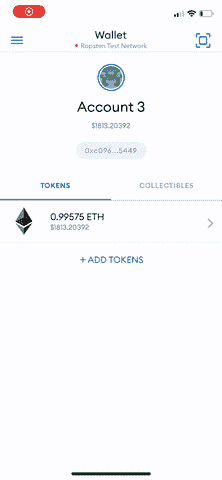

# 如何在手机钱包中查看您的 NFT

> 原文：<https://www.web3.university/tracks/build-your-first-nft/viewing-your-nft-in-a-mobile-wallet>

本教程介绍了如何在您的移动 Metamask 钱包上查看现有的 NFT。

*完成本指南的预计时间:~3 分钟*

恭喜你。你已经完成了 NFT 系列教程中最简短的部分:如何在你的虚拟钱包中查看你新铸造的 NFT。我们将在本例中使用元掩码，因为它是我们在前两部分中使用的。

作为先决条件，你应该已经在手机上安装了 Metamask，它应该包括你铸造 NFT 的账户——你可以在 [iOS](https://apps.apple.com/us/app/metamask-blockchain-wallet/id1438144202) 或 [Android](https://play.google.com/store/apps/details?id=io.metamask&hl=en_US&gl=US) 上免费获得该应用。

## 步骤 1:将你的网络设置为 Ropsten

在应用程序的顶部，按下“钱包”按钮，之后会提示您选择一个网络。因为我们的 NFT 是在 Ropsten 网络上制作的，所以您需要选择 Ropsten 作为您的网络。

## 步骤 2:将您的收藏添加到元蒙版

一旦你上了 Ropsten 网络，选择右边的“收藏品”标签，添加 NFT 智能合约地址和你的 NFT 的 ID——你应该可以在 Etherscan 上找到，基于我们教程的第二部分中生成的来自你的 [NFT 的交易散列。](https://docs.alchemyapi.io/alchemy/tutorials/how-to-write-and-deploy-a-nft-smart-contract/how-to-mint-a-nft)

您可能需要刷新几次才能查看您的 NFT，但它会在那里！😄

恭喜你。您现在可以在钱包中查看您的 NFT 了！我们迫不及待地想看看你将如何席卷 NFT 世界！🎨🪄🧙🤑🎊