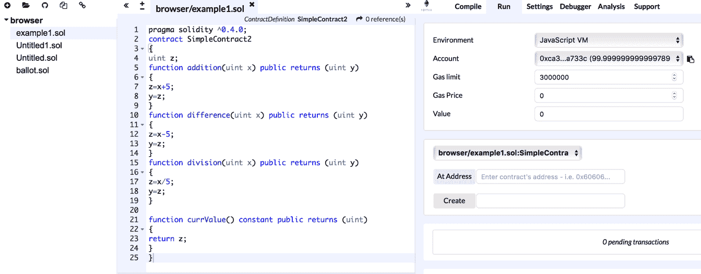
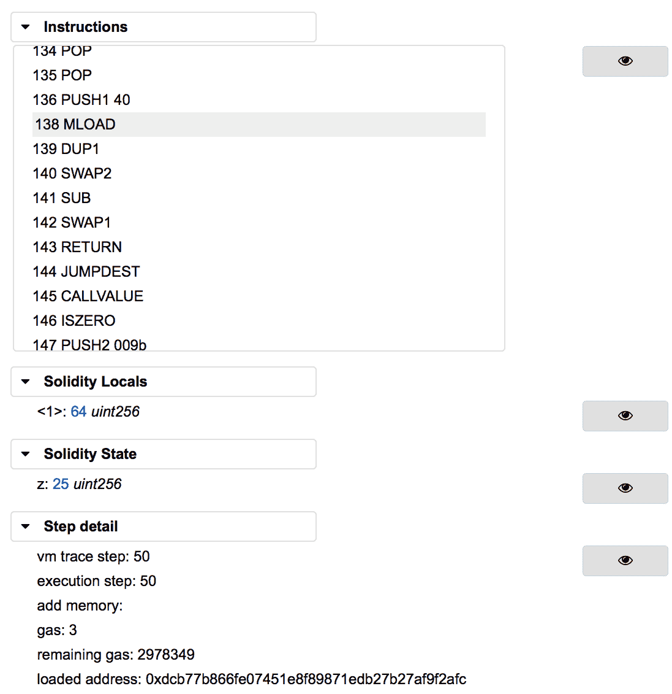
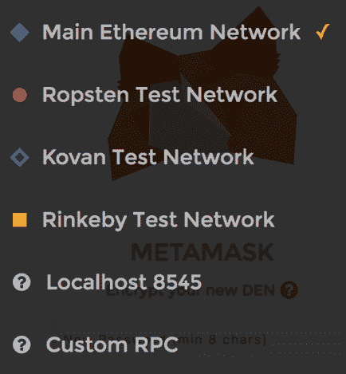
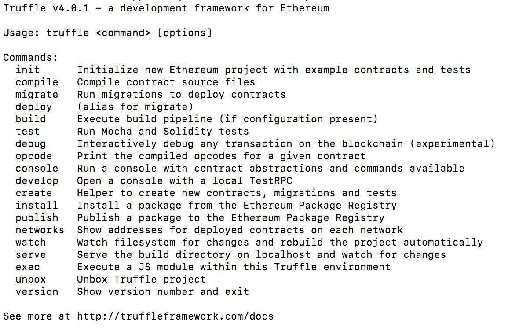
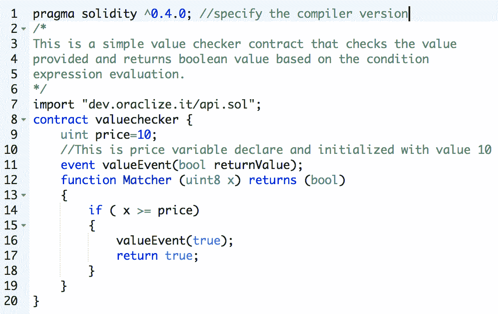

# 开发工具和框架

本章介绍了用于以太坊智能合约开发的开发工具、语言和框架。我们将研究为以太坊区块链开发智能合约的不同方法。我们将详细讨论 Solidity 语言的各种构造，Solidity 语言是目前以太坊上智能合约开发最流行的开发语言。

在本章中，我们将讨论以下主题:

*   开发工具、ide 和客户端
    *   再搅拌
    *   加纳切
    *   艾瑟芬姆
    *   TestRPC
    *   MetaMask
    *   松露
*   先决条件
    *   结节
    *   节点程序包管理器(NPM)
*   其他工具和实用程序

以太坊开发有很多可用的工具。下图显示了以太坊的各种开发工具、客户端、ide 和开发框架的分类:


以太坊发展生态系统组件的分类

前面的分类法并不包括以太坊上开发的所有框架和工具。它展示了最常用的工具和框架，以及我们将在本章的例子中使用的工具和框架。

在地址[http://eth docs . org/en/latest/contracts-and-transactions/developer-tools . html # developer-tools](http://ethdocs.org/en/latest/contracts-and-transactions/developer-tools.html#developer-tools)有许多与以太坊开发工具相关的可用资源。

在这一章中，主要关注的是 Geth、Remix IDE、Solidity、Ganache、MetaMask、solc 和 Truffle。其余的元素如先决条件(节点)也将简单讨论。

# 语言

智能合约可以用以太坊区块链的多种语言编程。有五种语言可以用来写合同:

*   **Mutan** :这是一种 Go 风格的语言，2015 年初已经弃用，不再使用。
*   **LLL** :这是一种**低级的类似 Lisp 的语言**，因此得名 LLL。这也不再使用了。
*   这是一种简单干净的类似 Python 的语言。它不再用于合同开发，也不再受社区支持。
*   这种语言现在几乎已经成为以太坊合同写作的标准。这种语言是本章的重点，将在后面的章节中详细讨论。
*   Vyper :这种语言是一种类似 Python 的实验性语言，旨在为智能合约开发带来安全性、简单性和可审计性。

# 编译程序

编译器用于将高级契约源代码转换成以太坊执行环境理解的格式。Solidity 编译器是最常用的编译器，在这里讨论。

# 可靠性编译器(solc)

solc 将高级 solidity 语言转换成**以太坊虚拟机** ( **EVM** )字节码，以便 EVM 可以在区块链上执行。

# 在 Linux 上安装

solc 可以使用以下命令安装在 Linux Ubuntu 操作系统上:

```
$ sudo apt-get install solc 
```

如果尚未安装 PPAs，可以通过运行以下命令进行安装:

```
$ sudo add-apt-repository ppa:ethereum/ethereum  
$ sudo apt-get update 
```

为了验证 solc 的现有版本并验证它是否已安装，可以使用以下命令:

```
$ solc --version
solc, the solidity compiler commandline interface
Version: 0.4.19+commit.c4cbbb05.Darwin.appleclang  
```

# 在 macOS 上安装

要在 macOS 上安装 solc，请执行以下命令:

```
$ brew tap ethereum/ethereum $ brew install solidity $ brew linkapps solidity  
```

solc 支持多种功能。下面是几个例子:

*   以二进制格式显示合同:

```
 $ solc --bin Addition.sol  
```

该命令将产生类似如下的输出。这显示了
`Addition.sol`合同代码的二进制翻译:


可靠性编译器二进制输出

*   估计气体:

```
 $ solc --gas Addition.sol
```

这将产生以下输出:


使用 solc 进行气体估算

*   生成 ABI:

```
 $ solc --abi Addition.sol 
```

以下是`Addition.abi`的内容:

```
      ======= Addition.sol:Addition ======= 
      Contract JSON ABI  
      [{"constant":false,"inputs":[{"name":"y","type":"uint8"},   
      {"name":"z","type":"uint8"}],"name":"addx","outputs":
      [],"payable":false,"stateMutability":"nonpayable","type":"function"},{"constant":true,"inputs":
      [],"name":"retrievex","outputs":   
      [{"name":"","type":"uint8"}],"payable":false,"stateMutability":"view","type":"function"}] 
```

*   编译:

这里显示了另一个有用的命令，它可以编译并生成二进制编译文件和 ABI:

```
 $ solc --bin --abi --optimize -o bin Addition.sol
```

该命令将在输出目录`bin`中生成两个文件:

这两个文件的输出如下面的屏幕截图所示:


ABI 与可靠性编译器的二进制输出

**ABI** 是**应用二进制接口**的缩写。ABI 编码关于智能合同的功能和事件的信息。它充当 EVM 级字节码和高级智能合同程序代码之间的接口。为了与以太坊区块链上部署的智能合约进行交互，外部程序需要智能合约的 ABI 和地址。

solc 是一个非常强大的命令，使用显示详细选项的`-- help`标志可以探索更多选项。然而，用于编译、ABI 生成和气体估计的前述命令应该足以满足大多数开发和部署需求。

# 集成开发环境(ide)

Solidity 开发有多种 ide 可供选择。大多数 ide 都可以在线获得，并通过 web 界面呈现。Remix(以前的 browser Solidity)是构建和调试智能合约最常用的 IDE。这里讨论一下。

# 再搅拌

Remix 是一个基于网络的环境，用于使用 Solidity 开发和测试合同。它是一个功能丰富的 IDE，不能在实时区块链上运行；事实上，它是一个模拟环境，可以在其中部署、测试和调试契约。

在[https://remix.ethereum.org](https://remix.ethereum.org)有售。

界面示例如下所示:



Remix IDE

在左侧，有一个带有语法突出显示和代码格式化的代码编辑器，在右侧，有许多工具可用于部署、调试、测试和与契约交互。

各种特性都是可用的，比如事务交互、连接到 JavaScript VM 的选项、执行环境的配置、调试器、形式验证和静态分析。它们可以配置为连接到执行环境，如 JavaScript VM、injected Web3(其中 Mist、MetaMask 或类似的环境提供了执行环境)或 Web3 provider，后者允许通过 IPC 或 RPC over HTTP (Web3 provider 端点)连接到本地运行的以太坊客户端(例如，`geth`)。

Remix 也有一个非常强大的 EVM 调试器，可以用来执行 EVM 字节码的详细跟踪和分析。这里显示了一个示例:


重新混合 IDE，调试

前面的截图展示了 Remix IDE 的不同元素。左上角显示了源代码。下面是输出日志，显示与合同的编译和执行相关的信息性消息和数据。

下面的截图更详细地展示了 Remix 调试器。它有解码成 EVM 指令的源代码。用户可以一个接一个地单步执行指令，并且可以检查源代码在执行时做了什么:



Remix 除错程式

# 工具和库

以太坊有各种工具和库。这里讨论最常见的几种。

在本节中，我们将首先安装为以太坊开发应用程序所需的先决条件。第一个要求是节点，这将在接下来看到。

# 节点版本 7

由于大多数工具和库都需要 Node，因此可以使用以下命令安装它:

```
$ curl -sL https://deb.nodesource.com/setup_7.x | sudo -E bash - sudo apt-get install -y nodejs 
```

# 艾瑟芬姆

有时，不可能在 testnet 上进行测试，mainnet 显然不是测试合同的地方。建立专用网络有时很费时间。当需要快速测试并且没有合适的测试网可用时，EthereumJS 的 TestRPC 就派上了用场。它使用 EthereumJS 来模拟以太坊`geth`的客户端行为，并允许更快的开发测试。TestRPC 可以通过`npm`作为节点包获得。

在安装 TestRPC 之前，应该已经安装了节点，并且`npm`包管理器也应该可用。

可以使用以下命令安装 TestRPC:

```
$ npm install -g ethereumjs-testrpc 
```

要启动`testrpc`，只需发出这个命令，让它在后台运行，并打开另一个终端来处理合同:

```
$ testrpc  
```

当 TestRPC 运行时，它将显示与下面的屏幕截图类似的输出。它会自动生成十个账户和私钥，以及高清钱包。它将开始监听 TCP 端口`8545`上的传入连接。


TestRPC

# 加纳切

Ganache 是为以太坊开发的众多开发工具和库的最新成员。这在某种程度上替代了 TestRPC，并使用用户友好的图形用户界面来查看事务和块以及相关的细节。这是完全工作的拜占庭式个人区块链，用于为区块链提供本地测试环境。

Ganache 基于以太坊区块链的 JavaScript 实现，具有内置的块浏览器和挖掘功能，使得在系统上进行本地测试非常容易。

如下面的屏幕截图所示，您可以在前端详细查看事务、块和地址:


加纳奇个人以太网块链

Ganache 可以从[http://truffleframework.com/ganache/](http://truffleframework.com/ganache/)下载。

# MetaMask

MetaMask 允许通过 Firefox 和 Chrome 浏览器与以太坊区块链进行交互。它在正在运行的网站的 JavaScript 上下文中注入一个`web3`对象，允许 DApps 的即时接口功能。这种*注射*允许 DApps 直接与区块链互动。

在[https://metamask.io/](https://metamask.io/)有售。

元掩码还允许帐户管理。这是在区块链上执行任何交易之前的一种验证方法。在交易到达目标区块链之前，向用户显示一个安全的界面来检查交易以获得批准或拒绝。

在[https://github.com/MetaMask/metamask-plugin](https://github.com/MetaMask/metamask-plugin)有售。


MetaMask

它允许连接各种以太坊网络，如下图所示。这是元掩码的屏幕截图，它允许用户选择自己喜欢的网络:



元掩码用户界面中显示的元掩码网络

值得注意的一个有趣的特性是，MetaMask 也可以连接到任何自定义 RPC，这允许您运行自己的区块链，例如本地甚至远程的专用网络，并允许您的浏览器连接到它。它还可以用来连接到本地运行的区块链，如 Ganache 和 TestRPC。

MetaMask 允许帐户管理，并记录这些帐户的所有交易。如下图所示:


元掩码帐户和交易视图

# 松露

truffle(http://truffleframework.com/有售)是一个开发环境，它使得测试和部署以太坊契约变得更加容易和简单。Truffle 使用 Mocha 和 Chai 提供契约编译和链接以及自动化测试框架。这也使得将合同部署到任何私有网络、公共网络或区块链以太坊测试网络变得更加容易。此外，还提供了资产管道，这使得处理所有 JavaScript 文件变得更加容易，使它们可以供浏览器使用。

# 装置

安装前假设`node`是可用的，可以如下图查询。如果`node`不可用，则需要先安装`node`才能安装`truffle`:

```
$ node -version 
v7.2.1 
```

`truffle`的安装非常简单，可以通过**节点包管理器** ( **npm** )使用以下命令来完成:

```
$ sudo npm install -g truffle 
```

这将需要几分钟时间；一旦安装完毕，`truffle`命令可用于显示帮助信息并验证安装是否正确:

```
$ sudo npm install -g truffle Password: /us/local/bin/truffle -> /usr/local/lib/node_modules/truffle/build/cli.bundled.js /usr/local/lib └── truffle@4.0.1  
```

在终端键入`truffle`显示使用帮助:

```
$ truffle 
```

这将显示以下输出:



松露帮助

或者，可以在 https://github.com/ConsenSys/truffle 的[或者 T2 的`truffle`获得这个库，可以在本地克隆它来安装`truffle`。 **Git** 可以通过以下命令克隆存储库:](https://github.com/ConsenSys/truffle)

```
$ git clone https://github.com/ConsenSys/truffle.git
```

# 合同开发和部署

为了开发和部署合同，需要采取各种步骤。大体上，这些可以分为四个步骤:编写、测试、验证和部署。部署之后，下一个可选步骤是创建用户界面，并通过 web 服务器呈现给最终用户。在不需要人工输入或监控的合同中，有时不需要 Web 界面，但通常需要创建 web 界面来与合同交互。

# 笔迹

编写步骤与编写 Solidity 中的合同源代码有关。这可以在任何文本编辑器中完成。在 Linux、Atom 和其他编辑器中，有各种插件和附件可用于 Vim，为 Solidity 源代码提供语法高亮和格式化。

Visual studio 代码已经变得非常流行，通常用于 Solidity 开发。有一个 Solidity 插件允许语法高亮、格式化和智能化。它可以通过 Visual Studio 代码中的扩展选项安装。


Visual studio 代码

# 测试

测试通常由自动化手段来执行。在本章的早些时候，我们向您介绍了 Truffle，它使用 Mocha 框架来测试合同。然而，手动功能测试也可以通过使用 Remix 和手动运行功能并验证结果来执行。

在下一节中，将向你介绍语言的可靠性。这是对 Solidity 的一个简要介绍，它应该提供编写合同所需的基础知识。语法非常类似于 C 和 JavaScript，编程起来相当容易。

# 固体语言

Solidity 是以太坊中用于编程契约的特定领域语言。然而，也有其他语言可以使用，如蛇，Mutan 和 LLL，但坚实是最受欢迎的时候写这篇文章。它的语法更接近 JavaScript 和 c。

在过去的几年中，Solidity 已经发展成为一门成熟的语言，并且非常容易使用，但是在它变得像 Java、C 或 C Sharp 等其他成熟的语言一样高级、标准化和功能丰富之前，它还有很长的路要走。然而，这是目前可用于编程契约的最广泛使用的语言。

它是一种静态类型语言，这意味着 Solidity 中的变量类型检查是在编译时进行的。每个变量，无论是状态变量还是局部变量，都必须在编译时指定类型。这是有益的，因为任何验证和检查都是在编译时完成的，某些类型的错误，如数据类型的解释，可以在开发周期的早期而不是在运行时被发现，这可能是昂贵的，特别是在区块链/智能合同范例的情况下。该语言的其他特性包括继承、库和定义复合数据类型的能力。

Solidity 也被称为面向契约的语言。在 Solidity 中，契约相当于其他面向对象编程语言中的类的概念。

# 类型

Solidity 有两类数据类型:**值类型**和**引用类型**。

# 值类型

以下是对这些问题的详细解释:

# 布尔代数学体系的

该数据类型有两个可能的值，`true`或`false`，例如:

```
bool v = true; 
bool v = false;  
```

该语句将值`true`分配给`v`。

# 整数

此数据类型表示整数。下表显示了用于声明整数数据类型的各种关键字:

| **关键词** | **类型** | **详情** |
| `int` | 带符号整数 | `int8`到`int256`，表示从`int8`到`int256`的关键字，以 8 为增量，例如:`int8`、`int16`、`int24`。 |
| `uint` | 无符号整数 | `uint8`，`uint16`，...`uint256`，从 8 位到 256 位的无符号整数。这种用法取决于变量中需要存储多少位的要求。 |

例如，在这段代码中，注意`uint`是`uint256`的别名:

```
uint256 x;  
uint y;  
uint256 z; 
```

这些类型也可以用关键字`constant`声明，这意味着编译器不会为这些变量保留存储槽。在这种情况下，每次出现都将被替换为实际值:

```
uint constant z=10+10; 
```

状态变量是在函数体之外声明的，根据分配给它们的可访问性，只要契约持续，它们在整个契约中都是可用的。

# 地址

该数据类型包含一个 160 位长(20 字节)的值。该类型有几个成员，可用于与合同交互和查询合同。这些成员描述如下:

*   **余额**:`balance`成员返回 Wei 中地址的余额。
*   **发送**:该成员用于向某个地址(以太坊的 160 位地址)发送一定量的以太，并根据事务的结果返回`true`或`false`，例如:

```
      address to = 0x6414cc08d148dce9ebf5a2d0b7c220ed2d3203da; address from = this; 
      if (to.balance < 10 && from.balance > 50) to.send(20); 
```

*   **调用函数**:提供`call`、`callcode`和`delegatecall`调用是为了与没有 ABI 的函数进行交互。应该谨慎使用这些函数，因为它们对类型安全和合同安全有影响，使用起来不安全。
*   **数组值类型(固定大小和动态大小的字节数组)** : Solidity 有固定大小和动态大小的字节数组。固定大小的关键字范围从`bytes1`到`bytes32`，而动态大小的关键字包括`bytes`和`string`。`bytes`关键字用于原始字节数据，`string`用于 UTF-8 编码的字符串。因为这些数组是由值返回的，所以调用它们会导致开销。`length`是数组值类型的成员，返回字节数组的长度。

静态(固定大小)数组的示例如下:

```
      bytes32[10] bankAccounts; 
```

动态调整大小的数组示例如下:

```
      bytes32[] trades;  
```

使用以下代码获得交易长度:

```
      trades.length; 
```

# 文字

这些用来表示固定值。在以下小节中描述了不同类型的文字。

# 整数文字

整数是范围在 0-9 之间的十进制数字序列。一个例子如下所示:

```
uint8 x = 2; 
```

# 字符串文字

字符串文字指定用双引号或单引号书写的一组字符。一个例子如下所示:

```
'packt' "packt" 
```

# 十六进制文字

十六进制文字以关键字`hex`为前缀，并在双引号或单引号内指定。一个例子如下所示:

```
(hex'AABBCC'); 
```

# 枚举数

这允许创建用户定义的类型。一个例子如下所示:

```
enum Order {Filled, Placed, Expired };  
Order private ord; 
ord=Order.Filled; 
```

枚举允许在所有整数类型之间进行显式转换。

# 功能类型

有两种函数类型:内部函数和外部函数。

# 内部功能

这些只能在当前合同的上下文中使用。

# 外部功能

外部函数可以通过外部函数调用来调用。

实度中的**函数**可以标记为常数。常量函数不能改变契约中的任何东西；它们只在被调用时返回值，并且不消耗任何气体。这是对*号召概念的实际贯彻。*

声明函数的语法如下所示:

```
function <nameofthefunction> (<parameter types> <name of the variable>) 
{internal|external} [constant] [payable] [returns (<return types> <name of the variable>)] 
```

# 参考类型

顾名思义，这些类型是通过引用传递的，将在下一节中讨论。这些也被称为**复杂类型**。

# 数组

数组表示一组连续的元素，这些元素在一个内存位置上具有相同的大小和类型。这个概念与任何其他编程语言都是一样的。数组有两个名为`length`和`push`的成员:

```
uint[] OrderIds; 
```

# 结构

这些结构可用于将一组不同的数据类型归入一个逻辑组。这些可用于定义新类型，如下例所示:

```
pragma solidity ^0.4.0; 
contract TestStruct { 
  struct Trade 
  { 
    uint tradeid; 
    uint quantity; 
    uint price;  
    string trader; 
  } 

  //This struct can be initialized and used as below 

  Trade tStruct = Trade({tradeid:123, quantity:1, price:1, trader:"equinox"}); 

} 
```

# 数据单元

数据位置指定特定复杂数据类型的存储位置。根据指定的缺省值或注释，该位置可以是存储器或内存。这适用于数组和结构，可以使用关键字`storage`或`memory`来指定。

由于在内存和存储之间进行复制可能会非常昂贵，因此指定一个位置有时会有助于控制气体消耗。 **Calldata** 是另一个用于存储函数参数的内存位置。

外部函数的参数使用 **calldata** 内存。默认情况下，函数的参数存储在**存储器**中，而所有其他局部变量使用**存储器**。另一方面，状态变量需要使用存储。

# 绘图

映射用于键到值的映射。这是一种将值与键相关联的方式。此映射中的所有值都已初始化为全零，例如:

```
mapping (address => uint) offers; 
```

此示例显示 offers 被声明为映射。另一个例子更清楚地说明了这一点:

```
mapping (string => uint) bids;  
bids["packt"] = 10; 
```

这基本上是一个字典或散列表，其中字符串值被映射到整数值。名为`bids`的映射将字符串`packt`映射到值`10`。

# 全局变量

Solidity 提供了许多在全局名称空间中总是可用的全局变量。这些变量提供关于块和事务的信息。此外，还提供加密功能和地址相关变量。

可用函数和变量的子集如下所示:

```
keccak256(...) returns (bytes32) 
```

此函数用于计算提供给函数的参数的 Keccak-256 哈希:

```
ecrecover(bytes32 hash, uint8 v, bytes32 r, bytes32 s) returns (address) 
```

此函数从椭圆曲线签名返回公钥的关联地址:

```
block.number 
```

这将返回当前的块号。

# 控制结构

solidity 语言中可用的控制结构有`if...else`、`do`、`while`、`for`、`break`、`continue`和`return`。它们的工作方式与其他语言如 C 语言或 JavaScript 完全相同。

以下是一些例子:

*   **如果**:如果`x`等于`0`，则将值`0`赋给`y`，否则将`1`赋给`z`:

```
      if (x == 0) 
          y = 0; 
      else 
          z = 1; 
```

*   **做**:当`z`大于`1`时，增量`x`；

```
      do{ 
          x++; 
      } (while z>1); 
```

*   **而**:增量`z`而`x`大于`0`:

```
      while(x > 0){ 
          z++; 
      } 
```

*   **for，break，and continue** :执行一些工作，直到`x`小于或等于`10`。该`for`循环将运行`10`次，如果`z`为`5`，则中断`for`循环:

```
      for(uint8 x=0; x<=10; x++) 
      { 
          //perform some work 
          z++ 
          if(z == 5) break; 
      } 
```

它将以类似的方式继续工作，但是当条件满足时，循环将再次开始。

*   **return** : Return 用于停止一个函数的执行，返回一个可选值。例如:

```
      return 0; 
```

它将停止执行并返回`0`的值。

# 事件

Solidity 中的事件可用于在 EVM 日志中记录某些事件。当需要将契约中的任何更改或事件通知给外部接口时，这些非常有用。这些日志存储在区块链的事务日志中。不能从契约中访问日志，但日志被用作一种机制来通知契约中的状态变化或事件(满足条件)的发生。

在这里的一个简单例子中，如果传递给函数`Matcher`的`x`参数等于或大于`10`，则`valueEvent`事件将返回`true`:

```
pragma solidity ^0.4.0;  
contract valueChecker  
{  
    uint8 price=10; 
    event valueEvent(bool returnValue);  
    function Matcher(uint8 x) public returns (bool) 
    { 
        if (x>=price) 
        { 
            valueEvent(true);  
            return true; 
        } 
    } 
} 
```

# 遗产

坚固性支持继承。`is`关键字用于从另一个合同中派生出一个合同。在下面的例子中，`valueChecker2`是从`valueChecker`合同中派生出来的。派生协定可以访问父协定的所有非私有成员:

```
pragma solidity ^0.4.0;  
contract valueChecker 
{ 
    uint8 price = 20; 
    event valueEvent(bool returnValue);  
    function Matcher(uint8 x) public returns (bool) 
    { 
        if (x>=price) 
        { 
            valueEvent(true);  
            return true; 
        } 
    } 
} 
contract valueChecker2 is valueChecker 
{ 
    function Matcher2() public view returns (uint) 
    { 
        return price+10; 
    } 
} 
```

在前面的例子中，如果`uint8 price = 20`被更改为`uint8 private price = 20`，那么它将不能被`valueChecker2`契约访问。这是因为现在该成员被声明为私有，不允许任何其他协定访问它。您将在 Remix 中看到的错误消息是

```
browser/valuechecker.sol:20:8: DeclarationError: Undeclared identifier. 
return price+10; 
       ^---^ 
```

# 图书馆

库只在特定地址部署一次，它们的代码通过 EVM 的`CALLCODE`或`DELEGATECALL`操作码调用。库背后的关键思想是代码的可重用性。它们类似于合约，并充当调用合约的基础合约。可以声明一个库，如下例所示:

```
library Addition 
{ 
    function Add(uint x,uint y) returns (uint z) 
    { 
        return x + y; 
    } 
} 
```

然后可以在契约中调用这个库，如下所示。首先，它需要被导入，然后可以在代码中的任何地方使用。一个简单的例子如下所示:

```
import "Addition.sol" 
function Addtwovalues() returns(uint) 
{ 
    return Addition.Add(100,100); 
} 
```

库有一些限制；例如，它们不能有状态变量，也不能继承或被继承。此外，他们也不能接受乙醚；这与可以接收以太网的合同相反。

# 功能

Solidity 中的功能是与合同相关联的代码模块。函数是用名称、可选参数、访问修饰符、可选关键字`constant`和可选返回类型来声明的。这显示在以下示例中:

```
function orderMatcher (uint x)  
private constant returns(bool return value)  
```

在前面的示例中，`function`是用于声明函数的关键字。`orderMatcher`是函数名，`uint x`是可选参数，`private`是控制从外部契约访问函数的**访问修饰符**或**说明符**,`constant`是可选关键字，用于指定该函数不改变契约中的任何内容，而仅用于从契约中检索值，`returns (bool return value)`是函数的可选返回类型。

*   **如何定义函数**:定义函数的语法如下:

```
      function <name of the function>(<parameters>) <visibility specifier> returns 
      (<return data type> <name of the variable>) 
      { 
          <function body> 
      } 
```

*   **函数签名**:Solidity 中的函数通过其签名来标识，签名是其完整签名字符串的 Keccak-256 hash 的前四个字节。这在 Remix IDE 中也是可以看到的，如下图截图所示。`f9d55e21`是名为`Matcher`的函数的 32 字节 Keccak-256 hash 的前四个字节。


函数哈希如 Remix IDE 所示

在这个示例函数中，`Matcher`的签名哈希是`d99c89cb`。这些信息对于构建接口非常有用。

*   **函数的输入参数**:函数的输入参数以`<data type> <parameter name>`的形式声明。本例阐明了概念，其中`uint x`和`uint y`是`checkValues`函数的输入参数:

```
      contract myContract 
      { 
          function checkValues(uint x, uint y) 
          { 
          } 
      } 
```

*   **函数的输出参数**:函数的输出参数以`<data type> <parameter name>`的形式声明。这个例子展示了一个返回一个`uint`值的简单函数:

```
      contract myContract 
      { 
          function getValue() returns (uint z) 
          { 
              z=x+y; 
          } 
      } 
```

一个函数可以返回多个值。在前面的示例函数中，`getValue`只返回一个值，但是一个函数可以返回多达 14 个不同数据类型的值。可以选择省略未使用的返回参数的名称。

*   **内部函数调用**:当前契约上下文中的函数可以直接在内部调用。这些调用是为了调用同一契约中存在的函数。这些调用导致 EVM 字节码级别的简单的`JUMP`调用。
*   **外部函数调用**:外部函数调用是通过从一个合同到另一个合同的消息调用实现的。在这种情况下，所有功能参数都被复制到存储器中。如果使用`this`关键字调用内部函数，它也被认为是外部调用。`this`变量是一个指向当前合同的指针。它可以显式转换为地址，并且协定的所有成员都是从该地址继承的。

*   **回退函数**:这是契约中的一个未命名函数，没有参数和返回数据。每次接收到以太网时，都会执行该功能。如果合同旨在接收以太网，则要求在合同中执行；否则，将引发异常并返回 Ether。如果协定中没有其他函数签名匹配，此函数也会执行。如果合同预计会收到以太网，那么应该用应付款**修饰符**来声明回退功能。应付款是必填项；否则，该功能将无法接收任何以太。可以使用`address.call()`方法调用该函数，例如:

```
      function () 
      { 
          throw; 
      } 
```

在这种情况下，如果根据前面描述的条件调用回退函数；它将调用`throw`，这将回滚到调用之前的状态。它也可以是除了`throw`之外的其他结构；例如，它可以记录一个事件，该事件可以用作警报，将调用结果反馈给调用应用程序。

*   **修改函数**:这些函数用来改变一个函数的行为，可以在其他函数之前调用。通常，它们用于在执行函数之前检查一些条件或验证。`_`(下划线)用于修饰符函数中，当调用修饰符时，将被替换为函数的实际主体。基本上，它象征着需要*守护*的功能。这个概念类似于其他语言中的 guard 函数。
*   **构造函数**:这是一个可选函数，与合同同名，一旦创建合同就执行。构造函数不能被用户调用，并且在一个契约中只允许有一个构造函数。这意味着没有重载功能可用。
*   **函数可见性说明符(访问修饰符)**:函数可以用如下四个访问说明符来定义:
    *   **外部**:这些功能可以从其他合同和交易中访问。除非使用关键字`this`，否则不能在内部调用它们。
    *   **公共**:默认情况下，函数是公共的。它们既可以在内部调用，也可以使用消息调用。
    *   **Internal** :内部函数对父合同的其他派生合同可见。
    *   私有函数:私有函数只对声明它们的同一个契约可见。
*   **功能修饰符:**
    *   纯态:该修改者禁止进入或修改状态
    *   **视图**:该修改器禁止对状态进行任何修改
    *   应付:该修正值允许通过一次召唤来支付乙醚
    *   常量:该修饰符不允许访问或修改状态
*   **其他重要关键字/函数抛出** : `throw`用于停止执行。因此，所有状态更改都会被还原。在这种情况下，没有气体返回给交易发起者，因为所有剩余的气体都被消耗掉了。

# Solidity 源代码文件的布局

在下面的小节中，我们将看看 Solidity 源代码文件的组成部分。

# 版本杂注

为了解决 solc 版本的未来版本可能出现的兼容性问题，可以使用`pragma`来指定兼容编译器的版本，例如，如下所示:

```
pragma solidity ^0.5.0 
```

这将确保源文件不会在低于 0.5.0 和从 0.6.0 开始的版本中编译。

# 导入

实体导入允许将符号从现有实体文件导入到当前全局范围。这类似于 JavaScript 中可用的`import`语句，例如:

```
import "module-name"; 
```

# 评论

可以以类似于 C 语言的方式在 Solidity 源代码文件中添加注释。多行注释包含在`/*`和`*/`中，而单行注释以`//`开始。

下面是一个实体程序的例子，显示了`pragma`、`import`和注释的使用:



如 Remix IDE 中所示的示例实度程序

这就完成了对 Solidity 语言的简单介绍。这种语言非常丰富，并且在不断改进。详细的文档和编码指南可在[http://solidity.readthedocs.io/en/latest/](http://solidity.readthedocs.io/en/latest/)在线获得。

# 摘要

本章首先介绍了以太坊的开发工具，比如 Remix IDE。然后我们讨论了一些框架，比如 Truffle，以及用于开发和测试的本地区块链解决方案，比如 Ganache、EthereumJS 和 TestRPC。还探索了其他工具，如 MetaMask。还介绍了 Node 的安装，因为大多数工具都是基于 JavaScript 和 Node 的。