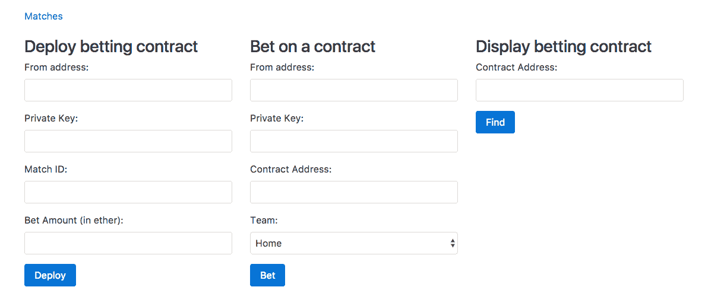
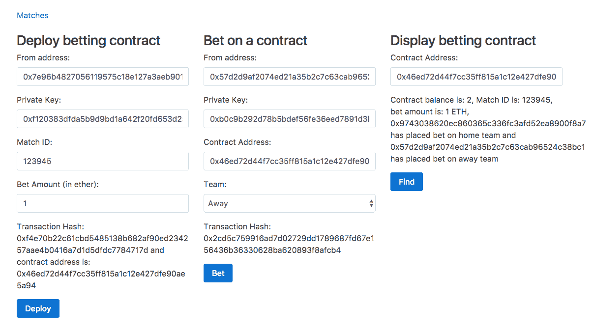

# 构建博彩应用程序

有时，智能合约需要从其他 dapps 或万维网访问数据。但由于技术和共识方面的挑战，让智能合约访问外部数据确实很复杂。因此，目前，以太坊智能合约没有访问外部数据的原生支持。但是以太坊智能合约有第三方解决方案可以从一些流行的 dapps 和万维网访问数据。在本章中，我们将学习如何使用 Oraclize 从以太坊智能合约发出 HTTP 请求，以访问万维网上的数据。我们还将学习如何访问存储在 IPFS 的文件，使用字符串库处理字符串，等等。我们将通过构建一个足球博彩智能合约及其客户端来了解所有这些。

在本章中，我们将讨论以下主题:

*   Oraclize 是如何工作的？
*   Oraclize 的各种数据来源是什么，每一个是如何工作的？
*   Oraclize 中的共识是如何工作的？
*   在以太坊智能合约中集成 Oraclize
*   使用字符串`Solidity`库使字符串工作变得容易
*   构建足球博彩应用程序

# Oraclize 简介

Oraclize 是一项服务，旨在使智能合约能够访问来自其他区块链和万维网的数据。这项服务目前在比特币和以太坊的 testnet 和 mainnet 上上线。Oraclize 的特别之处在于，您不需要信任它，因为它提供了它向智能合约提供的所有数据的真实性证明。

在本章中，我们的目标是学习以太坊智能合约如何使用 Oraclize 服务从万维网获取数据。

# 它是如何工作的？

让我们看看以太坊智能合约使用 Oraclize 从其他区块链和万维网获取数据的过程。

要获取以太坊区块链之外的数据，以太坊智能合约需要向 Oraclize 发送查询，提及数据源(表示从哪里获取数据)和数据源的输入(表示获取什么)。

向 Oraclize 发送查询 Oraclize 意味着向以太坊区块链中的 Oraclize 契约发送一个契约调用(即内部事务)。

Oraclize 服务器不断寻找新的传入查询，以访问其智能契约。每当它看到一个新的查询，它就获取结果，并通过调用您的契约的`_callback`方法将其发送回您的契约。

# 数据源

以下是 Oraclize 让智能合约获取数据的来源列表:

*   URL:URL 数据源为您提供了发出 HTTP GET 或 POST 请求的能力，也就是说，从 WWW 获取数据。
*   `WolframAlpha`:`WolframAlpha`数据源为您提供了向`WolframAlpha`知识引擎提交查询并获得答案的能力。
*   `Blockchain`:`blockchain`数据源为您提供从其他`blockchains`访问数据的能力。可以提交给`blockchain`数据源的可能查询有`bitcoin blockchain height`、`litecoin hashrate`、`bitcoin difficulty`、`1NPFRDJuEdyqEn2nmLNaWMfojNksFjbL4S balance`等等。
*   `IPFS`:`IPFS`数据源为您提供了获取存储在`IPFS`中的文件内容的能力。
*   `Nested`:`nested`数据源是元数据源；它不提供对附加服务的访问。它旨在提供一个简单的聚合逻辑，使单个查询能够利用基于任何可用数据源的子查询，并产生单个字符串作为结果；例如:

`[WolframAlpha] temperature in ${[IPFS] QmP2ZkdsJG7LTw7jBbizTTgY1ZBeen64PqMgCAWz2koJBL}`.

*   `Computation`:`computation`数据源使得给定应用的可审计执行能够进入安全的链外上下文；也就是说，它让我们获取应用程序的离线执行结果。这个应用程序必须在退出前在最后一行(标准输出)打印查询结果。执行上下文必须由 docker 文件描述，在 docker 文件中构建和运行它应该可以直接启动您的主应用程序。Dockerfile 初始化和应用程序执行应该尽快终止:在一个`AWS t2.micro`实例上，最大执行超时是 5 分钟。这里，我们考虑一个`AWS t2.micro`实例，因为 Oraclize 将使用它来执行应用程序。由于数据源的输入是包含此类文件(Dockerfile 加上任何外部文件依赖项，Dockerfile 必须放在归档根目录中)的 ZIP 归档的 IPFS 多重散列，因此您应该事先准备好此归档并将其推送到 IPFS。

在写这本书的时候这些数据来源是可用的。但是将来可能会有更多的数据源可用。

# 真实性证明

尽管 Oraclize 是一个可信的服务，但您可能仍然希望检查 Oraclize 返回的数据是否真实可信，也就是说，它是否在传输过程中被 Oraclize 或其他人操纵过。

或者，Oraclize 提供从 URL、区块链、嵌套和计算数据源返回的结果的 TLSNotary 证明。此证明不适用于`WolframAlpha`和`IPFS`数据源。目前，Oraclize 只支持 TLSNotary 证明，但在未来，他们可能会支持一些其他的认证方式。目前，TLSNotary 证明需要手动验证，但 Oraclize 已经在进行链上证明验证；也就是说，您的智能合约代码可以在从 Oraclize 接收数据时自行验证 TLSNotary 证明，这样，如果证明无效，就会丢弃该数据。

这个工具([https://github.com/Oraclize/proof-verification-tool](https://github.com/oraclize/proof-verification-tool))是 Oraclize 提供的一个开源工具，如果你想验证 TLSNotary proof 的话。

使用 Oraclize 或验证证据并不需要了解 TLSNotary 是如何工作的。验证 TLSNotary 证据的工具是开源的；因此，如果它包含任何恶意代码，那么它很容易被捕获，所以这个工具是可信的。

让我们看一下 TLSNotary 如何工作的高级概述。要了解 TLSNotary 是如何工作的，首先需要了解 TLS 是如何工作的。TLS 协议为客户端和服务器提供了一种创建加密会话的方法，这样其他人就无法读取或操纵客户端和服务器之间传输的内容。服务器首先将其证书(由受信任的 CA 颁发给域所有者)发送给客户端。证书将包含服务器的公钥。客户端使用 CA 的公钥来解密证书，这样它就可以验证证书是否确实是由 CA 颁发的，并获得服务器的公钥。然后，客户端生成对称加密密钥和 MAC 密钥，并使用服务器的公钥对它们进行加密，然后将其发送给服务器。服务器只能解密此消息，因为它有私钥来解密它。现在，客户端和服务器共享相同的对称密钥和 MAC 密钥，没有其他人知道这些密钥，它们可以开始相互发送和接收数据。对称密钥用于加密和解密数据，其中 MAC 密钥和对称密钥一起用于生成加密消息的签名，以便在消息被攻击者修改的情况下，另一方可以知道它。

TLSNotary 是 TLS 的一种修改，Oraclize 使用它来提供加密证明，表明他们提供给智能合约的数据确实是数据源在特定时间提供给 Oraclize 的数据。实际上，TLSNotary 协议是一种开源技术，由 PageSigner 项目开发和使用。

TLSNotary 通过在三方(即服务器、被审核者和审核者)之间拆分对称密钥和 MAC 密钥来工作。TLSNotary 的基本思想是，被审核者可以向审核者证明服务器在给定的时间返回了特定的结果。

下面是 TLSNotary 如何让我们实现这一目标的概述。审计员计算对称密钥和 MAC 密钥，并只将对称密钥提供给被审计方。被审核方不需要 MAC 密钥，因为 MAC 签名检查确保来自服务器的 TLS 数据在传输过程中没有被修改。有了对称加密密钥，审计对象现在可以从服务器解密数据。因为银行使用 MAC 密钥对所有消息进行“签名”,并且只有服务器和审计员知道 MAC 密钥，所以正确的 MAC 签名可以证明某些消息来自银行，并且不是被审计方伪造的。

在 Oraclize 服务的情况下，Oraclize 是被审计者，而一个专门设计的、开源的 Amazon 机器映像的锁定 AWS 实例充当审计者。

他们提供的证明数据是该 AWS 实例的签名证明，表明确实发生了适当的 TLSnotary 证明。它们还提供了一些关于在 AWS 实例中运行的软件的额外证据，也就是说，它在初始化后是否被修改过。

# 定价

来自任何以太坊地址的第一个 Oraclize 查询呼叫是完全免费的。Oraclize 调用在 testnets 上使用是免费的！这仅适用于测试环境中的适度使用。

从第二个电话开始，你必须为查询付费。向 Oraclize 发送查询时(即进行内部事务调用时)，通过将 ether 从调用约定转移到 Oraclize 约定来扣除费用。要扣除的乙醚量取决于数据来源和证明类型。

下表显示了发送查询时扣除的乙醚数量:

| **数据来源** | **无需证明** | **带 TLS nortary proof** |
| 统一资源定位器 | $0.01 | $0.05 |
| 区块链 | $0.01 | $0.05 |
| WolframAlpha | $0.03 | $0.03 |
| IPFS 吗 | $0.01 | $0.01 |

因此，如果您正在发出一个 HTTP 请求，并且也想要 TLSNotary 证明，那么调用契约必须有一个值为 0.05 美元的 ether 否则，将引发异常。

# Oraclize API 入门

对于使用 Oraclize 服务的契约，它需要继承`usingOraclize`契约。你可以在 https://github.com/Oraclize/Ethereum-api 找到这份合同。

`usingOraclize`合同作为`OraclizeI`和`OraclizeAddrResolverI`合同的代理。实际上，`usingOraclize`使得调用`OraclizeI`和`OraclizeAddrResolverI`契约变得很容易，也就是说，它提供了更简单的 API。如果你觉得舒服，也可以直接调用`OraclizeI`和`OraclizeAddrResolverI`合约。您可以浏览这些契约的源代码，找到所有可用的 API。我们只会学习最需要的。

让我们看看如何设置凭证类型、设置凭证存储位置、进行查询、查找查询的成本等等。

# 设置校样类型和存储位置

无论您是否需要来自 Oraclize 的 TLSNotary 证明，您都必须在进行查询之前指定证明类型和证明存储位置。

如果你不想要证据，那就把这段代码写进你的合同里:

```
oraclize_setProof(proofType_NONE)
```

如果你想要证据，那就在你的合同里写上这段代码:

```
oraclize_setProof(proofType_TLSNotary | proofStorage_IPFS)
```

目前，`proofStorage_IPFS`是唯一可用的校样存储位置；即 TLSNotary proof 只存储在`IPFS`中。

您可以只执行一次这些方法中的任何一个，例如，在构造函数中，或者在任何其他时候，例如，如果您只需要某些查询的证明。

# 发送查询

要向 Oraclize 发送查询，您需要调用`oraclize_query`函数。该函数至少需要两个参数，即数据源和给定数据源的输入。数据源参数不区分大小写。

以下是`oraclize_query`函数的一些基本示例:

```
oraclize_query("WolframAlpha", "random number between 0 and 100"); 

oraclize_query("URL", "https://api.kraken.com/0/public/Ticker?pair=ETHXBT"); 

oraclize_query("IPFS", "QmdEJwJG1T9rzHvBD8i69HHuJaRgXRKEQCP7Bh1BVttZbU"); 

oraclize_query("URL", "https://xyz.io/makePayment", '{"currency": "USD", "amount": "1"}');
```

以下是上述代码的工作原理:

*   如果第一个参数是字符串，则假定它是数据源，第二个参数假定是数据源的输入。在第一个调用中，数据源是`WolframAlpha`，我们发送给它的搜索查询是`random number between 0 and 100`。
*   在第二个调用中，我们向第二个参数中的`URL`发出一个`HTTP GET`请求。
*   在第三次调用中，我们从`IPFS`获取`QmdEJwJG1T9rzHvBD8i69HHuJaRgXRKEQCP7Bh1BVttZbU`文件的内容。
*   如果数据源后面的两个连续参数是字符串，那么它被认为是一个 POST 请求。在最后一个调用中，我们向`https://xyz.io/makePayment`发出一个`HTTP POST`请求，而`POST`请求的主体内容是第三个参数中的字符串。Oraclize 足够智能，可以根据字符串格式检测内容类型头。

# 计划查询

如果希望 Oraclize 在预定的未来时间执行查询，只需将当前时间的延迟(以秒为单位)指定为第一个参数。

这里有一个例子:

```
oraclize_query(60, "WolframAlpha", "random number between 0 and 100");
```

前面的查询将在被看到几秒钟后由 Oraclize `60`执行。因此，如果第一个参数是一个数字，那么就假设我们正在调度一个查询。

# 海关气体

从 Oraclize 到您的`__callback`函数的事务消耗 gas，就像任何其他事务一样。你需要支付或分摊油费。在调用`__callback`函数时，进行查询的 ether oraclize_query 费用也用于提供 gas。默认情况下，Oraclize 在调用`__callback`函数时提供 200，000 gas。

这种返回气体的成本实际上是在你的控制之下，因为你在`__callback`方法中编写了代码，因此，可以估计它。因此，当使用 Oraclize 进行查询时，您还可以指定在`__callback`事务中`gasLimit`应该占多少。但是，请注意，由于 Oraclize 发送交易，任何未用完的汽油都将返还给 Oraclize，而不是您。

如果缺省的最小值 200，000 gas 不够，您可以通过如下方式指定不同的`gasLimit`来增加它:

```
oraclize_query("WolframAlpha", "random number between 0 and 100", 500000);
```

在这里，你可以看到，如果最后一个参数是一个数字，那么它被假定为自定义气体。在前面的代码中，Oraclize 将为回调事务使用 500k `gasLimit`而不是 200k。因为我们是要求 Oraclize 提供更多的气，Oraclize 在调用`oraclize_query`的同时会扣除更多的乙醚(取决于需要多少气)。

注意，如果你提供的`gasLimit`太低，而你的`__callback`方法做多，你可能永远看不到回调。还要注意自定义气体必须超过 200k。

# 回调函数

一旦您的结果准备好了，Oraclize 将把一个事务发送回您的合同地址，并调用以下三种方法之一:

*   要么`__callback(bytes32 myid, string result)`。`Myid`是每个查询的唯一 ID。这个 ID 由`oraclize_query`方法返回。如果您的合同中有多个`oraclize_query`调用，那么这将用于匹配该结果所针对的查询。
*   如果您请求 TLS 公证证明，结果如下:`__callback(bytes32 myid, string result, bytes proof)`
*   作为最后的手段，如果其他方法都不存在，回退功能是`function()`

下面是一个`__callback`函数的例子:

```
function __callback(bytes32 myid, string result) { 
    if (msg.sender != oraclize_cbAddress()) throw; // just to be sure the calling address is the Oraclize authorized one 

    //now doing something with the result.. 
}
```

# 解析助手

HTTP 请求返回的结果可以是 HTML、JSON、XML、二进制等等。实际上，解析结果既困难又昂贵。由于这个原因，Oraclize 提供了解析帮助器，让它在自己的服务器上处理解析，而您只能得到您需要的那部分结果。

要让 Oraclize 解析结果，您需要用这些解析助手之一包装 URL:

*   `xml(..)`和`json(..)`帮助器允许您要求 Oraclize 只返回 JSON 或 XML 解析响应的一部分；例如，看看下面的内容:
    *   为了获得完整的响应，您使用带有`api.kraken.com/0/public/Ticker?pair=ETHUSD` URL 参数的`URL`数据源
    *   如果您想要的只是 last-price 字段，那么您需要使用 JSON 解析调用作为`json(api.kraken.com/0/public/Ticker?pair=ETHUSD).result.XETHZUSD.c.0`
*   `html(..).xpath(..)`助手对于 HTML 抓取很有用。只需指定您想要的 XPATH 作为`xpath(..)`参数；例如，看看下面的内容:
    *   要获取特定推文的文本，请使用`html(https://twitter.com/oraclizeit/status/671316655893561344).xpath(//*[contains(@class, 'tweet-text')]/text())`。
*   `binary(..)`助手在获取二进制文件(如证书文件)时非常有用:
    *   要只获取二进制文件的一部分，可以使用`slice(offset,length)`；第一个参数是偏移量，第二个参数是想要返回的切片的长度(都是以字节为单位)。
    *   示例:仅从二进制 CRL 中获取前 300 个字节，`binary(https://www.sk.ee/crls/esteid/esteid2015.crl).slice(0,300)`。二进制助手必须与 slice 选项一起使用，并且只接受二进制文件(未编码)。

如果服务器没有响应或无法连接，我们将向您发送一个空响应。您可以使用[http://app.Oraclize.it/home/test_query](http://app.oraclize.it/home/test_query)测试查询。

# 获取查询价格

如果您想在进行实际查询之前知道查询的开销，那么您可以使用`Oraclize.getPrice()`函数来获得所需的 wei 值。它采用的第一个参数是数据源，第二个参数是可选的，也就是自定义的 gas。

这种情况的一个常见用例是，如果没有足够的资源进行查询，就通知客户在契约中添加乙醚。

# 加密查询

有时，您可能不想显示数据源和/或数据源的输入。例如:您可能不希望在 URL 中显示 API 键(如果有的话)。因此，Oraclize 提供了一种在智能合约中存储加密查询的方法，并且只有 Oraclize 的服务器拥有解密查询的密钥。

Oraclize 提供了一个 Python 工具([https://github.com/Oraclize/encrypted-queries](https://github.com/oraclize/encrypted-queries))，可以用来加密数据源和/或数据输入。它生成一个不确定的加密字符串。

加密任意文本字符串的 CLI 命令如下:

```
    python encrypted_queries_tools.py -e -p 044992e9473b7d90ca54d2886c7addd14a61109af202f1c95e218b0c99eb060c7134c4ae46345d0383ac996185762f04997d6fd6c393c86e4325c469741e64eca9 "YOUR DATASOURCE or INPUT"
```

您看到的长十六进制字符串是 Oraclize 的服务器的公钥。现在，您可以使用前面命令的输出来代替数据源和/或数据源的输入。

为了防止误用加密查询(即重放攻击)，第一个查询或使用特定加密查询的契约成为其合法所有者。重用完全相同的字符串的任何其他协定将不被允许使用它，并将收到一个空结果。因此，在使用加密查询重新部署契约时，请记住始终生成一个新的加密字符串。

# 解密数据源

还有一个数据源叫做 decrypt。它用于解密加密的字符串。但是这个数据源不返回任何结果；否则，任何人都有能力解密数据源和数据源的输入。

它是专门设计用来在嵌套数据源中启用部分查询加密的。这是它唯一的用例。

# Oraclize web IDE

Oraclize 提供了一个 web IDE，使用它可以编写、编译和测试基于 Oraclize 的应用程序。你可以在 http://dapps.Oraclize.it/browser-Solidity/找到它。

如果你访问这个链接，你会注意到它看起来和 browser Solidity 一模一样。它实际上是浏览器的可靠性和一个额外的特性。为了理解这个特性是什么，我们需要更深入地理解浏览器的可靠性。

Browser Solidity 不仅允许我们为我们的合同编写、编译和生成 web3.js 代码，还允许我们在那里测试这些合同。到目前为止，为了测试我们的合同，我们正在建立一个以太坊节点，并向它发送事务。但 browser Solidity 可以在不连接任何节点的情况下执行契约，一切都发生在内存中。它使用 ethereumjs-vm 来实现这一点，这是 EVM 的 JavaScript 实现。使用 ethereumjs-vm，您可以创建我们自己的 EVM 并运行字节码。如果我们愿意，我们可以通过提供要连接的 URL 来配置 browser Solidity 使用以太坊节点。用户界面非常丰富；所以，这些你都可以自己尝试一下。

Oraclize web IDE 的特别之处在于，它将 Oraclize 契约部署在内存执行环境中，这样你就不必连接 testnet 或 mainnet 节点，但是如果你使用 browser Solidity，那么你就必须连接 testnet 或 mainnet 节点来测试 Oraclize APIs。

你可以在[https://dev.Oraclize.it/](https://dev.oraclize.it/)找到更多与整合 Oraclize 相关的资源。

# 使用字符串

在 Solidity 中处理字符串不像在其他高级编程语言中处理字符串那么容易，比如 JavaScript、Python 等等。因此，许多 Solidity 程序员想出了各种各样的库和契约，以方便使用字符串。

`strings`库是最流行的字符串实用程序库。它允许我们通过将字符串转换成称为切片的东西来进行连接、连接、拆分、比较等操作。切片是保存字符串长度和字符串地址的结构。由于切片只需指定偏移量和长度，因此复制和操作切片比复制和操作它们引用的字符串要便宜得多。

为了进一步降低 gas 开销，slice 上大多数需要返回一个 slice 的函数都会修改原来的函数，而不是分配一个新的函数；例如，`s.split(".")`将返回第一个`"."`之前的文本，将 s 修改为仅包含在`"."`之后的字符串的剩余部分。在您不想修改原始切片的情况下，您可以使用`.copy()`进行复制，例如`s.copy().split(".")`。尽量避免在循环中使用这种习惯用法；由于 Solidity 没有内存管理，它将导致分配许多短期切片，这些切片后来被丢弃。

必须复制字符串数据的函数将返回字符串而不是切片；如果需要，可以将它们转换回切片以便进一步处理。

让我们看几个使用`strings`库处理字符串的例子:

```
pragma Solidity ^0.4.0; 

import "github.com/Arachnid/Solidity-stringutils/strings.sol"; 

contract Contract 
{ 
    using strings for *; 

    function Contract() 
    { 
        //convert string to slice 
        var slice = "xyz abc".toSlice(); 

        //length of string 
        var length = slice.len(); 

        //split a string 
        //subslice = xyz 
        //slice = abc 
        var subslice = slice.split(" ".toSlice()); 

        //split a string into an array 
        var s = "www.google.com".toSlice(); 
        var delim = ".".toSlice(); 
        var parts = new string[](s.count(delim)); 
        for(uint i = 0; i < parts.length; i++) { 
            parts[i] = s.split(delim).toString(); 
        } 

        //Converting a slice back to a string 
        var myString = slice.toString(); 

        //Concatenating strings 
        var finalSlice = subslice.concat(slice); 

        //check if two strings are equal 
        if(slice.equals(subslice)) 
        { 

        } 
    } 
}
```

前面的代码不言自明。

返回两个片的函数有两个版本:一个非分配版本将第二个片作为参数，在适当的位置修改它，另一个分配版本分配并返回第二个片；例如，让我们来看看以下内容:

```
var slice1 = "abc".toSlice(); 

//moves the string pointer of slice1 to point to the next rune (letter) 
//and returns a slice containing only the first rune 
var slice2 = slice1.nextRune(); 

var slice3 = "abc".toSlice(); 
var slice4 = "".toSlice(); 

//Extracts the first rune from slice3 into slice4, advancing the slice to point to the next rune and returns slice4\. 
var slice5 = slice3.nextRune(slice4);
```

你可以在 https://github.com/Arachnid/Solidity-stringutils 了解更多关于字符串库的信息。

# 建立赌博合同

在我们的博彩应用程序中，两个人可以选择赌一场足球比赛，一个人支持主队，另一个人支持客队。他们两个应该赌相同数量的钱，赢家拿走所有的钱。如果比赛是平局，那么他们都将拿回他们的钱。

我们将使用 FastestLiveScores API 来找出比赛的结果。它提供了一个免费的 API，让我们每小时可以免费发出 100 个请求。首先，创建一个帐户，然后生成一个 API 密钥。要创建一个账户，请访问[https://customer.fastestlivescores.com/register](https://customer.fastestlivescores.com/register)，一旦账户被创建，您将在[https://customer.fastestlivescores.com/](https://customer.fastestlivescores.com/)看到 API 密钥。你可以在 https://docs.crowdscores.com/的[找到 API 文档。](https://docs.crowdscores.com/)

在我们的应用程序中，对于两个人之间的每一次下注，都会部署一个下注契约。合同将包含从`FastestLiveScores` API 检索的匹配 ID、各方需要投资的金额以及各方的地址。一旦双方都投入到合同中，他们就会发现比赛的结果。如果比赛还没有结束，他们会每 24 小时检查一次结果。

以下是合同的代码:

```
pragma Solidity ^0.4.0; 

import "github.com/Oraclize/Ethereum-api/oraclizeAPI.sol"; 
import "github.com/Arachnid/Solidity-stringutils/strings.sol"; 

contract Betting is usingOraclize 
{ 
    using strings for *; 

    string public matchId; 
    uint public amount; 
    string public url; 

    address public homeBet; 
    address public awayBet; 

    function Betting(string _matchId, uint _amount, string _url)  
    { 
        matchId = _matchId; 
        amount = _amount; 
        url = _url; 

        oraclize_setProof(proofType_TLSNotary | proofStorage_IPFS); 
    } 

    //1 indicates home team 
    //2 indicates away team 
    function betOnTeam(uint team) payable 
    { 

        if(team == 1) 
        { 
            if(homeBet == 0) 
            { 
                if(msg.value == amount) 
                { 
                    homeBet = msg.sender;    
                    if(homeBet != 0 && awayBet != 0) 
                    { 
                        oraclize_query("URL", url); 
                    } 
                } 
                else 
                { 
                    throw; 
                } 
            } 
            else 
            { 
                throw; 
            } 
        } 
        else if(team == 2) 
        { 
            if(awayBet == 0) 
            { 
                if(msg.value == amount) 
                { 
                    awayBet = msg.sender;           

                    if(homeBet != 0 && awayBet != 0) 
                    { 
                        oraclize_query("URL", url); 
                    } 
                } 
                else 
                { 
                    throw; 
                } 
            } 
            else 
            { 
                throw; 
            } 
        } 
        else 
        { 
            throw; 
        } 
    } 

    function __callback(bytes32 myid, string result, bytes proof) { 
        if (msg.sender != oraclize_cbAddress()) 
        { 
            throw;     
        } 
        else 
        { 
            if(result.toSlice().equals("home".toSlice())) 
            { 
                homeBet.send(this.balance); 
            } 
            else if(result.toSlice().equals("away".toSlice())) 
            { 
                awayBet.send(this.balance); 
            } 
            else if(result.toSlice().equals("draw".toSlice())) 
            { 
                homeBet.send(this.balance / 2); 
                awayBet.send(this.balance / 2); 
            } 
            else 
            { 
                if (Oraclize.getPrice("URL") < this.balance)  
                { 
                    oraclize_query(86400, "URL", url); 
                } 
            } 
        } 
    } 
}
```

合同代码是不言自明的。现在使用`solc.js`或浏览器 Solidity 编译前面的代码，这取决于你喜欢什么。您不需要链接`strings`库，因为其中的所有函数都被设置为`internal`可见性。

在 browser Solidity 中，当指定从 HTTP URL 导入一个库或契约时，确保它托管在 GitHub 上；否则，它不会获取它。在 GitHub 文件 URL 中，确保删除了协议和`blob/{branch-name}`。

# 为赌博合同建立客户

为了方便查找 match 的 id、部署和投资合同，我们需要构建一个 UI 客户机。因此，让我们开始构建一个客户端，它将有两个路径，即部署契约和下注匹配的主路径和查找匹配列表的另一个路径。我们将让用户使用他们自己的离线账户进行部署和下注，这样整个下注过程将以分散的方式进行，没有人能够作弊。

在我们开始构建我们的客户端之前，请确保您已经同步了 testnet，因为 Oraclize 只能在 Ethereum 的 testnet/mainnet 上运行，而不能在私有网络上运行。通过用`--testnet`选项替换`--dev`选项，您可以切换到 testnet 并开始下载 testnet 区块链。例如，看看下面的内容:

```
geth --testnet --rpc --rpccorsdomain "*" --rpcaddr "0.0.0.0" --rpcport "8545"
```

# 投影结构

在本章的练习文件中，你会发现两个目录，即 Final 和 Initial。Final 包含项目的最终源代码，而 Initial 包含空的源代码文件和库，以便快速开始构建应用程序。

为了测试`Final`目录，你需要在其中运行`npm install`，然后在最终目录中使用`node app.js`命令运行应用程序。

在`Initial`目录中，你会发现一个`public`目录和两个名为`app.js`和`package.json`的文件。`package.json`文件包含我们应用程序的后端依赖项，而`app.js`是放置后端源代码的地方。

`public`目录包含与前端相关的文件。在`public/css`里面，你会发现`bootstrap.min.css`，这是引导库。在`public/html`中，您将找到`index.html`和`matches.ejs`文件，在那里您将放置我们应用程序的 HTML 代码，在`public/js`目录中，您将找到 web3.js 和 ethereumjs-tx 的 js 文件。在`public/js`里面，你还会找到一个`main.js`文件，在那里你会放置我们应用的前端 JS 代码。您还可以找到 Oraclize Python 工具来加密查询。

# 构建后端

我们先来搭建 app 的后端。首先，在初始目录中运行`npm install`，为我们的后端安装所需的依赖项。

下面是运行快速服务、服务于`index.html`文件和静态文件以及设置视图引擎的后端代码:

```
var express = require("express"); 
var app = express(); 

app.set("view engine", "ejs"); 

app.use(express.static("public")); 

app.listen(8080); 

app.get("/", function(req, res) { 
    res.sendFile(__dirname + "/public/html/index.html"); 
})
```

前面的代码不言自明。现在让我们继续。我们的应用程序将有另一个页面，它将显示最近的比赛列表，如果比赛已经结束，将显示比赛的 id 和结果。以下是端点的代码:

```
var request = require("request"); 
var moment = require("moment"); 

app.get("/matches", function(req, res) { 
    request("https://api.crowdscores.com/v1/matches?api_key=7b7a988932de4eaab4ed1b4dcdc1a82a", function(error, response, body) { 
        if (!error && response.statusCode == 200) { 
            body = JSON.parse(body); 

            for (var i = 0; i < body.length; i++) { 
             body[i].start = moment.unix(body[i].start / 
               1000).format("YYYY MMM DD hh:mm:ss"); 
            } 

            res.render(__dirname + "/public/html/matches.ejs", { 
                matches: body 
            }); 
        } else { 
            res.send("An error occured"); 
        } 
    }) 
})
```

这里，我们发出 API 请求来获取最近匹配的列表，然后我们将结果传递给`matches.ejs`文件，以便它可以在用户友好的 UI 中呈现结果。API 结果将匹配开始时间作为时间戳提供给我们；因此，我们使用 moment 将其转换为人类可读的格式。我们从后端而不是前端发出请求，这样我们就不会向用户公开 API 密钥。

我们后端会给前端提供一个 API，利用这个 API 前端可以在部署契约之前加密查询。我们的应用程序不会提示用户创建 API 键，因为这是一个糟糕的 UX 实践。控制 API 密钥的应用程序开发人员不会造成任何伤害，因为开发人员无法修改来自 API 服务器的结果；因此，即使应用程序的开发人员知道 API 密钥，用户仍然会信任应用程序。

以下是加密端点的代码:

```
var PythonShell = require("python-shell"); 

app.get("/getURL", function(req, res) { 
    var matchId = req.query.matchId; 

    var options = { 
        args: ["-e", "-p", "044992e9473b7d90ca54d2886c7addd14a61109af202f1c95e218b0c99eb060c7134c4ae46345d0383ac996185762f04997d6fd6c393c86e4325c469741e64eca9", "json(https://api.crowdscores.com/v1/matches/" + matchId + "?api_key=7b7a988932de4eaab4ed1b4dcdc1a82a).outcome.winner"], 
        scriptPath: __dirname 
    }; 

    PythonShell.run("encrypted_queries_tools.py", options, function 
      (err, results) { 
        if(err) 
        { 
            res.send("An error occured"); 
        } 
        else 
        { 
            res.send(results[0]); 
        } 
    }); 
})
```

我们已经看到了如何使用这个工具。要成功运行此端点，请确保您的系统上安装了 Python。即使安装了 Python，此端点也可能会显示错误，表明没有安装 Python 的加密和 base58 模块。因此，如果工具提示您安装这些模块，请务必安装。

# 构建前端

现在让我们构建应用程序的前端。我们的前端将让用户看到最近的比赛列表，部署投注合同，对游戏下注，并让他们看到有关投注合同的信息。

让我们首先实现`matches.ejs`文件，它将显示最近匹配的列表。以下是代码:

```
<!DOCTYPE html>
<html lang="en">
    <head> 
         <meta charset="utf-8"> 
         <meta name="viewport" content="width=device-width, initial-scale=1, shrink-to-fit=no"> 
         <meta http-equiv="x-ua-compatible" content="ie=edge"> 
         <link rel="stylesheet" href="/css/bootstrap.min.css"> 
     </head> 
     <body> 
         <div class="container"> 
             <br> 
             <div class="row m-t-1"> 
                 <div class="col-md-12"> 
                     <a href="/">Home</a> 
                 </div> 
             </div> 
             <br> 
             <div class="row"> 
                 <div class="col-md-12"> 
                     <table class="table table-inverse"> 
                           <thead> 
                             <tr> 
                                 <th>Match ID</th> 
                                 <th>Start Time</th> 
                                 <th>Home Team</th> 
                                 <th>Away Team</th> 
                                 <th>Winner</th> 
                             </tr> 
                           </thead> 
                           <tbody> 
                               <% for(var i=0; i < matches.length; i++) { %> 
                                   <tr> 
                                       <td><%= matches[i].dbid %></td> 
                                       <% if (matches[i].start) { %> 
                                        <td><%= matches[i].start %></td> 
                                     <% } else { %> 
                                         <td>Time not finalized</td> 
                                     <% } %> 
                                       <td><%= matches[i].homeTeam.name %></td> 
                                       <td><%= matches[i].awayTeam.name %></td> 
                                       <% if (matches[i].outcome) { %> 
                                        <td><%= matches[i].outcome.winner %></td> 
                                     <% } else { %> 
                                         <td>Match not finished</td> 
                                     <% } %> 
                                 </tr> 
                             <% } %> 
                           </tbody> 
                     </table> 
                 </div> 
             </div> 
         </div> 
     </body> 
 </html>
```

前面的代码不言自明。现在让我们为我们的主页编写 HTML 代码。我们的主页将显示三种形式。第一个表单是部署一个投注合同，第二个表单是投资一个投注合同，第三个表单是显示一个已部署的投注合同的信息。

这是主页的 HTML 代码。将此代码放入`index.html`页面:

```
<!DOCTYPE html> 
 <html lang="en"> 
     <head> 
         <meta charset="utf-8"> 
         <meta name="viewport" content="width=device-width, initial-scale=1, shrink-to-fit=no"> 
         <meta http-equiv="x-ua-compatible" content="ie=edge"> 
         <link rel="stylesheet" href="/css/bootstrap.min.css"> 
     </head> 
     <body> 
         <div class="container"> 
             <br> 
             <div class="row m-t-1"> 
                 <div class="col-md-12"> 
                     <a href="/matches">Matches</a> 
                 </div> 
             </div> 
             <br> 
             <div class="row"> 
                 <div class="col-md-4"> 
                     <h3>Deploy betting contract</h3> 
                     <form id="deploy"> 
                         <div class="form-group"> 
                             <label>From address: </label> 
                             <input type="text" class="form-control" id="fromAddress"> 
                         </div> 
                         <div class="form-group"> 
                             <label>Private Key: </label> 
                             <input type="text" class="form-control" id="privateKey"> 
                         </div> 
                         <div class="form-group"> 
                             <label>Match ID: </label> 
                             <input type="text" class="form-control" id="matchId"> 
                         </div> 
                         <div class="form-group"> 
                             <label>Bet Amount (in ether): </label> 
                             <input type="text" class="form-control" id="betAmount"> 
                         </div> 
                         <p id="message" style="word-wrap: break-word"></p> 
                         <input type="submit" value="Deploy" class="btn btn-primary" /> 
                     </form> 
                 </div> 
                 <div class="col-md-4"> 
                     <h3>Bet on a contract</h3> 
                     <form id="bet"> 
                         <div class="form-group"> 
                             <label>From address: </label> 
                             <input type="text" class="form-control" id="fromAddress"> 
                         </div> 
                         <div class="form-group"> 
                             <label>Private Key: </label> 
                             <input type="text" class="form-control" id="privateKey"> 
                         </div> 
                         <div class="form-group"> 
                             <label>Contract Address: </label> 
                             <input type="text" class="form-control"
id="contractAddress"> 
                         </div> 
                         <div class="form-group"> 
                             <label>Team: </label> 
                             <select class="form-control" id="team"> 
                                 <option>Home</option> 
                                 <option>Away</option> 
                             </select> 
                         </div> 
                         <p id="message" style="word-wrap: break-word"></p> 
                         <input type="submit" value="Bet" class="btn btn-primary" /> 
                     </form> 
                 </div> 
                 <div class="col-md-4"> 
                     <h3>Display betting contract</h3> 
                     <form id="find"> 
                         <div class="form-group"> 
                             <label>Contract Address: </label> 
                             <input type="text" class="form-control"  
 d="contractAddress"> 
                         </div> 
                         <p id="message"></p> 
                         <input type="submit" value="Find" class="btn btn-primary" /> 
                     </form> 
                 </div> 
             </div> 
         </div> 

         <script type="text/javascript" src="/js/web3.min.js"></script> 
         <script type="text/javascript" src="/js/ethereumjs-tx.js"></script> 
         <script type="text/javascript" src="/js/main.js"></script> 
     </body> 
</html>
```

前面的代码不言自明。现在，让我们编写 JavaScript 代码来实际部署合同、投资合同并在合同上显示信息。这是所有这些的代码。将此代码放在`main.js`文件中:

```
var bettingContractByteCode = "6060604..."; 
var bettingContractABI = [{"constant":false,"inputs":[{"name":"team","type":"uint256"}],"name":"betOnTeam","outputs":[],"payable":true,"type":"function"},{"constant":false,"inputs":[{"name":"myid","type":"bytes32"},{"name":"result","type":"string"}],"name":"__callback","outputs":[],"payable":false,"type":"function"},{"constant":false,"inputs":[{"name":"myid","type":"bytes32"},{"name":"result","type":"string"},{"name":"proof","type":"bytes"}],"name":"__callback","outputs":[],"payable":false,"type":"function"},{"constant":true,"inputs":[],"name":"url","outputs":[{"name":"","type":"string"}],"payable":false,"type":"function"},{"constant":true,"inputs":[],"name":"matchId","outputs":[{"name":"","type":"string"}],"payable":false,"type":"function"},{"constant":true,"inputs":[],"name":"amount","outputs":[{"name":"","type":"uint256"}],"payable":false,"type":"function"},{"constant":true,"inputs":[],"name":"homeBet","outputs":[{"name":"","type":"address"}],"payable":false,"type":"function"},{"constant":true,"inputs":[],"name":"awayBet","outputs":[{"name":"","type":"address"}],"payable":false,"type":"function"},{"inputs":[{"name":"_matchId","type":"string"},{"name":"_amount","type":"uint256"},{"name":"_url","type":"string"}],"payable":false,"type":"constructor"}]; 

var web3 = new Web3(new Web3.providers.HttpProvider("http://localhost:8545")); 

function getAJAXObject() 
{ 
   var request; 
   if (window.XMLHttpRequest) { 
       request = new XMLHttpRequest(); 
   } else if (window.ActiveXObject) { 
       try { 
           request = new ActiveXObject("Msxml2.XMLHTTP"); 
       } catch (e) { 
           try { 
               request = new ActiveXObject("Microsoft.XMLHTTP"); 
           } catch (e) {} 
       } 
   } 

   return request; 
} 

document.getElementById("deploy").addEventListener("submit", function(e){ 
   e.preventDefault(); 

   var fromAddress = document.querySelector("#deploy #fromAddress").value; 
   var privateKey = document.querySelector("#deploy #privateKey").value; 
   var matchId = document.querySelector("#deploy #matchId").value; 
   var betAmount = document.querySelector("#deploy #betAmount").value; 

   var url = "/getURL?matchId=" + matchId; 

   var request = getAJAXObject(); 

   request.open("GET", url); 

   request.onreadystatechange = function() { 
       if (request.readyState == 4) { 
           if (request.status == 200) { 
               if(request.responseText != "An error occured") 
               { 
           var queryURL = request.responseText; 

           var contract = web3.eth.contract(bettingContractABI); 
           var data = contract.new.getData(matchId, 
             web3.toWei(betAmount, "ether"), queryURL, { 
               data: bettingContractByteCode 
                }); 

           var gasRequired = web3.eth.estimateGas({ data: "0x" + data
             }); 

      web3.eth.getTransactionCount(fromAddress, function(error, nonce){ 

       var rawTx = { 
            gasPrice: web3.toHex(web3.eth.gasPrice), 
             gasLimit: web3.toHex(gasRequired), 
              from: fromAddress, 
               nonce: web3.toHex(nonce), 
                data: "0x" + data, 
                 }; 

      privateKey = EthJS.Util.toBuffer(privateKey, "hex"); 

       var tx = new EthJS.Tx(rawTx); 
       tx.sign(privateKey); 

      web3.eth.sendRawTransaction("0x" + 
       tx.serialize().toString("hex"), function(err, hash) { 
            if(!err) 
                {document.querySelector("#deploy #message").
                   innerHTML = "Transaction Hash: " + hash + ". 
                     Transaction is mining..."; 

            var timer = window.setInterval(function(){ 
            web3.eth.getTransactionReceipt(hash, function(err, result){ 
            if(result) 
             {window.clearInterval(timer); 
       document.querySelector("#deploy #message").innerHTML = 
         "Transaction Hash: " + hash + " and contract address is: " + 
             result.contractAddress;} 
               }) 
                }, 10000) 
                 } 
             else 
           {document.querySelector("#deploy #message").innerHTML = err; 
             } 
           }); 
          }) 

          } 
           } 
       } 
   }; 

   request.send(null); 

}, false) 

document.getElementById("bet").addEventListener("submit", function(e){ 
   e.preventDefault(); 

   var fromAddress = document.querySelector("#bet #fromAddress").value; 
   var privateKey = document.querySelector("#bet #privateKey").value; 
   var contractAddress = document.querySelector("#bet #contractAddress").value; 
   var team = document.querySelector("#bet #team").value; 

   if(team == "Home") 
   { 
         team = 1; 
   } 
   else 
   { 
         team = 2; 
   }  

   var contract = web3.eth.contract(bettingContractABI).at(contractAddress); 
   var amount = contract.amount(); 

   var data = contract.betOnTeam.getData(team); 

   var gasRequired = contract.betOnTeam.estimateGas(team, { 
         from: fromAddress, 
         value: amount, 
         to: contractAddress 
   }) 

   web3.eth.getTransactionCount(fromAddress, function(error, nonce){ 

         var rawTx = { 
           gasPrice: web3.toHex(web3.eth.gasPrice), 
           gasLimit: web3.toHex(gasRequired), 
           from: fromAddress, 
           nonce: web3.toHex(nonce), 
           data: data, 
           to: contractAddress, 
           value: web3.toHex(amount) 
       }; 

       privateKey = EthJS.Util.toBuffer(privateKey, "hex"); 

       var tx = new EthJS.Tx(rawTx); 
         tx.sign(privateKey); 

         web3.eth.sendRawTransaction("0x" + tx.serialize().toString("hex"), function(err, hash) { 
               if(!err) 
               { 
    document.querySelector("#bet #message").innerHTML = "Transaction 
      Hash: " + hash; 
        } 
      else 
       { 
       document.querySelector("#bet #message").innerHTML = err; 
      } 
     }) 
   }) 
    }, false) 

document.getElementById("find").addEventListener("submit", function(e){ 
   e.preventDefault(); 

   var contractAddress = document.querySelector("#find 
     #contractAddress").value; 
   var contract =  
      web3.eth.contract(bettingContractABI).at(contractAddress); 

   var matchId = contract.matchId(); 
   var amount = contract.amount(); 
   var homeAddress = contract.homeBet(); 
   var awayAddress = contract.awayBet(); 

   document.querySelector("#find #message").innerHTML = "Contract balance is: " + web3.fromWei(web3.eth.getBalance(contractAddress), "ether") + ", Match ID is: " + matchId + ", bet amount is: " + web3.fromWei(amount, "ether") + " ETH, " + homeAddress + " has placed bet on home team and " + awayAddress + " has placed bet on away team"; 
}, false)
```

前面的代码是这样工作的:

1.  首先，我们将合同字节码和 ABI 分别存储在`bettingContractByteCode`和`bettingContractABI`变量中。
2.  然后，我们创建一个`Web3`实例，它连接到我们 testnet 节点。
3.  然后，我们有了`getAJAXObject`函数(一个跨浏览器兼容的函数)，它返回一个 AJAX 对象。
4.  然后，我们将一个`submit`事件监听器附加到第一个表单，用于部署契约。在事件监听器的回调中，我们通过传递`matchId`向`getURL`端点发出请求，以获取加密的查询字符串。然后，我们生成数据来部署合同。然后，我们找出`gasRequired`。我们使用 function 对象的 estimateGas 方法来计算所需的气体，但是您也可以使用 web3.eth.estimateGas 方法。他们都不同的论点；也就是说，在前一种情况下，您不需要传递事务数据。记住，如果函数调用抛出异常，`estimateGas`将返回阻塞气体限制。然后，我们计算随机数。这里，我们只是使用`getTransactionCount`方法，而不是我们之前学习的实际程序。我们这样做只是为了简化代码。然后，我们创建原始事务，签名并广播它。一旦挖掘出交易，我们就显示合同地址。

5.  然后，我们为第二个表单附加一个`submit`事件监听器，用于投资合同。这里，我们生成事务的`data`部分，计算所需的 gas，创建原始事务，签署它，并广播它。在计算事务所需的 gas 时，我们从 account address 和 value object 属性传递契约地址，因为这是一个函数调用，gas 根据值、from 地址和契约地址而不同。请记住，在查找调用契约函数所需的 gas 时，您可以传递`to`、`from`和`value`属性，因为 gas 依赖于这些值。
6.  最后，我们有一个用于第三种形式的`submit`事件监听器，也就是显示关于一个已部署的投注合同的信息。

# 测试客户端

现在我们已经完成了我们的投注平台的构建，是时候测试它了。在测试之前，确保 testnet 区块链已经完全下载，并且正在寻找新的输入块。

现在使用我们之前建立的钱包服务，生成三个帐户。使用[http://faucet.ropsten.be:3001/](http://faucet.ropsten.be:3001/)为每个账户添加一个乙醚。

然后，在`Initial`目录下运行`node app.js`，然后访问`http://localhost:8080/matches`，你会看到这个截图显示的内容:


在这里，您可以复制任何匹配 ID。假设您想用第一个匹配项，即 123945 进行测试。现在访问 [`http://localhost:8080`](http://localhost:8080) ，你会看到这个截图显示的是什么:



现在，通过填写第一个表单中的输入字段并单击 deploy 按钮来部署契约，如下所示。使用您的第一个帐户部署合同。


现在从第二个账号下注契约的主队，从第三个账号下注`away team`，如下图截图所示:


现在，将合同地址放在第三个表单上，然后单击“查找”按钮查看合同的详细信息。您将看到类似于以下屏幕截图所示的内容:



一旦这两个交易都被挖掘出来，再次检查合同的细节，您将看到类似于下面的屏幕截图所示的内容:


在这里，您可以看到合同中没有任何以太网，所有以太网都被转移到了将赌注下在主队的帐户上。

# 摘要

在这一章中，我们深入了解了 Oraclize 和`strings`库。我们一起用它们搭建了一个去中心化的投注平台。现在，您可以根据自己的需求定制合同和客户机。为了增强应用程序，您可以在合同中添加事件，并在客户端显示通知。目标是了解分散式博彩应用的基本架构。