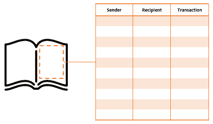
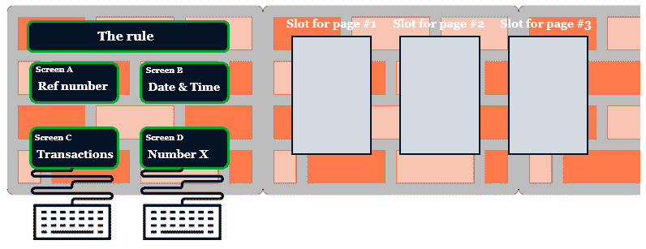

# 区块链基础知识和村庄贝塔插图

区块链被一种新的、有争议的数字货币形式比特币推到了聚光灯下。早期比特币投资者的成功故事和以太坊(一个允许创建去中心化应用的平台)的推出，将区块链和加密货币带到了前沿，决策者和高管开始关注这项新兴技术。许多好奇的人开始想知道它如何在他们的个人或专业企业中帮助他们，使他们相信这种创新可能是他们业务问题的适当答案。《经济学人》在 2015 年 10 月 31 日发表了第一篇关于区块链的知名文章([https://www . Economist . com/print edition/covers/2015-10-29/AP-e-eu-la-me-na-uk](https://www.economist.com/printedition/covers/2015-10-29/ap-e-eu-la-me-na-uk))。

作为一名决策者，对新技术和创新有足够的了解对于贵公司探索和尝试新兴的使能因素至关重要，这将带来竞争优势并帮助您实现稳定增长。能够在数字时代蓬勃发展越来越成为一种必然和复杂的任务，特别是因为技术突破和大规模创新引发了人们消费习惯的急剧转变，以及地缘政治挑战和经济变化。能够考虑、评估和整合新技术来实现公司的业务目标变得至关重要。

考虑到这一点，你应该意识到，区块链有潜力成为一个范式转变，可以重新设计组织如何运作以及价值如何在经济行为体之间共享。据说这种颠覆性技术改变了世界的运作方式、整个行业的运作方式以及价值交换和保护的方式。但是，尽管前景看好，你必须谨慎行事。我们正处于区块链所能实现的黎明，它还没有百分之百成熟——它仍被认为是一项新兴技术。

在本章中，我们将考虑一个区块链应用程序的例子，它将帮助你轻松地描绘和理解这些概念。本章结束时，你应该能够理解区块链在特定环境和条件下的可用性，尤其是在个人之间直接交换价值的时候。你应该能够基本解释区块链是如何工作的，它的内在特征是什么，以及比特币如何在没有任何中央权威的情况下运行。

本章包括以下几节:

*   区块链在商界的重要性
*   了解区块链
*   瓦解区块链

# 区块链在商界的重要性

2018 年 8 月 20 日发布的最新 Gartner 炒作周期显示了区块链距离大规模采用还有多远:5 到 10 年([https://www . Gartner . com/en/news room/press-releases/2018-08-20-Gartner 确定了五种新兴技术趋势，这些趋势将模糊人与机器之间的界限](https://www.gartner.com/en/newsroom/press-releases/2018-08-20-gartner-identifies-five-emerging-technology-trends-that-will-blur-the-lines-between-human-and-machine))。

Gartner 的炒作周期是新兴技术成熟和采用的可视化图形表示。这是由信息技术研究和咨询公司 Gartner 发布的年度报告。

正如 Gartner 所言，在媒体的广泛报道和宣传推动下，区块链展示了许多精彩的故事和成功的概念证明，但仍面临许多失败和可扩展性问题。一些产品已经看到了曙光，对经济和社会产生了真正的影响(比特币和以太坊是最知名的)，但只有通过大量投资来维持产品，并且对技术的理解越来越多，才能实现主流采用和广泛的市场适用性(所谓的生产力高原)。

根据普华永道的 2018 年全球区块链调查，84%的 C 级高管报告称，他们的组织已经参与了区块链技术，但超过 65%的人尚未度过试点阶段。

普华永道 2018 年全球区块链调查于 2018 年 4 月至 5 月进行，调查了 15 个国家的 600 名技术负责人。超过三分之一的受访者就职于收入超过 10 亿美元的机构。

围绕区块链背后的概念及其在商界的适用性，存在着严重的误解。加密货币和区块链最近的大肆宣传让高管们认为，它是应对所有商业挑战的答案。事实上，区块链必须被视为在分散化环境中实现交易证券化、确保信息透明和利益相关方认证的一个层面。区块链通常被视为一个难以理解的概念，尤其是对非技术人员而言。作为一名决策者，这本书将帮助你识别区块链提供的机会，让你了解它的适用性，并最终给你启动区块链项目的钥匙。

# 了解区块链

在立即进入技术部分之前，这将在[第二章](02.html)、*区块链技术探讨*中讨论，您应该首先对什么是区块链有一个概述。如果您已经阅读或听说过这个主题，您可能已经发现它适用于任何依赖于由第三方保证的信任的用例，以及不同利益相关者之间交换价值的用例。借助于一个取自想象场景的简单例子，以下部分将有望解开你可能已经困惑的事情和你渴望理解的事情。

# 使用集中的分类账系统

想象一下，一个 20 人的村庄生活在大洋中央的一个岛上，与任何其他部落或国家都没有联系。我们将称这个村庄为阿尔法村。他们在资源丰富的环境中过着平静的生活，没有人缺乏任何东西。

问题:*阿尔法村的人们如何在彼此之间交换和交易商品和服务？*

为了避免以物易物的弊端，他们发明了一种金币，这是一种类似于当今经济中一美元纸币的货币形式。因为这种硬币便于携带，容易识别，而且在所有村民眼中都有价值，所以它很快成为社区内的主要支付手段。为了确保彼此之间的适当交易，他们在分类账中记录每一笔交易，并指定其中一人作为参考簿记员，以保持其准确性和真实性。被任命的簿记员因其正直和诚实而获得奖励，在每笔交易中收取费用。

就是这样！人们可以用他们铸造的金币买卖商品。簿记员保证了事实的真实性，他不断更新分类账，通过对交易收费来激励他们公平行事。任何人都可以通过检查交易以确定正确的记录来质疑他/她。

村民们找到了解决问题的办法，不知不觉地发明了如今盛行的银行系统。

为了简单起见，我故意省略了对储蓄、证券或黄金储备的讨论，它们是当今银行体系的附加组成部分，但在我们的例子中是题外话。

现在，让我们假设簿记员不诚实。想象一下他/她在晚上修改分类账，删除一些交易或增加新的交易？如果他/她销毁了账本呢？

你可以看到这个系统有它的缺点。村民们目前使用的是我们称之为集中支付系统，每个人都依靠簿记员来确保真相。

在我们的现代社会中，银行扮演着簿记员的角色。当你给朋友汇款时，你相信银行会进行正确的资金转账

银行是受信任的第三方实体，确保从一个账户到另一个账户的正确金融交易，并将其记录在一本账簿中。

这有很大的缺点:

*   单点故障:想象一场风暴摧毁了村庄和账本。
*   可能不诚实的可信第三方:假设簿记员修改了交易。
*   这是一个重复消费的问题，但是在我们的例子中并不适用，因为我们假设他们交换实物商品。如果村民交换数字价值，重复支出将是一个问题，因为他们需要一个基础设施来防止数字资产的复制。换句话说，他们需要一种方法来防止一项资产被花费两次。稍后会详细介绍。

# 区块链的选择

那么，区块链如何为这种传统的集中支付系统提供强大的替代方案呢？

让我们以邻岛的村庄为例，看看他们是如何从最初的交换物品问题着手的。这个村子，我们将称之为贝塔村，也是由 20 人组成。

他们没有选择其中一个作为簿记员来证明他们之间交易的真相和历史，而是找到了另一个解决方案。

他们制作了一本书，其中每一页都被设计成一个十行三列的电子表格。这些行用于输入交易，这些列用于输入三条信息:发件人地址、收件人地址和金额，如下图所示:

然后，他们将这本书复制 19 次，并交给每个村民一本，这样每个人都拥有一本书。最后，他们制作了 10，000 枚硬币，他们称之为 Villagecoin，并给每个人分发了 10 枚，剩下的放在一个金库里。

# 授权分类账

当有人想做交易时，他或她必须到村子的中心，向其他人大声喊他或她愿意做什么交易。当听到交易时，其他村民在他们的书的第一页上写下:爱丽丝给了鲍勃 2 个村币，查克给了丹 5 个村币，等等。这样，每笔交易都记录在每个人的账上，如下图所示:

在这个系统中，没有人被委托去断言一本书的准确性，而是每个人对自己的书负责。

这个组织允许两件事:

*   **透明:**村民可以查看一个村民是否有足够的钱。因为所有的交易都有记录，所以很容易检查出 Alice 不能给 Dan 15 个 Villagecoin，因为她在第一天得到 10 个 Villagecoin，然后给 Bob 2 个 Villagecoin。因此，她只剩下 8 枚金币了。
*   **第一级安全:**由于每个人都应该有相同的账簿和交易历史，如果 Alice 在她的账簿中伪造了一笔交易，这将会无效，因为其他人(大多数)都记录了正确的交易。Alice 将最终得到一本不正确的书，并需要从另一个村民那里取回一本有效的书。

在这个例子中，账本就是我们所说的**数据库**(或**分类账**)，所有的交易和价值转移都记录在其中。村里是**社区**给账本赋能；这是一个网络基础设施，其中的村民如下:

*   **节点和挖掘器**:它们是验证交易和存储分类账的实体(稍后会详细介绍)。
*   他们是网络提供的服务的用户。在这个例子中，服务是使用分散支付方式(Villagecoin)来销售和购买实物商品的能力。可以比作比特币。

到目前为止，我们已经看到了一些相当有趣的事情。我们已经展示了区块链的去中心化特性，以及如何在网络上共享和跟踪记录数据库而不被修改。

我们已经展示了定义区块链的三个重要特征:它是一个共享的、透明的、分布式的数据库。

现在是最重要也是最难理解的特性:安全性。

# 安全因素

如前所述，这本书的每一页都设计有 10 行。那么，*当我们到达交易号#10* 时会发生什么？我们肯定需要进入下一页。但是，在这样做之前，村民必须验证交易并密封页面。

为了保证交易的安全，村民们决定每一页都必须从书上取下，放在一面特殊的墙上，一旦完成，就会显示每一页。通过这种方式，村民们将确信墙上显示的交易(因此，页面)是真实、有效和正确的。

在区块链世界中，页面是包含事务的**块**。我们可以将这堵墙比作整个区块链，所有经过验证的页面都显示在这里(换句话说，这些块链接在一起)。如果块中的一个事务被更改，那么后续块中的所有后续事务都将无效。

让我们坚持这个例子来理解它是如何工作的。

# 处理区块链

显示有效页面的墙不会让任何村民将他/她的页面放在上面。在一个记录了 10 笔交易的页面完成后，只有一个村民可以把他/她的页面放在上面。为了做到这一点，所有的村民将不得不竞争找到一个数学问题的结果。

这就是让区块链变得不可改变的微妙之处 。

墙上有一个区域有两个小屏幕，每次完成一页都会显示一些信息:

*   在**屏幕 A** 上，显示一个我们称之为*的参考号。*
*   在**屏幕 B** 上，显示日期和时间。

在这两个屏幕下，还有另外两个屏幕，村民将在其中输入数据:

*   在**屏幕 C** 上，村民将输入已完成页面的 10 笔交易。
*   在**屏幕 D** 上，村民将输入一个随机数，我们称之为*号 X* 。

最后，最后一个屏幕显示解决数学问题时必须遵守的规则，如下图所示:

为了保持本章的一致性并帮助您理解所有内容，我们将进一步定义规则、参考编号和数字 x。到本章结束时，所有内容都将变得有意义。现在，只需继续研究页面是如何完成的，以及如何在墙上展示。

当第 1 页完成时，所有村民聚集在墙前，注意前两个屏幕中提供的信息。在我们的示例中，我们有以下内容:

*   屏幕 A:参考编号:0
*   屏幕 B:日期和时间:2018 年 6 月 25 日下午 3 点 25 分

墙上给出的规则如下:

*“解数学题时要求的输出数必须以两个前导零开头。”*

你还记得吗，为了让墙上的一页被接受，村民们必须解决一个数学问题。

嗯，这个问题是这样设定的:

*屏幕 A 的参考号* + *屏幕 B 的日期和时间* + *屏幕 C 的页面交易* + *屏幕 D 的村民输入的随机数* ( *号 X* ) = *遵循墙给定规则的输出号* ( *开头的数字将有两个前导零*

在这个等式中，我们实际上知道五个变量中的四个:

*   来自**屏幕 A** (参考号)的数据由墙壁给出: **0** 。
*   来自**屏幕 B** (日期和时间)的数据由墙壁给出: **2018/06/25** ，下午 03:25。
*   来自**屏幕 C** (交易)的数据将由村民填写。他们被写在他们的书的页面上。
*   来自**屏幕 D** (规则)的数据由墙壁给出:解决数学问题时要找到的输出数字必须以两个前导零开始

这个等式可以这样描述:

现在，对于村民来说，最困难的部分是找到正确的数字输入到**屏幕 D** 上，让等式返回一个符合长城规则的数字:一个以两个前导零开始的数字。

为了帮助你形象化这个数学问题，它可以大致表示如下:

对于这个等式，答案很简单，因为我们知道我们必须将这些数字加在一起，并将*数字 X* 相加，才能得到小于 10 的输出。这里，*号 X* 将等于 1 或 2:

然而，在 Village Beta 中，没有人知道墙的算法。没有人知道它的逻辑，也不知道这个问题应该如何计算。他们将不得不尝试许多不同的*数字 X* 解决方案来找到正确的输出。

# 瓦解区块链

在本节中，我们将尝试分解数学问题、*号 X* 、参考号、规则，以及它们如何协同工作以允许以双方同意且安全的方式记录交易。

让我们总结一下目前的情况:

*   这个页面就是我们所说的**块**。
*   屏幕 B 上提供的日期时间就是我们所说的块的**时间戳**。
*   数字 X 被称为 T2 随机数 T3。这是区块链网络的节点(在我们的例子中，是村民)试图找到的数字，以达到遵守由墙给出的规则的输出数字。
*   寻找*号 X* 的过程叫做**挖掘**。
*   沃尔给出的规则被称为一个**哈希函数**。
*   我们将在后面的章节中看到参考号是什么。

# 哈希函数

在继续数学问题之前，我们先来关注一下墙给出的规则，也就是所谓的哈希函数。

哈希函数是一种数学函数，它将任何字符或数字链转换为固定长度的字符链。它将数据**转化为被称为哈希**的数字指纹。例如，如果我在名为 SHA-256 的散列函数中输入`euclide` (7 个字符)，它将返回 64 个字符的散列:`E0F4C627CD4D365EE9760BAA6A1CD35CA26CF7252F6EB25C0DC7B4C3E2718A20`。

**SHA** stands for **Secure Hash Algorithm** and is a set of cryptographic hash functions designed by the US National Security Agency. SHA-256 means that it is a hash function producing a 256-bit-long output.

现在，如果我将整个维基百科的比特币页面描述输入同一个 SHA-256 哈希函数，它将返回:`D5752C643EC97DC0FF32AE74FF2F2079043A8AB0191C51AEFDE09EDE0C757EE6`。

无论输入的长度是多少，它总是返回 64 个字符。

**哈希函数是确定性的** : **对于相同的输入**总是相同的输出。

下图描述了本节中解释的过程:

哈希函数背后的原理是，当你知道输出时，很难找到输入，因为反向操作是不可能的。也就是说，知道数据的数字指纹并不会泄露特定的数据。如果我告诉你输出是`E0F4C627CD4D365EE9760BAA6A1CD35CA26CF7252F6EB25C0DC7B4C3E2718A20`，你不会猜到我输入了`euclide`。但是，在知道输入的情况下，很容易找到正确的输出。事实上，您可以很容易地验证`euclide`是否返回了散列值`E0F4C627CD4D365EE9760BAA6A1CD35CA26CF7252F6EB25C0DC7B4C3E2718A20`，只需将它输入到 SHA-256 散列函数中。

您可以在自己的设备上尝试一下。试着在下面的网站上输入`euclide`:[https://passwordsgenerator.net/sha256-hash-generator](https://passwordsgenerator.net/sha256-hash-generator)。你应该找到和我一样的字符链。

如果我们回到贝塔村，你可能已经明白这是怎么回事了:

*   参考号，0
*   +页面的时间戳，2018/06/25，下午 03:25
*   +交易(写在一页书上的数据)
*   +随机数(数字 X)
*   =返回第 1 页的散列(一个遵循规则的输出数:一个以两个前导零开始的数)

前面的等式可以这样描述:

因此，为了找到输出数字(以两个前导零开始的数字，或者页面的散列)，每个村民将不得不尝试几次输入*数字 X* ，以使方程返回符合规则的数字。

这就好像我问你:使用 SHA-256 哈希函数，你能找到一个以两个前导零开始的输出数字吗？在找到正确的输出之前，您将尝试多少次输入？

你也可以在你的设备上尝试这个练习，使用这个网站:[https://passwordsgenerator.net/sha256-hash-generator](https://passwordsgenerator.net/sha256-hash-generator)。

# 缺失的变量

最终，一个名叫丹的村民找到了一个合适的数字 X。他告诉其他人，数字 **12345** ，结合时间戳、参考号和事务返回输出数字 **0031993** 。关于规则，这个数字是一个有效的输出，因为它以两个前导零开始。

因为当您知道输入时，很容易找到输出，所以每个其他村民都可以验证 n*number X*，12345，是返回有效散列的正确数据，也就是说，对于要解决的数学问题。

输出 **0031993** 就是我们所说的块的**哈希值。这是页面及其交易保持有效所需的印章。**

一旦每个人都验证了 12345 是正确的*数 X*(nonce)并返回符合规则的输出数 0031993(哈希值)，Dan 就可以在墙上显示他的第一页，从而成为参考页:

# 激励机制

现在，既然总有人会找到数字 X 并告诉其他人，为什么每个村民都要试图找到它呢？为什么村民要花费时间和精力来验证他/她的页面并将其显示在墙上？

我们在这里引入了激励机制，这是一种社会公平竞争的经济回报。因为页面应该保持密封以保持交易的准确性，所以社区应该继续致力于解决数学问题。以这种方式，找到*号 X* 的村民，即第一个找到正确的页面散列的村民，将获得奖励。在我们的例子中，丹被奖励了，比如说，5 个金币。

这种激励机制确保每个人都有兴趣为公共利益而工作。更多信息请见[第二章](02.html)、*区块链技术探讨*。

现在，页面#1 显示在墙上并被保护，交易继续发生: *Chuck 向 Alice 发送 5 个 Villagecoin，Dan 向 Bob 发送 2 个 Villagecoin，*等等。

当第 2 页完成 10 笔交易后，村民们再次重复整个过程。

# 链条

那么，*参考号*是什么呢？还记得吗，在第一页，参考数字是 0？

对于第 2 页，它将是 0031993。没错。第 2 页的参考号是前一页的输出号。用专业术语来说，我们称之为**前一个哈希**或者**前一个块**的哈希值。这允许页面彼此链接，或者彼此链接。

因此，当第 2 页被填充时，该过程重复:每个村民聚集在墙边，在屏幕 A 和 B 上显示新的信息:

*   屏幕 A 的参考号(前一页的散列，第 1 页):0031993
*   屏幕 B 的日期和时间(时间戳):2018/07/03，上午 10:08

下图显示了墙上的新信息:

然后，村民在屏幕 c 中输入页面#2 的交易。最后，每个人都试图在屏幕 D 上找到正确的*数字 X* (随机数)，这将返回一个以两个前导零开始的输出数字。

当发现一个遵循规则的输出数时， *number X* 被宣布给其他所有检查 *number X* 的人，结合 0031993、时间戳和交易，返回一个以两个前导零开始的数。如果每个人都同意，我们就把页面贴在墙上，奖励找到正确输入的村民 5 个村庄硬币。

然后从第 3 页、第 4 页等等重复该过程:

让我们来评估一下这个系统的安全性。让我们假设 Chuck 想要修改第 2 页上的事务。他想删除在完成第 2 页时发送给 Alice 的 5 Villagecoin，并将其更改为 1 Villagecoin。

会发生什么？

他将不得不再次解决第 2 页的数学问题，因为他修改了第 2 页的事务(因此，屏幕 C 的数据)。由于这个微小的变化，wall 返回一个完全不同的输出数字，比如 37882，它不再遵守规则。因此，Chuck 必须在屏幕 D 上计算新的*数字 X* ,这将为第 2 页返回一个以两个前导零开始的数字。

对查克来说，这有什么复杂的？

假设 Chuck 实际上找到了一个新的正确的*数字 X* ，它返回一个以两个前导零开始的输出数字。因为散列函数是变化敏感的(输入中的微小修改会返回完全不同的输出)，所以即使 Chuck 找到了新的正确输入，输出也将完全不同于原来的输入。假设第 2 页的新输出编号是 00829，而不是最初的 0088。第三页会发生什么？参考号(先前的散列)将会不同，并且第 3 页的输出号也将不同。此外，很可能第 3 页的新参考号(00829 而不是 0088)与其他屏幕上的其余数据相结合，将返回一个不是以两个前导零开头的数字，从而使该页(及其交易)无效。以这种方式，Chuck 还将不得不再次计算第 3 页的*号 X* ，然后是第 4 页和第 5 页以及随后验证的每一页。

这就是在区块链中通过密封和链接包含交易的块来实现安全性的方式。

墙上贴的页面(块)越多(验证)，事务就越安全，越不可更改。因为重新计算每个页面(块)的每个*数字 X* (nonce)以找到以两个前导零(哈希)开始的正确输出数字将花费大量的时间和计算能力，所以墙(区块链)是存储和保护村民(节点和用户)的交易的最佳技术。

# 摘要

在这一章中，我们通过介绍主要的经济方面和挑战在区块链立足，用最简单的例子发现这项技术是关于什么和它是如何工作的。Villagecoin 案是比特币的现实再现，比特币是有史以来第一个区块链应用，也是最著名的一个。这是一个假想的情况，说明了分散化和分布式分类帐如何增强不信任彼此的个人之间的合作，允许他们在没有任何信任中介的情况下交换价值。希望我们还以最容易理解的方式展示了什么是散列和随机数，它们使块能够链接在一起，在分散的基础设施中带来安全性，至少在基于这种机制的基础设施中是如此。但稍后会详细介绍。

在下一章中，我们将探索密码学、共识机制和对等网络如何在不信任的环境中实现大规模协作。换句话说，我们将从技术角度探索区块链的主要特征和组成部分。