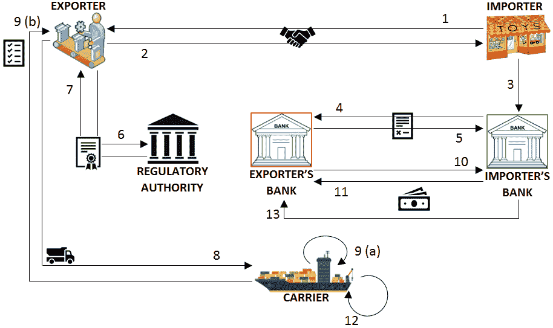
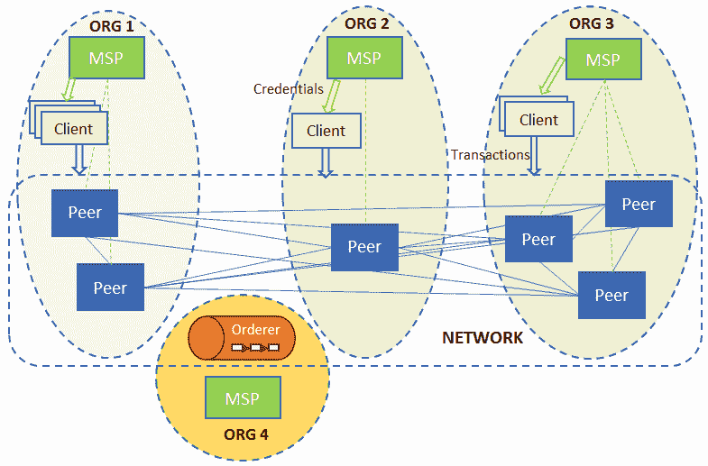

# 用业务场景搭建舞台

前两章的重点是设置舞台和定义区块链项目的景观。我们现在理解了技术如何在业务框架内工作，以及各种 Hyperledger 项目如何旨在解决时间和信任的问题。

了解了组成 Hyperledger Fabric 的组件后，我们现在将深入研究应用程序设计和实施注意事项。接下来的几章将带您完成创建您自己的智能契约，然后将其集成到应用程序中的步骤。

为了使这些练习具有相关性，我们将利用一个源于一些古老文明的业务用例:交易和信用证。

本章的目标是介绍信用证的业务概念，引导您完成我们选择的示例场景，并通过设置我们的开发环境来结束。

在本章中，我们将:

*   探索信用证
*   回顾我们简化的业务场景
*   设置我们的开发环境

# 贸易和信用证

让我们回到历史上这样一个时代:商人穿越各大洲，从一个国家购买布料，然后在另一个国家销售。作为一名佛罗伦萨羊毛商人，你可能会去阿姆斯特丹旅行，在那个新成立的城市国家购买优质羊毛，那里的港口收集了来自整个北欧及更远地区的资源。然后你可以把羊毛运到佛罗伦萨，卖给裁缝，为他们富有的客户制作精美的服装。我们谈论的是公元 1300 年——在那个时代，携带黄金或其他贵金属作为一种货币形式来买卖商品是不安全的。我们需要的是一种跨越国界的货币形式，一种可以在阿姆斯特丹、佛罗伦萨或任何地方使用的货币形式！

马可·波罗到过中国，看到了在那个繁荣的经济中商业是如何进行的。成功的可汗帝国的核心是我们今天会认识到的先进的金融技术。法定货币、纸币、本票和信用证都是通过中国到达欧洲的。马可·波罗将这些理念带回了欧洲——他们帮助罗马帝国衰落后崛起的欧洲形成并发展了商业银行业。

# 信任在促进贸易中的重要性

我们的佛罗伦萨商人现在可以联系他的银行，说他想在阿姆斯特丹购买羊毛，作为回报，银行会给他一份信用证，以换取分期付款。这封信可以有各种各样的规定，比如交易的最大金额，如何支付(一次或部分)，可以用于什么商品，等等。商人现在将前往阿姆斯特丹，在从羊毛商那里挑选羊毛后，他将提供信用证或信用作为付款。阿姆斯特丹的商人会很乐意用羊毛来交换这封信，因为佛罗伦萨的银行家在金钱方面是出了名的值得信赖。阿姆斯特丹商人可以把信用证交给他的银行，银行会把信用证存入他们的账户。当然，佛罗伦萨和阿姆斯特丹的银行家向他们各自的客户——商人——收取服务费！这对每个人都有好处。

阿姆斯特丹的银行家和佛罗伦萨的银行家会定期会面结算账目，但这对羊毛商人来说并不重要。实际上，佛罗伦萨和阿姆斯特尔的商人正在利用他们各自的银行家之间的信任来建立相互之间的信任关系——这是一个非常复杂的想法。这就是为什么信用证流程至今仍是全球开展业务的基本方式。

# 今天的信用证流程

然而，随着时间的推移，由于贸易的大规模全球化和金融行业的爆炸，参与信用证流程的金融机构数量呈爆炸式增长！如今，可能有 20 多家金融中介机构参与这一过程。这需要许多人和系统的协调，导致商家和银行在整个过程中花费过多的时间、成本和风险。

区块链的承诺是提供一个逻辑上单一但物理上分布式的系统，为低摩擦的信用证流程提供一个平台。这种系统的特点包括更高的透明度、及时性和自动化程度(从而降低成本)，以及诸如递增付款等新功能。

# 业务场景和用例

国际贸易包括表明现实世界过程中的低效率和不信任的各种情况，区块链旨在减轻这些情况。因此，我们选择了一个进出口场景中的一个元素，在现实世界中执行交易的简化版本，作为我们在接下来几章中实际练习的典型用例。

# 概观

我们将描述的场景涉及一个简单的交易:从一方到另一方的商品销售。由于买卖双方居住在不同的国家，这种交易很复杂，因此没有一个共同的可信任的中介来确保出口商得到他所承诺的钱，进口商得到货物。当今世界的这种贸易安排依赖于:

*   促进支付和货物实物转移的中介
*   随着时间的推移而演变的流程，使出口商和进口商能够对冲风险，降低风险

# 真实世界的过程

便利支付的中间人是出口商和进口商各自的银行。在这种情况下，交易安排是通过银行与其客户之间以及两家银行之间的信任关系来实现的。这类银行通常需要维护国际关系和声誉。因此，进口商银行向出口商银行付款的承诺(或许诺)足以触发该流程。在获得出口国政府的监管许可后，出口商通过一家知名的国际承运商发送货物。

向承运人交付的证明足以结清从进口商银行到出口商银行的付款，并且这种结清并不取决于货物到达其预定目的地(假定货物在运输途中被保险损失或损坏)。进口商银行向出口商银行付款的承诺规定了作为发货证明所需的单据清单，以及立即或在一段时间内付款的确切方法。出口商在获得允许他们将货物交给承运人的文件许可之前，必须满足各种监管要求。

# 简化和修改的流程

我们的用例将遵循前面过程的简化版本，并做了一些变化来展示区块链在促进这种交易中的价值。进口商银行分两次向出口商银行做出付款承诺。出口商从监管机构获得清关证书，将货物交给承运人，然后获得收据。收据的出示触发了从进口商银行到出口商银行的第一笔分期付款。当货物到达目的港时，进行第二笔也是最后一笔分期付款，流程结束。

# 贸易金融和物流术语

以下术语用于指代在我们的交易场景中使用的某些工具和人工制品。我们将在本章中构建的应用程序使用这些工具的非常简化的形式:

*   信用证:正如我们在本章开始时所看到的，这是指银行承诺在提交货物已经装运的证明文件后向出口商付款。简称为**信用证**，这份单据是由进口商的银行应其客户:进口商的要求出具的。信用证规定了构成装运证明的单据清单、要支付的金额以及该金额的受益人(在我们的情况下是出口商)。以下截图显示了一份信用证样本:


我们将在用例中引入一些小的变化，以使读者能够理解这个工具。首先，信用证将开给出口商的银行，而不是直接开给出口商。第二，信用证规定将分两次相同的付款，第一次在出示两份单据后付款，第二次在货物到达目的地后付款。

*   **出口许可证**:出口国监管机构对特定货物装运的批准。在本书中，我们将简称为 E/L。下面的屏幕截图展示了一个示例 E/L:


*   **提单**:这是承运人在占有货物后向出口商签发的一份文件。简称为 B/L，它同时充当收据、迫使承运人将货物运输到指定目的地并收取费用的合同以及货物的所有权。该文件也列在信用证中，并作为装运证明，将自动触发支付结算。以下屏幕截图展示了一份提单样本:


# 共享流程工作流

本章介绍的测试用例场景的每一个实例都需要很长一段时间来完成，涉及不同时间不同实体集合之间的交互，并且有许多不同的难以跟踪的移动部分。我们希望使用我们的工作流程来简化这一过程。在区块链上实施后，以下步骤中描述的交易序列(如下图所示)可以以不可撤销和不可否认的方式执行。在这一系列事件中，我们假设一个直截了当的、线性的叙述，各方彼此一致，没有任何不愉快的事情发生；在流程中建立防护只是为了捕捉错误。

我们工作流中的事务如下:

1.  进口商向出口商要求货物以换取金钱
2.  出口商接受交易
3.  进口商要求其银行开立以出口商为受益人的信用证
4.  进口商的银行向出口商提供信用证，并向后者的银行付款
5.  出口商的银行代表出口商接受信用证
6.  出口商向监管机构申请信用证
7.  监管机构向出口商提供信用证
8.  出口商准备一批货物并交给承运人
9.  承运人在确认 E/L 后接受货物，然后向出口商提供提单
10.  出口商银行要求进口商银行支付一半的货款
11.  进口商的银行将一半的金额转到出口商的银行
12.  承运人将货物运送到目的地
13.  进口商银行向出口商银行支付剩余金额

下图解释了交易工作流程:



# 共享资产和数据

前一个工作流中的参与者必须有一些共同的信息，使他们能够在任何给定的时刻看到交易安排及其进展。

以下是参与者拥有的资产表，这些资产相互共享，以推动流程从一个阶段进入下一个阶段。这包括单据和货币资产:

| **资产类型** | **资产属性** |
| 信用证 | ID、签发日期、到期日期、签发人、受益人、金额和单据列表 |
| 提货单 | ID、发货人(出口商)、收货人(进口商)、通知方(进口商的银行)、收货和交货地点、货物描述和运费金额 |
| 出口许可证 | ID、发行日期、到期日期、受益人、许可证持有者和商品描述 |
| 支付 | 以标准货币单位表示的金额 |

以下是限定每个阶段参与者可用选项的数据元素:

| **数据类型** | **数据属性** |
| 贸易协定 | 进口商要求，出口商接受 |
| 信用证 | 由进口商要求，由进口商银行出具，并由出口商银行承兑 |
| 出口许可证 | 出口商要求并由监管机构发布 |
| 装运 | 由出口商准备，由承运人接受，以及当前位置或地点 |

# 参与者的角色和能力

在我们的场景中有六类参与者:出口商、进口商、出口商银行、进口商银行、承运人和监管机构。这个集合中的术语指的是一个实体在交易中可以承担的角色；例如，在一种情况下出口货物的公司在另一种情况下可能是进口商。下表还详细列出了每个角色的功能和限制:

*   只有进口商可以申请信用证
*   只有进口商的银行可以提供信用证
*   只有出口商的银行可以接受信用证
*   只有出口商可以申请信用证
*   只有监管机构可以提供信用证
*   只有出口商可以准备装运
*   只有承运人可以提供提单
*   只有承运人可以更新装运地点
*   只有进口商的银行可以汇款，只有出口商的银行可以收款

# 区块链应用程序优于当前真实流程的优势

在没有保障措施(如可信赖的中间人)的情况下，转移货物或付款所固有的风险激发了银行的参与，并导致信用证和提单的产生。这些流程的后果不仅仅是额外的成本(银行收取签发信用证的佣金)或额外的管理费用。申请和等待出口许可证也增加了周转时间。在理想的贸易场景中，只有准备和运输货物的过程需要时间。最近，采用 SWIFT 报文传送取代人工通信提高了文件申请和收集流程的效率，但这并没有从根本上改变游戏规则。另一方面，区块链凭借其(几乎)即时的交易承诺和保证担保，开启了以前不存在的可能性。

例如，我们在用例中引入的一个变化是分期付款，这不能在遗留框架中实现，因为没有保证的方式来了解和共享关于装运进度的信息。在这种情况下，这种变化被认为风险太大，这就是为什么付款完全与书面证据挂钩。通过让一个区块链的贸易协定的所有参与者实施一个共同的智能合同，我们可以提供一个共享的事实来源，将风险降至最低，同时增加问责制。

在后续章节中，我们将详细演示如何在 Hyperledger Fabric 和 Composer 平台上实现我们的用例。读者将能够欣赏实现的简单性和优雅性，然后可以将其用作其他应用程序的指南，以使用这一令人兴奋的新技术来改造其陈旧的流程。然而，在开始编写代码之前，我们将看看 Hyperledger 网络的设计，并设置我们的开发环境。

# 设置开发环境

正如您现在已经知道的，Hyperledger Fabric 区块链的一个实例被称为通道，它是以加密的安全方式相互链接的事务的日志。要设计和运行区块链应用程序，第一步是确定需要多少个通道。对于我们的交易应用程序，我们将使用一个通道，它将维护不同参与者之间进行的交易的历史。

一个 Fabric peer 可能属于多个通道，从应用程序的角度来看，这些通道相互之间是不相干的，但是它们帮助单个 peer 代表其所有者(或客户端)在不同的应用程序中运行事务。一个渠道可以运行多个智能合约，每个智能合约可以是一个独立的应用程序，也可以在多合约应用程序中链接在一起。在本章和本书中，为了简单起见，我们将带领读者完成单通道、单契约应用程序的设计。依靠本书以及 Fabric 文档中提供的信息，由读者来设计更复杂的应用程序。

在我们深入研究设置我们的系统以安装应用程序并在我们的智能合约上运行交易的机制之前，我们将描述如何创建并启动将安装应用程序的网络。本章将使用一个样本网络结构来说明交易操作(在[第 9 章](09.html)、*区块链网络中的生活*中，您将看到这个样本网络如何随着需求的变化和发展而修改)。

# 设计网络

为应用程序确定 Hyperledger Fabric 网络结构的第一步是列出参与组织。从逻辑上讲，组织是一个安全域，是一个身份和凭据单元。它管理一个或多个网络对等体，并依赖于一个**成员资格服务提供商** ( **MSP** )为对等体以及智能合约访问特权的客户端颁发身份和证书。订购服务是结构网络的基础，通常被分配给自己的组织。下图说明了典型的对等网络结构，包括客户端、MSP 和逻辑组织分组。

批准交易(或调用)的标准是背书策略(我们将在本章后面重新讨论)。它是根据参与应用程序网络的组织而设计的，而不是对等体本身:



图 3.1:区块链网络，其对等点分布在各个组织中，客户端从组织获取凭证以提交对链代码的查询和调用

必须预先决定对等体的集合、它们所属的组织以及为每个组织服务的成员资格服务提供者，以便可以在那些机器上安装和运行适当的服务。

我们的示例贸易网络将由四个组织组成，分别代表出口商、进口商、承运商和监管者。后两者分别代表运营商和监管机构。然而，出口商组织代表出口实体及其银行。同样，进口商组织代表进口实体及其银行。从安全性和成本的角度来看，将实体及其信任方分组到一个组织中是有意义的。运行 Fabric peer 是一项繁重且成本高昂的任务，因此对于可能拥有更多资源和大量客户的银行来说，代表自己和客户运行这样的 peer 就足够了。交易实体以客户的身份获得提交交易或从其组织读取分类帐状态的权利。因此，我们的区块链网络需要四个对等体，每个对等体属于不同的组织。除了同行，我们的网络由四个组织中的每一个组织的一个 MSP 和一个以 solo 模式运行的订购服务组成。

在生产应用程序中，订购服务应该设置为 Zookeeper 上的 Kafka 集群，但是为了演示如何构建区块链应用程序，订购服务可以被视为黑盒。

订购服务属于它自己的独立组织，有一个 MSP。下图显示了我们交易网络中的组织及其 MSP、同行和客户:


图 3.2:一个贸易网络，在他们各自的组织中有同行、订购者和客户

读者可能想知道，如果交易方和其银行属于同一个组织，应用程序如何区分这两者(出口商和出口商的银行，进口商和进口商的银行)，以便控制对智能合同和分类帐的访问。实现这一点的两种方式如下:

*   The access control logic (which we will describe later in this chapter) is embedded in the middleware and application layer, so that users can be distinguished by their id (or login name), and the access control list that maps id to allowed chain code functions is maintained.
*   MSP, which owns an organization, acts as a CA server and embeds distinguishing attributes in its certificates issued to members of the organization. Access logic can be implemented in middleware or even chain code to resolve attributes and allow or disallow operations according to application policies. These mechanisms are not implemented in our application, where banks and customers are indistinguishable from each other for the smart contract and middleware layer. But readers may take this as an exercise. For those who are good at developing secure client-server applications, it should be simple.

# 安装先决条件

有了网络设计，让我们安装必要的工具:

1.  确保您拥有最新版本的:
    *   码头工人使用[https://docs.docker.com/install/](https://docs.docker.com/install/)
    *   坞站-使用:https://docs . docker . com/compose/install/合成

2.  我们将使用 GitHub 来分享我们教程的源代码。要访问 GitHub，需要安装 Git 客户端并配置 GitHub 的身份验证。如需了解更多信息，请访问 GitHub 官方网站[https://help.github.com/articles/set-up-git/](https://help.github.com/articles/set-up-git/)。

3.  安装业务网络所需软件示例:[https://hyperledger . github . io/composer/latest/installing/installing-prereqs](https://hyperledger.github.io/composer/latest/installing/installing-prereqs)。
    上面的说明是针对 Mac 和 Linux 的。请注意，在使用 Windows 时，我们建议使用类似于 vagger 的解决方案，在虚拟机中运行开发环境。
4.  Fabric 是用 Go 语言实现的。请注意:
    *   Go 在语法上类似于 C++
    *   我们还将使用 Go 来编写链码
    *   Go 可以从[https://golang.org/](https://golang.org/)安装

Note that the setup of Hyperledger Fabric and testing of the tutorial application in this book was done using Go 1.9, so the reader is advised to install and use 1.9 or a higher version

5.  接下来，我们需要设置我们的环境变量。

`GOPATH`指向`go`源代码的工作区，例如:

```
         $ export GOPATH=$HOME/go 
```

`PATH`需要包含用于存储库和可执行文件的 Go `bin`目录，正如我们在下面的代码片段中看到的:

```
         $ export PATH=$PATH:$GOPATH/bin 
```

6.  验证您的系统上是否安装了`make`。在 Debian/Ubuntu 系统上，你可以使用`sudo` `apt-get install make`来安装它。

# 分叉和克隆贸易-金融-物流知识库

现在，我们需要通过派生 GitHub 上的存储库来获得原始源代码的副本。然后，我们可以通过以下步骤将源代码克隆到本地机器目录中:

1.  **在 GitHub 中，导航到以下资源库**:[https://GitHub . com/hyperledger handson/trade-finance-logistics](https://github.com/HyperledgerHandsOn/trade-finance-logistics)
2.  **派生存储库**:使用页面右上角的 Fork 按钮为您的帐户创建一个源代码副本

3.  **获取克隆 URL** :导航到您的 trade-finance-logistics 存储库分支。点击克隆或下载按钮，并复制网址
4.  **克隆存储库**:在 Go 工作区中，如下克隆存储库:

```
$ cd $GOPATH/src 
$ git clone https://github.com/YOUR-USERNAME/trade-finance-logistics
```

我们现在有了所有贸易-金融-物流教程材料的本地副本。

# 创建和运行网络配置

配置和启动我们网络的代码可以在我们存储库的 network 文件夹中找到(这是对[fabric-samples/first-network](https://github.com/hyperledger/fabric-samples/tree/master/first-network)的改编)。在本练习中，我们将在一台物理机或虚拟机上运行整个网络，各种网络元素在适当配置的 Docker 容器中运行。假设读者对使用 Docker 的容器化和使用 Docker-compose 的配置有基本的了解。一旦满足了前一节中列出的先决条件，就足以运行该节中的命令，而不需要读者具备任何额外的知识或配置。

# 准备网络

要构建 Fabric 和 Fabric-CA，如果缺少某些依赖项，您可能需要安装它们。这些库包括`gcc`、`libtool`和`ltdl`库。(在 Ubuntu Xenial 系统上，所有必要的先决条件都可以通过运行`sudo apt-get install libltdl-dev`来安装。留给读者去寻找其他系统上的等同物)。在生成网络加密材料之前，我们需要执行以下步骤。

The tutorial application was developed on Hyperledger Fabric version 1.1, so you will need to fetch and build components for that version.

1.  克隆 Fabric(【https://github.com/hyperledger/fabric/tree/release-1.1】T4)源代码库。如果您正在使用`git clone`命令，添加参数`-b release-1.1`。确保克隆的`fabric`文件夹在`$GOPATH/src/github.com/hyperledger/`中存在，或者被象征性地链接。当您尝试构建 Fabric 时，它会在此路径中查找库。

2.  运行`make docker`为同行和订购者构建 Docker 映像
3.  运行`make configtxgen cryptogen`生成必要的工具来运行本节描述的网络创建命令
4.  克隆 Fabric-CA(【https://github.com/hyperledger/fabric-ca/tree/release-1.1】T4)源代码库。(如果您正在使用`git clone`命令，添加参数`-b release-1.1`。确保克隆的`fabric-ca`文件夹在`$GOPATH/src/github.com/hyperledger/`中存在，或者被象征性地链接。当您尝试构建 Fabric-CA 时，它将在此路径中查找库。
5.  运行`make docker`为 MSP 构建 Docker 映像

# 生成网络加密材料

网络配置的第一步包括为每个对等方和订购方组织的 MSP 以及基于 TLS 的通信创建证书和签名密钥。我们还需要为每个对等节点和订购节点创建证书和密钥，以便能够相互通信以及与它们各自的 MSP 通信。这个配置必须在我们代码库中的`network`文件夹中的`crypto-config.yaml`文件中指定。该文件包含组织结构(参见后面的 channel artifacts configuration 一节中的更多细节)、每个组织中的对等体数量，以及组织中必须为其创建证书和密钥的默认用户数量(注意，默认情况下会创建一个`admin`用户)。例如，参见文件中进口商组织的定义，如下所示:

```
PeerOrgs:
- Name: ImporterOrg
  Domain: importerorg.trade.com
  EnableNodeOUs: true
  Template:
    Count: 1
  Users:
    Count: 2
```

该配置表明标记为`ImporterOrg`的组织将包含一个对等体。还将创建两个非管理员用户。还定义了对等方要使用的组织域名。

要为所有组织生成加密材料，运行`cryptogen`命令，如下所示:

```
cryptogen generate --config=./crypto-config.yaml
```

输出被保存到`crypto-config`文件夹。

# 产生信道伪像

为了根据组织的结构创建一个网络，并引导一个渠道，我们将需要生成以下工件:

*   起源块，包含用于初始化结构区块链的组织特定证书。
*   通道配置信息。
*   每个组织的锚定对等配置。锚定对等体充当组织内的支点，用于使用 Fabric gossip 协议的跨组织分类帐同步。

像`crypto-config.yaml`文件一样，通道属性在一个标记为`configtx.yaml`的文件中指定，在我们的源代码中，这个文件可以在`network`文件夹中找到。我们贸易网络的高级组织可以在`Profiles`部分找到，如下所示:

```
Profiles:
  FourOrgsTradeOrdererGenesis:
    Capabilities:
      <<: *ChannelCapabilities
    Orderer:
      <<: *OrdererDefaults
      Organizations:
        - *TradeOrdererOrg
      Capabilities:
        <<: *OrdererCapabilities
    Consortiums:
      TradeConsortium:
        Organizations:
          - *ExporterOrg
          - *ImporterOrg
          - *CarrierOrg
          - *RegulatorOrg
  FourOrgsTradeChannel:
    Consortium: TradeConsortium
    Application:
      <<: *ApplicationDefaults
      Organizations:
        - *ExporterOrg
        - *ImporterOrg
        - *CarrierOrg
        - *RegulatorOrg
      Capabilities:
        <<: *ApplicationCapabilities
```

正如我们所看到的，我们将要创建的通道被命名为`FourOrgsTradeChannel`，它是在概要文件中定义的。参与该通道的四个组织被标记为`ExporterOrg`、`ImporterOrg`、`CarrierOrg`和`RegulatorOrg`，每个组织指的是在`Organizations`部分中定义的一个子部分。订购者属于自己的组织`TradeOrdererOrg`。每个组织部分包含有关其 MSP 的信息(ID 以及加密材料的位置，如密钥和证书)，以及其锚定对等体的主机名和端口信息。例如，`ExporterOrg`部分包含以下内容:

```
- &ExporterOrg
  Name: ExporterOrgMSP
  ID: ExporterOrgMSP
  MSPDir: crypto-config/peerOrganizations/exporterorg.trade.com/msp
  AnchorPeers:
    - Host: peer0.exporterorg.trade.com
    Port: 7051
```

如您所见，本规范中的`MSPDir`变量(代表一个文件夹)引用了我们之前使用`cryptogen`工具生成的加密材料。

为了生成通道工件，我们使用了`configtxgen`工具。要生成 genesis 块(将在网络引导期间发送给订购方)，从`network`文件夹运行以下命令:

```
configtxgen -profile FourOrgsTradeOrdererGenesis -outputBlock ./channel-artifacts/genesis.block
```

`FourOrgsTradeOrdererGenesis`关键字对应于`Profiles`部分中的配置文件名。创世纪程序块将被保存在`channel-artifacts`文件夹的`genesis.block`文件中。若要生成通道配置，请运行以下代码:

```
configtxgen -profile FourOrgsTradeChannel -outputCreateChannelTx ./channel-artifacts/channel.tx -channelID tradechannel
```

我们将创建的通道命名为`tradechannel`，其配置存储在`channel-artifacts/channel.tx`中。要为导出者组织生成锚点对等配置，请运行:

```
configtxgen -profile FourOrgsTradeChannel -outputAnchorPeersUpdate ./channel-artifacts/ExporterOrgMSPanchors.tx -channelID tradechannel -asOrg ExporterOrgMSP
```

应该对其他三个组织重复相同的过程，同时在前面的命令中更改组织名称。

为了让`configtxgen`工具工作，环境变量`FABRIC_CFG_PATH`必须设置为指向包含`configtx.yaml`文件的文件夹。脚本文件`trade.sh`(我们将在后面使用)包含以下代码行，以确保`YAML`文件是从运行命令的文件夹中加载的:

`export FABRIC_CFG_PATH=${PWD}`

# 在一个操作中生成配置

为了方便起见，`trade.sh`脚本被配置为使用前面描述的命令和配置文件来生成通道工件以及加密材料。只需在`network`文件夹中运行以下命令:

```
./trade.sh generate -c tradechannel
```

尽管您可以在这里指定任何通道名称，但是请注意，本章后面用于开发中间件的配置将依赖于该名称。

The `GOPATH` variable is set to `/opt/gopath` in the container that runs the peer.

# 构建一个样本贸易网络

最后一个命令还具有生成网络配置文件`docker-compose-e2e.yaml`的作用，该文件用于使用 docker-compose 工具启动作为一组 Docker 容器的网络。文件本身依赖于静态配置的文件`base/peer-base.yaml`和`base/docker-compose-base.yaml`。这些文件共同指定服务及其属性，使我们能够在 Docker 容器中一次性运行它们，而不必在一台或多台机器上手动运行这些服务的实例。我们需要运行的服务如下:

*   一个结构对等体的四个实例，每个组织一个
*   订购的织物的一个实例
*   一个结构 CA 的五个实例，对应于每个组织的 MSP

每个的 Docker 图片可以从 Docker Hub 上的 Hyperledger 项目(【https://hub.docker.com/u/hyperledger/】)获得，图片分别是`hyperledger/fabric-peer`、`hyperledger/fabric-orderer`、`hyperledger/fabric-ca for peers`、`orderers`和 MSPs。

对等体的基本配置如下(见`base/peer-base.yaml`):

```
peer-base:
image: hyperledger/fabric-peer:$IMAGE_TAG
environment:
  - CORE_VM_ENDPOINT=unix:///host/var/run/docker.sock
  - CORE_VM_DOCKER_HOSTCONFIG_NETWORKMODE=${COMPOSE_PROJECT_NAME}_trade
  - CORE_LOGGING_LEVEL=INFO
  - CORE_PEER_TLS_ENABLED=true
  - CORE_PEER_GOSSIP_USELEADERELECTION=true
  - CORE_PEER_GOSSIP_ORGLEADER=false
  - CORE_PEER_PROFILE_ENABLED=true
  - CORE_PEER_TLS_CERT_FILE=/etc/hyperledger/fabric/tls/server.crt
  - CORE_PEER_TLS_KEY_FILE=/etc/hyperledger/fabric/tls/server.key
  - CORE_PEER_TLS_ROOTCERT_FILE=/etc/hyperledger/fabric/tls/ca.crt
working_dir: /opt/gopath/src/github.com/hyperledger/fabric/peer
command: peer node start
```

可以在这里设置 Fabric 配置参数，但是如果您为`fabric-peer`使用预构建的 Docker 映像，默认值足以启动并运行对等服务。运行对等服务的命令在配置的最后一行被指定为`peer node start`；如果您希望通过下载 Fabric 源代码并在您的本地机器上构建它来运行一个对等体，这是您必须运行的命令(例如，参见 [*第 4 章*](04.html) ，*使用 Golang* 设计数据和事务模型)。还要确保使用`CORE_LOGGING_LEVEL`变量适当地配置日志记录级别。在我们的配置中，变量被设置为`INFO`，这意味着只记录信息、警告和错误消息。如果您希望调试一个对等体并需要更广泛的日志记录，您可以将这个变量设置为`DEBUG`。

在`network`文件夹的`.env`文件中，变量`IMAGE_TAG`被设置为最新的，尽管如果你想提取旧的图像，你可以设置一个特定的标签。

此外，我们需要为每个对等体配置主机名和端口，并将生成的加密材料(使用`cryptogen`)同步到容器文件系统。导出方组织中的对等方在`base/docker-compose-base.yaml`中的配置如下:

```
peer0.exporterorg.trade.com:
  container_name: peer0.exporterorg.trade.com
  extends:
    file: peer-base.yaml
    service: peer-base
  environment:
    - CORE_PEER_ID=peer0.exporterorg.trade.com
    - CORE_PEER_ADDRESS=peer0.exporterorg.trade.com:7051
    - CORE_PEER_GOSSIP_BOOTSTRAP=peer0.exporterorg.trade.com:7051
    - CORE_PEER_GOSSIP_EXTERNALENDPOINT=peer0.exporterorg.trade.com:7051
    - CORE_PEER_LOCALMSPID=ExporterOrgMSP
  volumes:
    - /var/run/:/host/var/run/
    - ../crypto-config/peerOrganizations/exporterorg.trade.com/peers/peer0.exporterorg.trade.com/msp:/etc/hyperledger/fabric/msp
    - ../crypto-config/peerOrganizations/exporterorg.trade.com/peers/peer0.exporterorg.trade.com/tls:/etc/hyperledger/fabric/tls
    - peer0.exporterorg.trade.com:/var/hyperledger/production
  ports:
    - 7051:7051
    - 7053:7053
```

如`extends`参数所示，这扩展了基本配置。注意，ID ( `CORE_PEER_ID`)与在`configtx.yaml`中为这个对等体指定的 ID 相匹配。这个身份是在导出组织中运行的对等体的主机名，将在本章后面的中间件代码中使用。volumes 部分表示将`crypto-config`文件夹中生成的加密材料复制到容器中的规则。对等服务本身监听端口`7051`，客户端可以用来订阅事件的端口被设置为`7053`。

在该文件中，您将看到容器内端口在对等体之间是相同的，但是被映射到主机上的不同端口。最后，注意这里指定的 MSP ID 也与`configtx.yaml`中指定的相匹配。

订购者服务的配置是类似的，如下面来自`base/docker-compose-base.yaml`的片段所示:

```
orderer.trade.com:
  container_name: orderer.trade.com
  image: hyperledger/fabric-orderer:$IMAGE_TAG
  environment:
    - ORDERER_GENERAL_LOGLEVEL=INFO
  ……
  command: orderer
  ……
```

如代码所示，启动订购者的命令只是简单的`orderer`。日志级别可以使用`ORDERER_GENERAL_LOGLEVEL`变量进行配置，在我们的配置中被设置为`INFO`。

我们将运行的实际网络配置基于一个名为`docker-compose-e2e.yaml`的文件。该文件不存在于存储库中，而是由命令`./trade.sh generate -c tradechannel`创建的，我们之前运行该命令来生成通道和加密材料。这个文件依赖于`base/docker-compose-base.yaml`(并间接依赖于`base/peer-base.yaml`)，通过检查文件内容可以看出这一点。它实际上是从一个名为`docker-compose-e2e-template.yaml`的模板`YAML`文件创建的，你可以在`network`文件夹中找到它。模板文件包含变量，作为使用`cryptogen`生成的关键文件名的替代。当生成`docker-compose-e2e.yaml`时，这些变量名被替换为`crypto-config`文件夹中的实际文件名。

例如，考虑`docker-compose-e2e-template.yaml`中的`exporter-ca`部分:

```
exporter-ca:
  image: hyperledger/fabric-ca:$IMAGE_TAG
  environment:
    ……
    - FABRIC_CA_SERVER_TLS_KEYFILE=/etc/hyperledger/fabric-ca-server-config/EXPORTER_CA_PRIVATE_KEY
  ……
  command: sh -c 'fabric-ca-server start --ca.certfile /etc/hyperledger/fabric-ca-server-config/ca.exporterorg.trade.com-cert.pem --ca.keyfile /etc/hyperledger/fabric-ca-server-config/EXPORTER_CA_PRIVATE_KEY -b admin:adminpw -d'
```

现在，看看生成的文件`docker-compose-e2e.yaml`中的相同部分:

```
exporter-ca:
  image: hyperledger/fabric-ca:$IMAGE_TAG
  environment:
    ……
    - FABRIC_CA_SERVER_TLS_KEYFILE=/etc/hyperledger/fabric-ca-server-config/ cc58284b6af2c33812cfaef9e40b8c911dbbefb83ca2e7564e8fbf5e7039c22e_sk
  ……
  command: sh -c 'fabric-ca-server start --ca.certfile /etc/hyperledger/fabric-ca-server-config/ca.exporterorg.trade.com-cert.pem --ca.keyfile /etc/hyperledger/fabric-ca-server-config/cc58284b6af2c33812cfaef9e40b8c911dbbefb83ca2e7564e8fbf5e7039c22e_sk -b admin:adminpw -d'
```

如您所见，在环境变量和命令中，变量`EXPORTER_CA_PRIVATE_KEY`都被替换为`cc58284b6af2c33812cfaef9e40b8c911dbbefb83ca2e7564e8fbf5e7039c22e_sk`。如果您现在检查`crypto-config`文件夹的内容，您会注意到在`crypto-config/peerOrganizations/exporterorg.trade.com/ca/`文件夹中存在一个名为`cc58284b6af2c33812cfaef9e40b8c911dbbefb83ca2e7564e8fbf5e7039c22e_sk`的文件。该文件包含导出组织的 MSP 私有(秘密)签名密钥。

前面的代码片段包含示例运行的结果。每当您运行加密材料生成工具时，密钥文件名都会发生变化。

现在让我们更详细地看看 MSP 的配置，以出口组织 MSP 为例，如`docker-compose-e2e.yaml`中所述:

```
exporter-ca:
  image: hyperledger/fabric-ca:$IMAGE_TAG
  environment:
    - FABRIC_CA_HOME=/etc/hyperledger/fabric-ca-server
    - FABRIC_CA_SERVER_CA_NAME=ca-exporterorg
    - FABRIC_CA_SERVER_TLS_ENABLED=true
    - FABRIC_CA_SERVER_TLS_CERTFILE=/etc/hyperledger/fabric-ca-server-config/ca.exporterorg.trade.com-cert.pem
    - FABRIC_CA_SERVER_TLS_KEYFILE=/etc/hyperledger/fabric-ca-server-config/cc58284b6af2c33812cfaef9e40b8c911dbbefb83ca2e7564e8fbf5e7039c22e_sk
  ports:
    - "7054:7054"
  command: sh -c 'fabric-ca-server start --ca.certfile /etc/hyperledger/fabric-ca-server-config/ca.exporterorg.trade.com-cert.pem --ca.keyfile /etc/hyperledger/fabric-ca-server-config/cc58284b6af2c33812cfaef9e40b8c911dbbefb83ca2e7564e8fbf5e7039c22e_sk -b admin:adminpw -d'
  volumes:
    - ./crypto-config/peerOrganizations/exporterorg.trade.com/ca/:/etc/hyperledger/fabric-ca-server-config
  container_name: ca_peerExporterOrg
  networks:
    - trade
```

将在 MSP 中运行的服务是`fabric-ca-server`，它监听端口`7054`，使用使用`cryptogen`创建的证书和密钥进行引导，并使用在`fabric-ca`映像中配置的默认登录和密码(分别为`admin`和`adminpw`)。启动 Fabric CA 服务器实例的命令是`fabric-ca-server start …`，正如您在前面的代码中看到的。

如前面的配置所示，对等体和 ca 被配置用于基于 TLS 的通信。读者必须注意，如果 TLS 在一个中被禁用，那么它在另一个中也必须被禁用。

此外，通过检查`docker-compose-e2e.yaml`可以观察到，我们没有为订购者的组织创建结构 CA 服务器(和容器)。对于我们将在本书中完成的练习，为订购者静态创建的管理员用户和凭证就足够了；我们不会动态注册新的订购者组织用户，因此不需要结构 CA 服务器。

# 网络组件的配置文件

我们已经演示了如何在 docker-compose YAML 文件中配置对等方、订购方和 ca。但是这种配置意味着覆盖已经在组件各自的图像中默认进行的设置。虽然对这些配置的详细描述超出了本书的范围，但是我们将列出各自的文件，并提到用户如何对它们进行更改。

对于对等体来说，`core.yaml`文件([https://github . com/hyperledger/fabric/blob/release-1.1/sample config/core . YAML](https://github.com/hyperledger/fabric/blob/release-1.1/sampleconfig/core.yaml))包含所有重要的运行时设置，包括但不限于地址、端口号、安全性和隐私以及 gossip 协议。您可以创建自己的文件，并使用自定义的`Dockerfile`将它同步到容器中，而不是默认情况下由`hyperledger/fabric-peer`图像使用的那个。如果您登录到一个正在运行的对等容器(让我们从我们刚刚启动的网络中取出出口组织的对等容器):

```
docker exec -it f86e50e6fc76 bash
```

然后你会在文件夹`/etc/hyperledger/fabric/`中找到`core.yaml`文件。

类似地，订购者的默认配置位于一个`orderer.yaml`文件中([https://github . com/hyperledger/fabric/blob/release-1.1/sample config/order er . YAML](https://github.com/hyperledger/fabric/blob/release-1.1/sampleconfig/orderer.yaml))，该文件也同步到运行`hyperledger/fabric-orderer`映像的容器上的`/etc/hyperledger/fabric/`。请记住，`core.yaml`和`orderer.yaml`文件都被同步到对等容器和订购者容器，因此如果您希望创建定制文件，您将需要将这些 YAML 文件同步到这两个容器。

Fabric CA 服务器也有一个名为`fabric-ca-server-config.yaml`([http://hyperledger-Fabric-CA . readthe docs . io/en/latest/server config . htm](http://hyperledger-fabric-ca.readthedocs.io/en/latest/serverconfig.htm))的配置文件，该文件同步到运行`hyperledger/fabric-ca`镜像的容器上的`/etc/hyperledger/fabric-ca-server/`。您可以创建和同步定制配置，就像您为对等方或订购方所做的那样。

# 启动一个样本贸易网络

现在我们已经有了网络的所有配置，以及运行网络所需的通道工件和加密材料，我们需要做的就是使用`docker-compose`命令启动网络，如下所示:

```
docker-compose -f docker-compose-e2e.yaml up
```

如果您愿意，您可以将它作为后台进程运行，并将标准输出重定向到一个`log`文件。否则，您将在控制台上看到各种容器的启动和日志显示。

请注意，在某些操作系统配置中，设置 Fabric 可能会很棘手。如果遇到问题，请查阅文档。在[https://hyperledger-Fabric . readthe docs . io/en/release-1.1/samples . html](https://hyperledger-fabric.readthedocs.io/en/release-1.1/samples.html)中提供了关于如何安装光纤网络的详细描述和示例。

也可以使用我们的 trade.sh 脚本在后台启动网络；只需运行:

```
./trade.sh up
```

从不同的终端窗口，如果您运行`docker ps -a`，您将看到如下内容:

```
CONTAINER ID    IMAGE    COMMAND    CREATED    STATUS    PORTS    NAMES
4e636f0054fc    hyperledger/fabric-peer:latest    "peer node start"    3 minutes ago    Up 3 minutes    0.0.0.0:9051->7051/tcp, 0.0.0.0:9053->7053/tcp    peer0.carrierorg.trade.com
28c18b76dbe8    hyperledger/fabric-peer:latest    "peer node start"    3 minutes ago    Up 3 minutes    0.0.0.0:8051->7051/tcp, 0.0.0.0:8053->7053/tcp    peer0.importerorg.trade.com
9308ad203362    hyperledger/fabric-ca:latest    "sh -c 'fabric-ca-se..."    3 minutes ago    Up 3 minutes    0.0.0.0:7054->7054/tcp    ca_peerExporterOrg
754018a3875e    hyperledger/fabric-ca:latest    "sh -c 'fabric-ca-se..."    3 minutes ago    Up 3 minutes    0.0.0.0:8054->7054/tcp    ca_peerImporterOrg
09a45eca60d5    hyperledger/fabric-orderer:latest    "orderer"    3 minutes ago    Up 3 minutes    0.0.0.0:7050->7050/tcp    orderer.trade.com
f86e50e6fc76    hyperledger/fabric-peer:latest    "peer node start"    3 minutes ago    Up 3 minutes    0.0.0.0:7051->7051/tcp, 0.0.0.0:7053->7053/tcp    peer0.exporterorg.trade.com
986c478a522a    hyperledger/fabric-ca:latest    "sh -c 'fabric-ca-se..."    3 minutes ago    Up 3 minutes    0.0.0.0:9054->7054/tcp    ca_peerCarrierOrg
66f90036956a    hyperledger/fabric-peer:latest    "peer node start"    3 minutes ago    Up 3 minutes    0.0.0.0:10051->7051/tcp, 0.0.0.0:10053->7053/tcp    peer0.regulatororg.trade.com
a6478cd2ba6f    hyperledger/fabric-ca:latest    "sh -c 'fabric-ca-se..."    3 minutes ago    Up 3 minutes 0.0.0.0:10054->7054/tcp    ca_peerRegulatorOrg
```

我们有四个对等体、四个 MSP 和一个订购者运行在不同的容器中。我们的贸易网络已经准备好运行我们的应用程序了！

要查看给定容器的运行日志，请记下容器 ID(前面列表中的第一列),只需运行:

```
docker logs <container-ID>
```

要关闭网络，您可以使用 docker-compose 命令:

`docker-compose -f docker-compose-e2e.yaml down` 
或我们的`trade.sh`脚本:

`./trade.sh down`

# 摘要

在这一章中，我们介绍了业务用例，我们的后续章节将利用它来围绕我们将要编写的代码创建一个上下文。我们还部署了第一个 Hyperledger 结构网络，现在已经从理论过渡到实践。干得好！

接下来的章节将从两个角度带您了解区块链应用程序的开发:(1)使用 chaincode 和 Fabric SDK 的基础 API)使用 Hyperledger Composer 的业务网络实现。

通过这两个视角，我们希望让您了解该解决方案的灵活性以及在正确的环境中利用每个工具的能力。为了准备下一章，你现在应该使用`./trade.sh` down 来停止你的网络。