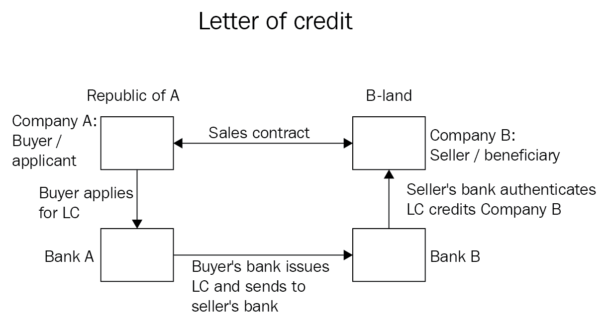
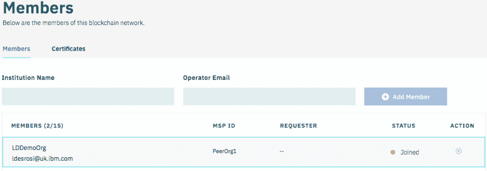
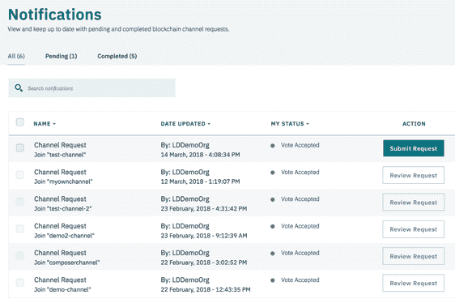
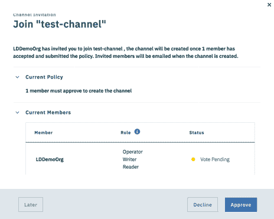

# 治理，受监管行业的必然之恶

对于那些经历过没有明确决策过程的项目的人来说，你会感受到由于各种利益相关者的影响，决策不断被质疑和修改的痛苦。政治成为障碍，项目的目标最终受到挑战，预算被削减，长期愿景缺失或令人困惑。

虽然这是你可以从传统的 IT 项目中预料到的，但是区块链项目的特点是有更多的利益相关者。一个典型的商业网络将由有时竞争有时合作的组织组成。在这种情况下，不难看出，发现相互冲突的观点、观点和利益的风险很高。

无论您是开发人员还是 CIO，了解您可以从这样的项目中期待什么，以及治理模型如何帮助缓解一些问题，可能有助于您为即将到来的事情做好准备。

本章将介绍我们在各种行业中看到的一些模式，并探讨这些区块链商业网络是如何形成的，以及基本的治理模式是如何运作的。

本章将介绍以下主题:

*   什么是治理？
*   各种商业模式
*   企业网络中的治理角色
*   典型的治理结构和阶段
*   要考虑的角色和流程
*   治理对 IT 解决方案的影响

# 权力下放和治理

你们中的一些人可能想知道为什么我们要在区块链的书里讨论治理。毕竟，区块链网络不应该是去中心化的，从而防止单一实体的控制吗？虽然从技术角度来看这是事实，但现实是我们是人，企业级区块链网络要取得成功，在网络的整个生命周期中需要做出许多决策。

即使是比特币这种去中心化、匿名、无许可的网络，也必须处理重要而艰难的决定。一个恰当的例子是围绕比特币块大小的争议。在比特币的早期，对块大小设置了 1 MB 的限制。随着网络规模的扩大，这个限制变得很成问题。提出了许多建议，但需要整个比特币节点达成共识，这使得改变难以达成一致。这场争论始于 2015 年，但社区不得不等到 2018 年 2 月才部分采用部分解决方案 SegWit。我们之所以说是部分的，是因为 **SegWit** (代表**隔离见证**)只是通过将签名从事务有效负载中分离出来来缓解这个问题，从而允许在一个块中包含更多的事务——通过大量的讨论和交流来达成部分答案。

此外，考虑到区块链商业网络是为了在一个并非所有参与者都完全信任对方的环境中创造信任。他们将如何就如何管理网络达成共识？

知道会有冲突和不同的观点，我们如何解决这个问题？我们需要一个流程，让每个关键组织的重要决策者都参与进来。需要就参与者同意遵循并尊重其结果的过程达成基本一致。我们需要一种方法来治理网络——我们需要治理。

那么，治理是关于决策的吗？不完全是。治理就是提供一个指导决策过程的框架。它通过提供角色和责任的清晰描述来做到这一点，并确保有达成和传达决策的一致过程。

我们已经以通用的方式讨论了决策，但是什么类型的决策需要通过治理过程来管理呢？我们将在*角色和流程*部分正确地回答这个问题，但是现在，可以说，与资金、功能路线图、系统升级和网络扩展相关的一切都是治理流程应该涵盖的关键主题。

业务和 IT 治理是已经详细讨论过的主题。因此，您会发现许多 IT 治理标准旨在定义一个经过验证的结构来指导 IT 行业内的实践。这些标准的几个例子是:

*   **信息技术基础设施库** ( **ITIL** ) : ITIL 主要关注 IT 如何为业务提供服务，并致力于定义支持 IT 服务管理的流程模型，本质上是将 IT 服务表达为它们带来的业务利益的函数，而不是底层的技术细节。
*   **信息和相关技术的控制目标** ( **COBIT** ):该标准分为治理和管理两部分。COBIT 的治理部分关注于确保通过围绕评估、指导和监控过程的一系列控制目标来满足企业目标。

在任何情况下，标准方法总是需要调整和适应业务模型和环境。

# 探索商业模式

商业模型关注于创建一个描述组织如何在市场中创造和获取价值的流程的结构。

在商业网络的背景下，观察价值链并理解价值来源是很有趣的。从金融角度来看，是什么让区块链网络如此吸引人？正如我们在第一章*[中看到的，区块链——企业和行业视角](01.html)*，区块链技术提供了一个解决时间和信任问题的机会，从而降低了低效率和运营成本。

# 区块链的好处

解决时间和信任问题能带来什么样的好处？在接下来的几节中，让我们看几个例子，看看在哪里以及如何实现这些好处。

# 供应链管理

供应链由许多角色组成，从生产商到物流服务提供商、港务局、制造商，最后是消费者。该行业必须应对各种各样的法规，尽管不同组织之间有许多数据交换，但不可能获得单一版本的事实。

供应链中缺乏信任源于这样一个事实，即许多相关组织担心数据可能会泄露给竞争对手。这又转化为以下问题:

*   **能见度**:我的订单在哪里？我的集装箱在哪里？没有透明度，制造商的预测就会受到影响，并可能导致生产延迟。
*   **管理开销**:数据需要多次键入，需要人工操作，并且需要一个核对过程来检测错误。
*   **争端**:无法获得共同的信息来源导致不同行为者的看法存在差异，从而将这些差异转化为争端。
*   **调查**:作为争议的结果，多方必须努力收集事实并解决问题。

在这种情况下，分散的许可分类账意味着可以实时跟踪每份订单和每批货物，同时防止竞争对手访问敏感信息。这一模式将有助于消除重复的数据输入，减少人为错误，并加快调查，因为每笔交易的来源都可以很容易地证明。

考虑到全球经济，不难想象潜在的节约。想象一下这样一个世界，其中有一个通过许可分类账管理的单一真相来源，所有相关行为者都可以访问这些信息，我们可以看到这将给整个供应链带来的直接好处。

# 卫生保健

医疗保健行业有大量可以探索的用例，包括药品供应链、临床试验和电子健康记录。我们将关注最后一个用例，因为它更贴近我们的内心(字面上)。

电子健康记录的前景一直很吸引人，乍一看好处似乎很多:

*   **患者病史的完整视图**:通过消除纸质记录的固有重复，患者应该能够及时获得更准确的诊断和更连贯的长期护理
*   **减少重复**:无论是不同医生要求的重复检查，还是每个诊所和医院都必须保留其记录的事实，都有可能浪费医疗系统的资源
*   **防止欺诈行为**:无论是流氓诊所的重复记账还是开假药，在许多情况下，记录的重复会为滥用创造机会

虽然好处似乎显而易见，但现有电子健康记录项目的经验教训似乎暗示了一个事实，即这些项目成本高昂，而且可能不会立即带来预期的好处。一些研究发现:

*   数字化记录患者/医生会话给医生带来了额外的工作
*   电子健康记录系统增加了 IT 开支
*   必须在变革管理和培训方面付出更多努力

自那以后，最近的研究表明，从长远来看，这种解决方案往往会有正的投资回报(大约需要五年才能实现收益)。

考虑到技术的广泛/标准化应用带来的价值和好处，以及许多国家的医疗网络，不难看出这种努力充满了政治复杂性。

区块链网络能改善这个长期以来被吹捧为集中技术创新的主要领域吗？虽然从技术上讲，我们可以设想一个优雅的区块链解决方案，让诊所和医院加入网络来访问患者的记录，但真正的挑战可能在于治理吗？

# 金融-信用证

到这本书的这一点，你应该熟悉信用证的概念。但是，让我们快速回顾一下其背后的概念，如下图所示:

信用证是一种支付工具，根据买方的要求，银行将向卖方签发信用证，声明只要符合条款和条件，就将付款。虽然这一过程在国际贸易中根深蒂固，但信用证的使用是一个非常古老的过程，它可以追溯到第一次十字军东征，当时圣殿骑士需要找到一种方法，允许朝圣者前往耶路撒冷，而没有携带现金的危险。

今天的信用证过程是一个复杂的过程。虽然示例通常涉及两家银行，但现实情况是，在这样的网络中会有更多的参与者。这转化为一个成本高昂的过程，并受到执行时间的限制。

区块链网络可以创造优化流程的机会；在区块链网络中，信用证存储在分类账中，这可以防止重复支出的情况，即信用证的所有者可能试图再次兑现它。

好处是通过减少时间延迟和成本来衡量的，但它也提供了减少与此类交易相关的潜在风险的主要好处。最后，银行现在也可以考虑引入新的服务，比如向卖家进行增量支付的能力。

分类账上的交易是最终的，这一事实使得这种情况对银行很有吸引力。它还使我们能够从一个较小的网络开始，获得早期价值，并随着解决方案的成熟而扩展，从根本上减少了建立网络所需的早期协调工作。

# 从利益到利润

无论市场或商业模式如何，投资回报必须满足以下公式:

*Value created by blockchain - Network operation cost > 0*

本质上，有了正回报，出于共同的商业利益，一个网络级的商业模式就可以出现了。显然，我们的目标是实现价值最大化和成本最小化，从而获得更高的利润。不难理解，当网络能够提供高利润时，组织会蜂拥到网络中，渴望加入。也就是说，除非这种商业模式以牺牲多数人为代价来支持少数人。

因此，选择一个公平且适合大多数成员的商业模式将是网络成败的决定性因素。

# 网络商业模式

现在让我们来看看迄今为止使用的各种商业模式:

*   创始人主导的网络
*   基于联合体的网络
*   基于社区的网络
*   混合模型

我们将在接下来的章节中讨论这些模型。

# 创始人主导的网络

在许多有效的情况下，创始人领导的网络是有价值的，我们将很快介绍这些情况。一个正常的创始人领导的网络将具有以下架构:

然而，我们首先要提出一个警告:创始人主导的网络不应该成为避免与潜在网络参与者进行艰难商业讨论的方式。

从我们在这个领域工作的时间来看，我们已经开始与那些真正相信区块链网络价值的组织进行互动，但是对于分散网络控制权的想法感到不知所措。他们最终创建了一个路线图，他们的初始阶段是深入技术，将业务讨论推迟到后续阶段。最终结果通常是在方正基础设施中托管一个结构网络，通过 API 网关公开网络。在某些情况下，它甚至不向参与者提供不同的身份(即私钥和证书)。这里的风险是，尽管该解决方案在技术上是可行的，但它无法根据区块链网络的原则提供价值。

这并不是说组织不应该采用创始人领导的方法和分阶段的路线图，但是在网络建立的早期获得潜在参与者的认可是很重要的，以避免缺乏采用或大量的返工工作。

以下类型的组织通常利用创始人领导的网络:

*   初创公司:他们往往对自己的行业有独特的看法，并带来创新和新鲜的想法。他们的商业模式通常面向为行业提供增值服务。虽然创新可能会推动他们获得行业认可，但他们的成功取决于信誉和资金。
*   **行业领袖**:从他们的行业角度来看，他们有足够的影响力来建立自己的关系网。他们得到供应商和其他组织的支持，来定义议程和要支持的用例。
*   部门间区块链项目:这种模式最初可能不符合商业模式的标准，因为它旨在服务于组织内部协调的目的，但在这里提出它的原因是这些项目是超越组织边界的良好候选。

作为网络的创始成员，这些组织有机会确定网络的政策和重点。在网络上取得成功的组织会获得领导地位，并有希望获得网络的价值。

然而，这些优势也带来了需要说服其他组织加入的风险。他们还承担投资资本的全部负担，以启动项目并获得交付解决方案所需的专业知识。如果其他行业领导者在加入之前要求变更，他们还面临着大量返工的风险。

# 基于联合体的网络

联合体是两个或多个组织的组合，具有通过业务网络实现的共同业务目标。该网络的架构如下:

这些组织通常处于同一行业或密切相关的行业。关键是他们的联合来自于他们过程中的协同水平和通过联盟合作的共同/共享利益。

财团的一个重要特征是每个成员都保留其法律实体和地位。通过创建财团，他们通常会签订合同和法律协议，以指导将愿景变为现实所需的治理、活动和投资。

我们对创始人和成员进行了区分，因为前者通常会面临与采用创始人主导的网络模式的组织类似的情况。他们将面临与创始人领导的网络类似的问题、风险和利益，但他们将通过扩大行业参与来抵消风险。随着其他组织的加入，联盟创始人也可以选择将网络货币化。

此外，财团成员可能享有税收优惠，有助于改善行业的监管状况，并发出更有影响力的声音。然而，他们也面临着潜在的责任和违约风险，其中一个创始人可能无法像其他创始人那样做出同等水平的贡献。

# 基于社区的网络

基于社区的网络本质上是一个由志同道合的组织组成的非正式联盟。它们共同形成了一个商业生态系统，旨在促进不同行业之间的合作，以创造新的商业机会。该网络的架构如下:

在这种模式下，解决方案可能演变成一个市场，每个成员都可以提供增值服务。这种模式的力量来自于隐含的自由结构和最好的想法浮出水面的自由。这是自然支持分散网络和治理概念的最佳模型。然而，如果其成员的贡献没有很好地协调，并且潜在的责任被忽略，它可能遭受与财团相同的问题。

# 混合模型

商业模式不是一成不变的，会随着时间的推移而演变。因此，虽然一个网络可能从一个社区开始，但可以想象它会发展成一个联合体。此外，这些模型中的任何一个都可以从我们将要讨论的两个混合模型中受益。

# 合资企业

在合资企业模式中，一些组织同意成立一个共同拥有的新法人实体。每个组织都可以贡献资金和股权，收入和运营费用由各方共享。合资企业的控制权在于组成合资企业的各方，而不在于合资企业本身。

# 新闻集团

新的公司模式基本上类似于合资企业模式，但完全是从企业或财团中分离出来的。这个**新公司** ( **新公司**)可以向促成其成立的各方提供服务；然而，利润和损失完全归新公司所有。

# 企业网络中的治理角色

回顾了各种业务模型后，我们可以看到每个参与者拥有的控制权会因模型而异。通过正确理解模型和各方的利益，我们可以创建对每个人都有意义的决策过程。

因此，虽然我们理解治理是关于达成决策的过程，但是治理过程应该管理和跟踪每一个业务、操作和技术决策吗？有些人会争辩说，只有重要的主题才应该被治理过程覆盖，但是什么是重要的主题呢？这就是治理模型的作用:定义每个决策域，并确保每个人都理解每个决策类别的仪式级别(即，形式主义和官方流程)。智能合同的错误修复可能不需要太多关注，但区块链技术的升级可能需要高度关注。事先就如何处理这些类别达成一致，将有助于当前和未来的参与者了解对他们的期望。

除了流程的复杂性之外，另一个需要考虑的问题是决策的集中化和分散化。分配决策权可能会使过程看起来公平，减少过度控制的风险，并鼓励自由思考，但这样做可能会延迟达成共识。

虽然这在社区驱动的网络环境中是有意义的，但在创始人主导的网络中行得通吗？

大概不会。如果创始人投入资本和资源，他们可能不想分享网络控制权。请记住，这不是一个绝对的规则。决策的关键程度将在应用的控制量中扮演重要角色。回到我们之前的智能合约错误修复的例子，可以预期何时部署的决策应该是分散的，但是实现下一个功能的决策应该是集中的。

下表显示了治理和业务模型之间的关系，以及(一般来说)业务模型将如何驱动治理结构。本质上，我们可以看到，在规模的两端，我们都有基于社区的网络，这往往是一种完全分散的业务模式，因此只能在分散的治理中生存:

试图集中治理可能会损害其存在，因为社区成员要么拒绝控制，要么推动建立一个财团。在光谱的另一端，我们有创始人领导的网络，其本质上倾向于保留对创始组织的控制。财团的商业模式往往是可变的，在很大程度上取决于其自身的个性。一个高度管制的行业可能需要同等程度的高度集中，以确保各方都遵守既定的标准。此外，一个财团可以通过实施规则或采用共识机制进行决策来实现分权治理。

为了结束我们对企业网络中的治理角色的研究，让我们快速地看一下企业网络需要解决的决策类型:

*   **会员生命周期**:与网络参与者的加入和退出过程相关的决策。
*   **资金和费用**:围绕网络资金来源的决策。这可能包括集中基础设施、公共服务、人员配备等领域。
*   **法规**:大多数行业都需要符合特定的法规，这些法规通常受地理位置的限制。此类别侧重于关键决策，以确保这些法规得到遵守和执行。
*   **教育**:就网络的使用和整合向成员和外部组织提供的培训水平做出决定。
*   **服务生命周期**:与 IT 组件相关的所有决策，涵盖如新智能合同的部署到系统更新等方面。
*   **争议**:因为争议几乎总是不可避免的，所以这些决定处理解决过程。

在下一节中，我们将深入这些领域并探究它们的复杂性。但是，值得注意的是，在每一类决策中，都需要在以下各项之间进行平衡:

*   成本与风险
*   竞争与合作
*   形式主义与敏捷性

# 业务领域和流程

在这一节中，我们将看看治理模型应该致力于解决的过程的范围。任何网络都应该考虑这些决策领域中的每一个，以避免糟糕的意外。并不是每个决策都需要受到正式流程的约束，但是考虑这些因素将会避免以后出现不好的意外。

# 会员生命周期

众所周知，区块链网络应该是完全分散的。因此，参与者的扩大是一件正常的事情，我们希望在一个健康的网络中看到。

但是，由于这是一个受规则和法规约束的企业级网络，因此在网络形成和新参与者入职期间，需要预先建立一些东西:

*   谁拥有邀请组织加入网络的特权？
    这应包括考虑谁可以提交创建新组织的提案，但也应包括考虑渠道级别的邀请。入职培训期间是否需要考虑隐私和保密限制？
*   组织需要满足的最低安全要求是什么？
    一个不能妥善保护其同事安全的组织将冒着暴露其分类账数据和泄露其私钥的风险。处理欺诈交易会导致混乱和痛苦的调查。清楚地阐明安全要求将有助于新参与者理解他们需要进行的投资水平。
*   参与者应该接受的标准合同协议有哪些？
    正如我们在前面章节中提到的，智能合同应被接受为网络内的法律，但这需要受到合同协议的约束，合同协议不仅要承认这一事实，还要说明参与者的期望和争议流程。
*   参与者需要遵守哪些 IT 服务级别协议？
    正如我们在 [*第八章*](08.html) ，*区块链网络中的敏捷性*中所看到的，就提升到智能合约的频率和集成层的隐式演进达成一致非常重要。这是一个示例，但从服务级别协议来看，还有其他方面，如可用性、性能和吞吐量，也会影响网络。

在启动过程中，组织需要部署自己的基础设施，将交易集成到自己的企业系统中，并在实际开始交易之前完成一轮测试。在参与者的网络生命周期中，管理机构可能会要求对参与者的基础设施进行一些审计，以证明其遵守了条款和条件。

一种经常被忽视的情况是组织脱离网络。可能有两个事件导致这种情况发生:

*   参与者对网络的兴趣发生了变化，他们不再想进行交易
*   违约或争议导致参与者被除名

无论原因是什么，如果没有针对此事件的规定，就可能存在与组织数据的所有权相关的问题。虽然交易数据是在法律协议的上下文中共享的，但是各方可能同意将分布式分类帐存储在每个人的对等端，但是一旦该协议终止，会发生什么呢？

# 资金和费用

网络不会自己运行。要开发智能合同，部署公共基础设施(例如，有序节点)，撰写法律协议，等等。

根据所选择的业务模型，这里将采用的模型会有很大的不同。创始人主导的网络可能会产生所有的融资成本，但反过来可能会收取费用，这不仅可以弥补成本，还可以产生利润。另一方面，社区驱动的网络可以选择让参与者支付这些公共要素的费用。

在任何情况下，治理不仅应该定义资金和费用结构，还应该考虑如何监控使用情况以及如何计费。

# 规章制度

这一领域在很大程度上取决于网络运营的行业和地理位置，但在这一层面，应该确定参与者应该遵守的合规性要求和法规。

一个很好的例子是最近生效的**通用数据保护条例** ( **GDPR** )。GDPR 是欧盟委员会提出的一项法规，旨在加强和巩固数据隐私规则。根据新法律，用户可以要求将他们的个人数据从任何组织中永久删除。忽略此类法规可能会导致智能合同保留个人信息，当收到擦除请求时，会给网络的所有参与者带来重大问题。

在这方面，重点应放在以下方面:

*   确定相关法规
*   审核智能合同和参与者(如果适用)以确保符合合规性

# 教育

这可能不适用于所有类型的商业模式。例如，社区驱动的模式可能选择不提供教育服务，让参与者自己管理，而创始人主导的网络可能决定投资于教育，以加快加入过程并更快地收回投资。

# 服务生命周期

服务生命周期专门处理网络的技术方面。从最初的设计和实施到网络的运行，需要预先考虑很多因素。

在网络的初始阶段，关键决策将包括以下领域:

*   设计权威和标准
*   数据治理
*   结构管理
*   密钥管理
*   测试流程

一旦网络为黄金时间做好准备，运营方面将很快浮出水面:

*   基础设施运营(网络、服务器、存储)
*   变更、升级、发布管理、维护
*   业务连续性计划、归档、备份
*   安全性、控制、策略实施
*   容量、可扩展性和性能
*   事件和问题管理

# 争论

没有人愿意考虑争议，就像他们不愿意考虑离开的过程一样；但是，定义一个解决这些争议的流程是很重要的。在这种情况下，治理应涵盖以下方面:

*   **提出不满**:这些问题应该在哪里提出？我们将在下一节中讨论治理结构，但是如果您在一个真正分散的模型中工作呢？你有论坛来提出这个问题吗？
*   调查:如何收集事实？如何记录该问题？如果智能合约交易的输出受到质疑，它(及其对应的客户)是否会从分类帐中提取出来？
*   **解决**:争端不会总是有好的结果，但是解决这些的过程是什么？是否有参与者的子集应该决定这个问题？这应该成为法律起诉吗？

# 治理结构

到目前为止，我们已经介绍了各种业务模型，研究了集中化与分散化的影响，并探索了各种决策，以及支持这些决策所需的角色和职责。

现在，我们将了解组织如何构建自己，以提供一种一致的方法来处理决策者根据其角色所关注的不同层次。

虽然集中式和分散式治理的表现看起来非常不同，但在实际应用中，还是存在灰色地带，一些功能可能是集中式的，而另一些是分散式的。同样，这在很大程度上与推动网络的商业模式和需求有关。

# 集中治理

虽然网络可能采用集中或分散的治理，但是每个组织也有自己的机制来控制谁来做决策。通常，组织将在内部依赖于集中式治理。这意味着我们不仅需要考虑网络治理，还需要考虑每个组织的结构，如下图所示:

在一个集中的模型中，决策倾向于自上而下的流动，只有在组织的较低层的未解决的问题才会渗透到高层。这创建了一个框架，其中有一个处理问题和愿景的明确流程，但没有为结构的变化留下多少空间。

在这个模型中，我们通常看到三个主要的治理层:

*   战略治理
*   运营治理
*   战术治理

下一小节将定义每一层，并探讨每一层的决策者类型。

# 战略治理

战略治理代表了决策金字塔的顶端。该治理层需要各种组织和业务单位的管理层支持，并负责确保愿景和战略与网络目标保持一致。它还应该专注于确保实现业务利益。

战略治理将侧重于以下方面:

*   创建共同的业务愿景
*   定义明确的任务和治理结构(利益相关方驱动)
*   为网络的优先事项制定议程
*   确保满足业务目标
*   发展和进化网络能力

# 运营治理

运营治理侧重于将愿景转化为具有满足网络要求的里程碑的计划。这通常包括业务涉众、主管、IT 架构师、法律顾问等等。

出于这些考虑，重点将放在以下方面:

*   定义所有权
*   制定和维护标准、隐私要求和法规
*   为服务和智能合约创建通用方法
*   管理定义业务和技术需求的通用方法
*   通用技术基础设施

# 战术治理

战术治理侧重于以网络运行和操作为中心的日常活动。在这一级，重点将放在网络的设计、构建和运行方面。它将包括来自业务、法律和技术团队的各种利益相关者。任务将包括以下内容:

*   强制执行标准
*   智能合同代码审查
*   部署规划
*   组织入职
*   安全审计
*   报告

# 分权治理

治理的分散化是为决策过程带来透明度和公平性的一种方式。请记住，每个组织都有自己的治理结构(三层)，这些治理机构需要就决策达成一致。考虑到每个组织的战略治理可能有不同的需求，这不是一个简单的任务。这意味着决策需要通过某种形式的共识——投票过程——来达成，这种共识是公平、透明的，并汇集了网络中每个组织的治理机构。

它还保留了与集中式网络相同的治理级别(战略、运营和战术)，但一切都将在开放的模式中进行，所有主题都将在社区电话/活动中讨论。在这种模式下，为确保适当的透明度，决策文件甚至更为重要。没有公开的审计线索，人们怎么能知道决策过程是公平的呢？

应该注意的是，虽然模型是分散的，并且可能更加轻量级/敏捷，但是正确地记录模型并看到参与者的认同同样重要。注意，去中心化并不意味着更容易。事实上，尽管分散式网络治理可能更符合区块链技术的本质，但它也带来了一些有趣的挑战。

例如，由于没有控制战略决策的中央机构，网络如何向一个共同的目标前进？如何避免硬接管或网络分裂？

当业务目标一致时，这样的模型将会工作得很好。然而，当一个公司的议程因为社区的大多数人投票支持不同的优先事项而被延迟时，这必然会产生紧张、争议和延迟。正如我们在比特币区块大小的辩论中看到的那样，达成共识需要时间，并为碎片化创造了机会。这并不是说解决方案在于一个集中的模型——事实上，类似的风险也存在于该模型中——但是分散模型的分散性质可能意味着参与者的业务目标更松散地耦合。

# 治理和 IT 解决方案

到目前为止，在这一章中，我们主要关注治理的人的方面。我们已经研究了业务模型对治理的影响、要考虑的业务流程以及各种潜在的结构，但是技术呢？治理模型对技术有什么影响，技术如何影响治理？

虽然区块链项目可能主要关注解决商业和企业问题，但基金会仍然依赖于技术。在本节中，我们将着眼于网络生命周期的主要阶段，从开始一直到运行，并了解这些活动是如何实现自动化并得到技术支持的。

我们将集中讨论登机的话题。如您所知，系统分类帐用于存储构成网络的组织、策略和渠道。将配置存储在分类帐中意味着任何修改都需要签名和批准。从审计的角度来看，这非常好，因为它为配置提供了区块链方法本身的特征:

*   **共识**:配置变更由网络成员根据定义的策略认可和验证。
*   **出处**:配置变更由变更的发起者和所有其他签署者签署，因此保留了变更的出处。
*   **不可变**:配置块一旦添加到区块链网络，就不能修改。需要后续事务来进一步改变配置。
*   **终结性**:由于交易被记录在系统分类账中，并被分发给网络的所有对等方，所以它提供了一个唯一且最终的位置来断言网络的配置。不需要查看配置文件来理解你的锚应该与哪个对等体通信。

虽然这是一个非常有价值的特性，但是它也有一定的复杂性。修改配置的高级过程如下:

1.  检索最新的配置块
2.  解码配置块并相应地改变配置
3.  对该块进行编码，并计算与前一块相比的增量/差值，以建立 RW 集
4.  签署交易并与其他参与者共享，以便他们可以根据网络策略签署交易
5.  将签名的交易提交回网络

这些步骤需要很好地理解 Hyperledger Fabric 的基础，以及跟踪和管理其他方签名的方法。鉴于其分散的性质，可能有许多不同的方面需要参与。这就是入职流程对合理规划如此重要的原因之一。

网络应确保尽早定义该流程和所需的自动化。虽然组织可以构建自己的解决方案，但他们也可以依赖预构建的解决方案。以 IBM 为例，IBM 区块链平台提供了简化网络治理的能力。在下一节中，我们将看看如何使用 IBM 区块链平台来完成入门。

# 受管登机

为了完成练习，您可以:

1.  **在这里注册 IBM Cloud**:【https://console.bluemix.net/ T2】
2.  **使用此链接向您的帐户添加 IBM 区块链平台服务**:
    [https://console.bluemix.net/catalog/services/blockchain](https://console.bluemix.net/catalog/services/blockchain)

应选择启动计划，读者应查看条款和条件以了解潜在成本。

由于网络是分散的，除非政策另有规定，否则邀请可以由网络的任何组织发出。

该流程从通过以下表单发出邀请开始，该表单可从仪表板的成员资格菜单中访问:

提交该表单后，系统将向新组织的操作员发送一个唯一的 URL。在后台，它还针对网络的根结构 ca 创建注册请求。

为了接受邀请，运营商在平台上注册，提供组织的名称，并且在接受邀请时，系统将根据定义的策略自动改变网络的配置，并且包括新组织的定义。从这个角度来看，新组织的操作员可以访问操作仪表板，并开始加入渠道和部署智能合同。该控制面板将类似于下面的屏幕截图:

操作仪表板

现在，由于网络上的所有交互都是允许的，平台提供了一种投票机制，允许参与者接受或拒绝更改，如下面的屏幕截图所示:

允许参与者接受或拒绝变更的投票机制

在这种情况下，当新组织被邀请加入渠道时，其他组织将投票决定是否接受修改。他们将能够在其通知门户中查看请求，并批准或拒绝请求，如以下屏幕截图所示:

审查请求

虽然 IBM 区块链平台有更多的优势和好处，但这里的目的是展示一种 IT 解决方案可以支持和促进与组织的加入相关的一些关键治理过程的方式。

# 摘要

在某种意义上，治理是业务网络中人的一面。它是关于人们如何走到一起，构建决策过程，以确保所有相关方要么被咨询，要么对决策负责。治理需要涵盖广泛的主题。

技术专家可能对这个话题没有其他人那么感兴趣，但是对这个话题有一个基本的了解对理解我们的工作环境是很有用的。

总而言之，在这一章中，我们已经探索了商业模式如何对治理产生深远的影响。使用这些模型，我们然后查看如何通过处理关键业务流程来派生满足业务需求的结构。我们已经看到了组织如何需要考虑集中式和分散式治理模型的方法。最后，我们了解到治理需要支持 IT 解决方案，但是反过来，IT 解决方案需要支持治理过程。

要记住的最后一点是，商业模式可能是不稳定的。虽然一项倡议可能从创始人领导的网络开始，但它可以发展成为一个财团或一个基于社区的项目。这一点很重要，因为虽然我们孤立地看待每个模型，但事实是它们必然会随着时间的推移而发展，但需要与网络提供的商业价值保持一致。