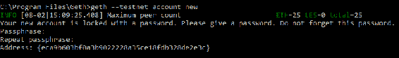
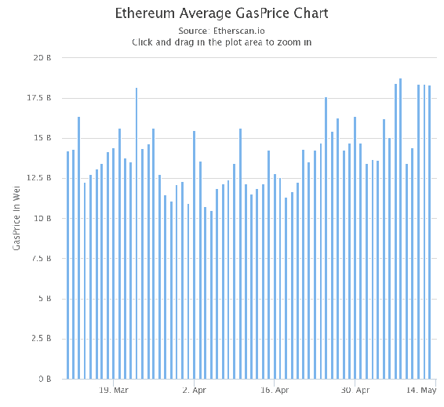
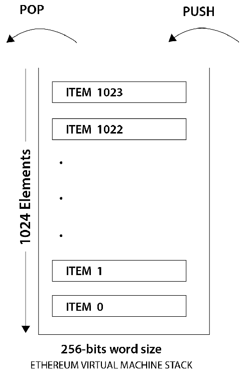
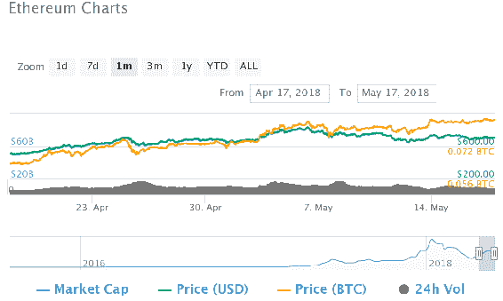

# 以太网 101

在前几章中，我们已经详细研究了区块链、比特币、替代加密货币和加密钱包。我们不仅讨论了基于货币的应用程序中区块链的使用和优势，还讨论了其他类似的领域。我们还讨论了比特币如何改变了区块链货币利益的使用格局，以及它如何塑造了全球经济。

在这一章中，我们将深入研究以太坊区块链。它是目前最大的社区支持的区块链项目，仅次于比特币，有支持者和各种项目和代币在其上运行。在本章中，我们将讨论以下主题:

*   以太坊账户
*   以太网
*   以太坊客户端，比如 Geth
*   以太坊区块链项目的执行环境
*   以太坊街区
*   以太坊虚拟机
*   在以太坊交易中使用气体
*   乙醚和乙醚采购方法

# 以太坊简介

以太坊是一个基于区块链的系统，具有特殊的脚本功能，允许其他开发人员在其上构建分散和分布式应用程序。以太坊在开发人员中最广为人知的是易于开发分散式应用程序。以太坊和区块链是有区别的。最重要的区别是以太坊区块链可以运行大多数分散的应用程序。

加密货币研究员和开发者 Vitalik Buterin 在 2013 年末提出了以太坊的概念。它是由 2014 年 7 月至 8 月间的一次众筹活动资助的。以太坊内置了图灵，一种完整的编程语言，也就是说，一种旨在解决任何计算复杂性的编程语言。这种编程语言被称为 Solidity，用于创建契约，帮助在以太坊上创建分散的应用程序。

以太坊于 2015 年 7 月 30 日上线，预挖掘了 1190 万枚硬币用于人群销售，以资助以太坊的发展。以太坊的主要内部加密货币被称为**以太**。它被缩写为 **ETH** 。

# 以太坊的组件

让我们讨论以太坊的一些通用组件，它的主要货币，网络，以及其他细节。这将有助于更好地理解以太坊，也有助于我们了解它与比特币有何不同，以及为什么它有一个庞大的社区，目前使其成为最重要的加密货币和区块链项目，仅次于比特币区块链。

# 以太坊账户

以太坊账户在以太坊区块链扮演着主要角色。这些帐户包含钱包地址以及其他详细信息。有两种类型的账户:**自有账户** ( **EOA** )，由私钥控制；以及**合同账户**、，由合同代码控制。

eoa 类似于比特币中用私钥控制的账户。合同账户有与之相关联的代码，以及一个私钥。一个外部拥有的帐户有一个余额，可以发送交易，以消息的形式，从一个帐户到另一个帐户。另一方面，合同账户可以有一个余额和一个合同代码。当合同账户接收到消息时，代码被触发以在内部存储器上执行读取或写入功能，或者向另一个合同账户发送消息。

# 以太网

两个以太坊节点只有拥有相同的 genesis 块和相同的网络 ID 才能连接。根据用途，以太坊网络分为三种类型:

*   **MainNet** :这是以太坊目前的直播网络；截至目前，MainNet 的最新版本名为**家园**。
*   TestNet :这用于测试目的，在合同部署到区块链之前，由开发人员测试智能合同和 DApps。TestNet 的最新版本叫做 **Ropsten** 。
*   **PrivateNet** :这是用来通过生成一个新的创世块来创建一个许可的区块链。

除了每种类型都有不同的起源块和网络 ID 之外，所有前述类型都是相同的；它们有助于区分各种合同帐户和外部拥有的帐户，如果任何合同运行不同的起源，则它们使用不同的网络 ID 来将其与其他合同帐户区分开来。

有一些以太坊官方使用的网络 id。合同帐户可以使用其余的网络 id。以下是一些已知的 id:

*   这是以太坊公共预发布测试网，它被称为奥林匹克项目。
*   **1** :这个 ID 是以太坊公共主网；它有许多版本:边疆，家园，和大都会。我们将在以后的章节中更多地讨论公共 MainNet。
*   **2** :这是初始测试网使用的 ID；2016 年末弃用。
*   这是在写这本书的时候最新的测试网。它于 2016 年底推出，因为旧的 Testnet 存在多个问题。
*   这是一个公共测试网，正在测试 PoA 共识。它被称为**林克比**。

# 以太坊公共主网

公共 MainNet 的网络 ID 为 1，但由于以太坊有一个非常活跃的社区支持它，所以以太坊区块链有各种更新和升级；以太坊网络主要有四个阶段:让我们详细讨论一下它们:

*   **前沿**:这是第一个官方公开的主网；它于 2015 年年中推出。
*   **家园**:这是 2016 年 3 月的重大升级之一。
*   这个升级阶段将会给区块链以太坊带来很多升级。此次升级将通过硬分叉实现，分为两个阶段，**拜占庭**和**君士坦丁堡**。
*   **宁静**:以太坊的这次发布将把共识从战俘转移到**利益证明** ( **位置**)。这实际上是为了降低以太网的功耗。

# Ethereum 客户端

客户端是以太坊区块链的实现；它们有各种各样的特点。除了拥有常规钱包之外，用户还可以观看智能合约、部署智能合约、清除多个以太账户、存储以太余额以及执行挖掘，以作为 PoW 共识协议的一部分。

有多种语言的各种客户端，一些由以太坊基金会正式开发，一些由其他开发人员支持:

*   **Geth** :基于围棋编程语言，有时也被称为**围棋以太坊**
*   **奇偶性**:基于 Rust 编程语言，由 Ethcore 开发
*   **CPP-以太坊**:基于 C++构建，由以太坊基金会正式开发
*   Pyethapp :基于 Python 编程语言，由以太坊官方开发
*   **ethereumjs-lib** :基于 JavaScript 编程语言
*   以太坊(j) :基于 Java 的客户端，由以太营开发
*   ruby-ethereum :基于 ruby 的客户端，由 Jan Xie 开发
*   ethereumH :基于 Haskell 的客户端，由 BlockApps 开发和维护

前面的列表包含了一些目前正在生产的最著名的以太坊专用客户端。除此之外，还有许多其他客户没有得到社区的大力支持，或者正处于开发阶段。现在让我们讨论最突出的以太坊客户端— **Geth** ，或者**go—以太坊**。

# Geth

这是构建在 Golang 上使用最广泛的以太坊客户端之一；它是一个命令行界面，用于运行一个完整的以太坊节点。它是 Frontier 版本的一部分，目前也支持 Homestead。Geth 可以允许其用户执行以下各种操作:

*   采矿乙醚
*   创建和管理帐户
*   在两个以太坊账户之间转移以太
*   创建、测试和部署智能合约
*   探索块历史

# 安装 Geth

可以在 Ubuntu 系统上使用以下命令安装 Geth:

```
sudo apt-get install software-properties-common
sudo add-apt-repository -y ppa:ethereum/ethereum
sudo apt-get update
sudo apt-get install ethereum
```

安装后，运行`geth account new`在您的节点上创建一个帐户。使用`geth --help`命令可以检查各种选项和命令。

在基于 Windows 的系统上，安装 Geth 要容易得多，只需从[https://geth.ethereum.org/downloads/](https://geth.ethereum.org/downloads/)下载最新版本，然后下载所需的`zip`文件，后解压`zip`文件，打开`geth.exe`程序。

# 管理账户

Geth 使用`account`命令提供帐户管理。Geth 上与帐户管理相关的一些最常用的命令如下:

```
COMMANDS:
 list Print summary of existing accounts
 new Create a new account
 update Update an existing account
 import Import a private key into a new account
```

以下屏幕截图是执行上述代码后生成的输出:



当我们运行创建新帐户的命令时，Geth 在我们的区块链上为我们提供了一个地址:

```
$ geth account new
Your new account is locked with a password. Please give a password. Do not forget this password.
Passphrase:
Repeat Passphrase:
Address: {168bc315a2ee09042d83d7c5811b533620531f67}
```

当我们运行`list`命令时，它提供了与定制密钥库目录相关联的帐户列表:

```
$ geth account list --keystore /tmp/mykeystore/
Account #0: {5afdd78bdacb56ab1dad28741ea2a0e47fe41331} keystore:///tmp/mykeystore/UTC--2017-04-28T08-46-27.437847599Z--5afdd78bdacb56ab1dad28741ea2a0e47fe41331
Account #1: {9acb9ff906641a434803efb474c96a837756287f} keystore:///tmp/mykeystore/UTC--2017-04-28T08-46-52.180688336Z--9acb9ff906641a434803efb474c96a837756287f
```

我们将在后面的章节中讨论采矿和合同开发。

# 以太网气体

以太坊区块链上的每个交易都需要覆盖计算成本；这是通过向交易发起者支付 *gas* 来实现的。事务执行的每个操作都有一定量的 gas 与之相关联。

每个事务所需的 gas 量直接取决于要执行的操作的数量——基本上，要覆盖整个计算。

简单地说，在以太坊区块链上进行的每一笔交易都需要用煤气来支付。汽油的最低价格是 1 威(乙醚的最小单位)，但这是根据各种因素增减的。下图显示了以太币气体的价格波动:



# 以太坊虚拟机

以太坊虚拟机 ( **EVM** )是一个简单的基于堆栈的执行机器，充当智能合约的运行时环境。EVM 的字长是 256 位，这也是每个堆栈项目的大小限制。堆栈的最大大小为 1024 个元素，工作于**后进先出****t****Out**(**LIFO**)队列系统。EVM 是一台图灵完全机器，但受到运行任何指令所需气体量的限制。气体充当具有计算信用的推进剂，这确保任何错误代码或无限循环不能运行，因为一旦气体耗尽，机器将停止执行指令。下图说明了 EVM 堆栈:



EVM 支持在出现异常的情况下，或者气体不足或指令无效的情况下进行异常处理。在这种情况下，EVM 会暂停并向执行节点返回一个错误。气体耗尽时的异常俗称**缺气**(**)异常。**

 **有两种类型的存储可供合同和 EVM:一种是内存，另一种被称为存储。内存的作用就像 RAM 一样，当代码完全执行时，它就会被清除。存储永久存储在区块链上。EVM 是完全隔离的，存储在存储或内存访问方面是独立的，如下图所示:


EVM 可直接访问的存储是**字数组**，它是非易失性的，是系统状态的一部分。程序代码存储在虚拟 ROM 中，可使用 **CODECOPY** 访问，它基本上将代码从当前环境复制到内存中。

# 执行环境

除了系统状态和 gas 之外，在执行环境中还需要各种其他元素和信息，其中执行节点必须提供给 EVM:

*   拥有执行代码的帐户的地址。
*   发起执行的事务的发送方地址。
*   执行的起始地址。
*   启动执行的交易的天然气价格。
*   输入数据或事务数据，取决于执行代理的类型。如果执行节点是一个事务，则事务数据作为输入数据包含在内。
*   启动代码执行的帐户或交易发送方的地址。如果发起是通过交易，则这是发送者的地址，否则是账户的地址。
*   成交金额——此金额以卫(乙醚的最小单位)为单位。如果执行代理是一个事务，那么它就是事务的值。
*   要执行的代码，表示为迭代器函数可以循环执行的字节数组。
*   当前块的块头。
*   正在执行的消息调用或协定创建事务的数量，即当前执行周期中正在执行的调用或创建的数量。

# 以太坊街区

以太坊区块链是所需参数的集合，类似于比特币区块链；以下是以太坊积木的主要元素:

*   块标题
*   交易列表
*   叔叔/叔叔的标题列表

# 块标题

块头是各种有价值信息的集合，它定义了以太坊区块链中块的存在。看一看以下内容:

*   **Parent hash** :父块头的 Keccak 256 位 hash。
*   **Ommers hash** :该块的 Ommers(叔伯)列表的 Keccak 256 位 hash。
*   **受益人**:160 位地址，该区块开采的所有费用都集中到该地址。
*   **状态根**:状态 trie 的根节点的 Keccak 256 位哈希。一旦所有交易都被处理和执行，它就被计算。
*   **事务根**:trie 结构根节点的 keccak 256 位哈希。事务 trie 表示该块中包含的事务列表。
*   **Receipts root** :这是 trie 结构根节点的 keccak 256 位散列。该 trie 由块中包含的所有交易的收据构成。每笔交易成功执行后都会生成收据。
*   **Logs bloom** :这是一个 bloom 过滤器，由日志地址和日志主题组成，这些日志主题来自块中包含的事务列表的每个事务收据的日志。
*   **难度**:这是每个方块的难度等级。这是通过前一个方块的难度和时间戳计算出来的。
*   **号**:这是前面块的总数；创世区块的数字是零。
*   **气体极限**:当前区块的气体消耗设定的极限。
*   **用气**:区块内交易消耗的总气量。
*   **时间戳**:这是块初始化时间的纪元 Unix 时间。
*   **额外数据**:该文件可用于存储与该块相关的任意数据。它的最大大小必须是 32 字节。
*   **Mixhash** :包含一个 256 位的 hash，与 nonce 结合；它用于证明消耗了足够的计算能力来挖掘块，这是 power 机制的一部分。
*   **Nonce** :这是一个 64 位散列，用于证明(与混合散列字段一起)已经花费了足够的计算工作来创建这个块。

下图显示了块头的结构:


# 叔叔或婶婶

以太坊激励矿工在开采一个矿块时，在一定限度内包括一个叔叔或叔叔的名单。虽然在比特币中，如果在同一高度开采一个区块，或者一个区块不包含交易，就被认为是无用的；以太坊就不是这样的。包括叔叔并让他们成为以太坊区块链的重要组成部分的主要原因是他们减少了 51%的攻击发生率，因为他们阻止了中央集权。

# 信息

消息是在两个帐户之间传递的数据和值。该数据包包含数据和值(乙醚量)。可以在合同账户或外部拥有的账户之间以交易的形式发送消息。

# Ethash

**Ethash** 是以太坊使用的**工作证明** ( **PoW** )算法。这是 Dagger-Hashimoto 算法的最新版本。它类似于比特币，尽管有一点不同——et hash 是一种内存密集型算法；因此，很难实现同样的 ASICs。Ethash 使用 Keccak 散列函数，该函数现在已经标准化为 SHA-3。

# 醚

**以太**是与以太坊区块链相关的主要加密货币；每个合约账户都可以创建自己的货币，但是在区块链以太坊内使用以太来支付在 EVM 上执行的合约。乙醚用于购气，以乙醚的最小单位作为气的单位。

因为卫是卫的最小单位，所以这里有一个表，列出了它们的面额和常用名称，以及相关的值:


# 采购乙醚

有多种方法可以获得以太网用于交易、构建智能合约或分散应用:

*   通过加入采矿池或单独采矿开采乙醚
*   使用加密交易平台进行交易，并与任何其他加密货币进行交易
*   从任何法定货币购买乙醚——有各种交易所允许从法定货币购买乙醚

# 贸易

由于其广泛的社区支持和重大的积极发展，以太一直是每个人的首选投资机会。有 500 多个已知的交易所支持其他加密货币或法定货币之间的以太交换。下面是一张价格图，显示了 2018 年 4 月 17 日至 2018 年 5 月 17 日乙醚价格的波动情况:



# 摘要

在这一章中，我们讨论了以太坊的各种组件、它的执行、网络和帐户，并对以太坊的客户端进行了详细的研究。我们还讨论了 gas 和 EVM，包括它的环境和执行过程如何工作。最后，我们讨论了以太坊块及其块头、以太坊算法和以太的采购。

在下一章，我们将学习 **Solidity** ，这是以太坊区块链网站上合同写作的官方标准语言。了解 Solidity 将有助于我们更好地理解智能合约的开发和部署。**