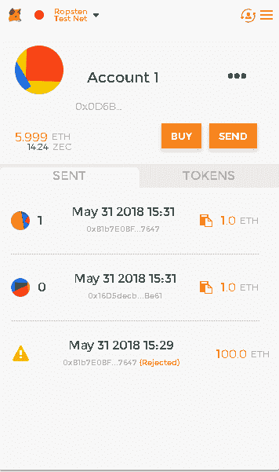

# 以太坊发展

在过去的几章中，我们学习了以太坊区块链，它的用途，以及它是如何塑造分散化技术的，不仅仅是基于货币的用途，还包括其他垂直行业。此外，我们还学习了使用智能合约在以太坊区块链之上进行开发。

在前一章中，我们讨论了 Solidity——以太坊基金会推出的编程语言。Solidity 是一种语言，它使得在以太坊区块链之上创建去中心化的应用成为可能，无论是用于创建另一个加密货币令牌，还是用于区块链可以发挥重要作用的任何其他用例。

在这一章中，我们将专门讨论以太坊的开发，也就是创建一个代表智能合约的令牌。我们将创造一种硬币或代币，在以太坊区块链平台上运行。我们将了解使用 Solidity 的令牌的开发、测试和部署，同时，我们将讨论智能合约开发阶段的重要方面，这将有助于在其他应用程序和行业中使用智能合约。

简而言之，我们将讨论以下主题:

*   准备智能合同开发
*   处理智能合同

# 介绍

在本章中，我们将继续在以太坊区块链上创建一个令牌。我们还将简要介绍 DApp 的发展，它将充分利用智能合同的潜力。以下是开发过程所需的工具列表:

*   **代码编辑器或 IDE** :就像上一章一样，挑选一个你用起来舒服的代码编辑器；在这一章，我们选择崇高的文本。虽然，官方在线的 IDE remix 也可以。
*   **以太坊钱包**:这是在 TestnNet 上部署和测试智能合约所必需的。
*   Solc 编译器(Solc compiler):这是为了编译一个智能合同，将 Solidity 语言代码转换成字节码，供 EVM 阅读。
*   Truffle 框架:这使得测试和部署智能合约变得更加容易。
*   **Web3** :这是一个 JavaScript 库，用来和以太坊节点通信；例如，我们的应用程序中有一个前端接口，供用户与区块链交互，然后`Web3`允许用户界面与部署在区块链上的合同交互。

# 准备智能合同开发

在我们深入开发智能合约以及进一步测试和部署程序之前，务必准备好工具和其他模块，并准备好有助于实现预期结果的开发流程。

# 再搅拌

**Remix** 是目前官方在线提供的 IDE 如果你在另一个 IDE 中感觉更舒服，你可以检查 Solidity 是否是一个受支持的语言，并开始使用相同的语言。以下是 Remix 的截图:


Remix 是一个全功能的在线 IDE，具有代码编译、运行、连接本地主机、在 GitHub 上发布代码等所需的特性。

第一次打开 Remix 时，加载`Ballot`合约。

# 迷雾重重

我们可以使用 Geth 运行测试节点，尽管在`TestNet`或`private net`中连接和挖掘以太的任务也可以使用官方以太坊客户端来完成，这是一个工作在 Geth 节点之上的 Mist 浏览器。

Mist 客户端具有各种功能，例如能够创建以太坊帐户以及与`MainNet`或`TestNet`连接。我们可以使用 Mist 在区块链部署或观看已经部署的合同。下面的截图展示了薄雾的样子:


# MetaMask

**MetaMask** 是以太坊钱包，也是以太坊浏览器。MetaMask 使我们能够通过网络浏览器与 DApps 和智能合约进行交互，而无需下载完整的以太坊区块链。它是 Chrome、Firefox 和其他浏览器的浏览器扩展。

它允许网站从区块链获取数据，也允许用户从扩展本身发送交易。有了 MetaMask，在浏览器中与以太坊 DApp 互动变得更加容易。以下截图是以太坊钱包的一个例子:



# 令牌标准

有了以太坊，可以创建分散的应用程序，我们还可以在以太坊区块链上发行代币。就像**比特币改进提案** ( **BIPs** ，GitHub 上托管的**以太坊改进提案** ( **EIPs** )网上有一个列表，这个可以在这里找到:[https://github.com/ethereum/EIPs](https://github.com/ethereum/EIPs)。EIP 20 在 2015 年底引入了新的令牌标准。这个令牌标准被称为 **ERC20** 。 *ERC* 代表**以太坊征求意见。** ERC 由社区开发者创作；提交社区和核心团队批准后，提案将成为标准。除了 ERC20 之外，还有其他各种标准，如 ERC223 和 ERC721。

必须遵循 EIP 中定义的方法，以便令牌可以成为 ERC20 令牌合约的一部分。

# ERC20 中的方法

下面是 ERC20 契约类型中指定的方法；重要的是遵循给定的方法/事件，以便合同可以在 ERC20 系列中。尽管这些规范中的一些是可选的，并不是必须有的。看看这个列表:

*   `name`:返回合同名称，例如:`BaToken`。
*   `symbol`:返回令牌的符号，例如:`BATN`。
*   `decimals`:返回令牌使用的小数位数，例如:18。
*   `totalSupply`:返回令牌的总供应量。这是一种强制性的方法。
*   `balanceOf(address _owner)`:返回地址为`_owner`的另一余额的账户余额。这是一种强制性的方法。
*   `transfer(address _to, unit256 _value)`:向地址`_to`发送`_value`金额的令牌。这是一种强制性的方法。
*   `transferFrom(address _from, address _to, uint256 _value)`:该方法将`_value`数量的代币从地址`_from`转移到地址`_to`。为了使智能协定成为有效的 ERC20 协定，必须在智能协定中包含此方法。
*   `approve(address _spender, uint256 _value)`:该方法允许地址`_spender`多次从给定账户中提款；它可以提取的最大金额是`_value`。也是强制的方法；建议首先将 allowance 设置为 0，以便不存在任何漏洞。
*   `allowance(address _owner, address _spender)`:返回`_spender`仍然可以从`_owner`中提取的金额。智能合约中必须有这个方法。
*   `event Transfer(address indexed _from, address indexed _to, uint256 _value)`:令牌转移时必须触发此事件，即使转移的令牌值为零。
*   `event Approval(address indexed _owner, address indexed _spender, uint256 _value)`:这个事件也是强制的，每当调用`approve`方法时都会被调用。

# Web3

`Web3.js`是 JavaScript 库；它可以通过连接到 HTTP 或 IPC 连接，通过 JSON RPC 调用与以太坊节点通信。`Web3.js`通过公开已经在 RPC 上启用的方法来工作。

使用以下命令通过`npm`安装`Web3`:

```
npm install web3
```

# 块菌框架

**Truffle** 是一个开发框架，使得测试和部署以太坊智能合约变得简单。Truffle 可以使用以下命令通过`npm`安装:

```
npm install -g truffle
```

Truffle 使用 Mocha 和 Chai 帮助编写合同和链接自动化测试框架。有了 Truffle，我们可以轻松地将合同部署到任何`estNet`、MainNet 或私有网络 ID。Truffle 在 DApp 中做任何事情，比如编译合同，将合同注入用户界面，以及测试检查漏洞。

# 加纳切

Ganache 是松露基金会推出的一款工具，用于测试区块链创建的以太坊。它有一个命令行界面，但需要时也有一个图形界面。下面的截图描述了 **Ganache** 工具:


# 处理智能合同

让我们深入研究创建智能合约的任务，以及在`TestNet`测试智能合约的过程。运行下面讨论的代码的最简单的方法是在 Remix 上。只需遵循以下步骤:

1.  当你在浏览器中打开 Remix 时，默认情况下，它会打开`ballot.sol`文件；您可以创建一个新文件并开始编辑您的第一个智能合同。看看这个:

```
pragma solidity ^0.4.24;

//This is a test comment, details about the contract can be added here
/*details like Total supply, contract address, Name, Symbol an decimals which will help someone knowing about the contract instead of finding these details within the source code 

*/

contract Gotham{

 string public name;    
    string public symbol;
    uint8 public decimals;
    //most suggested decimal places in 18
   uint256 public totalSupply;

}
```

2.  在前面的代码片段中，我们已经用 Solidity 版本 0.4.24 创建了一个名为`Gotham`的契约。现在让我们创建一个构造函数来初始化我们已经定义的变量。现在我们的`contract`代码应该是这样的:

```
contract Gotham{

    string public name;    
    string public symbol;
    uint8 public decimals;
    //most suggested decimal places in 18
    uint256 public totalSupply;

//Constructor

    constructor() public {
        symbol = "GOTH";         //This is the symbol of our Token
        name = "GothCoin";       //This is the name of our Token 
        decimals = 12;           /* These are the number of decimal places it can have,  it is suggested to have 18 decimal places */
        totalSupply = 100000;    //total supply of coins allowed 
        }

}
```

3.  现在，让我们将标准的 ERC20 方法添加到一个单独的契约中；这些都需要在以太坊智能合约中出现。看一下这段代码:

```
contract ERC20 {

     function totalSupply() public constant returns (uint);
     function balanceOf(address tokenOwner) public constant returns (uint balance);
     function allowance(address tokenOwner, address spender) public constant returns (uint remaining);
     function transfer(address to, uint tokens) public returns (bool success);
     function approve(address spender, uint tokens) public returns (bool success);
     function transferFrom(address from, address to, uint tokens) public returns (bool success);

     event Transfer(address indexed from, address indexed to, uint tokens);
     event Approval(address indexed tokenOwner, address indexed spender, uint tokens);
}
```

4.  此外，为了避免任何溢出或类似的问题，实现一些基本的数学函数是很重要的，这些函数具有适当的检查以避免任何函数溢出。以下是可以创建的合同:

```
contract Arithmetic {

   function Addition(uint a, uint b) public pure returns (uint c) {
        c = a + b;
        require(c >= a);
    }
    function Subtraction(uint a, uint b) public pure returns (uint c) {
        require(b <= a);
        c = a - b;
    }
    function Multiplication(uint a, uint b) public pure returns (uint c) {
        c = a * b;
        require(a == 0 || c / a == b);
    }
    function Division(uint a, uint b) public pure returns (uint c) {
        require(b > 0);
        c = a / b;
    }
}
```

5.  我们的合同必须有业主的地址；这将有助于在部署合同时转移硬币。为此，我们在 Solidity 文件中创建一个名为`Im_owner`的契约。看一看以下内容:

```
contract Im_owner {

    address public owner;
    address public newOwner;
    event OwnershipTransferred(address indexed _from, address indexed _to);

    constructor() public {
        owner = msg.sender;
    }

    modifier onlyOwner {
        require(msg.sender == owner);
        _;
    }

    function transferOwnership(address _newOwner) public onlyOwner {
        newOwner = _newOwner;
    }
    function acceptOwnership() public {
        require(msg.sender == newOwner);
        emit OwnershipTransferred(owner, newOwner);
        owner = newOwner;
        newOwner = address(0);
    }
}
```

6.  现在是时候在`contract Gotham`上添加各种函数了，这些函数将返回总供应量，获取帐户中可用代币的余额，转移代币，以及其他所需的重要函数。另外，由于这个`contract Gotham`是主合同，我们的 solidity 文件中的其他合同应该在这个合同中继承。`contract Gotham`现在看起来如下:

```
contract Gotham is ERC20, Im_owner, arithmetic {

    string public symbol;
    string public name;
    uint8 public decimals;
    uint public totalSupply;

    mapping(address => uint) balances;
    mapping(address => mapping(address => uint)) allowed;

    // Constructor

    constructor() public {
        symbol = "GOTH"; //This is the symbol of our Token
        name = "GothCoin"; //This is the name of our Token 
        decimals = 12; /* These are the number of decimal places it can have, it is suggested to have 18                             decimal places */
        totalSupply = 100000; //total supply of coins allowed 
        }

    // Total supply

    function totalSupply() public constant returns (uint) {
        return totalSupply - balances[address(0)];
    }

    // Get the token balance for account tokenOwner

    function balanceOf(address tokenOwner) public constant returns (uint balance) {
        return balances[tokenOwner];
    }

    // Transfer the balance from token owner's account to to account
    // - Owner's account must have sufficient balance to transfer
    // - 0 value transfers are allowed
    //This function returns true when this is successful

    function transfer(address to, uint tokens) public returns (bool success) {
        balances[msg.sender] = safeSub(balances[msg.sender], tokens);
        balances[to] = safeAdd(balances[to], tokens);
        emit Transfer(msg.sender, to, tokens);
        return true;
    }

    // Token owner can approve for spender to transferFrom(...) tokens
    // from the token owner's account
    //
    // https://github.com/ethereum/EIPs/blob/master/EIPS/eip-20-token-standard.md
    // recommends that there are no checks for the approval double-spend attack
    // as this should be implemented in user interfaces 

    function approve(address spender, uint tokens) public returns (bool success) {
        allowed[msg.sender][spender] = tokens;
        emit Approval(msg.sender, spender, tokens);
        return true;
    }

    // This function transfers tokens from the from account to the two account
    // 
    // The calling account must already have sufficient tokens approve(...)-d
    // for spending from the from account and
    // - From account must have sufficient balance to transfer
    // - Spender must have sufficient allowance to transfer
    // - 0 value transfers are allowed

    function transferFrom(address from, address to, uint tokens) public returns (bool success) {
        balances[from] = safeSub(balances[from], tokens);
        allowed[from][msg.sender] = safeSub(allowed[from][msg.sender], tokens);
        balances[to] = safeAdd(balances[to], tokens);
        emit Transfer(from, to, tokens);
        return true;
    }

    // Returns the amount of tokens approved by the owner that can be transferred to spender's account
    // transferred to the spender's account

    function allowance(address tokenOwner, address spender) public constant returns (uint remaining) {
        return allowed[tokenOwner][spender];
    }

    }
}
```

前面的代码具有 Solidity 文件成为有效的 ERC20 标准令牌所需的最少函数。一旦代码完成，你可以在 Remix 中按下右边面板上的开始编译按钮来运行它。编译选项卡旁边还有另一个名为 Run 的选项卡，它有助于在`TestNet`上部署智能合同，如下面的屏幕截图所示:


使用 Remix 在您的浏览器上运行 BrowserHello_World.sol 文件

# 摘要

在本章中，我们了解了智能合约开发、测试和部署所需的工具。我们了解了以太坊基金会的在线官方 RemixMist，官方以太坊钱包和浏览器；MetaMask 是帮助以太坊智能合约开发的工具。我们学习了 ERC20 令牌标准、`Web3`和 Truffle 框架。此外，我们致力于智能合约的创建，以及在 Ropsten 上部署智能合约的各种细节。

在接下来的章节中，我们将学习更多关于分散式应用和以太坊账户的知识。我们还将深入研究采矿、ICO、通过分流比特币储存库创造我们自己的货币，我们还将讨论区块链技术面临的挑战。