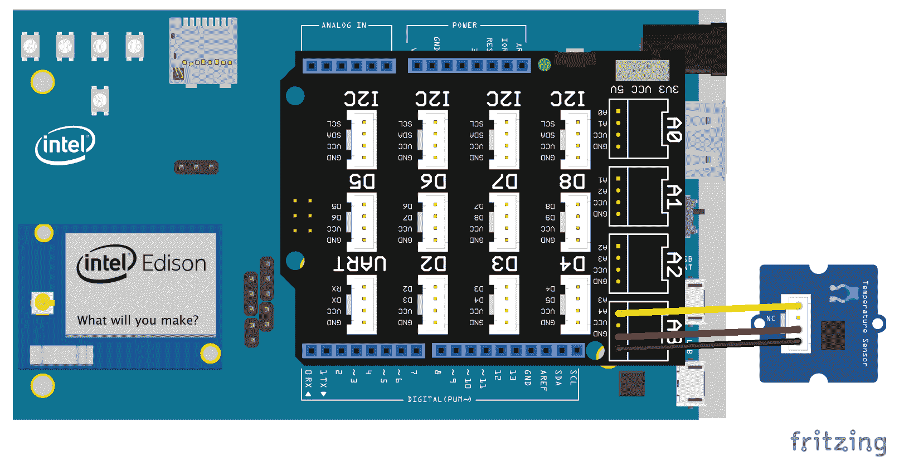
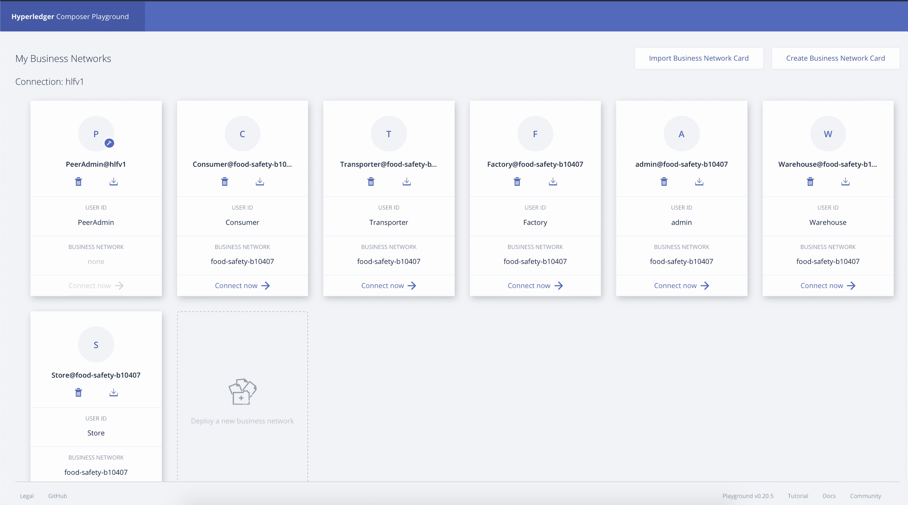
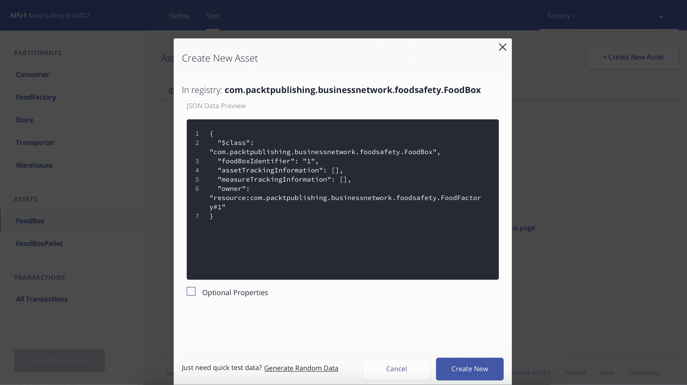
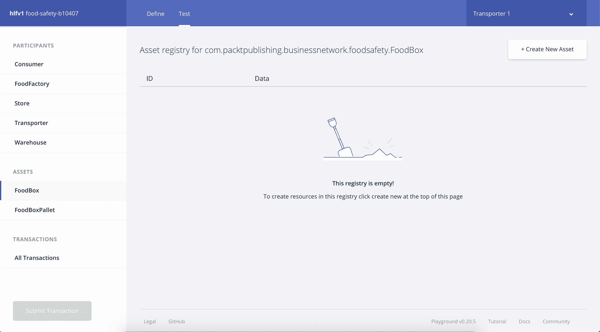

# 创建您的区块链和物联网解决方案

正确理解了上一章提出的项目目标后，就该让解决方案发挥作用了。在本章中，我将指导您使用 Hyperledger Composer 创建区块链网络。

在本章中，我们将讨论以下主题:

*   创建区块链网络
*   使用 Hyperledger Composer 定义资产、参与者、事务处理和访问控制列表
*   将网络发布到超级分类帐环境

我们还将从[第二章](2.html)、*中借用代码来创建您的第一个物联网解决方案*，以创建一个将监控货物并与区块链网络交互的设备。

# 技术要求

要访问完整的代码，您必须在您的计算机上安装 Hyperledger Fabric/Composer 环境，包括先决条件和能够开发 Node.js 应用程序的 IDE(建议使用 Visual Studio 代码)。

本章列出的代码可在[https://github . com/packt publishing/Hands-On-IoT-Solutions-with-block chain/tree/master/ch7/Hands-On-IoT-区块链获得。](https://github.com/PacktPublishing/Hands-On-IoT-Solutions-with-Blockchain/tree/master/ch7/hands-on-iot-blockchain)

# 解决方案概述

在这里，我们将处理从农场到餐桌的食品生命周期中最重要的部分之一:将产品从食品工厂运送到杂货店。

下图显示了每个给定阶段应实施的解决方案:


让我们详细看看前面的图表。我们将从四名参与者开始:

*   **工厂**:这是这个食品安全解决方案的出发点。它负责从农场收集原材料，并创建一个发送到仓库的盒子。允许该参与者执行的操作是添加新箱子并将箱子转移到运输者。
*   **运输公司**:这是一家公司，负责在受控的温度下处理从工厂到仓库以及从仓库到杂货店的运输。为运输者定义的动作是将温度测量添加到在其控制下的资产，并将资产转移到仓库或杂货店。

*   杂货店:这是一家向消费者出售食品盒的公司。杂货店是链条的末端，也是消费者从食品盒中获取信息的地方。杂货店可以检查货盘和箱子数据。
*   **消费者**:他们是食盒的目标。消费者对跟踪盒子链感兴趣，因此有一个查看盒子信息的映射动作。

我们将使用每个参与者的名片创建一个 **Composer REST 服务器**的实例，因此我们总共有四个 **Composer REST 服务器**实例。还有盒子和托盘。这些资产的定义如下:

*   **FoodBox** :代表工厂生产的产品，在整个链条中处理
*   **货盘:**这代表一组箱子，它们被组合在一起，从仓库发送到杂货店

让我们从我们的区块链网络解决方案开始。

# 创建区块链网络

要开发一个区块链网络，我们首先必须使用 Yeoman 命令行创建一个业务网络项目，然后将业务网络命名为:

```
$ yo hyperledger-composer
Welcome to the Hyperledger Composer project generator
? Please select the type of project: Business Network
You can run this generator using: 'yo hyperledger-composer:businessnetwork'
Welcome to the business network generator
? Business network name: food-safety-b10407
? Description: Hands-on IoT solutions with Blockchain
? Author name: Maximiliano and Enio
? Author email: max.santos@gmail.com
? License: Apache-2.0
? Namespace: com.packtpublishing.businessnetwork.foodsafety
? Do you want to generate an empty template network? Yes: generate an empty template network
   create package.json
   create README.md
   create models/com.packtpublishing.businessnetwork.cto
   create permissions.acl
   create .eslintrc.yml
```

Yeoman 生成器为 Hyperledger Composer 业务网络创建一个具有基本空结构的文件夹。

`.cto`文件包含业务网络定义:资产、参与者、事务和查询，而`.acl`文件包含资产和事务的访问控制列表。

在后面的部分中，我们将编写业务网络定义，因此启动 Visual Studio 代码并打开由 Yeoman 创建的文件夹。

要开始开发区块链解决方案，打开`models/com.packtpublishing.businessnetwork.cto`文件并开始编码。

# 概念和枚举

通过在 Hyperledger Composer 中创建可读性更强的结构，创建在资产、参与者和事务中通用的组合数据类型是一种很好的做法。这些结构是**概念**和**枚举**。

我们将在解决方案中使用以下结构:

```
// Tracking information when an asset arrives or leaves a location
enum LocationStatus {
 o ARRIVED
 o IN_TRANSIT
 o LEFT
}

// Location Types
enum LocationType {
 o FACTORY
 o WAREHOUSE
 o TRANSPORTER
 o STORE
}

// A measurement sent by the transporter sensor
concept Measurement {
 o DateTime date
 o Double value
}

// Check if it's in the factory, warehouse
concept Location {
 o DateTime date
 o LocationType location
 o String locationIdentifier
 o LocationStatus status
}
```

接下来，我们将看看如何定义业务网络中的资产。

# 资产定义

在定义了区块链网络的通用结构之后，让我们来定义将在其中使用的资产。在我们的解决方案中，我们将拥有`FoodBox`和`FoodBoxPallet`资产。

以下代码定义了它们:

```
// Definition of a food box
asset FoodBox identified by foodBoxIdentifier {
 o String foodBoxIdentifier
 o Location[] assetTrackingInformation
 o Measurement[] measureTrackingInformation
 --> FoodSafetyParticipant  owner
}

// Definition of a pallet that groups food boxes
asset FoodBoxPallet identified by foodBoxPalletIdentifier {
 o String foodBoxPalletIdentifier
 --> FoodBox foodBoxInPallet
 o Location[] assetTrackingInformation 
 o Measurement[] measureTrackingInformation
 --> FoodSafetyParticipant  owner
}
```

# 参与者

参与者是与区块链网络互动的行动者。每个参与者定义用于业务网络中的不同角色，他们的权限在访问控制列表中定义，如下所示:

```
abstract participant FoodSafetyParticipant identified by identifier {
 o String identifier
 o String name
}

participant FoodFactory extends FoodSafetyParticipant {
}

participant Warehouse extends FoodSafetyParticipant {
}

participant Transporter extends FoodSafetyParticipant {
}

participant Store extends FoodSafetyParticipant {
}

participant Consumer extends FoodSafetyParticipant {
}
```

# 为 Hyperledger 部署和测试业务网络

出于测试目的，我们将允许所有参与者完全访问区块链网络的所有资源:

1.  为此，我们将在`permissions.acl`文件中添加以下几行(不删除任何现有规则):

```
rule Default {
    description: "Allow all participants access to all resources"
    participant: "ANY"
    operation: ALL
    resource: "com.packtpublishing.businessnetwork.foodsafety.**"
    action: ALLOW
}
```

定义了这个规则后，我们将能够部署和测试分类帐，而不需要任何其他额外的权限。

2.  定义网络后，我们将生成一个**业务网络档案** ( `.bna`文件)并部署到 Hyperledger 环境中。在此之前，请确保您的环境已经启动并运行。要创建`.bna`文件，进入项目的根目录并运行以下命令:

```
$ composer archive create -t dir -n .
Creating Business Network Archive
Looking for package.json of Business Network Definition
    Input directory: /hands-on-iot-solutions-with-blockchain/ch7/food-safety-b10407
Found:
     Description: Hands-on IoT solutions with Blockchain
     Name: food-safety-b10407
     Identifier: food-safety-b10407@0.0.1
Written Business Network Definition Archive file to 
     Output file: food-safety-b10407@0.0.1.bna
Command succeeded
```

3.  如果您还没有生成`PeerAdminCard`,现在是时候这样做了，用`createPeerAdminCard.sh`脚本将它导入到我们下载了`fabric-dev servers`的目录中:

```
$ ~/fabric-dev-servers/createPeerAdminCard.sh 
Development only script for Hyperledger Fabric control
Running 'createPeerAdminCard.sh'
FABRIC_VERSION is unset, assuming hlfv12
FABRIC_START_TIMEOUT is unset, assuming 15 (seconds)
Using composer-cli at v0.20.4
Successfully created business network card file to 
    Output file: /tmp/PeerAdmin@hlfv1.card
Command succeeded
Successfully imported business network card
    Card file: /tmp/PeerAdmin@hlfv1.card
    Card name: PeerAdmin@hlfv1
Command succeeded
The following Business Network Cards are available:
Connection Profile: hlfv1
┌─────────────────┬───────────┬──────────────────┐
│ Card Name       │ UserId    │ Business Network │
├─────────────────┼───────────┼──────────────────┤
│ PeerAdmin@hlfv1 │ PeerAdmin │                  │
└─────────────────┴───────────┴──────────────────┘

Issue composer card list --card <Card Name> to get details a specific card
Command succeeded
Hyperledger Composer PeerAdmin card has been imported, host of fabric specified as 'localhost'
```

4.  当您完成所有设置后，将`.bna`文件安装到环境中，并通过运行以下命令启动网络:

```
$ composer network install --card PeerAdmin@hlfv1 --archiveFile food-safety-b10407\@0.0.1.bna 
√ Installing business network. This may take a minute...
Successfully installed business network food-safety-b10407, version 0.0.1

Command succeeded
$ composer network start --networkName food-safety-b10407 --networkVersion 0.0.1 --networkAdmin admin --networkAdminEnrollSecret adminpw --card PeerAdmin@hlfv1 --file networkadmin.card
Starting business network food-safety-b10407 at version 0.0.1

Processing these Network Admins: 
userName: admin
√ Starting business network definition. This may take a minute...
Successfully created business network card:
Filename: networkadmin.card

Command succeeded
```

5.  最后，导入由启动进程生成的网络管理员卡，并 ping 网络以确保它在环境中运行:

```
$ composer card import --file networkadmin.card
Successfully imported business network card
    Card file: networkadmin.card
    Card name: admin@food-safety-b10407

Command succeeded

$ composer network ping --card admin@food-safety-b10407
The connection to the network was successfully tested: food-safety-b10407
    Business network version: 0.0.1
    Composer runtime version: 0.20.4
    participant: org.hyperledger.composer.system.NetworkAdmin#admin
    identity: org.hyperledger.composer.system.Identity#f48a787ac40102cc7753336f8b15dd20fa3765e7b9049b2aeda4dcc3816d30c1

Command succeeded
```

至此，我们已经创建了网络的第一个版本；生成了用于部署的包(`.bna`文件)；创造了`PeerAdminCard`；已将网络安装到 Hyperledger 结构环境中；生成了`NetworkAdminCard`，负责管理区块链网络；并启动了网络。

使用管理卡，我们将发送一个`ping`命令来确保网络正常运行。现在，让我们改进我们的网络。

# 通过在区块链的交易操纵资产

事务是对 Hyperledger Composer 定义的业务网络内的对象执行的原子操作。它们在 Hyperledger 结构环境和定义的业务网络的范围内运行。

在这里展示的用例中，我们创建的事务将使用物联网设备提供的信息来更新托盘和嵌套的食物盒。

它由两个结构组成。第一个是事务的定义，在业务网络定义模型中创建(`.cto`文件):

```
transaction updateTransportationData {
  --> FoodBoxPallet pallet
  o Location locationInformation
  o Measurement measurementInformation
}
```

下一个结构是实现先前定义的事务的函数，它是在一个符合 JavaScript ES5 的脚本中创建的(一个`.js`文件):

```
/**
 * Update pallets and boxes with measurements function.
 * @param {com.packtpublishing.businessnetwork.foodsafety.UpdateTransportationData} tx Update pallets and boxes with measurements.
 * @transaction
 */
async function updateTransportationData(tx) {

 // Get transaction parametes
 let newValue = tx.asset;
 let location = tx.locationInformation;
 let measurement = tx.measurementInformation;

 // Update Pallet data with measurements
 if( !newValue.assetTrackingInformation || newValue.assetTrackingInformation == undefined)
 newValue.assetTrackingInformation = [];
 if ( !newValue.measureTrackingInformation || newValue.measureTrackingInformation == undefined)
 newValue.measureTrackingInformation = [];

 newValue.assetTrackingInformation.push(location);
 newValue.measureTrackingInformation.push(measurement);

 // Update Boxes data with measurements
 let foodBox = newValue.foodBoxInPallet;
 if( !foodBox.assetTrackingInformation || foodBox.assetTrackingInformation == undefined)
 foodBox.assetTrackingInformation = [];

 if ( ! foodBox.measureTrackingInformation || foodBox.measureTrackingInformation == undefined)
 foodBox.measureTrackingInformation = [];

 foodBox.assetTrackingInformation.push(location); 
 foodBox.measureTrackingInformation.push(measurement);

// Get the asset registry for both assets.
 let assetRegistryFoodBoxPallet = await getAssetRegistry('com.packtpublishing.businessnetwork.foodsafety.FoodBoxPallet');
 let assetRegistryFoodBox = await getAssetRegistry('com.packtpublishing.businessnetwork.foodsafety.FoodBox');

 // Update the assets in the asset registry.
 await assetRegistryFoodBoxPallet.update(newValue);
 await assetRegistryFoodBox.update(foodBox);
}
```

# 生成和导出参与者名片

为了正确使用网络，我们将为每个班级(`Factory`、`Warehouse`、`Transporter`、`Store`和`Consumer`)创建一名参与者，生成他们各自的名片，并将其导入 Composer CLI Wallet:

1.  首先，我们将创建参与者:

```
$ composer participant add -c admin@food-safety-b10407 -d '{"$class":"com.packtpublishing.businessnetwork.foodsafety.Consumer","identifier":"5","name":"Consumer"}'
Participant was added to participant registry.

Command succeeded

$ composer participant add -c admin@food-safety-b10407 -d '{"$class":"com.packtpublishing.businessnetwork.foodsafety.Store","identifier":"4","name":"Store"}'
Participant was added to participant registry.

Command succeeded

$ composer participant add -c admin@food-safety-b10407 -d '{"$class":"com.packtpublishing.businessnetwork.foodsafety.Transporter","identifier":"2","name":"Transporter"}'
Participant was added to participant registry.

Command succeeded

$ composer participant add -c admin@food-safety-b10407 -d '{"$class":"com.packtpublishing.businessnetwork.foodsafety.Warehouse","identifier":"3","name":"Warehouse"}'
Participant was added to participant registry.

Command succeeded

$ composer participant add -c admin@food-safety-b10407 -d '{"$class":"com.packtpublishing.businessnetwork.foodsafety.FoodFactory","identifier":"1","name":"Factory"}'
Participant was added to participant registry.
Command succeeded
```

2.  然后，我们将使用以下命令发布一个身份并导入各自的名片:

```
composer identity issue -c admin@food-safety-b10407 -f <name of the output file for the card> -u <participant name> -a <participant class# Participant id>
```

3.  对每个参与者重复这个命令:`Transporter 1`、`Store 1`、`Warehouse 1`和`Factory 1`。

```
$ composer identity issue -c admin@food-safety-b10407 -f consumer.card -u "Consumer" -a "resource:com.packtpublishing.businessnetwork.foodsafety.Consumer#1"
Issue identity and create Network Card for: Consumer

√ Issuing identity. This may take a few seconds...

Successfully created business network card file to 
    Output file: consumer.card Command succeeded

```

4.  将生成的每个参与者/卡的每张卡导入 Composer CLI wallet，并检查所有卡是否都已成功导入:

```
$ composer card import -f consumer.card 
Successfully imported business network card
    Card file: consumer.card
    Card name: Consumer 1@food-safety-b10407

Command succeeded

$ composer card list
The following Business Network Cards are available:
Connection Profile: hlfv1
┌──────────────────────────────────┬───────────────┬────────────────────┐
│ Card Name                        │ UserId        │ Business Network   │
├──────────────────────────────────┼───────────────┼────────────────────┤
│ Factory 1@food-safety-b10407     │ Factory       │ food-safety-b10407 │
├──────────────────────────────────┼───────────────┼────────────────────┤
│ Warehouse 1@food-safety-b10407   │ Warehouse     │ food-safety-b10407 │
├──────────────────────────────────┼───────────────┼────────────────────┤
│ Store 1@food-safety-b10407       │ Store         │ food-safety-b10407 │
├──────────────────────────────────┼───────────────┼────────────────────┤
│ Consumer 1@food-safety-b10407    │ Consumer      │ food-safety-b10407 │
├──────────────────────────────────┼───────────────┼────────────────────┤
│ Transporter 1@food-safety-b10407 │ Transporter   │ food-safety-b10407 │
├──────────────────────────────────┼───────────────┼────────────────────┤
│ admin@food-safety-b10407         │ admin         │ food-safety-b10407 │
├──────────────────────────────────┼───────────────┼────────────────────┤
│ PeerAdmin@hlfv1                  │ PeerAdmin     │                    │
└──────────────────────────────────┴───────────────┴────────────────────┘

Issue composer card list --card <Card Name> to get details a specific card

Command succeeded
```

# 定义访问控制列表(ACL)

为了在网络上实施权限，我们将使用以下规则为参与者定义一些对资产的访问控制:

1.  只有工厂可以创建`FoodBoxes`:

```
rule FoodBoxFactoryCreation {
 description: "Factories can create FoodBoxes"
 participant: "com.packtpublishing.businessnetwork.foodsafety.FoodFactory"
 operation: CREATE
 resource: "com.packtpublishing.businessnetwork.foodsafety.FoodBox"
 action: ALLOW
}
```

2.  由于食品工厂也可以看到它们的`FoodBoxes`是什么并将它们转移到运输商，我们可以使用条件规则来定义这些限制:

```
rule FoodBoxFactoryUpdateAndRead {
 description: "Factories can update and read owned FoodBoxes"
 participant(p): "com.packtpublishing.businessnetwork.foodsafety.FoodFactory"
 operation: UPDATE, READ
 resource(b): "com.packtpublishing.businessnetwork.foodsafety.FoodBox"
 condition: (p == b.owner)
 action: ALLOW
}
```

3.  下一条规则指的是`Transporters`。这些可以读取和更新自己的`FoodBoxes`。我们将为`FoodBoxPallets`做同样的事情:

```
rule FoodBoxTransportersUpdateAndRead {
 description: "Transporters can update and read owned FoodBoxes"
 participant(p): "com.packtpublishing.businessnetwork.foodsafety.Transporter"
 operation: UPDATE, READ
 resource(b): "com.packtpublishing.businessnetwork.foodsafety.FoodBox"
 condition: (p  == b.owner )
 action: ALLOW
}

rule FoodBoxPalletTransportersUpdateAndRead {
 description: "ransporters can update and read owned FoodBoxes"
 participant(p): "com.packtpublishing.businessnetwork.foodsafety.Transporter"
 operation: UPDATE, READ
 resource(b): "com.packtpublishing.businessnetwork.foodsafety.FoodBoxPallet"
 condition: (p  == b.owner )
 action: ALLOW
}
```

4.  仓库还可以读取和更新它们的`FoodBoxes`，以及创建、更新和读取`FoodBoxPallets`:

```
rule FoodBoxPalletWarehouseCreate {
 description: "Warehouses can create FoodBoxPallets"
 participant: "com.packtpublishing.businessnetwork.foodsafety.Warehouse"
 operation: CREATE
 resource: "com.packtpublishing.businessnetwork.foodsafety.FoodBoxPallet"
 action: ALLOW
}

rule FoodBoxWarehouseUpdateAndRead {
 description: "Warehouses can update and read owned FoodBoxes"
 participant(p): "com.packtpublishing.businessnetwork.foodsafety.Warehouse"
 operation: UPDATE, READ
 resource(b): "com.packtpublishing.businessnetwork.foodsafety.FoodBox"
 condition: (p == b.owner )
 action: ALLOW
}

rule FoodBoxPalletWarehouseUpdateAndRead {
 description: "Warehouses can update and read owned FoodBoxes"
 participant(p): "com.packtpublishing.businessnetwork.foodsafety.Warehouse"
 operation: UPDATE, READ
 resource(b): "com.packtpublishing.businessnetwork.foodsafety.FoodBoxPallet"
 condition: (p  == b.owner)
 action: ALLOW
}

```

5.  最后，商店可以读取他们拥有的`FoodBoxes`，而消费者可以读取所有的`FoodBoxes`:

```
// Store Rules
rule StoreCanReadFoodBoxes {
 description: "Stores can update and read owned FoodBoxes"
 participant(p): "com.packtpublishing.businessnetwork.foodsafety.Store"
 operation: READ
 resource(b): "com.packtpublishing.businessnetwork.foodsafety.FoodBoxPallet"
 condition: (p  == b.owner )
 action: ALLOW
}

// Consumer Rules
rule ConsumersCanReadFoodBoxes {
 description: "Factories can update and read owned FoodBoxes"
 participant: "com.packtpublishing.businessnetwork.foodsafety.Consumer"
 operation: READ
 resource: "com.packtpublishing.businessnetwork.foodsafety.FoodBox"
 action: ALLOW
}

```

应用这些规则后，网络就可以进行测试了。

# 将企业网络升级到新版本

升级已部署的企业网络只需四个步骤:

1.  打开`package.json`文件，更新应用程序的版本号。在我们的例子中，它将更新为`0.0.2`,如下所示:

```
{
 "engines": {
 "composer": "^0.20.4"
 },
 "name": "food-safety-b10407",
 "version": "0.0.2",
...
```

2.  运行`composer archive create -t dir -n .`创建一个新的 nba 文件

```
$ composer archive create -t dir -n .
Creating Business Network Archive

Looking for package.json of Business Network Definition
 Input directory: /projects/hands-on-iot-solutions-with-blockchain/ch7/food-safety-b10407
Found:
 Description: Hands-on IoT solutions with Blockchain
 Name: food-safety-b10407
 Identifier: food-safety-b10407@0.0.2
Written Business Network Definition Archive file to
 Output file: food-safety-b10407@0.0.2.bna

Command succeeded
```

3.  在 Hyperledger 环境中安装新的存档文件:

```
$ composer network install --card PeerAdmin@hlfv1 --archiveFile food-safety-b10407\@0.0.2.bna
√ Installing business network. This may take a minute...
Successfully installed business network food-safety-b10407, version 0.0.2

Command succeeded
```

4.  最后，`upgrade`网络版来了个新的:

```
$ composer network upgrade --card PeerAdmin@hlfv1 --networkName food-safety-b10407 --networkVersion 0.0.2
Upgrading business network food-safety-b10407 to version 0.0.2

√ Upgrading business network definition. This may take a minute...

Command succeeded
```

如果所有命令都已成功运行，企业网络现在将运行在新版本上，包括前面几节中创建的事务和 ACL。

# 为每个参与者设置 Composer REST 服务器

作为安装 Hyperledger Composer 开发环境的先决条件之一，您还需要安装 Composer REST 服务器。

该组件是一个基于回送框架的 API 服务器( [http://loopback.io](http://loopback.io) )，包括一个用于连接到 Hyperledger Composer 环境的`loopback-connector-composer`和一个用于动态收集资产、参与者和交易模型的脚本。

启动 Composer REST 服务器最简单的方法是运行`cli`命令并正确填写启动问卷。为了方便起见，我们将使用以下命令运行它:

```
composer-rest-server -c "<business card name>" -n never -u true -w true -p <port defined for the participant server> 
```

为每个参与者打开一个终端窗口，为其启动一个专用的 Composer REST 服务器:

```
composer-rest-server -c "Factory@food-safety-b10407" -n never -u true -w true -p 3000

composer-rest-server -c "Warehouse@food-safety-b10407" -n never -u true -w true -p 3001

composer-rest-server -c "Store@food-safety-b10407" -n never -u true -w true -p 3002

composer-rest-server -c "Consumer@food-safety-b10407" -n never -u true -w true -p 3003

composer-rest-server -c "Transporter@food-safety-b10407" -n never -u true -w true -p 3004
```

每个正在运行的实例都与单个用户相关，这意味着通过监听端口`3003`的 Composer REST 服务器调用的所有操作都与标识符为 5 **的`Consumer`相关。**例如，如果创建了一个新的`Consumer`参与者(假设 ID 6)，那么必须向该参与者发放一张新的名片，并且必须使用这张新卡启动 Composer REST 服务器的另一个实例。

在大多数情况下，一张名片就足以满足整个组织的需求。发行名片的其他规则可以由治理定义，比如每个分支/子公司一张名片，或者每个用户必须有自己的名片。

此时，您的计算机上应该已经运行了五个 Composer REST 服务器实例，并且每个实例都应该能够通过位于以下地址的浏览器进行访问:`http://localhost:<port>`。

# 创建解决方案的物联网部分

在定义了整个区块链网络并使一切正常运行后，我们现在将设置并开发一个设备，该设备将通过箱子和托盘测量来更新分类账。

为了完成这项工作，我们将创建一个新设备，使用与第 2 章、*创建您的第一个物联网解决方案*相同的方法，并创建一个应用程序来接收来自测量的事件，并使用 Composer REST 服务器公开的 API 来更新区块链总账。

# 硬件设置

为了组装这款监控设备，我们将应用一些可能与生产环境相关的假设:

*   运输车辆具有可用的 Wi-Fi 连接，以便设备可以连接到互联网
*   监控设备时间与应用程序时间同步，包括时区
*   所有箱子都在同一时间用同一辆车运输，因此托盘中的所有箱子都适用相同的条件和尺寸

在生产级应用中，这些限制/假设必须通过缓存未发布的事件和使用不同的网络提供商(Sigfox、LoRAWan、移动连接等)等技术来处理，并且实际时间必须与设备的位置同步。

本项目中使用的零件如下所示:


此图像是用 Fritzing 创建的，并在 CC BY-SA 3.0 下获得许可；参见 https://creativecommons.org/licenses/by-sa/3.0/

下表给出了每个组件的说明。您应该对它们很熟悉，因为它们是第二章 T2[中使用的内容的子集，创建您的第一个物联网解决方案:](2.html)

| **数量** | **组件** |
| one | 英特尔爱迪生模块 |
| one | 英特尔 Edison Arduino 分线板 |
| one | Grove Base Shield v2 |
| one | Grove 温度传感器 1.2 版 |
| one | Grove 通用 4 针电缆 |

根据这些假设，本应用中使用的设备已连接，如下图所示。在这里，我们已经将 Grove 温度传感器连接到基座护罩中的`A3`连接插孔:



此图像是用 Fritzing 创建的，并在 CC BY-SA 3.0 下获得许可；参见 https://creativecommons.org/licenses/by-sa/3.0/

这就完成了监测食品盒运输的装置。

# 固件开发

以下代码借用自[第 2 章](2.html) *，创建您的第一个物联网解决方案*，因为它具有相同的硬件特征和相同的目标。

唯一的修改是在公布的 JSON 中:我们必须移除`soilMoisture`属性并在从工厂运输到仓库时添加箱子 ID，在从仓库运输到商店时添加托盘 ID。

它检索 Grove 传感器的温度，并将其发布到沃森物联网平台:

```
var iotf = require("ibmiotf");
var mraa = require('mraa');
var config = require("./device.json");
var deviceClient = new iotf.IotfDevice(config);
var temperatureSensor = new mraa.Aio(3);

var RESISTOR = 100000;
var THERMISTOR = 4250;

var getTemperature = function() {
    var sensorReading = temperatureSensor.read();
    var R = 1023 / sensorReading - 1;
    R = RESISTOR * R;
    var temperature = 1 / (Math.log(R/RESISTOR)/THERMISTOR+1/298.15)-273.15;
    return temperature;
};

deviceClient.connect();
deviceClient.on('connect', function(){
    console.log("connected");
    setInterval(function function_name () {
// When transporting from Factory to Warehouse
    deviceClient.publish('status','json','{ "foodBoxId":"1", "temperature":+         getTemperature()}',         2);

// When transporting from Warehouse to Store
// deviceClient.publish('status','json','{ "palletId":"1", "temperature":+ 
// getTemperature()}', 2);

 },300000);
});
```

# 应用开发

因为我们在本地运行 Hyperledger 环境，所以这里开发的应用程序必须在与 Hyperledger 相同的网络上运行。假设我们没有在 IBM Cloud/Bluemix 中运行它，配置将存储在一个 JSON 文件中，与应用程序的主`.js`文件将运行在同一个目录中。

此处列出了配置 JSON 文件的内容结构，并且必须使用在[第 2 章](2.html) *中定义的详细信息进行更新，以创建您的第一个物联网解决方案*:

```
{
    "org": "<your IoT organization id>",
    "id": "sample-app",
    "auth-key": "<application authentication key>",
    "auth-token": "<application authentication token>"
}
```

应用程序代码接收设备发布的所有事件，并用收集的温度更新托盘中的`FoodBoxes`:

```
// Composer Rest Server definitions
var request = require('request');
var UPDATE_BOX_URL = "http://<composer rest server url>:3004/api/UpdateFoodBoxTransportationData"
var UPDATE_PALLET_URL = "http://<composer rest server url>:3004/api/UpdateTransportationData"

// Watson IoT definitions
var Client = require("ibmiotf");
var appClientConfig = require("./application.json");
var appClient = new Client.IotfApplication(appClientConfig);

appClient.connect();]

appClient.on("connect", function () {
 appClient.subscribeToDeviceEvents();
});

appClient.on("deviceEvent", function (deviceType, deviceId, eventType, format, payload) {
 // update food box
 // updateFoodBox(payload.temperature);
 // update pallet
 // updatePallet(payload.temperature);
 });
```

以下代码通过 Composer REST 服务器调用区块链网络中定义的事务:

```
var updateFoodBox = function (temperature) {
   var options = {
      uri: UPDATE_BOX_URL,
      method: 'POST',
      json: {
  "$class": "com.packtpublishing.businessnetwork.foodsafety.UpdateFoodBoxTransportationData",
  "asset": "resource:com.packtpublishing.businessnetwork.foodsafety.FoodBox#<YOUR FOODBOX ID>",
  "locationInformation": {
    "$class": "com.packtpublishing.businessnetwork.foodsafety.Location",
    "date": "2018-12-24T15:08:27.912Z",
    "location": "<LOCATION TYPE>",
    "locationIdentifier": "<LOCATION ID>",
    "status": "<LOCATION STATUS>"
  },
  "measurementInformation": {
    "$class": "com.packtpublishing.businessnetwork.foodsafety.Measurement",
    "date": "2018-12-24T15:08:27.912Z",
    "value": 0
  }
}
    };
}

var updatePallet = function (temperature) {
    var options = {
      uri: UPDATE_BOX_URL,
      method: 'POST',
      json: {
  "$class": "com.packtpublishing.businessnetwork.foodsafety.UpdateTransportationData",
  "asset": "resource:com.packtpublishing.businessnetwork.foodsafety.FoodBoxPallet#<YOUR PALLET ID>",
  "locationInformation": {
    "$class": "com.packtpublishing.businessnetwork.foodsafety.Location",
    "date": "2018-12-24T15:09:02.944Z",
    "location": "<LOCATION TYPE>",
    "locationIdentifier": "<LOCATION ID>",
    "status": "<STATUS>"
  },
  "measurementInformation": {
    "$class": "com.packtpublishing.businessnetwork.foodsafety.Measurement",
    "date": "2018-12-24T15:09:02.944Z",
    "value": 0
  }
}
    };
}
```

# 端到端测试

出于测试目的，我们将使用 Hyperledger Composer Playground 进行大多数操作，除了传输器更新。因此，此时，您可以停止在上一节中启动的所有 Composer REST 服务器，除了为 transporter 参与者启动的服务器(侦听端口 3004)。

如果您的 Hyperledger Composer Playground 是在开发环境设置过程中安装的，您所要做的就是运行`composer-playground`命令，或者使用`npm` ( `npm install -g composer-playground`)进行安装。

您的默认浏览器将打开 Composer-Playground web 应用程序，如下面的屏幕截图所示:



作曲家游乐场登录页面

您可以看到之前创建的相同参与者。

# 创造一个食物盒子

根据我们授予的权限，工厂可以创建`FoodBoxes`。让我们看看如何:

1.  找到 Factory 1 @food-safety-b10407 名片，并选择“立即连接”选项。然后，点击屏幕左上角的测试。
2.  在左侧面板中，选择 Assets -> FoodBox，并在右上角单击+ Create New Asset:



3.  用以下内容填充 JSON，并使用 Create New 按钮创建资产:

```
{
  "$class": "com.packtpublishing.businessnetwork.foodsafety.FoodBox",
  "foodBoxIdentifier": "2015",
  "assetTrackingInformation": [],
  "measureTrackingInformation": [],
  "owner": "resource:com.packtpublishing.businessnetwork.foodsafety.FoodFactory#1"
}
```

# 将资产转移到运输商

要使用 Hyperledger Composer Playground 转移食品安全网络的资产，请执行以下步骤:

1.  在应用程序的右上角，选择“我的企业网络”选项，并作为传输者连接。
2.  如果您选择“测试”、“资产”→“食物盒”,您将看到没有可用的资产:



3.  返回到`Factory`身份，选择资产数据右侧的编辑按钮，用以下数据更新 JSON 文件:

```
{
 "$class": "com.packtpublishing.businessnetwork.foodsafety.FoodBox",
 "foodBoxIdentifier": "1",
 "assetTrackingInformation": [],
 "measureTrackingInformation": [],
 "owner": "resource:com.packtpublishing.businessnetwork.foodsafety.Transporter#2"
}
```

4.  保存资产；它将从工厂视图中消失。当您返回到 transporter 视图时，您会发现 Transporter 现在可以看到资产了。

# 运输时测量温度

此时，我们将模拟运输过程中的温度测量。

我们在物联网应用程序代码中创建了以下注释代码，因为我们在两个不同的时间点处理交通收集数据。

第一种是当一个`FoodBox`从`Factory`运输到`Warehouse`时，由`updateFoodBox`函数实现，而`updatePallet`函数的目的是处理从`Warehouse`到商店的运输:

```
appClient.on("deviceEvent", function (deviceType, deviceId, eventType, format, payload) {
 // update food box
 // updateFoodBox(payload.temperature);
 // update pallet
 // updatePallet(payload.temperature);
 });
```

此时，我们正在处理从`Factory`到`Warehouse`的传输，所以取消代码的第 19 行`updateFoodBox(payload.temperature);`的注释，然后更新第 30、34、35 和 36 行，为数据提供正确的值。

确保传输器的 Composer REST 服务器已启动并正在运行，并且设备代码的第 2 行和第 3 行中定义的 URL 指向正确的 Composer REST 服务器主机。

启动设备应用程序。

# 将资产转移到仓库

当资产转移到运输商时，也会发生同样的情况。转到 transporter 的 asset 视图，编辑 JSON 文件，并使用相应的值更改所有者:

```
"owner": "resource:com.packtpublishing.businessnetwork.foodsafety.Warehouse#3"
```

# 创建托盘并将箱子添加到其中

要创建货盘，我们需要遵循与 FoodBox 相同的流程:

1.  在左侧面板中，选择 Assets → FoodBoxPallet，并在右上角单击+ Create New Asset。
2.  然后，用以下数据填充 JSON。确保您在`foodBoxInPallet`字段和`owner`字段中使用了相同的 FoodBox ID 和仓库 ID (3 ):

```
{
 "$class": "org.hyperledger.composer.system.AddAsset",
 "resources": [
 {
 "$class": "com.packtpublishing.businessnetwork.foodsafety.FoodBoxPallet",
 "foodBoxPalletIdentifier": "3485",
 "foodBoxInPallet": "resource:com.packtpublishing.businessnetwork.foodsafety.FoodBox#2473",
 "assetTrackingInformation": [],
 "measureTrackingInformation": [],
 "owner": "resource:com.packtpublishing.businessnetwork.foodsafety.Warehouse#3"
 }
 ],
 "targetRegistry": "resource:org.hyperledger.composer.system.AssetRegistry#com.packtpublishing.businessnetwork.foodsafety.FoodBoxPallet",
 "transactionId": "0dfe3b672a78dd1d6728acd763d125f813ed0ca74450a2596b9cf79f47f054ad",
 "timestamp": "2018-12-24T14:43:34.217Z"
}
```

3.  创建货盘后，如前所述，将货盘和箱子转移到运输装置。JSON 的所有者值应该如下所示:

```
 "owner": "resource:com.packtpublishing.businessnetwork.foodsafety.Transporter#2"
```

# 运输托盘时测量温度

这与 FoodBox 运输的测量遵循相同的规则，但是您必须注释设备代码的第 19 行，取消对第 20 行的注释，并使用托盘的正确值更新第 53、57、58 和 59 行。

在运输结束时，使用托盘的`owner`和盒子将资产转移到商店，如下所示:

```
 "owner": "resource:com.packtpublishing.businessnetwork.foodsafety.Store#4"
```

# 追踪食物盒

为了跟踪作为消费者的食品盒，我们将通过`composer-playground`使用 Hyperledger Composer 历史记录。

要访问已应用于资产的操作的历史记录，请使用消费者名片连接到 Hyperledger 环境，并从游乐场的左侧面板中选择所有交易选项。

我们将能够看到对一项资产进行的所有交易，从资产的创建到货盘及其内箱到达商店:


作曲家游乐场-历史学家

我们还可以通过单击查看记录链接来查看交易详细信息，如下所示:


# 摘要

在本章中，我们学习了如何使用 Hyperledger Composer 和 Watson 物联网平台创建业务网络。

在开发解决方案的过程中，我们能够使用 Yeoman 创建一个 Hyperledger Composer 项目；定义共享数据结构；创建资产、参与者交易和访问控制列表。以及创建网络的第一个版本并将其升级到较新的版本。

我们还能够创建一个设备，负责读取从工厂到仓库，然后从仓库到商店的食品箱运输中的温度，并将该信息添加到区块链网络的共享分类账中的食品箱资产中。

该食品盒的消费者也能够从生产链的最开始就跟踪与该食品盒相关的信息。

尽管 Hyperledger Composer 和 Watson 物联网开发非常简单，但我们创建的解决方案解决了一个关于食物链安全的巨大问题。

以下章节将为您提供作者关于经验教训、实践和现实项目中使用的模式的观点，以及物联网和区块链如何成为在当前工业 4.0 场景下创建商业模式和应对新挑战的必要工具。