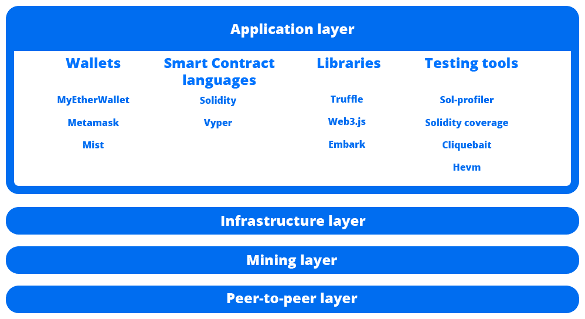
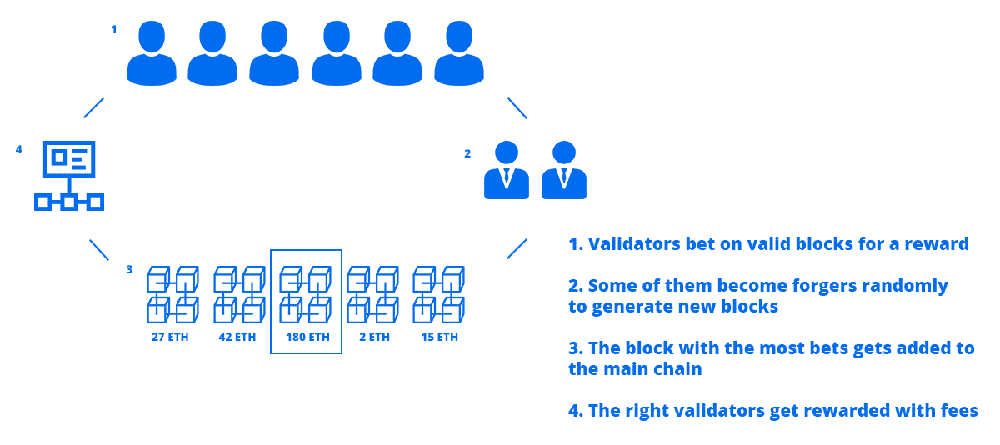
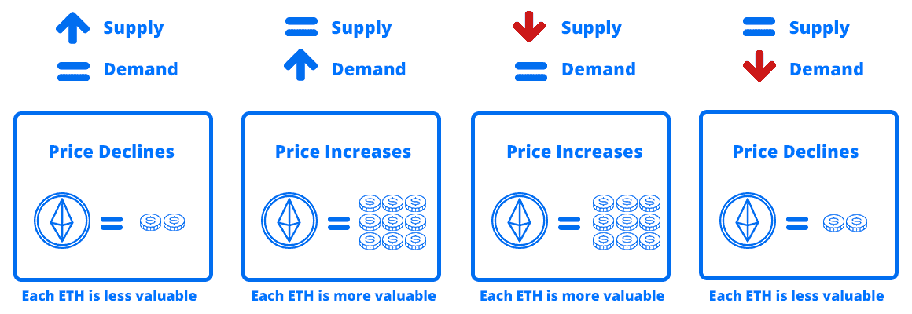
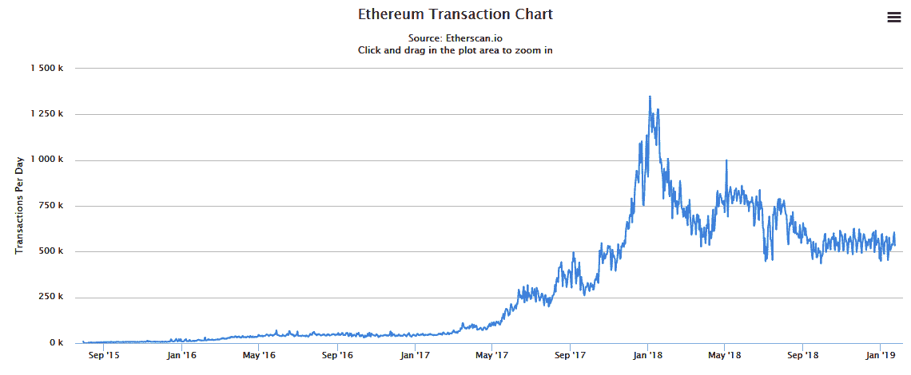

# 以太坊生态系统

在这一章中，我们将涉及区块链的几个重要方面。例如，在其他有趣的主题中，我们将关注那些使有组织的、分散的计算机网络成为可能的技术发明，我们将探索所有这些背后的经济学，以帮助您解决一个重要的问题，*为什么这项技术值得真正的金钱？*这将帮助你成为分散应用领域的专家。你将能够比以往任何时候都更好地解释这一切是如何协同工作的，以便你能够将你未来的客户引向正确的方向，因为你将确切地了解在所有这些协议、技术和加密层背后以太坊区块链正在发生什么，并且你将下意识地解决你所关心的关于这项发明的紧迫问题。

在本章中，我们将讨论以下主题:

*   以太坊链规范简介
*   区块链技术
*   区块链共识
*   区块链经济学
*   区块链指标

# 以太坊链规范简介

以太坊链规范是一种用于描述以太坊区块链外观的格式。它描述了什么样的参数、组件和元素应该被认为是以太坊区块链，这样你就可以创建你自己的具有不同属性的私有以太坊区块链，用于测试你的应用程序或派生新版本的以太坊。该规范定义了创建自己的区块链所需的内容。例如，WhaleCoin 使用以太坊规范创造了一个新的区块链，拥有相同的核心技术，但是由于以太坊链规范，他们进行了自己的修改。

重要的是要有一个清晰的规范，告诉我们如何创建我们自己的类似以太坊的区块链，因为硬分叉是每个区块链的基本组成部分，也因为高级开发人员可能觉得他们需要更多的控制来在私有区块链上测试他们的应用程序。以太坊给了人们基于以太坊创建自己系统的选择；在我看来，这对于处理事务的开发人员或矿工来说非常好，因为，例如，您可以更改共识算法、每项事务的汽油成本、阻塞时间等等，同时仍然拥有有效的以太坊区块链。

使用以太坊链规范，您可以创建叉子或您自己的私人以太坊区块链作为测试工具，以查看您的智能合约代码在现实世界中如何交互。

# 创世目标

链规范规定以太坊区块链必须由一个单独的模块生成，这个模块叫做**创世模块**。这是一个特殊的块，因为它不包含以前块的信息，并且包含整个区块链的配置。

它基于一个`genesis.json`文件，并具有以下参数:

*   `name`:这是链名。比如**家园**、**君士坦丁堡**、**摩登**。
*   `forkName`:这是该链的可选二级名称。
*   `engine`:这是一个指定共识引擎的 enum，可以是 **Ethash** 或者 **Null** 。

*   `params`:如果您仅指定了 **Ethash** ，则这是一个具有共识引擎多个属性的对象。不同的参数如下:
    *   这是一个数字，指定一个方块的最低难度。
    *   `gasLimitBoundDivisor`:这是一个分隔符字符串。通常是 0x400，它是转换成 utf8 字符串时的字符@。
    *   `difficultyBoundDivisor`:这是一个指定每块难度的整数，必须能被 2 整除。比如 2084。
    *   `durationLimit`:这是增加难度的点。
    *   `blockReward`:这是发现以太坊方块的奖励。
    *   `registrar`:这是该链上注册商契约的以太坊地址。

不同的共识引擎可能允许在`params` 对象中使用不同的关键字，但是有一些是通用的:

*   `accountStartNonce`:这个整数指定所有新创建的账户应该有什么随机数。
*   `frontierCompatibilityModeLimit`:该整数指定边界兼容模式结束，家园模式开始的块数。
*   `maximumExtraDataSize`:该整数指定报头的`extra_data`字段的最大字节数。
*   `minGasLimit`:该整数规定了一个区块可能被限制的最小天然气量。
*   `networkID`:该整数指定该链在网络上的索引。
*   `genesis`:你在[第一章](01.html)、*区块链架构*中看到的带有创世纪区块头的物体。报头包含关于块内容的特定信息，例如使用的气体、时间戳和随机数。

`genesis`对象包含创建的第一个块的一系列强制参数，即:

*   `seal`
*   `difficulty`
*   `author`

*   `timestamp`
*   `parentHash`
*   `extraData`
*   `gasLimit`

*   `nodes`:包含 enode 格式的区块链的初始节点的字符串数组。我们稍后会看到它是如何构造的。
*   `accounts`:带有`genesis`块账户的对象。每个帐户必须有几个关于每个地址的密钥:
    *   `balance`:这个账号在魏里指定了多少乙醚。
    *   `nonce`:账户在`genesis`的随机数，通常为零。
    *   `code`:该账户或其他账户关联的合同地址。
    *   `storage`:映射十六进制编码整数的对象，用于账户在`genesis`的存储。
    *   `builtin`:代码的替代，用于指定帐户代码是本机实现的。值是具有更多字段的对象:
        *   `name`:作为字符串执行的内置代码名，如 **identity** 或 **ecrecover** 。
        *   `pricing`:指定调用此契约的成本的枚举。
        *   `linear`:指定调用此合同的线性成本。Value 是一个具有两个字段的对象:base，它是 Wei 中的基本成本，并且总是被支付；word 是输入的每个单词的成本，向上取整。

现在你已经知道哪些参数进入了`genesis.json`文件，你可以开始为你自己的个人应用创建你自己的私人区块链。在第三章、*以太坊资产*、*、*中，你将了解创建一个定制以太坊区块链的确切过程。

现在，你已经对以太坊区块链如何启动、如何操作有了基本的了解，并对如何创建你自己的个性化区块链以供测试有了坚实的认识。

# 区块链技术

使区块链成为现实的技术是一组复杂的发明，它们共同努力实现全球协议源的共同目标。为了理解它们是如何联系在一起的，最好将技术分成四个主要部分，以便我们可以看到所有分散应用程序运行的层:

使以太坊成为可能的是一套在社区中广泛使用的工具和协议。每当您想要实现很难从头重新创建的高级机制时，您都可以将这些工具用于个人项目。

# 应用层

应用层是外部程序与区块链交互的一层。它还包括智能合同语言，如 Solidity 和 Vyper。这一层是最重要的一层，因为它让人们可以选择使用以太坊区块链，而不仅仅是发送和存储加密货币，这是分散技术用例的下一步。下图显示了应用层:

首先，我们有**钱包**，允许日常用户管理私人钥匙，以便能够与**分散应用** ( **dApps** )进行互动并进行转账。

主要有**迷雾**、**超面具**和**我的 therWallet** :

*   **Mist** 是一款正在开发中的浏览器，一直连接着以太坊。它允许你直接使用 dApps，而不必担心管理你的帐户或使用外部插件。
*   MetaMask 是一个在大多数浏览器上都可以使用的插件，它可以让你拥有连接以太坊区块链的超能力，而不必拥有区块链的本地副本，因为它连接到一个名为 INFURA 的计算机网络，在那里你可以自由地创建交易。
*   MyEtherWallet 是一个著名的以太坊钱包管理器，你可以在这里存储你的资金，连接到你的账户，并与智能合约在线互动。您也可以下载离线版本，以提高安全性和可靠性。

然后，我们有了**智能合同语言**，比如**稳健**和 **Vyper** 。它们用于创建智能契约，通过字节码指令与区块链交互。这些工作都要归功于在开采区块时执行代码的矿工。Solidity 最常用于 ico、分散式应用程序和令牌，用户可以在不可信的环境中与区块链进行交互。

接下来是**库**，比如**松露**、 **Embark** 和 **web3.js** **。**它们为您提供了创建更好的 dApps 的工具，同时能够与智能合约进行交互:

*   **Truffle** :这个库以用于**最小可行产品**(**MVP**)、dApps、ico 和令牌合同而闻名，因为它为想要更进一步的开发者提供了一个安全且经过测试的环境。
*   **Embark** :这是一个 dApp 框架，由 Status 的人开发，它给了你一些实用程序，比如从`.js`代码自动部署契约、观察变化和管理各种链的能力。
*   Web3.js :这是最常用的库，通过 JavaScript 与 Web 应用程序上现有的智能合同进行交互。它为你提供了一个简单的界面，直观且易于学习。

最后，你有**测试工具**来验证你的智能合约的安全性。请记住，这些工具并不完美，因为它们只为您提供了测试代码的扩展选项，而没有强迫您全面测试分散式应用程序的所有方面:

*   这是一个简单的分析器，生成一个漂亮的表格，以一种容易理解的方式显示你所有的合同和功能。这对于较大的项目来说是非常好的，在那里开始变得很难理解所有组件之间的关系，以便您能够更有效地测试它们。
*   这是一个用 JavaScript 编写的很棒的测试工具，可以确保你的测试实际上检查了每一行代码，至少保证它得到了全面的测试，而不考虑质量测试。Truffle 是编写测试的一个很好的工具，因为它为你提供了一个测试框架，帮助你执行单元测试。
*   **Cliquebait** :这为您提供了一个干净的 Docker 映像，以太坊区块链使用授权证明，具有极快的阻塞时间，因此您可以部署和检查您的分散应用程序的每个功能，而无需依赖。
*   **Hevm** :有了 Hevm，你就有了一个定制的**以太坊虚拟机** ( **EVM** )的实现，它可以准确地向你展示你的智能合约中正在发生的事情，包括操作码和一个调试器，你可以直接与部署的智能合约进行交互。

# 基础设施层

在应用层之下是基础设施层，它提供了一组较低级别的实用程序来与区块链进行更紧密的交互。分散存储、**点对点** ( **P2P** )实时消息传递、以太坊客户端等东西。

下图显示了基础架构层包含的内容:

因为区块链是建立在 P2P 网络之上的，节点之间可以直接交互，所以我们可以利用**消息传递**工具，比如 **Whisper** 和 **PyDevp2p** :

*   **耳语**:这是一个由核心以太坊开发者维护的协议，你可以在自己的 dApps 上使用它在应用之间发送几乎即时的消息。这对于加密的类似聊天的应用程序来说很棒，因为你只交换散列。
*   **PyDevp2p** :这是一个类似的工具，直接与 Devp2p 协议一起工作来交换消息，而不需要等待块来确认事务。它完全是用 Python 写的，所以对于直接连接以太坊的个人项目来说非常棒。

在这一层中，您还可以访问**分散存储**，这实质上允许您将数据保存在区块链上而不受限制。这个协议非常类似于 torrent，在 torrent 中，大文件在对等体之间直接交换。

最受欢迎的以太坊存储是 **IPFS** 和**蜂群**:

*   **Swarm** :这是一个建立在以太坊之上的分散存储，由核心开发者维护。有了它，您可以创建分散的应用程序，这些应用程序能够上传特定类型的数据，同时获得内容的散列。它的工作方式很简单；用户将一些文件上传到 swarm，同时让其他用户在线查看这些文件，每当其他人想要获取这些文件时，他只需直接从上传者那里下载，而无需征得许可。它提供了一个容错系统，类似于互联网的工作方式，但没有集中化。这个事实迫使用户自己保存他们的内容，当这项技术开始获得普通互联网用户的巨大牵引力时，这可能会成为一个问题。
*   星际文件系统 ( **IPFS** ):另一方面，这与 Swarm 几乎是一样的，它有一个分散的协议来存储用户之间的大量数据，包括文件，但有一些显著的区别。首先，IPFS 正致力于消除网络中的冗余。您知道，分散存储的一个问题是，您将拥有来自不同节点的大量相同副本。

当你在不同的计算机上有不同处理时间的相同文件时，你别无选择，只能选择每次都最快的那个。你也不能确定你从网络上下载的文件是否真的是它所说的那样。它可能包含充满恶意软件的恶意软件。为了解决这个问题，IPFS 提供了一个类似 GitHub 的系统，其中每个特定的文件都有一个唯一的标识符。如果两个文件具有完全相同的内容，这意味着它们是相同的，那么它们将具有完全相同的哈希。

这很好，因为它给了人们一个保证，他们得到的是没有任何修改的有效内容。它还增加了网络的可用性，因此您可以从许多不同的提供商那里可靠地获得正确的文件。IPFS 仍在进行中，它正在开发一种硬币，用于奖励用户在网络上保存文件。

最后，我们有在以太坊上工作的**客户端**。这是直接用来挖掘和下载公共以太坊链的软件。核心以太坊开发人员确保他们提供了各种各样的类似客户端，以便人们可以公开选择哪一个最符合他们的利益，这样就不会出现软件垄断，这种垄断会将所有必要的集中化强加给人们。

这些是主要的客户，尽管还有更多用不同语言编写并由不同组织维护的客户:

*   Geth :这是用 Go 语言编写的最流行的客户端，因其简单而流行。你可以用它来下载主区块链，用你的 CPU 挖矿，部署契约，并与之交互，创建以太坊账号，还有很多普通以太坊开发者感兴趣的功能。它提供了一个命令行界面，您可以在其中快速访问所有功能。
*   **奇偶校验**:这是一个更大的客户端，由以太坊的联合创始人之一创建，用 Rust 编写，它在语法上类似于 C++，但在每个方面都倾向于安全性。奇偶校验为您提供了一个命令行和 web 界面，您可以使用它来创建帐户、下载区块链、部署智能合约以及执行许多其他任务。奇偶校验以创建多签名钱包而闻名，这是一个智能合同，可以帮助组织在处理资金和投票时达成决策，因为所有成员都必须同意每个决策。

或者，您有用 Python、C++和其他语言编写的客户机，可以用于您的个人项目。选择权在你，所以确保你检查了所有这些，以便更好地了解每个客户能为你做什么。

# 采矿层

在基础设施下面，是挖掘层，在这里有一组不同的实用程序，可以使用图形卡或 CPU 来挖掘以太坊。你可能知道，产生以太坊唯一有点利润的方法是用廉价的电力和 GPU 卡。实际上，你可以自己采矿，或者加入支付一小部分区块奖励的池。

下图显示了挖掘层包含的内容:

**挖掘**是通过添加包含有效事务的块来增加区块链大小的过程，这要归功于一组参与挖掘的计算机通过工作验证方案达成共识。这是进行加密货币转移和能够利用采矿网络的联合力量运行智能合同的基础。

以太坊中的采矿网络非常庞大，它负责处理所有发生的交易，包括智能合同的执行和部署。这是任何强大的区块链的基础。处理交易的矿工越多，整个系统就越能抵御审查，越安全。

说到采矿，你有**个采矿池**和采矿客户，他们使用所有可用的显卡来解决**工作证明** ( **PoW** )挑战。采矿池给所有参与者一部分他们从单独采矿中获得的区块奖励，因为一个简单的事实是，采矿已经变得非常困难，只有许多计算机的联合努力才能持续地产生区块。它们是获得持续回报的好方法，不用花几天时间自己去采矿，也不知道你是否会找到一个区块:

*   **以太矿** : 在许多其他类似的资金池中，以太矿以其巨大的收益和持续的回报而闻名。其中最大的，你会发现，你有一个很大的保证，你会收到你的矿醚后，达到最低 0.05 ETH。

*   这是一个特殊的资金池，因为它可以处理更多种类的加密货币。这更像是一个出售哈希能力的市场，以换取更大的比特币支付，你可以很容易地将其转换为 ETH。支付门槛是 0.001 BTC，比以太矿要求的要贵很多。这对那些希望获得长期利益的人来说非常好。

在选择你的矿池后，你需要一个采矿软件，它会以最有效的方式使用你的计算机资源，以获得最大的回报。最受欢迎的 **GPU** 矿工是 Claymore 和 Ethminer，虽然许多其他的，如 Geth 和奇偶校验，可以用于相同的目的，使用您的 CPU，具有低得多的哈希输出:

*   这是一个非常棒的工具，可以让你的 Nvidia 和 AMD GPUs 发挥最大能力，因为它针对这些卡的每一种进行了优化。包括对双重挖掘的支持，您可以挖掘以太和其他您选择的加密货币，而对以太坊哈希功能的影响最小，因为它们使用相似和互补的算法，可以很好地协同工作。这个挖掘器唯一的问题是，你使用它挖掘的每一个小时，将有 36 秒的时间用于应用程序开发人员的挖掘，对于这样一个高效的工具来说，这是可以理解的，也是公平的，它提供了比其他挖掘器更好的性能。
*   Ethminer :用 C++编写的 Ethminer 专门用于挖掘任何使用哈希算法 Ethash 的加密货币，包括以太坊、以太坊经典和 Musicoin 等。它不像 Claymore 那样高效，但它背后有一个强大的开源社区，该社区无休止地工作，从一个热情的开发人员小团队提供尽可能最好的支持和编程。

理想情况下，您应该测试两个挖掘器，看看哪一个产生的性能最好，因为每个设置和计算机都略有不同。如果您的性能达不到最佳，请务必调整它们提供的设置。

# 对等层

这是以太坊正常运行的最低层。P2P 层负责节点之间的实时通信，无需通过消息中间人。

下图显示了 P2P 层包含的内容:

P2P 网络中的每个节点都是可被发现的，因为有一个唯一的 IP 标识符和一个哈希表，该哈希表包含您所连接的每个节点的相关数据。例如，当您连接到节点 123.456.123 时，您可以发送一个请求来查看它连接到了哪些节点，这样您就可以选择扩展您将来可以连接的已知节点的范围。这对于能够发现节点并在需要时连接到新的对等点非常重要。你连接的节点越多，你的交流就越强，就能更快地获得重要信息。

# 了解 DEVP2P

DEVP2P 是一种网络协议，当节点想要通过发送消息进行交互时，它负责管理节点之间的协商。每条消息都使用名为 **RLPx** 的协议进行加密，该协议允许节点在网络上交换加密数据，并确保除了接收者之外没有人能够解码该消息。

对于要相互连接的节点，它们公开它们想要使用的任何 TCP 端口，默认情况下是 30303。因此，如果您想要连接到一个特定的节点，您必须确切地知道它正在使用哪个端口，它正在使用哪个协议，以及它的 IP 地址或唯一标识符。例如，我们之前讨论的消息协议 Whisper 使用的是`shh`协议，而以太坊使用的是`eth`协议。这只是一个简单的区别，当您使用 web3.js 时，这个区别就变得很明显，因为它显示了每个相应协议中的每个功能。

总之，您已经看到了以太坊架构是由哪些组件组成的，因此在开发智能合约时，您能够辨别实际使用的是哪些组件。您应该能够识别网络中使用的不同协议，并了解可用的工具。

当涉及到可供您使用的工具时，您已经提高了认识，这对于所有那些想要实现经过时间考验的解决方案来解决常见问题的以太坊开发者来说是必不可少的。

# 区块链共识

区块链以太坊正在建立一个由数千台计算机组成的网络，这些计算机相互连接，交换信息。现在，为了保证他们都在处理相同的事务，并作为一个联合的团队为相同的目标而努力，我们需要达成协议，这被称为共识，以便他们都同意结果。这是最好的方法，把所有的努力结合起来，使整体受益。

在下图中，您可以看到所有计算机如何运行相同的挖掘软件，同时同意一个协议，为它们的计算能力提供奖励:

# 介绍区块链共识

在标准投票过程中，所有人都独立决定他们想要实现的目标，相比之下，区块链的**共识**更进一步，旨在做出有助于以最有效的方式实现最终目标的决策。例如，桥梁建设项目的管理者所做的决策是基于共识的，即同意以最有效的时间和成本方式建造桥梁的最佳解决方案。就区块链而言，共识是矿工采取的一组联合行动，以最有效的方式生成可能的最佳区块，从而减少区块时间，同时矿工获得可盈利的乙醚量。

PoW 是一种方案，用于处理事务并生成包含有效事务的块，以换取一项困难的任务，因此只有最有能力的计算机才能获得块生成的奖励。矿工在生成事务时所做的只是生成随机散列，直到他们找到下一个块所需的散列。每台计算机都独立完成这项工作。当矿工找到正确的散列时，他们将生成该散列的成分分发到所有连接的节点，以便他们可以做同样的事情，并最终将这个新块添加到网络中，同时获得对他的努力的奖励。

为什么所有的矿工都同意这样一个事实:发现者应该因为发现下一个块的正确散列而获得奖励？因为，当他们开矿时，他们同意一套规则。

这些规则如下:

*   找到方块的用户将获得奖励。
*   作为一个挖掘者，您必须将这个新块分发给所有连接的对等体，以使整个网络与该块中包含的新事务同步。
*   您必须只将有效的事务添加到块中。

此时，您可能会问自己*当一个无效的事务被添加到一个块中时会发生什么？*答案是，每当一个挖掘者将无效事务添加到块中，解决工作证明挑战，并试图将其分发给其他人以更新主链时，其他挖掘者将注意到这些无效事务，并将停止分发给该块，这样它就不会继续下去，因为他们中的每一个人都是每个块内部内容的验证者。

为包含这些无效事务的块解决 PoW 挑战的矿工浪费了他的计算能力，因为它不会进一步传播。那是对恶意行为的惩罚，浪费精力和时间。

这是一个非常强大和简单的检查机制，它保护区块链免受恶意意图，以便它只批准已经成功验证的有效交易。

# 展望未来

以太坊的核心开发者正在开发以太坊共识的下一个版本，该版本将在不久的将来，大约一两年后，在名为 **Serenity** 的硬版本中发布。以太坊将使用一种叫做 **Casper** 的东西作为协议，通过 PoS 和 PoW 的组合来实现共识，而不是使用 Ethash 作为实现和处理共识的算法。

他们为什么要改变生成块和达成共识的协议？因为电力在资源方面是不可持续，因为它迫使矿工浪费无法承受的能量和资源。没有必要把所有的精力浪费在密码挑战上。我们可以用不需要太多能量的更简单的协议达到同样的目标。此外，最大的加密组织能够负担大量的计算能力，使少数公司拥有几乎整个采矿网络。这是一个严重的问题，因为它破坏了分权原则。如果他们能够控制整个网络，那么这个系统就可以被认为是集中的，因此他们在决定加密货币如何发展方面获得了更强的地位。

理论上，他们可以联合努力，发动 51%的攻击，随心所欲地操纵交易。

Casper 计划通过使用 PoS 算法来解决功率意外增长带来的问题。然后，矿工在网络上锁定特定数量的以太网，以便能够验证交易，同时获得交易费，因为新的区块创建将停止奖励。每个矿工在他们认为有效的区块上下注他们想要的任何数量的乙醚，如果他们是正确的，他们将得到他们赌注的一部分。这使得整个网络更加分散，因为更多的计算机能够参与共识过程，以加速和释放少数大玩家手中的资源。

在下图中，您可以看到验证如何通过在随机生成的块上建议赌注来生成块的直观表示:

在 Casper 中，将有一种特殊类型的挖掘器，称为**伪造者**、**、**，他们将通过组合事务并在流程中添加他们的公钥来生成块，以证明他们是创建该块的人。如果他们最终为区块链添加了正确的区块，他们也将获得费用奖励。那些赌对区块的人将被称为**验证者**。每当一个区块有足够的赌注，如果它是在正确的时间，这意味着它是在区块链的标准区块时间内生成的，该区块将被添加。伪造者将从所有的验证者中随机选择，以便少数人能够创建区块。

# 无关紧要的问题

当带 PoS 的 Casper 实现时，参与者将能够通过在他们认为有效的积木上下注来推动积木前进，而如果他们选择了有效的积木，则可以获得奖励。但是，如果他们决定对恶意屏蔽进行投票，会发生什么呢？没有什么可以阻止他们这样做，因为他们在恶意的区块下注时不会失去任何东西。这就是所谓的**无利害关系**问题。

这些矿工将可以在他们看到的每一个街区下注，以获得可能的奖励。

这个问题的一个可能的解决方案是惩罚那些不断押注错误板块的人。因此，如果一个矿工做了 10 次错误的判断，他将损失一部分股份。然而，这种情况只会发生在网络的大多数人决定投票给错误的区块时，如果矿工分布得足够分散，就很难就错误的选择达成一致。

# 区块链经济学

加密货币的有趣之处在于，它们将技术与在现实世界中具有价值的真实资产相结合。有史以来第一次，我们能够创造完全独立运行的数字货币。从历史上来说，货币总是由中央政府支持，他们控制着供求。他们是唯一有能力印刷钞票来控制通货膨胀的人。

# 理解通货膨胀

简单来说，通货膨胀就是经济中所有资产遭受的价格上涨。例如，一栋房子在 1890 年通常价值约 10，000 美元，但同样的房子现在价值约 350，000 美元，尽管它变得更旧了——这是高通货膨胀的结果。这可能是由于自然资源稀缺时供应减少导致材料成本增加造成的。也许是因为工作短缺，所以人们要求更高的工资，因为要求越来越高。这也可能是因为没有足够的房屋出售导致土地成本上升。所有这些，以及许多其他因素，迫使企业提高价格，这迫使人们赚更多的钱，同时加剧通货膨胀。

以太坊等加密货币能够提高价格，因为随着技术的不断进步和更多用例的开发，其采用率正在上升，这使它们在一定程度上能够抵御外部通胀。与政府和机构能够按需印刷的法定货币相比，供应量每年增长更慢的事实使其价值相对稳定，这使得以太坊和其他许多货币成为一种巨大的价值储存手段。

# 评估加密货币经济学

问加密货币为什么有价值，就相当于问任何东西为什么有价值。我们用数字来衡量事物，因为它给了我们一些东西——为我们提供一个安全的睡觉地方的房子，让我们有能力去远方旅行的汽车，或者生存的食物。总的来说，区块链作为一种工具有实用价值，可以存储金钱，进行几乎即时的数字硬币转移，以及使用没有区块链就无法工作的特定类型的应用程序。

在转换加密货币时，交易所发挥了重要作用。你可以去任何接受以太的交易所，把它兑换成任何其他货币，因为他们认为以太是有价值的东西。钱是基于协议的。我们都同意，一个苹果有一个特定的美元价值，可以略有不同，只要人们想消费这个苹果，并接受美元作为交换，他们就会购买它。乙醚也是如此——只要人们想用乙醚做任何他们能做的事情，并接受美元作为交换，他们就会购买乙醚。

在钱出现之前，人们通过协议交换东西，例如，用一张桌子换一袋土豆。然后，他们决定使用一个抽象概念，一个数字，可以用来以更精确的方式理解事物的价值。

请注意，价格从来不是固定的。这不像公制，1 公斤对整个地球来说是一样的。法定货币和加密货币通过与其他货币进行比较来定价。与 0.8 欧元相比，1 美元就是 1 美元。与 200 美元相比，1 乙醚就是 1 乙醚。世界各国法定货币的全球交换称为 Forex(外汇)。对于加密货币，有单独的交易所自行处理价格。

当有人愿意用一枚硬币交换另一枚时，两枚硬币都有了价格。例如，想象以下场景:

1.  想想某人刚刚创造的一种叫做红色的新虚拟货币。它没有任何价值，因为它还不出名，没人想买。
2.  现在，约翰读到了这种新的红色硬币，并决定这将有助于他以更低的价格购买苹果，因为他们已经与当地生产商达成了协议。红色硬币有实用价值。

3.  他去交易所和硬币的主人谈判。约翰想买 100 个红色的硬币，所以他们一直在谈，直到他们根据硬币的效用决定 100 个红色的硬币值 300 美元。
4.  此时，红色硬币的价值为 3 美元，直到硬币的创造者决定降低价格以增加买家，反之亦然。

市场决定所有货币的价格，这取决于人们的购买意愿。

# 确定加密货币的价值

任何东西的价值都取决于供给和需求。只要供应保持稳定，想要它的人越多，它就会变得越贵。

在下图中，您可以看到供求关系如何影响特定加密货币相对于稳定的法定货币的价格:

许多交易所都有自己的流动性池，其中 ETH 具有不同的价值，因为人们基于偏好使用不同的交易所。那么，它们是如何同步的，以便有一个统一的价格呢？事实是，它们的价格仍然略有不同。套利者致力于保持价格一致；由于他们是根据交易所之间的价格差异获得报酬的，这就是每种加密货币价格总体稳定的原因，特别是大型加密货币，如以太坊，每天的交易量足够大，值得投资。

价格随时间变化的结果可以在下一部分的图表中看到，您可以快速分析特定相关历史事件下加密货币的价值。图表有助于更好地理解区块链的采用。

# 基于以太坊的令牌

以太坊区块链如此著名的原因之一是因为它提供了创建代币的简单性。每个有大量追随者的代币都会影响价格，因为背后的技术是一样的。在接下来的章节中，您将了解 ERC20 令牌是如何创建的。就目前而言，你明白每当有人投资购买代币，代币的价格就会上涨，同时也增加了以太坊的整体价值，这就足够了。

以太坊上的代币越多，区块链就越有价值，所以它的价格也会上涨。如果你去[https://coinmarketcap.com/](https://coinmarketcap.com/)，在那里你可以看到所有基于以太坊的大型代币的价格，你会意识到大多数代币的价格模式与以太坊相同，原因很简单，任何人购买代币实际上都是在投资底层技术，即以太坊。

投入以太坊的资金总额被称为市值，因为以太坊的市值如此之大，只有大量购买以太才能显著改变价格。所以，每当你看到价格大幅上涨，这可能是因为大公司出于自己的动机投资该技术。

# 区块链指标

区块链指标是区块链的重要可测量功能，可以帮助您了解其状态，以便您能够确定以太坊区块链的表现如何以及采用率如何，以便您能够预测未来的定价、发展和采用率。

# 交易数量

区块链中的交易数量是最重要的指标，因为它显示了该技术在日常生活中的使用情况。交易代表活动。交易越多，越多人积极使用区块链投资项目、运行 dApps 和使用智能合约。

如果没有人使用这项技术，拥有数十亿用户就没有意义；交易越多，技术就越有用。你还会在下一个标题中看到以太坊正在经历成长的烦恼，并且没有得到应有的使用。人们正在加入它，但他们没有充分利用它。这是社区中的一个巨大问题，必须超越它才能成为主流。

以太坊开始的时候有 8893 笔交易，后来在 2019 年 1 月 1 日变成了 448168 笔日交易。纪录是 2018 年 1 月 4 日日的 1349890。

下面是以太坊 2015 年上线以来的交易数量的可视化，供大家参考:

前面的截图告诉我们，每天有 44.8 万笔交易来自日常转账、使用 dApps 的人、参与 ico 的投资者以及玩智能合约的人。相比之下，截至 2017 年 12 月，PayPal 每年处理 76 亿笔交易，每天约 6.33 亿笔交易。PayPal 是世界各地使用的主流技术，因此，以太坊要达到这样的大规模采用水平，它必须增长到目前交易水平的 1413 倍左右。这清楚地向我们表明以太坊仍处于起步阶段，按照目前的使用情况，要达到这样的规模还需要几年时间。

图表显示，自去年以来，以太坊的日交易量并没有增加。这在区块链空间中是常见的，并且由于该技术尚未经历的许多改进，预计将在一段时间后继续增长。

你可以通过查看位于[https://etherscan.io/chart/tx](https://etherscan.io/chart/tx)的以太坊交易图来探索自己的数据。

# 应对增长

以太坊中的地址类似于现实生活中的账户，尽管它们更容易生成，所以人们在任何给定的时间点管理 10 个地址并不罕见。以太坊成立时，一共创建了 9205 个地址。从那时起，以太坊就没有停止增长，到 2019 年 1 月 1 日，已经创建了 54，281，633 个地址，每天增长约 51，139 个。这是 5000 万个地址，我们可以近似为 500 万个用户，因为我们可以假设普通用户有大约 10 个地址，并且很容易创建它们。

以下是这些年来以太坊地址总数的增长情况:

如果你想探索更多关于以太坊地址的历史数据，你可以在[https://etherscan.io/chart/address](https://etherscan.io/chart/address)查看图表。

这 5400 万个地址向我们表明，以太坊在持续增长的同时仍处于采用阶段。人们第一次发现这项技术，他们正在加入，他们正在把更多的人带进来。每当我们达到 10 亿个地址时，我们可以充满信心地说，这项技术是主流，人们已经将它融入到日常生活中。

# 以太市场资本总额

以太网的价格向我们表明了人们对这项技术的信任程度。有句谚语说*说到做到*完全符合这个统计数字。人们对这项技术投入的资金越多，他们就越相信它，这表明了扩张。ico、TGEs 和 STOs 筹集的资金也是乙醚价格上涨的重要来源，因为许多项目成功地使用了这项技术。人们把钱投入到基于以太坊的有用项目中。

在下图中，您可以看到以太坊的价格是如何随着时间的推移而变化的，人们对该技术的兴趣导致了几次突然的上涨:

以太坊诞生于四年前的 2015 年，当时一个以太值 0.31 美元。两年后，到 2017 年 12 月底，它的价值超过了 1000 美元。最近，价格正在下降，截至 2019 年 1 月 1 日约为 142 美元。这向我们表明，人们正在逃离它，因为他们被骗了，因为他们没有使用它，或者只是因为炒作用完了。真正的原因尚不确定，但可以肯定的是，价格在下降，因为该技术需要为现实世界的问题提供创新的解决方案，这些问题只能通过区块链来解决。

如果你想了解更多关于[https://etherscan.io/chart/marketcap](https://etherscan.io/chart/marketcap)价格随时间变化的信息，请查看 Etherscan 上的图表。

# 开发者采用

一个项目如果没有人在背后改进它并将其发展到新的领域，它就什么都不是。以太坊背后的开发者的质量和数量是它未来发展的一个指标。越多伟大的人致力于它，它就能越快地面对新的挑战，解决人们的问题，提高效用。我们可以通过使用以太坊发布的 dApps 的数量和流通中的 ERC20 令牌的数量来衡量开发人员的采用情况。

块浏览器 Etherscan 表示，截至 2019 年 1 月 24 日，以太坊区块链上发布的代币合约共有 164，188 个。你必须考虑到这样一个事实，其中许多都是骗局。考虑到每个好的代币有 10 个假的或废弃的代币，大约 1000 个实际上是真的。这个数字向我们表明，以太坊是开发者采用的主要区块链，因为其他人很少达到几百个令牌。人们正在加入网络，为了有用的目的学习更多的知识，因为代币背后有有用的应用。

dApps state 是最受欢迎的网站，汇集了大多数基于以太坊的应用程序。上面说这个区块链有 2432 个 dApps。这比其他任何区块链都多。然而，我们必须将其与部署应用程序的真实场景进行比较，因为以太坊主要是用于构建不可阻挡的应用程序的协议。例如，Google Play 列出了大约 260 万个活跃的应用程序，这是以太坊上部署的应用程序的 1000 多倍。

根据这些数据，我们可以得出结论，以太坊再次处于其成长阶段，采用才刚刚开始，所以我们必须继续在它的基础上发展，直到人们决定参与解决分散化的问题。

要了解更多信息，你可以看看[https://etherscan.io/tokens](https://etherscan.io/tokens)和[https://www . statista . com/statistics/266210/number-of-available-applications-in-the-Google-play-store/](https://www.statista.com/statistics/266210/number-of-available-applications-in-the-google-play-store/)。

# 矿工活动

最后，矿工活动是衡量技术背后力量的一个重要标准。越多的矿工加入这个网络，它就变得越强大，这反过来又增加了它的分散性，达到创纪录的高水平。

以太坊从 2015 年开始，在 hashrate 只有 11 GH/s。这是非常低的，这是任何新区块链的期望。然而，这个数字并没有停止增长，截至 2019 年 1 月 1 日，我们已经拥有大约 180，000 GH/s。

看看这张以太坊的网络哈希值持续增长的截图，就能清楚地理解价格和采用率之间的关系:

你可以在前面的图表中看到，增长一直持续到 2018 年 9 月，在那里它大幅下降，同时缓慢复苏。通过解读这些数据，我们可以得出这样的结论:它正在慢慢被相信这项技术的矿工所接受，尤其是在最近，难度增加了，而回报却减少了。这种类型的秘密冬天仍然出人意料地强劲，得到了那些即使亏本也要开采它的人的支持。这是一个很好的指标，表明人们对基础系统的信任程度。

请务必查看官方图表，亲自分析这个有趣的区块链的哈希表，以发现人们决定在[https://etherscan.io/chart/hashrate](https://etherscan.io/chart/hashrate)参与采矿过程的有趣时间点。

# 摘要

在这一章中，我们已经了解了大量与将区块链技术与现实世界场景相结合的机制相关的事情，例如交换和采用率。您现在能够使用强大的工具来提高您的分散式应用程序和智能合约的质量，同时还能够根据以太坊最重要的指标来预测未来的价格变动。在第一部分中，您看到了以太坊区块链是如何使用一组称为链规范的特定规则来定义的，然后您了解了使这种令人印象深刻的技术成为可能的不同部分，包括在每一层上构建的许多应用程序。最后，您看到了以太坊共识、经济学和度量如何帮助您理解为什么以太坊如此有价值，同时也看到了许多节点如何使用所谓的共识为单一目标进行合作。

在下一章中，我们将介绍以太坊协议的不同实现，以便能够在您自己的项目中充分利用以太坊的潜力。