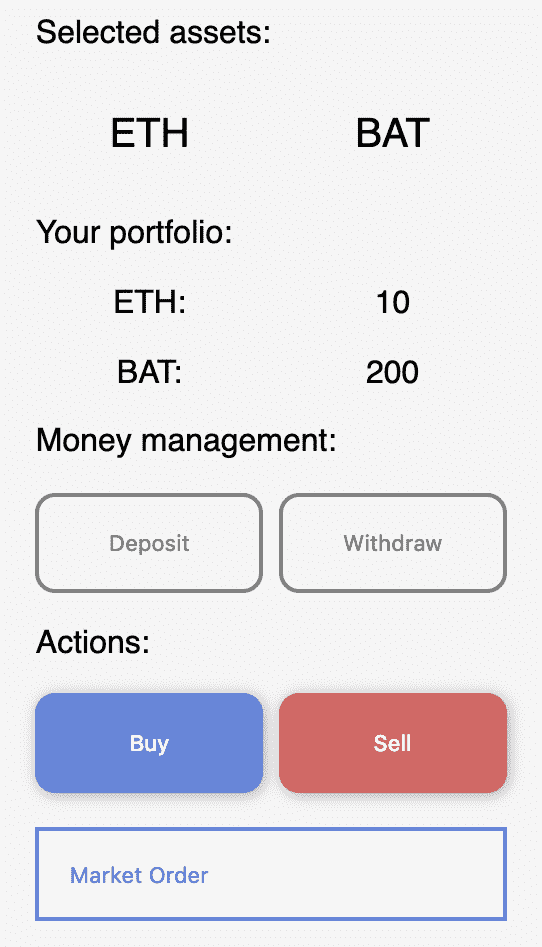
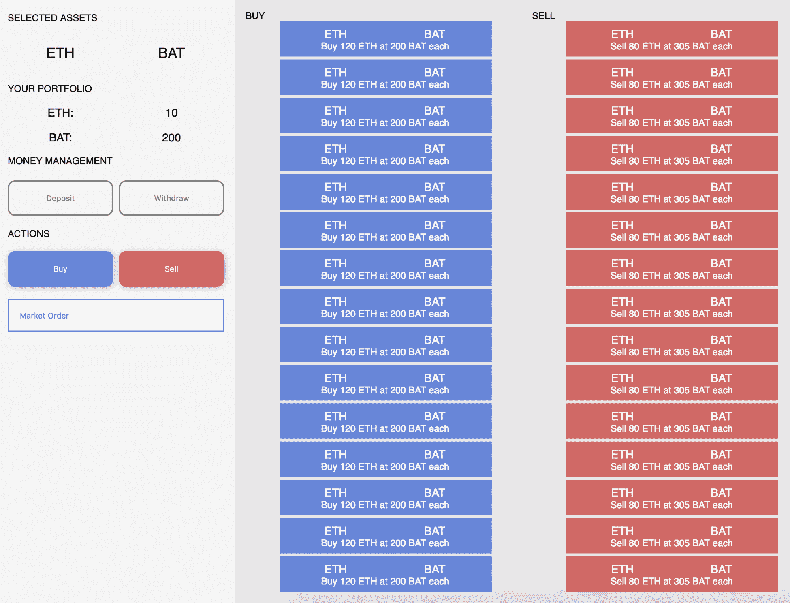
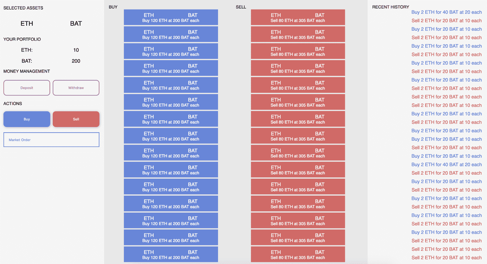

# 分散的 Exchanges 工作流

去中心化交易所，也被称为 **DAXs** ，是一个热门话题，原因很简单，所有加密货币都需要由他人进行交换，以赋予它们某种效用。你能想象一个不能用比特币换美元的世界吗？还是以太坊换比特币？这将摧毁大多数加密货币的现实效用。这就是为什么我们有交易所，允许各种货币在自由市场上交易。我们将从解释 DAXs 开始，这样你就能理解它们背后的想法。然后你就会明白订单是怎么下的，怎么安全的管理用户资金。之后，您将创建一个具有复杂智能契约和详细接口的真实世界 DAX。

在本章中，我们将讨论以下主题:

*   引入分散式交易所
*   了解交易和匹配引擎
*   管理加密货币钱包和冷藏
*   构建用户界面
*   构建以太坊后端
*   完成 dApp

# 引入分散式交易所

DAX 到底是什么？正常的交易，比如股票市场，是建立在一个中央系统上的，在这个系统中，一个服务器处理所有的订单并将结果显示给用户。他们运行非常高效的系统，建立起来非常昂贵，尽管考虑到他们提供的效用，这是可以理解的。另一方面，DAXs 不依赖于中央系统，所有订单都必须通过服务器进行必要的计算。相反，DAX 在以太坊的基础设施上工作，为用户提供一个可以由任何人执行并由巨大的计算机网络处理的系统。

与集中式交易所相比，DAX 的第一个不同之处是它们受到背后技术的限制。你不能创建一个交易法定货币的 DAX，比如美元或欧元，因为这些货币是基于不同的技术；它们运行在一个不同的市场上，被称为外汇市场，世界各地的银行在这里交易全球货币。同样，你不能在证券交易所交易 ERC20 代币，因为它们运行在以太坊之上，而在这些集中式交易所工作的开发人员没有在这些系统之间建立流畅连接所需的工具——主要原因是速度上的差异。

以太坊自然会进行较慢的交易，因为它们必须得到网络每个节点的确认。这就是为什么它预计将在 DAXs 中有一个缓慢的交易系统。然而，有缩放技术，如*等离子*和*国家频道*，让你在初始设置后更有效地交易。我们将探索它们是如何工作的，我们将构建一个 DAX，以便您了解它们是如何工作的。你甚至可以创建自己的规则。

# DAX 的缺点

DAX 通常较慢，因为除非你依赖一对货币之间的链外系统，否则你无法进行即时交易，当你希望在其他加密货币之间进行交易时，会减慢你的速度。

在某种意义上，它们也是有限的，因为你不能交易基于不同区块链的法定货币或加密货币。例如，将**比特币**(**【BTC】**)兑换为**以太坊** ( **ETH** )的唯一方法是建立一个集中系统，同时持有这两种货币，并在任何给定时刻为用户提供公平的兑换。有几个项目集成了这两种货币，但它们还很年轻，需要成熟才能流行起来。

DAX 还没有被主流公众使用，所以它们还没有达到应有的水平，因为我们缺乏创建没有问题的交易所所需的工具和协议。

# 达克斯的优点

另一方面，这些类型的交易所有潜力克服大多数依赖集中交易的市场的过时技术。因为它们是从零开始创建的，所以他们可以从其他项目中吸取所有优秀的东西，并用更好的特性来实现它们。

默认情况下，DAX 可以处理数千个令牌，因为它们中的大多数都实现了 ERC20 标准，这为它们提供了大量的可能性。有一些伟大的项目正在构建协议，例如 **0xprotocol** ，开发者可以在他们自己的系统中实现一组已知的功能，这样他们就可以像一个全球互联的 DAX 系统一样自由通信。事实上，0xprotocol 在许多交易所之间共享代币的流动性，使它们有权在没有要求的情况下作为交易者进行交易。

随着核心以太坊团队开发新的缩放解决方案，DAX 将大幅改善，交易速度更快，类似于真实的集中式市场，使以太坊成为全球虚拟货币经济的核心参与者。

许多成功的交易所都在不断改进，以扩大分散技术的可能性，他们使用稳定的硬币，如 Tether 和 USD 硬币，以保持法币支持的恒定价值，从而弥合两个世界之间的差距。

我们可以在几本不同的书中花几个小时来谈论 DAX，但我试图强调的一点是，DAX 有潜力超越现有技术，成为全球集中和分散货币市场的主要场所。这就是为什么我想让你明白，通过建立一个基于 solidity smart contracts 的简单 DAX，你可以获得为创建 DAX 的许多公司工作所需的实践经验，甚至可以创建自己的 DAX，因为它们是去中心化技术的核心要素之一。

# 基本交易条款

交流的世界是广阔而复杂的；这就是为什么使用它们的人们创造了许多术语来帮助彼此理解它们的确切含义。例如，不要说*我想买 10 BTC，希望它在未来*上涨，而是说*我想做多 10 BTC* 。它们的意思是一样的，但这是一种更精确的相互交流方式。

让我们通过一些重要的术语来理解外汇市场的一些方面:

*   **市价单**:以最低或最高价格卖出或买入一种货币的行为。你看，在交易所里有卖家和买家，那些想卖掉一些货币的和那些想得到一些货币的。他们每个人都为他们想要的回报设定了一个价格，而且价格总是成对的。例如，*我想以 50 ETH* 的价格购买 10 辆 BTC。在这种情况下，对将是 BTC-ETH，因为你说你想得到 ETH 来交换你的比特币；在那里，你同时是比特币的买家和以太的卖家。人们设定不同的价格，所以当你做市价单时，你只是以最大利润买入或卖出。当你用美元在网上买东西时，也会发生同样的事情。如果你和我一样是欧洲人，你会注意到网上的许多东西都是用美元标价的，这使得你不可能用欧元来购买这些东西，而且它们不是一回事。那么当你买一本书时会发生什么呢？在后端，一些程序按照市场设定的价格将欧元兑换成美元，然后用美元买书。
*   **限价单**:以自己设定的固定价格卖出或买入的动作。这些类型的订单用于那些预测价格变动或愿意等待更长时间才能完成订单的客户。
*   经纪人:为你的交易活动提供带息贷款的人。经纪人通常会帮助你采取行动，比如执行你的交易，因为他们有更多的钱，所以他们在你所在的交易所享有特权。
*   保证金账户:一种特殊类型的用户账户，你可以在交易时向经纪人借钱。
*   **多头买入**:买入特定货币的行为，因为你相信它会升值以获利，或者支持货币背后的技术。
*   卖空:当你做空的货币贬值时，你就赢了。例如，你可以说，*我打算做空欧元，因为我相信未来五天价格会下跌*。在这个系统中，你可以卖出不属于你的货币。背后的推理包括以下内容:
    *   首先，你从另一个人那里借钱，这个人叫做经纪人，他会给你想要做空的货币，比如你要做空的 100 ETH。
    *   你自动以市场价卖出那 100 个 ETH。
    *   稍后，你购买这 100 个 ETH。这叫平仓。例如，20 天后，你以市价买入 100 个 ETH 来平仓。
    *   你的输赢取决于买卖时的价格。如果你在高价时开始做空，在低价时平仓，你就赢了差价。例如，如果您以 20 美元的价格做空 100 个 ETH，并在 5 天后平仓，而 ETH 的价值为 10 美元，那么您每一个 ETH 将赢得 10 美元，或者总共 100 个 ETH×$ 10 = 1000 美元。
    *   通常卖空只适用于保证金账户。你可以通过这些账户从经纪人那里借钱，但有一些限制。

还有买价和卖价，相当于买和卖。现在你已经更好地理解了一些复杂的概念，你可以继续学习更多关于我们将在本章中构建的 DAX。

# 了解交易和匹配引擎

交易和匹配引擎是一组使用不同类型的算法来创建和关闭订单的功能。一种算法可以专注于完成价格较高的订单或之前执行的订单。这取决于开发者的喜好。因为我们将使用智能合约和 ERC20 令牌，所以我们的引擎将专注于尽快完成订单，因为关闭订单的将是用户，因为前端是大多数逻辑所在的地方。

由于天然气价格昂贵，我们无法在智能合约上处理大量信息，因此我们让 React 应用程序控制交易，以节省人们的资金。

让我们从规划我们将需要的功能开始，以便我们在创建合同和前端功能时有一个坚实的基础:

```
/// @notice To create a limit order for buying the _symbolBuy while selling the _symbolSell.
/// @param _symbolBuy The 3 character or more name of the token to buy.
/// @param _symbolSell The 3 character or more name of the token to sell.
/// @param _priceBid The price for how many _symbolBuy tokens you desire to buy. For instance: buy 10 ETH for 1 BTC.
/// @param _priceAsk The price for how many tokens you desire to sell of the _symbolSell in exchange for the _symbolBuy. For instance: sell 10 BTC for 2 ETH.
function createLimitOrder(bytes32 _symbolBuy, bytes32 _symbolSell, uint256 _priceBid, uint256 _priceAsk) public {}

```

该函数签名(有参数但没有函数体的函数名)将负责生成限价单。让我们看一些例子，并检查函数的签名是否正确:

比如，*我要卖 7 个 BTC 换 90 个 ETH* ，执行下面的代码:*T3】*

```
function createLimitOrder("ETH","BTC", 90, 7);
```

如您所见，我们颠倒了符号的顺序，将该卖出订单转换为买入订单，用户愿意用`ETH`交换`BTC`。仅仅用一个功能也是一样的效果，而不是为了销售而创造一个专属的功能。

例如，*我想用 20 ETH* 买 10 个 BTC。

```
function createLimitOrder("BTC", "ETH", 10, 20);
```

在这种情况下，我们将符号按照预期的顺序排列，因为我们正在创建一个限价单，在卖出`ETH`的同时买入`BTC`。现在我们可以创建市场订单函数的签名。

市价订单很有意思，因为我们希望以尽可能低或高的价格立即完成订单。在引擎盖下发生的事情是，我们正在用我们的市价单关闭限价单。然而，通常不可能以最新的市场价格完成整个订单，原因很简单，最有利可图的限价订单是买入或卖出最小数量的代币。

例如，我们想以 TokenB 的市场价格出售 10 个 TokenA。最有利可图的限价单说*用 40 TokenB* 购买 5 TokenA。在这种情况下，1 TokenA 的价格将是 8 TokenB，反之亦然。因此，我们创建了市价单，并立即卖出 5 个 TokenA，从限价单中买入 40 个 TokenB，但我们想卖出的剩余 5 个 TokenA 会发生什么情况呢？我们转到下一个最有利可图的购买订单，上面写着*用 700 TokenB* 购买 100 TokenA。那样的话，1 TokenA 的价格就是 7 TokenB，虽然比上一个利润少但还是不错的。因此，我们卖出 5 个 tokenA 来换取 35 个 TokenB，在下一个用户完成之前，在*用 665 个 TokenB* 购买 95 个 TokenA。

最后，我们利用特定时刻的市场价格组合(取决于当时最有利可图的限价单),用 10 个 TokenA 得到了 75 个 TokenB。有了这种理解，我们就可以创建我们的市场订单函数的签名:

```
/// @notice The function to create market orders by filling existing limit orders
/// @param _type The type of the market order which can be "Buy" or "Sell"
/// @param _symbol The token that we want to buy or sell
/// @param _maxPrice The maximum price we are willing to sell or buy the token for, set it to 0 to not limit the order
function createMarketOrder(bytes32 _type, bytes32 _symbol, uint256 _maxPrice);
```

`_maxPrice`参数是一个简单的数字，表示你愿意卖的最低价格，或者你愿意买的最高价格。默认情况下，它是零，这是无限的，所以你会得到最有利可图的价格，只要有卖方或买方可用。

# 管理加密货币钱包和冷藏

当涉及到存储人们的资金时，我们必须额外注意我们是如何做的，因为使用我们的 DAX 可能会有损失数百万美元的风险。这就是为什么最大的交易所使用冷藏设备，并配备了许多安全系统。本质上，他们将资金离线保存在远程位置，存储在根据他们的需求定制的安全硬件设备中，如 Trezor、Ledger 或他们自己的设备。

在我们的例子中，我们将在一系列智能合约中存储资金，称为 **escrows** ，其唯一目标是存储人们的钱。将有一个与每个用户帐户相关的托管合同，以独立保护他们的所有资金。该托管合同将具有接收资金的功能，只有 ERC20 令牌，以及提取可由该托管的所有者执行的资金的功能。继续创建一个名为`decentralized-exchange`的文件夹，然后运行`truffle init`和`npm init -y`命令，并在名为`Escrow.sol`的`contracts/`文件夹中创建一个合同。以下是我们的托管将看起来。

首先，它包含用于 ERC20 令牌的接口，因为我们不需要整个实现就能使用令牌进行交易:

```
pragma solidity 0.5.4;

interface IERC20 {
    function transfer(address to, uint256 value) external returns (bool);
    function approve(address spender, uint256 value) external returns (bool);
    function transferFrom(address from, address to, uint256 value) external returns (bool);
    function totalSupply() external view returns (uint256);
    function balanceOf(address who) external view returns (uint256);
    function allowance(address owner, address spender) external view returns (uint256);
    event Transfer(address indexed from, address indexed to, uint256 value);
    event Approval(address indexed owner, address indexed spender, uint256 value);
}
```

然后我们添加`Escrow`契约，它将用于管理每个用户的资金:

```
contract Escrow {
    address public owner;

    modifier onlyOwner {
        require(msg.sender == owner, 'You must be the owner to execute that function');
        _;
    }

    /// @notice This contract does not accept ETH transfers
    function () external { revert(); }

    /// @notice To setup the initial tokens that the user will store when creating the escrow
    /// @param _owner The address that will be the owner of this escrow, must be the owner of the tokens
    constructor (address _owner) public {
        require(_owner != address(0), 'The owner address must be set');
        owner = _owner;
    }

    /// @notice To transfer tokens to another address, usually the buyer or seller of an existing order
    /// @param _token The address of the token to transfer
    /// @param _to The address of the receiver
    /// @param _amount The amount of tokens to transfer
    function transferTokens(address _token, address _to, uint256 _amount) public onlyOwner {
        require(_token != address(0), 'The token address must be set');
        require(_to != address(0), 'The receiver address must be set');
        require(_amount > 0, 'You must specify the amount of tokens to transfer');

        require(IERC20(_token).transfer(_to, _amount), 'The transfer must be successful');
    }

    /// @notice To see how many of a particular token this contract contains
    /// @param _token The address of the token to check
    /// @return uint256 The number of tokens this contract contains
    function checkTokenBalance(address _token) public view returns(uint256) {
        require(_token != address(0), 'The token address must be set');
        return IERC20(_token).balanceOf(address(this));
    }
}
```

这种合同接受象征性的转账，以保证资金的安全。每个用户将有一个独特的托管合同，以分散资金的位置，使攻击者不能集中在一个单一的地方。您可以使用`transferTokens()`功能管理里面的代币资金，并且您可以使用`checkTokenBalance()`功能查看合同里面的代币余额，这是一个简化的`.balanceOf()` ERC20 帮助器功能。最后，我添加了一个空的非 payable fallback 函数来避免接收 Ether，因为我们只需要里面的令牌。

我们稍后将使用这个`Escrow`合同来管理人们的资金，因为我们想要一个安全的地方来保存他们珍贵的代币。理想情况下，我们会创建一个在硬件设备中使用冷存储的系统，但这样的行动需要一个复杂的系统来安全地管理每一步，以防止中间人攻击。

# 构建用户界面

DAXs 的用户界面与传统交易所(如证券交易所)或集中式加密交易所(如**币安**)的用户界面相同。其想法是提供一种数据驱动的设计，在这种设计中，他们可以快速了解所选令牌对的情况。中心部分将用于数据，侧边栏将用于用户可能采取的行动，右侧的附加侧边栏将用于次要数据；在我们的案例中，它将用于过去的交易。

像往常一样，创建一个包含我们项目的`src`和`dist`文件夹。你可以从以前的项目中复制设置，看看我在[github.com/merlox/dapp](http://github.com/merlox/dapp)上的版本。我们的设计将基于大多数交易所，因为他们有一个研究过的公式，感觉很棒。在你的`index.js`文件中创建一个新的侧边栏。

首先，添加`Main`组件以及普通 React 应用程序所需的导入:

```
import React from 'react'
import ReactDOM from 'react-dom'
import './index.styl'

class Main extends React.Component {
    constructor() {
        super()
    }

    render() {
        return (
            <div>
                <Sidebar />
            </div>
        )
    }
}
```

然后添加带有用户可以执行的一些基本操作的`Sidebar`组件，例如添加或提取资金的资金管理部分，以及创建购买或销售订单的部分:

```
/// Create the basic sidebar html, then we'll add the style css
// The sidebar where you take all your actions
class Sidebar extends React.Component {
    constructor() {
        super()
        this.state = {
            showLimitOrderInput: false
        }
    }

    render() {
        return (
            <div className="sidebar">
                <div className="selected-assets-title">Selected assets:</div>
                <div className="selected-asset-one">ETH</div>
                <div className="selected-asset-two">BAT</div>
                <div className="your-portfolio">Your portfolio:</div>
                <div className="grid-center">ETH:</div><div className="grid-center">10</div>
                <div className="grid-center">BAT:</div><div className="grid-center">200</div>
                <div className="money-management">Money management:</div>
                <button className="button-outline">Deposit</button>
                <button className="button-outline">Withdraw</button>
                <div className="actions">Actions:</div>
                <button>Buy</button>
                <button className="sell">Sell</button>
                <select defaultValue="market-order" onChange={selected => {
                    if(selected.target.value == 'limit-order') this.setState({showLimitOrderInput: true})
                    else this.setState({showLimitOrderInput: false})
                }}>
                    <option value="market-order">Market Order</option>
                    <option value="limit-order">Limit Order</option>
                </select>
                <input ref="limit-order-amount" className={this.state.showLimitOrderInput ? '' : 'hidden'} type="number" placeholder="Price to buy or sell at..."/>
            </div>
        )
    }
}
```

您添加的类和元素完全由您决定。就我个人而言，我喜欢向用户展示他们正在交易的货币对，他们对每一个货币对的余额，以及一系列的操作，比如买、卖、存和取。然后我们可以添加一些`css`。在这个项目中，我们将使用一个被称为`stylus`(【stylus-lang.com】)的`css`预处理器，它允许你编写没有括号和嵌套类的`css`，以及许多其他好的特性。您可以按如下方式安装它:

```
npm i -S style-loader css-loader stylus-loader stylus
```

然后将其作为新的规则块添加到您的`webpack`配置文件中:

```
{
    test: /\.styl$/,
    exclude: /node_modules/,
    use: ['style-loader', 'css-loader', 'stylus-loader']
}
```

在你的源文件夹中创建一个新的`index.styl`文件，并添加你的手写笔代码。如果你想创作出和我一样的设计，可以在这里查看 GitHub 官方上的手写笔代码:[https://GitHub . com/merlox/decentralized-exchange/blob/master/src/index . styl](https://github.com/merlox/decentralized-exchange/blob/master/src/index.styl)。

这为我们的 DAX 生成了一个漂亮的侧边栏。记得将您的文件与`webpack -w -d`捆绑在一起:



正如你所看到的，Stylus 允许你写干净的、可嵌套的`css`来组织大块的样式，这样你的项目更容易维护。最后，代码被转换成可以在所有浏览器上运行的有效的`css`,因为 Stylus 正确地编译了每个文件。然后，我们可以添加一个交易部分，在那里我们将显示所有对在我们的交易所发生的交易，以便人们了解他们的硬币的整体价格。

首先，向状态对象添加新的状态交易，并向`Main`组件添加假数据，这样我们就可以看到 dApp 在最终设计完成后的样子:

```
import React from 'react'
import ReactDOM from 'react-dom'
import './index.styl'

class Main extends React.Component {
    constructor() {
        super()

        this.state = {
            trades: [{
                id: 123,
                type: 'buy',
                firstSymbol: 'ETH',
                secondSymbol: 'BAT',
                quantity: 120, // You want to buy 120 firstSymbol
                price: 200 // When buying, you get 1 firstSymbol for selling 200 secondSymbol
            }, {
                id: 927,
                type: 'sell',
                firstSymbol: 'ETH',
                secondSymbol: 'BAT',
                quantity: 80, // You want to buy 80 secondSymbol
                price: 305 // When selling, you get 305 secondSymbol for selling 1 firstSymbol
            }],
            history: [{
                id: 927,
                type: 'buy',
                firstSymbol: 'ETH',
                secondSymbol: 'BAT',
                quantity: 2,
                price: 20
            }, {
                id: 927,
                type: 'sell',
                firstSymbol: 'ETH',
                secondSymbol: 'BAT',
                quantity: 2, // You want to buy 80 secondSymbol
                price: 10 // When selling, you get 305 secondSymbol for selling 1 firstSymbol
            }]
        }
    }
```

之后，通过将道具传递给`Trades`和`History`组件，用新的状态对象更新`render()`函数:

```

    render() {
        return (
            <div className="main-container">
                <Sidebar />
                <Trades
                    trades={this.state.trades}
                />
                <History
                    history={this.state.history}
                />
            </div>
        )
    }
}

```

创建新的`Trades`组件，以便它显示我们刚刚添加的交易:

```
// The main section to see live trades taking place
class Trades extends React.Component {
    constructor() {
        super()
    }

    render() {
        let buyTrades = this.props.trades.filter(trade => trade.type == 'buy')
        buyTrades = buyTrades.map((trade, index) => (
            <div key={trade.id + index} className="trade-container buy-trade">
                <div className="trade-symbol">{trade.firstSymbol}</div>
                <div className="trade-symbol">{trade.secondSymbol}</div>
                <div className="trade-pricing">{trade.type} {trade.quantity} {trade.firstSymbol} at {trade.price} {trade.secondSymbol} each</div>
            </div>
        ))
        let sellTrades = this.props.trades.filter(trade => trade.type == 'sell')
        sellTrades = sellTrades.map((trade, index) => (
            <div key={trade.id + index} className="trade-container sell-trade">
                <div className="trade-symbol">{trade.firstSymbol}</div>
                <div className="trade-symbol">{trade.secondSymbol}</div>
                <div className="trade-pricing">{trade.type} {trade.quantity} {trade.firstSymbol} at {trade.price} {trade.secondSymbol} each</div>
            </div>
        ))
        return (
            <div className="trades">
                <div className="buy-trades-title heading">Buy</div>
                <div className="buy-trades-container">{buyTrades}</div>
                <div className="sell-trades-title heading">Sell</div>
                <div className="sell-trades-container">{sellTrades}</div>
            </div>
        )
    }
}
```

正如你所看到的，我们添加了许多样本交易和历史交易，因为我们需要它们来了解我们的交易所在真实环境中的样子；注意我们是如何更新`Main`组件来将状态数据传递给每个组件的。然后我们可以添加一些手写笔，使它看起来很好。在 GitHub 官方上查看最终的手写笔代码这里:[https://GitHub . com/merlox/decentralized-exchange/blob/master/src/index . styl](https://github.com/merlox/decentralized-exchange/blob/master/src/index.styl.)。

才能得到好看的设计。请注意，我在`Main`组件的状态中包含了 15 个交易对象和 15 个历史交易对象，这样我们就可以看到 dApp 在满载时的样子:



每个买卖部分顶部的交易是该加密货币对的市场价格，因为市场订单总是在特定时刻最有利可图的交易。随着人们交易不同的货币，这些交易会实时更新。这是理解价格变动的绝佳方式。最后，我们可以添加`History`部分，它将显示最近的交易:

```
// Past historical trades
class History extends React.Component {
    constructor() {
        super()
    }

    render() {
        const historicalTrades = this.props.history.map((trade, index) => (
            <div key={trade.id + index} className="historical-trade">
                <div className={trade.type == 'sell' ? 'sell-trade' : 'buy-trade'}>{trade.type} {trade.quantity} {trade.firstSymbol} for {trade.quantity * trade.price} {trade.secondSymbol} at {trade.price} each</div>
            </div>
        ))
        return (
            <div className="history">
                <div className="heading">Recent history</div>
                <div className="historical-trades-container">{historicalTrades}</div>
            </div>
        )
    }
}

ReactDOM.render(<Main />, document.querySelector('#root'))

```

记得从`react-dom`包中添加`render()`函数来渲染你的组件。然后我们可以再增加一些`css`:

```
.history
    padding: 15px
    background-color: whitesmoke
    height: 100vh
    overflow: auto

    .historical-trades-container
        text-align: center

        .historical-trade
            font-size: 0.95em
            margin-bottom: 10px

            &:first-letter
                text-transform: uppercase

            .sell-trade
                color: rgb(223, 98, 98)

            .buy-trade
                color: rgb(98, 133, 223)
```

现在，如果你运行`webpack`和`http-server`，你会看到我们的成品。它对移动设备没有响应，因为我们的目标是创建一个用于桌面计算机的交换，并且验证每个断点以适应手机和平板电脑的不同维度是一项非常耗时的任务:



这将是我们的基本设计。可以用 ERC20 代币自由添加更多货币对，用 D3.js 添加图形，甚至状态通道！本书中展示的项目的伟大之处在于，您可以在现有结构的基础上创建一个真正高质量的产品，用于 ICO 或用您自己的解决方案来发展 dApps 的生态系统。让我们继续构建创建交易所需的智能合约，并使用 DAX 和 MetaMask。

# 构建以太坊后端

我们项目的后端将负责生成交易，任何人都可以填充，只要他们有足够的资金支付既定的价格。当用户注册后，他们将部署一个托管合同，该合同将由我们的主 DAX 合同使用。因此，让我们从设置需求和合同结构开始，然后开始填充我们在第四章、*掌握智能合同*中学习的所有功能来练习系统以提高开发人员的效率。

首先在文件开头的大注释中定义我们需要的函数:

```
// Functions that we need:
/*
    1\. Constructor to setup the owner
    2\. Fallback non-payable function to reject ETH from direct transfers since we only want people to use the functions designed to trade a specific pair
    3\. Function to extract tokens from this contract in case someone mistakenly sends ERC20 to the wrong function
    4\. Function to create whitelist a token by the owner
    5\. Function to create market orders
    6\. Function to create limit orders
 */
```

设置使用的 Solidity 版本，导入`Escrow`契约，定义令牌接口:

```
pragma solidity ^0.5.4;

import './Escrow.sol';

interface IERC20 {
    function transfer(address to, uint256 value) external returns (bool);
    function approve(address spender, uint256 value) external returns (bool);
    function transferFrom(address from, address to, uint256 value) external returns (bool);
    function totalSupply() external view returns (uint256);
    function balanceOf(address who) external view returns (uint256);
    function allowance(address owner, address spender) external view returns (uint256);
    event Transfer(address indexed from, address indexed to, uint256 value);
    event Approval(address indexed owner, address indexed spender, uint256 value);
}
```

通过首先定义我们将用于创建新订单的`Order`结构来创建`DAX`契约:

```
contract DAX {
    event TransferOrder(bytes32 _type, address indexed from, address indexed to, bytes32 tokenSymbol, uint256 quantity);
    enum OrderState {OPEN, CLOSED}

    struct Order {
        uint256 id;
        address owner;
        bytes32 orderType;
        bytes32 firstSymbol;
        bytes32 secondSymbol;
        uint256 quantity;
        uint256 price;
        uint256 timestamp;
        OrderState state;
    }
```

然后定义管理买卖订单所需的许多变量，同时将令牌列入白名单:

```
    Order[] public buyOrders;
    Order[] public sellOrders;
    Order[] public closedOrders;
    uint256 public orderIdCounter;
    address public owner;
    address[] public whitelistedTokens;
    bytes32[] public whitelistedTokenSymbols;
    address[] public users;
```

创建添加和管理令牌符号以及根据给定 id 查找订单所需的映射:

```
    // Token address => isWhitelisted or not
    mapping(address => bool) public isTokenWhitelisted;
    mapping(bytes32 => bool) public isTokenSymbolWhitelisted;
    mapping(bytes32 => bytes32[]) public tokenPairs; // A token symbol pair made of 'FIRST' => 'SECOND'
    mapping(bytes32 => address) public tokenAddressBySymbol; // Symbol => address of the token
    mapping(uint256 => Order) public orderById; // Id => trade object
    mapping(uint256 => uint256) public buyOrderIndexById; // Id => index inside the buyOrders array
    mapping(uint256 => uint256) public sellOrderIndexById; // Id => index inside the sellOrders array
    mapping(address => address) public escrowByUserAddress; // User address => escrow contract address
```

然后，添加`onlyOwner`修饰符、返回的回退函数和构造函数:

```
    modifier onlyOwner {
        require(msg.sender == owner, 'The sender must be the owner for this function');
        _;
    }

    /// @notice Users should not send ether to this contract
    function () external {
        revert();
    }

    constructor () public {
        owner = msg.sender;
    }
```

用完整的 NatSpec 文档和函数签名定义白名单令牌函数。我突出显示了该函数，以便您可以清楚地将该函数与注释区分开:

```
     /// @notice To whitelist a token so that is tradable in the exchange
     /// @dev If the transaction reverts, it could be because of the quantity of token pairs, try reducing the number and breaking the transaction into several pieces
     /// @param _symbol The symbol of the token
     /// @param _token The token to whitelist, for instance 'TOK'
    /// @param _tokenPairSymbols The token pairs to whitelist for this new token, for instance: ['BAT', 'HYDRO'] which will be converted to ['TOK', 'BAT'] and ['TOK', 'HYDRO']
    /// @param _tokenPairAddresses The token pair addresses to whitelist for this new token, for instance: ['0x213...', '0x927...', '0x128...']
    function whitelistToken(bytes32 _symbol, address _token, bytes32[] memory _tokenPairSymbols, address[] memory _tokenPairAddresses) public onlyOwner {}
```

要管理令牌，请使用文档创建以下两个函数:

```
    /// @notice To store tokens inside the escrow contract associated with the user accounts as long as the users made an approval beforehand
    /// @dev It will revert is the user doesn't approve tokens beforehand to this contract
    /// @param _token The token address
    /// @param _amount The quantity to deposit to the escrow contract
    function depositTokens(address _token, uint256 _amount) public {}

    /// @notice To extract tokens
    /// @param _token The token address to extract
    /// @param _amount The amount of tokens to transfer
    function extractTokens(address _token, uint256 _amount) public {}
```

添加市场并使用正常工作所需的参数限制订单函数，因为这些将是用于创建订单并与 DAX 交互的主要函数:

```
    /// @notice To create a market order by filling one or more existing limit orders at the most profitable price given a token pair, type of order (buy or sell) and the amount of tokens to trade, the _quantity is how many _firstSymbol tokens you want to buy if it's a buy order or how many _firstSymbol tokens you want to sell at market price
    /// @param _type The type of order either 'buy' or 'sell'
    /// @param _firstSymbol The first token to buy or sell
    /// @param _secondSymbol The second token to create a pair
    /// @param _quantity The amount of tokens to sell or buy
    function marketOrder(bytes32 _type, bytes32 _firstSymbol, bytes32 _secondSymbol, uint256 _quantity) public {}

    /// @notice To create a market order given a token pair, type of order, amount of tokens to trade and the price per token. If the type is buy, the price will determine how many _secondSymbol tokens you are willing to pay for each _firstSymbol up until your _quantity or better if there are more profitable prices. If the type if sell, the price will determine how many _secondSymbol tokens you get for each _firstSymbol
    /// @param _type The type of order either 'buy' or 'sell'
    /// @param _firstSymbol The first symbol to deal with
    /// @param _secondSymbol The second symbol that you want to deal
    /// @param _quantity How many tokens you want to deal, these are _firstSymbol tokens
    /// @param _pricePerToken How many tokens you get or pay for your other symbol, the total quantity is _pricePerToken * _quantity
    function limitOrder(bytes32 _type, bytes32 _firstSymbol, bytes32 _secondSymbol, uint256 _quantity, uint256 _pricePerToken) public {}
```

最后，添加`view`函数，作为接口可能需要的重要变量的助手和获取器。尽量自己加。然后检查解决方案:

```
    /// @notice Sorts the selected array of Orders by price from lower to higher if it's a buy order or from highest to lowest if it's a sell order
    /// @param _type The type of order either 'sell' or 'buy'
    /// @return uint256[] Returns the sorted ids
 function sortIdsByPrices(bytes32 _type) public view returns (uint256[] memory) {}

    /// @notice Checks if a pair is valid
    /// @param _firstSymbol The first symbol of the pair
    /// @param _secondSymbol The second symbol of the pair
    /// @returns bool If the pair is valid or not
 function checkValidPair(bytes32 _firstSymbol, bytes32 _secondSymbol) public view returns(bool) {}

    /// @notice Returns the token pairs
    /// @param _token To get the array of token pair for that selected token
    /// @returns bytes32[] An array containing the pairs
 function getTokenPairs(bytes32 _token) public view returns(bytes32[] memory) {}
}
```

首先，我们设置了一个`event`来记录令牌转移，这样人们就可以看到令牌何时被出售或购买。我们可以添加更多的事件，但我会让你来发现你需要的事件。然后我们添加了大量必要的变量，从定义订单是未结还是已结的`enum`开始。我们为每个订单的每个属性添加了一个`struct`,以清楚地定义处理的是哪个令牌。

然后，我们添加了三个数组来存储现有订单，同时还添加了一些变量来将新令牌列入白名单，以便我们可以使用更广泛的加密货币进行交易。之后，我们添加了多个映射，以便在优化汽油成本的同时轻松找到每个特定订单。

我们添加了一个`onlyOwner`修饰符来限制对白名单功能的访问，以便在添加加密货币时不会太疯狂。我们添加了一个不允许 ETH 转账的回退函数，这样人们就不会向这个交易所发送资金，还添加了一个定义 DAX 所有者的构造函数。

然后我们添加了`whitelistToken()`函数，它接受一个令牌地址和一个符号数组来创建与主令牌的配对；这样，你就可以同时交易大量的对子。`depositTokens()`功能由希望增加代币余额的用户使用。他们可以直接将想要交易的令牌转移到其关联的托管合同，但用户首先必须创建一个新的托管，这只能通过此功能来完成。那么`Escrow`地址将在`escrowByUserAddress`映射中与该账户相关联。该存款功能还要求用户先前使用`approve()`功能来允许 DAX 合约将令牌转移到托管合约；否则就会失败。

接下来，`extractTokens()`函数用于将令牌从托管转移到用户的地址。这是`Escrow`契约中`transferTokens()`函数的快捷方式，便于令牌管理。之后，我们有复杂的市场和限价订单功能。这两个功能都很大，因为它们必须排序、更新和查找订单以匹配现有订单，同时还要在区块链的天然气使用限制范围内工作。我们很快就会看到它们是如何被深入实现的。最后，我们有一些助手函数来对订单进行排序，检查给定的一对标记是否存在，并检索标记对的数组。

让我们继续实现其中的一些功能。记得先从最简单的开始，然后逐步发展到更复杂的，这样你就有了一个坚实的结构。下面是`whitelisting`函数的样子:

```
/// @notice To whitelist a token so that is tradable in the exchange
/// @dev If the transaction reverts, it could be because of the quantity of token pairs, try reducing the number and breaking the transaction into several pieces
/// @param _symbol The symbol of the token
/// @param _token The token to whitelist, for instance 'TOK'
/// @param _tokenPairSymbols The token pairs to whitelist for this new token, for instance: ['BAT', 'HYDRO'] which will be converted to ['TOK', 'BAT'] and ['TOK', 'HYDRO']
/// @param _tokenPairAddresses The token pair addresses to whitelist for this new token, for instance: ['0x213...', '0x927...', '0x128...']
function whitelistToken(bytes32 _symbol, address _token, bytes32[] memory _tokenPairSymbols, address[] memory _tokenPairAddresses) public onlyOwner {
    require(_token != address(0), 'You must specify the token address to whitelist');
    require(IERC20(_token).totalSupply() > 0, 'The token address specified is not a valid ERC20 token');
    require(_tokenPairAddresses.length == _tokenPairSymbols.length, 'You must send the same number of addresses and symbols');

    isTokenWhitelisted[_token] = true;
    isTokenSymbolWhitelisted[_symbol] = true;
    whitelistedTokens.push(_token);
    whitelistedTokenSymbols.push(_symbol);
    tokenAddressBySymbol[_symbol] = _token;
    tokenPairs[_symbol] = _tokenPairSymbols;

    for(uint256 i = 0; i < _tokenPairAddresses.length; i++) {
        address currentAddress = _tokenPairAddresses[i];
        bytes32 currentSymbol = _tokenPairSymbols[i];
        tokenPairs[currentSymbol].push(_symbol);
        if(!isTokenWhitelisted[currentAddress]) {
            isTokenWhitelisted[currentAddress] = true;
            isTokenSymbolWhitelisted[currentSymbol] = true;
            whitelistedTokens.push(currentAddress);
            whitelistedTokenSymbols.push(currentSymbol);
            tokenAddressBySymbol[currentSymbol] = currentAddress;
        }
    }
}
```

白名单功能进行一些必要的检查，然后将每个给定的令牌对列入白名单，以便您可以独立地与它们进行交易。例如，如果你的主要代币符号是蝙蝠，而你的`_tokenPairSymbols`数组包含`['TOK', 'TIK']`，你将能够与蝙蝠-托克和蝙蝠- TIK 进行交易。简单的东西。只要保持少量的标记对，函数就不会耗尽。

以下是管理代币基金的后续功能:

```
/// @notice To store tokens inside the escrow contract associated with the user accounts as long as the users made an approval beforehand
/// @dev It will revert is the user doesn't approve tokens beforehand to this contract
/// @param _token The token address
/// @param _amount The quantity to deposit to the escrow contract
function depositTokens(address _token, uint256 _amount) public {
    require(isTokenWhitelisted[_token], 'The token to deposit must be whitelisted');
    require(_token != address(0), 'You must specify the token address');
    require(_amount > 0, 'You must send some tokens with this deposit function');
    require(IERC20(_token).allowance(msg.sender, address(this)) >= _amount, 'You must approve() the quantity of tokens that you want to deposit first');
    if(escrowByUserAddress[msg.sender] == address(0)) {
        Escrow newEscrow = new Escrow(address(this));
        escrowByUserAddress[msg.sender] = address(newEscrow);
        users.push(msg.sender);
    }
    IERC20(_token).transferFrom(msg.sender, escrowByUserAddress[msg.sender], _amount);
}

/// @notice To extract tokens
/// @param _token The token address to extract
/// @param _amount The amount of tokens to transfer
function extractTokens(address _token, uint256 _amount) public {
    require(_token != address(0), 'You must specify the token address');
    require(_amount > 0, 'You must send some tokens with this deposit function');
    Escrow(escrowByUserAddress[msg.sender]).transferTokens(_token, msg.sender, _amount);
}
```

存款功能检查用户是否有与其地址相关联的`Escrow`合同。如果没有，该函数创建一个新的`Escrow`，然后转移用户请求的令牌存款，只要他们以前在适当的 ERC20 合同中批准了一些令牌。

提取函数只是简单地将`transferTokens()`函数运行到所有者的地址，只要它们内部有一些以前的余额。否则它会恢复原状。

让我们继续讨论限价单功能。因为这是一个较大的函数，我们将把它分解成较小的部分，以便您理解每个部分是如何操作的。

首先，我们有一个基于您创建函数时遇到的更改的更新文档。改进文档永远不嫌晚:

```
/// @notice To create a market order given a token pair, type of order, amount of tokens to trade and the price per token. If the type is buy, the price will determine how many _secondSymbol tokens you are willing to pay for each _firstSymbol up until your _quantity or better if there are more profitable prices. If the type if sell, the price will determine how many _secondSymbol tokens you get for each _firstSymbol
/// @param _type The type of order either 'buy' or 'sell'
/// @param _firstSymbol The first symbol to deal with
/// @param _secondSymbol The second symbol that you want to deal
/// @param _quantity How many tokens you want to deal, these are _firstSymbol tokens
/// @param _pricePerToken How many tokens you get or pay for your other symbol, the total quantity is _pricePerToken * _quantity
```

然后，我们运行许多`require()`检查，以确保用户正确执行限价单功能:

```
function limitOrder(bytes32 _type, bytes32 _firstSymbol, bytes32 _secondSymbol, uint256 _quantity, uint256 _pricePerToken) public {
    address userEscrow = escrowByUserAddress[msg.sender];
    address firstSymbolAddress = tokenAddressBySymbol[_firstSymbol];
    address secondSymbolAddress = tokenAddressBySymbol[_secondSymbol];

    require(firstSymbolAddress != address(0), 'The first symbol has not been whitelisted');
    require(secondSymbolAddress != address(0), 'The second symbol has not been whitelisted');
    require(isTokenSymbolWhitelisted[_firstSymbol], 'The first symbol must be whitelisted to trade with it');
    require(isTokenSymbolWhitelisted[_secondSymbol], 'The second symbol must be whitelisted to trade with it');
    require(userEscrow != address(0), 'You must deposit some tokens before creating orders, use depositToken()');
    require(checkValidPair(_firstSymbol, _secondSymbol), 'The pair must be a valid pair');
```

之后，如果用户正在创建限价单，则执行`buy`功能:

```
    Order memory myOrder = Order(orderIdCounter, msg.sender, _type, _firstSymbol, _secondSymbol, _quantity, _pricePerToken, now, OrderState.OPEN);
    orderById[orderIdCounter] = myOrder;
    if(_type == 'buy') {
        // Check that the user has enough of the second symbol if he wants to buy the first symbol at that price
        require(IERC20(secondSymbolAddress).balanceOf(userEscrow) >= _quantity, 'You must have enough second token funds in your escrow contract to create this buy order');

        buyOrders.push(myOrder);

        // Sort existing orders by price the most efficient way possible, we could optimize even more by creating a buy array for each token
        uint256[] memory sortedIds = sortIdsByPrices('buy');
        delete buyOrders;
        buyOrders.length = sortedIds.length;
        for(uint256 i = 0; i < sortedIds.length; i++) {
            buyOrders[i] = orderById[sortedIds[i]];
            buyOrderIndexById[sortedIds[i]] = i;
        }
```

否则，更改添加订单的数组，同时对添加后的订单进行排序:

```
    } else {
        // Check that the user has enough of the first symbol if he wants to sell it for the second symbol
        require(IERC20(firstSymbolAddress).balanceOf(userEscrow) >= _quantity, 'You must have enough first token funds in your escrow contract to create this sell order');

        // Add the new order
        sellOrders.push(myOrder);

        // Sort existing orders by price the most efficient way possible, we could optimize even more by creating a sell array for each token
        uint256[] memory sortedIds = sortIdsByPrices('sell');
        delete sellOrders; // Reset orders
        sellOrders.length = sortedIds.length;
        for(uint256 i = 0; i < sortedIds.length; i++) {
            sellOrders[i] = orderById[sortedIds[i]];
            sellOrderIndexById[sortedIds[i]] = i;
        }
    }

    orderIdCounter++;
}
```

这是整个限价单函数分解成易于理解的部分，以解释每个语句背后的逻辑。您看到我们使用了`sortIdsByPrices`函数，因为我们需要对订单数组进行排序。下面是排序函数完成后的样子。请注意，该函数是一个`view`类型的函数，这意味着运行所有计算不会消耗任何气体，因为它们将在本地完成，因此排序后的数组可以是无限的:

```
/// @notice Sorts the selected array of Orders by price from lower to higher if it's a buy order or from highest to lowest if it's a sell order
/// @param _type The type of order either 'sell' or 'buy'
/// @return uint256[] Returns the sorted ids
function sortIdsByPrices(bytes32 _type) public view returns (uint256[] memory) {
    Order[] memory orders;
    if(_type == 'sell') orders = sellOrders;
    else orders = buyOrders;

    uint256 length = orders.length;
    uint256[] memory orderedIds = new uint256[](length);
    uint256 lastId = 0;
    for(uint i = 0; i < length; i++) {
        if(orders[i].quantity > 0) {
            for(uint j = i+1; j < length; j++) {
                // If it's a buy order, sort from lowest to highest since we want the lowest prices first
                if(_type == 'buy' && orders[i].price > orders[j].price) {
                    Order memory temporaryOrder = orders[i];
                    orders[i] = orders[j];
                    orders[j] = temporaryOrder;
                }
                // If it's a sell order, sort from highest to lowest since we want the highest sell prices first
                if(_type == 'sell' && orders[i].price < orders[j].price) {
                    Order memory temporaryOrder = orders[i];
                    orders[i] = orders[j];
                    orders[j] = temporaryOrder;
                }
            }
            orderedIds[lastId] = orders[i].id;
            lastId++;
        }
    }
    return orderedIds;
}
```

注意`sortIdsByPrice()`功能。它读取包含订单结构的相应状态变量，然后按照升序(如果是限价买入订单)或降序(如果是限价卖出订单)组织订单。我们需要它来执行限价单功能。

`limitOrder()`函数从检查参数是否有效以及代币是否可以交易开始。根据请求的订单类型，它会将新的`Order` struct 实例推送到`sellOrders()`或`buyOrders()`数组，同时对这些数组进行排序，以将新的限价订单推送到正确的位置。请记住，我们的想法是对订单进行排序，这样我们就可以快速找到利润最高的订单；这就是为什么我们有排序函数。最后，它更新订单数组和订单索引的映射，这样我们以后就可以找到每个`Order`实例在这些数组中的位置。

现在，我们可以看看海量的`marketOrder`函数实现；这是我自己的做法，我建议你试着从零开始重新创建一个市场订单函数，考虑所有的气体限制和局限性。它并不完美，但它清楚地展示了 DAX 交易所是如何运作的。下面是功能分解，供你理解。首先，更新函数的文档，确保它解释了内部执行的内容:

```
/// @notice To create a market order by filling one or more existing limit orders at the most profitable price given a token pair, type of order (buy or sell) and the amount of tokens to trade, the _quantity is how many _firstSymbol tokens you want to buy if it's a buy order or how many _firstSymbol tokens you want to sell at market price
/// @param _type The type of order either 'buy' or 'sell'
/// @param _firstSymbol The first token to buy or sell
/// @param _secondSymbol The second token to create a pair
/// @param _quantity The amount of tokens to sell or buy
```

然后添加`require()`函数检查来验证给定的令牌是有效的，并且数量是正确的:

```
function marketOrder(bytes32 _type, bytes32 _firstSymbol, bytes32 _secondSymbol, uint256 _quantity) public {
    require(_type.length > 0, 'You must specify the type');
    require(isTokenSymbolWhitelisted[_firstSymbol], 'The first symbol must be whitelisted');
    require(isTokenSymbolWhitelisted[_secondSymbol], 'The second symbol must be whitelisted');
    require(_quantity > 0, 'You must specify the quantity to buy or sell');
    require(checkValidPair(_firstSymbol, _secondSymbol), 'The pair must be a valid pair');
```

就像限价单功能一样，我们根据现有订单的状态执行买入或卖出功能:

```
    // Fills the latest market orders up until the _quantity is reached
    uint256[] memory ordersToFillIds;
    uint256[] memory quantitiesToFillPerOrder;
    uint256 currentQuantity = 0;
    if(_type == 'buy') {
        ordersToFillIds = new uint256[](sellOrders.length);
        quantitiesToFillPerOrder = new uint256[](sellOrders.length);
        // Loop through all the sell orders until we fill the quantity
        for(uint256 i = 0; i < sellOrders.length; i++) {
            ordersToFillIds[i] = sellOrders[i].id;
            if((currentQuantity + sellOrders[i].quantity) > _quantity) {
                quantitiesToFillPerOrder[i] = _quantity - currentQuantity;
                break;
            }
            currentQuantity += sellOrders[i].quantity;
            quantitiesToFillPerOrder[i] = sellOrders[i].quantity;
        }
    } else {
        ordersToFillIds = new uint256[](buyOrders.length);
        quantitiesToFillPerOrder = new uint256[](buyOrders.length);
        for(uint256 i = 0; i < buyOrders.length; i++) {
            ordersToFillIds[i] = buyOrders[i].id;
            if((currentQuantity + buyOrders[i].quantity) > _quantity) {
                quantitiesToFillPerOrder[i] = _quantity - currentQuantity;
                break;
            }
            currentQuantity += buyOrders[i].quantity;
            quantitiesToFillPerOrder[i] = buyOrders[i].quantity;
        }
    }
```

在开发如此复杂的逻辑时，添加一些额外的注释也无妨。在这里，我添加了一些说明，以提醒自己该功能在更技术性的层面上应该如何工作:

```
    // When the myOrder.type == sell or _type == buy
    // myOrder.owner send quantityToFill[] of _firstSymbol to msg.sender
    // msg.sender send quantityToFill[] * myOwner.price of _secondSymbol to myOrder.owner

    // When the myOrder.type == buy or _type == sell
    // myOrder.owner send quantityToFill[] * myOwner.price of _secondSymbol to msg.sender
    // msg.sender send quantityToFill[] of _firstSymbol to myOrder.owner
```

现在，我们已经生成了一个要填充的订单数组和每个订单所需的数量，我们可以开始用另一个循环填充每个订单:

```
    // Close and fill orders
    for(uint256 i = 0; i < ordersToFillIds.length; i++) {
        Order memory myOrder = orderById[ordersToFillIds[i]];

        // If we fill the entire order, mark it as closed
        if(quantitiesToFillPerOrder[i] == myOrder.quantity) {
            myOrder.state = OrderState.CLOSED;
            closedOrders.push(myOrder);
        }
        myOrder.quantity -= quantitiesToFillPerOrder[i];
        orderById[myOrder.id] = myOrder;
```

我们必须按类型将其分解，以查看订单实际上是购买订单还是销售订单，从而保证我们以正确的数量履行正确的订单:

```
        if(_type == 'buy') {
            // If the limit order is a buy order, send the firstSymbol to the creator of the limit order which is the buyer
            Escrow(escrowByUserAddress[myOrder.owner]).transferTokens(tokenAddressBySymbol[_firstSymbol], msg.sender, quantitiesToFillPerOrder[i]);
            Escrow(escrowByUserAddress[msg.sender]).transferTokens(tokenAddressBySymbol[_secondSymbol], myOrder.owner, quantitiesToFillPerOrder[i] * myOrder.price);

            sellOrders[sellOrderIndexById[myOrder.id]] = myOrder;

            emit TransferOrder('sell', escrowByUserAddress[myOrder.owner], msg.sender, _firstSymbol, quantitiesToFillPerOrder[i]);
            emit TransferOrder('buy', escrowByUserAddress[msg.sender], myOrder.owner, _secondSymbol, quantitiesToFillPerOrder[i] * myOrder.price);
```

如果是卖出订单，我们会更改所用的数组，但逻辑是一样的:

```
        } else {
            // If this is a buy market order or a sell limit order for the opposite, send firstSymbol to the second user
                Escrow(escrowByUserAddress[myOrder.owner]).transferTokens(tokenAddressBySymbol[_secondSymbol], msg.sender, quantitiesToFillPerOrder[i] * myOrder.price);
            Escrow(escrowByUserAddress[msg.sender]).transferTokens(tokenAddressBySymbol[_firstSymbol], myOrder.owner, quantitiesToFillPerOrder[i]);

            buyOrders[buyOrderIndexById[myOrder.id]] = myOrder;

            emit TransferOrder('buy', escrowByUserAddress[myOrder.owner], msg.sender, _secondSymbol, quantitiesToFillPerOrder[i] * myOrder.price);
            emit TransferOrder('sell', escrowByUserAddress[msg.sender], myOrder.owner, _firstSymbol, quantitiesToFillPerOrder[i]);
        }

    }
}
```

乍一看，您可以看到我们有不少于三个`for`循环，这是非常不优化的，因为它一次只能处理几个订单，但它是 DAX 中少数不需要集中式服务器的解决方案之一。

首先，我们进行必要的检查，以验证用户正在创建一个有效的市场订单，该订单包含他们想要购买或出售的商品的适当的`approve()`,以便合同可以自由地购买代币。然后，我们开始遍历所有排序的订单数组，首先填充利润最高的订单，同时跟踪每个订单将填充多少代币。一旦我们有了要填写数量的订单列表，我们就可以继续填写每一个订单。我们怎么做呢？

我们更新每个订单的状态，以便我们将数量标记为零或减少的数量，同时还使用`enum OrderState.CLOSED`来标记那些已完成的订单。然后，我们将正确数量的令牌转移给每个用户。这就是`buyOrderIndexById[]`的映射特别有用的地方，因为我们想要更新一个特定的顺序，而不改变整个数组的顺序，从而节省气体和处理成本。最后，我们发出一些事件来表明我们进行了一些令牌传输。

应该就是这样！以下是整个合同，这样你可以看到它是如何联系在一起的。可在官方 GitHub 上获得，网址为[https://GitHub . com/merlox/decentralized-exchange/blob/master/contracts/DAX . sol](https://github.com/merlox/decentralized-exchange/blob/master/contracts/DAX.sol)。

这是一个相当大的合同，所以我建议您为它编写一些测试来验证它是否工作。你可以通过克隆我的 GitHub 来检查和运行我写的测试，所有代码如下:[https://github.com/merlox/decentralized-exchange](https://github.com/merlox/decentralized-exchange)。

# 完成 dApp

现在我们已经有了一个带有我们想要的逻辑的工作智能契约，我们可以在一个简单的 React 应用程序中使用 Truffle 和 web3.js 实现 dApp。首先在您的`index.js`文件中导入所需的组件:

```
import React from 'react'
import ReactDOM from 'react-dom'
import MyWeb3 from 'web3'
import './index.styl'
import ABI from '../build/contracts/DAX.json'
import TokenABI from '../build/contracts/ERC20.json'

const batToken = '0x850Cbb38828adF8a89d7d799CCf1010Dc238F665'
const watToken = '0x029cc401Ef45B2a2B2D6D2D6677b9F94E26cfF9d'
const dax = ABI.networks['3'].address
```

在这个原型中，我们将只使用两个令牌来帮助您学习如何创建应用程序，因为全功能的 DAX 超出了本书的范围。我们的目标是给你指明道路，这样如果你愿意，你可以创造一个更高级的 DAX。我们首先导入创建令牌实例和令牌地址所需的 ABI。这些是我们要用的代币。

首先用新的必需变量更新`Main`组件中的状态对象，我们将使用这些变量与智能契约进行交互。请注意我们是如何删除交易和历史数组的，因为我们将从合同中获取这些数据:

```
class Main extends React.Component {
    constructor() {
        super()

        this.state = {
            contractInstance: {},
            tokenInstance: {},
            secondTokenInstance: {},
            userAddress: '',
            firstSymbol: 'BAT', // Sample tokens
            secondSymbol: 'WAT', // Sample tokens
            balanceFirstSymbol: 0,
            balanceSecondSymbol: 0,
            escrow: '',
            buyOrders: [],
            sellOrders: [],
            closedOrders: []
        }

        this.setup()
    }
```

添加`bytes32()` helper 函数，该函数生成 web3.js 所需的有效十六进制字符串:

```
    // To use bytes32 functions
    bytes32(name) {
        return myWeb3.utils.fromAscii(name)
    }
```

然后创建`setup()`来初始化 web3.js 实例，同时获得用户同意使用他们的元掩码帐户凭证:

```
 async setup() {
        // Create the contract instance
        window.myWeb3 = new MyWeb3(ethereum)
        try {
            await ethereum.enable();
        } catch (error) {
            console.error('You must approve this dApp to interact with it')
        }
        console.log('Setting up contract instances')
        await this.setContractInstances()
        console.log('Setting up orders')
        await this.setOrders()
        console.log('Setting up pairs')
        await this.setPairs()
    }
```

因为 react 应用程序中的契约设置更加复杂，所以我们必须为可维护性创建一个单独的函数:

```
    async setContractInstances() {
        const userAddress = (await myWeb3.eth.getAccounts())[0]
        if(!userAddress) return console.error('You must unlock metamask to use this dApp on ropsten!')
        await this.setState({userAddress})
        const contractInstance = new myWeb3.eth.Contract(ABI.abi, dax, {
            from: this.state.userAddress,
            gasPrice: 2e9
        })
        const tokenInstance = new myWeb3.eth.Contract(TokenABI.abi, batToken, {
            from: this.state.userAddress,
            gasPrice: 2e9
        })
        const secondTokenInstance = new myWeb3.eth.Contract(TokenABI.abi, watToken, {
            from: this.state.userAddress,
            gasPrice: 2e9
        })
        await this.setState({contractInstance, tokenInstance, secondTokenInstance})
    }
```

在设置了 web3 和 contract 实例之后，我们可以开始从 smart contract 获取订单，用订单填充我们的用户界面。首先，我们得到用于循环所有订单的数组的长度。这是安全考虑数组中包含的所有元素的唯一方法:

```
    async setOrders() {
        // First get the length of all the orders so that you can loop through them
        const buyOrdersLength = await this.state.contractInstance.methods.getOrderLength(this.bytes32("buy")).call({ from: this.state.userAddress })
        const sellOrdersLength = await this.state.contractInstance.methods.getOrderLength(this.bytes32('sell')).call({ from: this.state.userAddress })
        const closedOrdersLength = await this.state.contractInstance.methods.getOrderLength(this.bytes32('closed')).call({ from: this.state.userAddress })
        let buyOrders = []
        let sellOrders = []
        let closedOrders = []
```

然后，我们通过独立调用每个组件的智能合约，开始遍历购买订单数组:

```
        for(let i = 0; i < buyOrdersLength; i++) {
            const order = await this.state.contractInstance.methods.getOrder(this.bytes32('buy'), i).call({ from: this.state.userAddress })
            const orderObject = {
                id: order[0],
                owner: order[1],
                type: myWeb3.utils.toUtf8(order[2]),
                firstSymbol: myWeb3.utils.toUtf8(order[3]),
                secondSymbol: myWeb3.utils.toUtf8(order[4]),
                quantity: order[5],
                price: order[6],
                timestamp: order[7],
                state: order[8],
            }
            buyOrders.push(orderObject)
        }
```

我们对销售订单数组做同样的事情:

```
        for(let i = 0; i < sellOrdersLength; i++) {
            const order = await this.state.contractInstance.methods.getOrder(this.bytes32('sell'), 0).call({ from: this.state.userAddress })
            const orderObject = {
                id: order[0],
                owner: order[1],
                type: myWeb3.utils.toUtf8(order[2]),
                firstSymbol: myWeb3.utils.toUtf8(order[3]),
                secondSymbol: myWeb3.utils.toUtf8(order[4]),
                quantity: order[5],
                price: order[6],
                timestamp: order[7],
                state: order[8],
            }
            sellOrders.push(orderObject)
        }
```

同样，我们对 closed orders 数组做同样的事情。我们需要这个来展示过去的历史交易，可以帮助人们了解他们加入之前发生了什么:

```
        for(let i = 0; i < closedOrdersLength; i++) {
            const order = await this.state.contractInstance.methods.closedOrders(this.bytes32('close'), 0).call({ from: this.state.userAddress })
            const orderObject = {
                id: order[0],
                owner: order[1],
                type: myWeb3.utils.toUtf8(order[2]),
                firstSymbol: myWeb3.utils.toUtf8(order[3]),
                secondSymbol: myWeb3.utils.toUtf8(order[4]),
                quantity: order[5],
                price: order[6],
                timestamp: order[7],
                state: order[8],
            }
            closedOrders.push(orderObject)
        }
        this.setState({buyOrders, sellOrders, closedOrders})
    }
```

最后，创建一个名为`setPairs()`的函数，它将在将来用于向平台添加新的令牌对。因为我们不想让我们创建的这个初始 DAX 过于复杂，所以我们将自己限制在由两个虚拟令牌组成的一个令牌对，名为`WAT`和`BAT`:

```
    async setPairs() {
        // Here you'd add all the logic to get all the token symbols, in this case we're keeping it simple with one fixed pair
        // If there are no pairs, whitelist a new one automatically if this is the owner of the DAX contract
        const owner = await this.state.contractInstance.methods.owner().call({ from: this.state.userAddress })
        const isWhitelisted = await this.state.contractInstance.methods.isTokenWhitelisted(batToken).call({ from: this.state.userAddress })
        if(owner == this.state.userAddress && !isWhitelisted) {
            await this.state.contractInstance.methods.whitelistToken(this.bytes32('BAT'), batToken, [this.bytes32('WAT')], [watToken]).send({ from: this.state.userAddress, gas: 8e6 })
        }

        // Set the balance of each symbol considering how many tokens you have in escrow
        const escrow = await this.state.contractInstance.methods.escrowByUserAddress(this.state.userAddress).call({ from: this.state.userAddress })
        const balanceOne = await this.state.tokenInstance.methods.balanceOf(escrow).call({ from: this.state.userAddress })
        const balanceTwo = await this.state.secondTokenInstance.methods.balanceOf(escrow).call({ from: this.state.userAddress })
        this.setState({escrow, balanceOne, balanceTwo})
 }
}
```

我们首先用整个应用程序所需的基本变量来设置构造函数。然后一个`setup()`函数负责获取所有的初始信息。`bytes32()`函数用于将普通字符串转换为十六进制，因为新版本的 web3 强制我们发送十六进制字符串而不是普通文本来标识`bytes32`变量。就个人而言，我更喜欢将`bytes32`变量写成字符串，但是`web3`是它们的框架，所以我们必须遵循它的编程风格。我们继续用`setContractInstances()`函数设置契约实例，从给定的地址和 ABI 开始我们的契约。

然后我们用`setOrders()`功能设置订单。这个看起来更可怕，因为它包含了更多的代码，但其思想是简单地从智能契约中获取每个订单，并将它们存储在 react 状态变量内的有组织的数组中。最后，我们用`setPairs()`设置令牌对，它用我们的令牌更新状态。

现在，我们需要实现智能合约中的其余功能。React dApp 中的白名单功能如下:

```
async whitelistTokens(symbol, token, pairSymbols, pairAddresses) {
    await this.state.contractInstance.methods.whitelistToken(this.bytes32(symbol), token, pairSymbols, pairAddresses).send({ from: this.state.userAddress })
}
```

然后，我们实现存款代币功能，这将增加用户添加到代币交易平台的可用余额。我已经添加了大量的注释，以便您了解正在发生的事情:

```
async depositTokens(symbol, amount) {
    if(symbol == 'BAT') {
        // Check the token balance before approving
        const balance = await this.state.tokenInstance.methods.balanceOf(this.state.userAddress).call({ from: this.state.userAddress })
        if(balance < amount) return alert(`You can't deposit ${amount} BAT since you have ${balance} BAT in your account, get more tokens before depositing`)
        // First approve to 0 to avoid errors and then increase it
        await this.state.tokenInstance.methods.approve(dax, 0).send({ from: this.state.userAddress })
        await this.state.tokenInstance.methods.approve(dax, amount).send({ from: this.state.userAddress })
        // Create the transaction
        await this.state.contractInstance.methods.depositTokens(batToken, amount).send({ from: this.state.userAddress })
    } else if(symbol == 'WAT') {
        // Check the token balace before approving
        const balance = await this.state.secondTokenInstance.methods.balanceOf(this.state.userAddress).call({ from: this.state.userAddress })
        if(balance < amount) return alert(`You can't deposit ${amount} WAT since you have ${balance} WAT in your account, get more tokens before depositing`)
        // First approve to 0 to avoid errors and then increase it
        await this.state.secondTokenInstance.methods.approve(dax, 0).send({ from: this.state.userAddress })
        await this.state.secondTokenInstance.methods.approve(dax, amount).send({ from: this.state.userAddress })
        // Create the transaction
        await this.state.contractInstance.methods.depositTokens(watToken, amount).send({ from: this.state.userAddress })
    }
}
```

提取令牌功能非常简单，将用于以下两种令牌:

```
async withdrawTokens(symbol, amount) {
    if(symbol == 'BAT') {
        await this.state.contractInstance.methods.extractTokens(batToken, amount).send({ from: this.state.userAddress })
    } else if(symbol == 'WAT') {
        await this.state.contractInstance.methods.extractTokens(watToken, amount).send({ from: this.state.userAddress })
    }
}
```

最后，我们必须实现限价和市价订单功能，具有讽刺意味的是，这是最小的功能，因为我们只需将所需的信息传递给智能合约，让它自己执行全部功能:

```
async createLimitOrder(type, firstSymbol, secondSymbol, quantity, pricePerToken) {
    // Create the limit order
    await this.state.contractInstance.methods.limitOrder(type, firstSymbol, secondSymbol, quantity, pricePerToken).send({ from: this.state.userAddress })
}

async createMarketOrder(type, firstSymbol, secondSymbol, quantity) {
    // Create the market order
    await this.state.contractInstance.methods.marketOrder(type, firstSymbol, secondSymbol, quantity).send({ from: this.state.userAddress })
}
```

白名单功能非常简单，因为我们只使用主以太坊地址从智能合约运行白名单功能。请记住，此功能只能由合同所有者执行。

存款令牌功能检查您的以太坊地址中是否有足够的令牌，然后它创建两个批准:第一个是将批准减少到零，因为我们无法安全地增加批准数量，因为该功能存在一些安全风险；第二个是`approve()`为所选代币存放所需数量的代币。然后，我们从我们的`DAX`契约中运行`depositTokens()`方法，将令牌移动到托管地址，如果用户还没有托管，则创建一个托管地址。

withdraw 函数简单地运行我们的`DAX`契约中的`extractTokens()`方法，将令牌从托管转移到用户的地址，因为我们不需要检查那里的任何东西。

然后我们转到`createLimitOrder()`函数。还记得`DAX`合同里有多复杂多庞大吗？在这种情况下，只需要将正确的参数放在正确的位置。稍后我们将在`render()`函数中看到我们如何获得这些参数。同样的事情也适用于运行我们的`DAX`合同中的`marketOrder`方法的`createMarketOrder()`。

下面是`render()`函数:

```
render() {
    return (
        <div className="main-container">
            <Sidebar
                firstSymbol={this.state.firstSymbol}
                secondSymbol={this.state.secondSymbol}
                balanceOne={this.state.balanceOne}
                balanceTwo={this.state.balanceTwo}
                deposit={(symbol, amount) => this.depositTokens(symbol, amount)}
                withdraw={(symbol, amount) => this.withdrawTokens(symbol, amount)}
                limitOrder={(type, firstSymbol, secondSymbol, quantity, pricePerToken) => this.createLimitOrder(type, firstSymbol, secondSymbol, quantity, pricePerToken)}
                marketOrder={(type, firstSymbol, secondSymbol, quantity) => this.createMarketOrder(type, firstSymbol, secondSymbol, quantity)}
            />
            <Orders
                buyOrders={this.state.buyOrders}
                sellOrders={this.state.sellOrders}
            />
            <History
                closedOrders={this.state.closedOrders}
            />
        </div>
    )
}
```

render 函数生成三个组件:`Sidebar`、`Orders`和`History`。这是我们之前创建的三个部分。在这种情况下，我们为每个组件添加了许多道具，以便于数据通信。您可以看到限价单和市价单道具只是接受参数并将其发送给`Main`组件的函数。

让我们探索一下我对每个组件的实现；这是我自己的做法，所以你可以看到达克斯应该是什么样子。我建议你根据你所学到的知识创建你自己的版本。下面是`Sidebar`组件；我们首先创建更新后的`constructor()`、`bytes32()`和`resetInputs()`函数，它们将用于渲染:

```
class Sidebar extends React.Component {
 constructor() {
        super()
        this.state = {
            selectedLimitOrder: false,
            limitOrderPrice: 0,
            orderQuantity: 0,
        }
 }

    // To use bytes32 functions
 bytes32(name) {
        return myWeb3.utils.fromAscii(name)
 }

 resetInputs() {
        this.refs.limitOrderPrice.value = ''
        this.refs.orderQuantity.value = ''
        this.setState({
            limitOrderPrice: 0,
            orderQuantity: 0,
        })
 }
```

本例中的`render()`函数对您来说有点太大，难以理解，所以我们将把它分成更小、更容易理解的部分。因为我们想给用户更多的选择，所以我们为每个令牌添加了存款和取款按钮，以保持简单:

```
 render() {
        return (
            <div className="sidebar">
                <div className="selected-assets-title heading">Selected assets</div>
                <div className="selected-asset-one">{this.props.firstSymbol}</div>
                <div className="selected-asset-two">{this.props.secondSymbol}</div>
                <div className="your-portfolio heading">Your portfolio</div>
                <div className="grid-center">{this.props.firstSymbol}:</div><div className="grid-center">{this.props.balanceOne ? this.props.balanceOne : 'Loading...'}</div>
                <div className="grid-center">{this.props.secondSymbol}:</div><div className="grid-center">{this.props.balanceTwo ? this.props.balanceTwo : 'Loading...'}</div>
                <div className="money-management heading">Money management</div>
                <button className="button-outline" onClick={() => {
                    const amount = prompt(`How many ${this.props.firstSymbol} tokens do you want to deposit?`)
                    this.props.deposit(this.props.firstSymbol, amount)
                }}>Deposit {this.props.firstSymbol} </button>
                <button className="button-outline" onClick={() => {
                    const amount = prompt(`How many ${this.props.firstSymbol} tokens do you want to withdraw?`)
                    this.props.withdraw(this.props.firstSymbol, amount)
                }}>Withdraw {this.props.firstSymbol}</button>
                <button className="button-outline" onClick={() => {
                    const amount = prompt(`How many ${this.props.secondSymbol} tokens do you want to deposit?`)
                    this.props.deposit(this.props.secondSymbol, amount)
                }}>Deposit {this.props.secondSymbol} </button>
                <button className="button-outline" onClick={() => {
                    const amount = prompt(`How many ${this.props.secondSymbol} tokens do you want to withdraw?`)
                    this.props.withdraw(this.props.secondSymbol, amount)
                }}>Withdraw {this.props.secondSymbol}</button>
```

正如您所看到的，这些按钮询问用户使用`prompt()`全局 JavaScript 函数移动多少令牌，这提供了一个清晰但基本的动态输入。然后，通过经由`props`传递它们，在`Main`组件上调用各自的函数。然后，我们可以添加`buy`按钮功能来格式化限价或市价订单所需的输入:

```
                <div className="actions heading">Actions</div>
                <button onClick={() => {
                    if(this.state.orderQuantity == 0) return alert('You must specify how many tokens you want to buy')
                    if(this.state.selectedLimitOrder) {
                        if(this.state.limitOrderPrice == 0) return alert('You must specify the token price at which you want to buy')
                        if(this.props.balanceTwo < (this.state.orderQuantity * this.state.limitOrderPrice)) {
                            return alert(`You must approve ${this.state.orderQuantity * this.state.limitOrderPrice} of ${this.props.secondSymbol} tokens to create this buy limit order, your ${this.props.secondSymbol} token balance must be larger than ${this.state.orderQuantity * this.state.limitOrderPrice}`)
                        }
                        // Buy the this.state.orderQuantity of this.props.firstSymbol
                        this.props.limitOrder(this.bytes32('buy'), this.bytes32(this.props.firstSymbol), this.bytes32(this.props.secondSymbol), this.state.orderQuantity, this.state.limitOrderPrice)
                    } else {
                        this.props.marketOrder(this.bytes32('buy'), this.bytes32(this.props.firstSymbol), this.bytes32(this.props.secondSymbol), this.state.orderQuantity)
                    }
                    this.resetInputs()
                }}>Buy {this.props.firstSymbol}</button>
```

“出售”按钮做同样的事情，但是在最顶层的函数中使用了“出售”类型来告诉智能合约我们想要出售:

```
                <button onClick={() => {
                    if(this.state.orderQuantity == 0) return alert('You must specify how many tokens you want to sell')
                    if(this.state.selectedLimitOrder) {
                        if(this.state.limitOrderPrice == 0) return alert('You must specify the token price at which you want to sell')
                        if(this.props.balanceOne < this.state.orderQuantity) {
                            return alert(`You must approve ${this.state.orderQuantity} of ${this.props.firstSymbol} tokens to create this sell limit order, your ${this.props.firstSymbol} token balance must be larger than ${this.state.orderQuantity}`)
                        }
                        // Buy the this.state.orderQuantity of this.props.firstSymbol
                        this.props.limitOrder(this.bytes32('sell'), this.bytes32(this.props.firstSymbol), this.bytes32(this.props.secondSymbol), this.state.orderQuantity, this.state.limitOrderPrice)
                    } else {
                        this.props.marketOrder(this.bytes32('sell'), this.bytes32(this.props.firstSymbol), this.bytes32(this.props.secondSymbol), this.state.orderQuantity)
                    }
                    this.resetInputs()
                }} className="sell">Sell {this.props.firstSymbol}</button>
```

最后，我们给用户一个简单的选择输入，表明他们想要创建限价单或市价单。如果他们选择限价单，将显示一个额外的输入以指示卖出或买入价格:

```
                <select defaultValue="market-order" onChange={selected => {
                    if(selected.target.value == 'limit-order') {
                        this.setState({selectedLimitOrder: true})
                    } else {
                        this.setState({selectedLimitOrder: false})
                    }
                }}>
                    <option value="market-order">Market Order</option>
                    <option value="limit-order">Limit Order</option>
                </select>
                <input ref="limitOrderPrice" onChange={event => {
                    this.setState({limitOrderPrice: event.target.value})
                }} className={this.state.selectedLimitOrder ? '' : 'hidden'} type="number" placeholder="Price to buy or sell at..." />
                <input ref="orderQuantity" onChange={event => {
                    this.setState({orderQuantity: event.target.value})
                }} type="number" placeholder={`Quantity of ${this.props.firstSymbol} to buy or sell...`} />
            </div>
        )
 }
}
```

和以前一样，我们有一个构造函数、`bytes32`函数和`render()`函数。`resetInputs()`函数负责清理输入字段，以便您在买入或卖出后重置它们的值。最复杂的部分是渲染，它创建了我们的设计。主要逻辑可以在按钮中找到。我们在资金管理部分有四个按钮，用于存入 BAT 或 WAT，以及提取 BAT 或 WAT。有一个简单的系统来管理你的代管账户中有多少代币。然后，有一对夫妇的主要按钮购买或出售。这些按钮中的每一个都运行`createLimitOrder`或`createMarketOrder`方法，这取决于您是否选择了限价单下拉列表或其他选项。当您单击按钮时，组件读取存储在输入中的值，并将它们传输到正确的函数。

仔细看看按钮背后的逻辑，了解它们如何决定调用哪个函数，以及它们如何将信息移动到`Main`组件。让我们继续讨论`Orders`组件，之前称为`Trades`:

```
// The main section to see live trades taking place
class Orders extends React.Component {
 constructor() {
        super()
 }

 render() {
        let buyOrders = this.props.buyOrders
        let sellOrders = this.props.sellOrders
        if(buyOrders.length > 0) {
            buyOrders = buyOrders.map((trade, index) => (
                <div key={trade.id + index} className="trade-container buy-trade">
                    <div className="trade-symbol">{trade.firstSymbol}</div>
                    <div className="trade-symbol">{trade.secondSymbol}</div>
                    <div className="trade-pricing">{trade.type} {trade.quantity} {trade.secondSymbol} at {trade.price} {trade.secondSymbol} each</div>
                </div>
            ))
        }

        if(sellOrders.length > 0) {
            sellOrders = sellOrders.map((trade, index) => (
                <div key={trade.id + index} className="trade-container sell-trade">
                    <div className="trade-symbol">{trade.firstSymbol}</div>
                    <div className="trade-symbol">{trade.secondSymbol}</div>
                    <div className="trade-pricing">{trade.type} {trade.quantity} {trade.secondSymbol} at {trade.price} {trade.secondSymbol} each</div>
                </div>
            ))
        }
        return (
            <div className="trades">
                <div className="buy-trades-title heading">Buy</div>
                <div className="buy-trades-container">{buyOrders}</div>
                <div className="sell-trades-title heading">Sell</div>
                <div className="sell-trades-container">{sellOrders}</div>
            </div>
        )
    }
}
```

我们只有一个呈现器和构造器来从`Main`组件给出的买卖订单对象中生成我们想要的设计。除了它为无止境的订单创建了一个干净的界面这一事实之外，没有什么可说的。

现在，这里是最后一个`History`组件:

```
// Past historical trades
class History extends React.Component {
 constructor() {
        super()
 }

 render() {
        let closedOrders = this.props.closedOrders
        if(closedOrders.length > 0) {
            closedOrders = closedOrders.map((trade, index) => (
                <div key={trade.id + index} className="historical-trade">
                    <div className={trade.type == 'sell' ? 'sell-trade' : 'buy-trade'}>{trade.type} {trade.quantity} {trade.firstSymbol} for {trade.quantity * trade.price} {trade.secondSymbol} at {trade.price} each</div>
                </div>
            ))
        }
        return (
            <div className="history">
                <div className="heading">Recent history</div>
                <div className="historical-trades-container">{closedOrders}</div>
            </div>
        )
    }
}

ReactDOM.render(<Main />, document.querySelector('#root'))
```

它几乎与`Orders`组件相同，但风格不同。记得运行`ReactDOM.render()`功能来显示您的 dApp。

差不多就是这样！现在你应该有一个工作的 DAX，你可以使用和建立一个更强大的数百甚至数千代币的交流，因为你从内到外了解它是如何工作的。这可能是最直接的开始自己交流的方式。以下是一些交易后的情况:


# 摘要

在本章中，您学习了如何从零开始构建 DAX，从交换如何工作的想法，到使用 react 和 truffle 的用户界面，到创建所需的智能合约以便亲眼看到完全分散的系统如何工作，到最终将所有这些组合在一个漂亮的 dApp 中，该 dApp 与您部署的合约和令牌通信。您了解了传统集中式加密货币交易所和全功能 DAX 之间的差异，因此您可以根据自己的需求选择最佳类型。

在简短的介绍之后，通过了解我们如何通过一组智能合约实现交易和匹配引擎，您进入了 DAX 的技术方面。最后，您开发了一个没有图形的简洁界面以保持其简单，并且您通过可管理的组件集成了所有复杂的智能契约逻辑。

在下一章中，我们将探索区块链上的机器学习，这是一个你可能听说过的话题，因为它通过构建一个 dApp 结合了关于货币和计算未来的两种最流行的技术，允许我们在智能合约中使用线性回归算法通过训练模型进行预测。