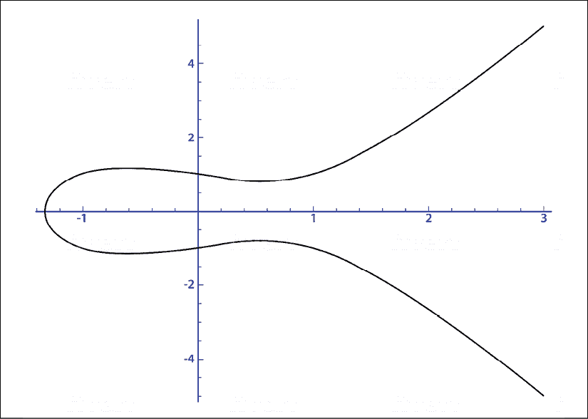

# 15

# 量子安全区块链

这本书的论文围绕探索两种技术展开:量子计算和区块链。我已经谈到了这两种技术的关键概念和历史。在一些采访和行业章节中，我展示了这些技术的实际应用。这是为了确定，尽管有一些挑战，这些技术有基本的用例。

我们已经确定这两种技术会一直存在。他们可能会经历冬天，在那里他们的相关性可能会受到挑战。然而，最具影响力的技术经受住了这样的风暴，一旦它们变得相关，就会重新浮出水面。由于限制或缺乏生态系统成熟度，技术可能会出现低谷。在区块链的例子中，我们提到了三难困境，强调了这项技术尚未规模化。例如，一个完全分散的分类账往往难以证明当今支付基础设施可以轻松容纳的吞吐量。

在量子计算的情况下，存在退相干等挑战，其中数据由于量子位与其环境之间的相互作用而丢失。这两种技术都还处于早期阶段，主流采用还需要做更多的工作。然而，超越限制的能力是我们之前强调的。

那么什么是 T1 呢？这两项技术都是无可争议的。他们有跨不同行业的用例，可能会创造跨越时刻。产生跨越效应的技术影响着目标市场数百万人的生活。个人电脑、互联网和智能手机的发明以及 PayPal、M-Pesa 和支付宝等应用都影响了发达国家和发展中国家数十亿人的生活。

我们还讨论了这两种技术之间的用例是如何互补的。量子计算主要集中在计算基础设施上，也可以提供超越当今经典计算机的智能能力。另一方面，区块链是一个数据完整性层。

在一个很大程度上由数据驱动的世界中，我们需要一个能够提供智能和模拟功能的基础设施，以挖掘丰富的数据。然而，如果没有一个框架来确保这些机器存储和使用的数据具有高数据质量和完整性，那么所有的智能都将毫无用处。如果没有智能，高完整性的数据也不会有太大用处。

因此，我们需要这两种技术成为主流，以应对未来的数据挑战。然而，有一个问题。这两种技术正在发生碰撞。密码学是量子计算和区块链的组成部分。有一种潜在的情况是，一旦量子计算机规模化并成为主流，我们今天拥有的区块链解决方案将会过时。

因此，尽管有这些技术的商业案例，我们可能只会看到这两种技术中的一种在未来是相关的。这是一个我们可以克服的情况。如果区块链能够克服另一个技术障碍，它仍然可以发挥作用。这一章讨论了技术之间的冲突过程，并探索了这种情况的解决方案。

# 与时间赛跑

尽管面临挑战，互联网在很大程度上为我们提供了良好的服务。它是帮助世界各地经济繁荣的主要基石。全球接入互联网的成本大幅下降。例如，仅在印度，接入移动互联网的人数就从 2015 年的约 2.42 亿增长到 2019 年底的 4.51 亿。来源:[https://www . statista . com/statistics/558610/number-of-mobile-internet-user-in-India/](https://www.statista.com/statistics/558610/number-of-mobile-internet-user-in-india/)

过去，移动渗透创造了世界各地的飞跃时刻。移动互联网的渗透更进一步。例如，通过 M-Pesa，非洲能够看到前所未有的移动支付规模。如果没有手机的普及，这一切都不会发生。随着移动互联网的渗透导致支付宝和微信的支付热潮，中国更进了一步。这两家公司贡献了中国价值 40 万亿美元的移动交易的 90%以上。

另一方面，在印度，由于移动互联网的普及，一些新的商业模式正在推出。有一些创新的应用程序允许农村地区的用户在基于语音的界面中使用当地语言进行日常交易。这些模式闻所未闻，尤其是在新兴市场。然而，这种增长是有代价的。互联网的爆炸给网络安全带来了风险。

在过去几年中，互联网成功渗透到世界上的许多地方，但这些地方对数据隐私和数据安全的理解和认识却严重不足。因此，我们今天看到的增长实际上可能是未来网络战争的沃土。互联网上大多数位于服务器上并被当今安全机制锁定的数据容易受到网络攻击。

当我们将量子计算机引入其中时，这种威胁就变成了定时炸弹。量子计算机可能会给存储在互联网上的数据带来灾难。我们今天所知道的互联网上的信息交换使用**Rivest–sha mir–Adleman**(**RSA**)算法和**椭圆曲线加密** ( **ECC** )。这些算法用于对互联网上传输的信息进行编码和解码。这些算法是公钥加密技术，其中用于编码数据的加密密钥是公开的，用于解码数据的加密密钥是私有的。

让我们简单看看这些加密技术都涉及到什么，并触及它们在量子世界中的弱点。

## RSA 算法

在需要从甲方向乙发送消息的情况下，甲只需将消息写在一张纸上，然后发送给乙。如果信息是机密的并且需要保护，甲可以使用加密密钥将消息混在一起。只要甲方和乙方事先交换了密钥，乙方就可以使用该密钥解密并阅读该消息。使用同一私钥加密和解密消息的方法称为对称密钥加密。

但是如果甲乙双方事先没有交换密钥来解密消息呢？在这种情况下，RSA 算法等非对称密钥加密技术非常适用。在 RSA 技术中，A 和 B 将有一个密钥对，每个密钥对构成一个公钥和一个私钥。A 和 B 之间交换公钥。A 将使用 B 的公钥加密他们的消息并将其发送给 B。发送给 B 的加密消息只能通过使用 B 的私钥来解密。

这使得 RSA 可以用于 A 和 B 之间无法事先共享私钥的情况。RSA 算法已经被用于电子邮件和虚拟专用网络中，虚拟专用网络也可以在许多浏览器中看到。尽管在互联网上有几个使用案例，RSA 算法直到最近才成为焦点。

RSA 算法最初是由罗恩·里维斯特、阿迪·萨莫尔和伦纳德·阿德曼在 1977 年开发的，甚至以他们的名字命名(里维斯特、沙米尔、阿德曼)。然而，当时它被搁置了，因为当时很难理解真实世界的应用程序。1997 年，随着互联网热潮的形成，RSA 算法突然变得重要起来，因为基于互联网的业务、电子邮件、社交媒体和微消息变得普遍。

RSA 算法从根本上依赖于这样一个原理，即一个操作在一个方向上相对容易计算，但是相反的方向是非常耗费资源的。这种计算的一个重要例子是质因数分解。如果我取两个质数，997 和 667，我们很容易得出 997*667 等于 674，969。然而，反过来是极其困难的。如果我们被要求找出 674，969 的质因数，由于计算中涉及的困难和涉及的试错量，我们将很难在合理的时间范围内完成。

表现出这种特性的算法叫做陷门函数。识别这样的算法是创建安全的公钥密码技术的基础。

在前面的例子中，如果给你两个因子中的一个，结果是 674，969，这又会使运算变得更简单。在真实的 RSA 实现中，素数非常长。例如，RSA 1024 有 1，024 位，可能有多达 309 位的数字。

在公钥密码技术中，在一个方向上解决问题的容易程度与在另一个方向上解决问题的容易程度之间的差异是很重要的。例如，RSA 面临的挑战是，随着质因数大小的增加，一端计算倍数的难度差异和另一端确定因数的难度差异已经减小。由于移动互联网的爆炸式增长，安全机制也变得更加资源密集。

因此，RSA 不被视为可扩展的解决方案，因为随着主要因素变大，它会变得更加资源密集型。除此之外，像二次筛选和一般数域筛选这样的算法使得破解素数分解挑战变得相对容易。我们需要 RSA 的其他替代方案来提供可扩展的安全解决方案。现在让我们来看看 ECC 形式的其中一种。来源:[https://www . comparitech . com/blog/information-security/RSA-encryption/](https://www.comparitech.com/blog/information-security/rsa-encryption/ )

## 等

ECC 是最近开始流行的一种替代方案。它基于椭圆曲线上点群的离散对数。椭圆曲线算法可以用下面的等式来解释:

y2= x3+ax+b

当我们使用前面的等式绘制椭圆曲线时，我们会得到一个看起来像下面曲线的变体的图表:

图 1:绘制的椭圆曲线

这条曲线有几个特点，其中之一是它的水平对称性。位于 *x* 轴下方的那一半曲线可以描述为位于 x 轴上方的那一半曲线的镜像。然而，从活板门功能的角度来看，还有另一个更相关的属性。

这个性质可以通过想象一个在棋盘上玩的台球游戏来解释。如果我们在曲线上的两点之间击球，它必然会在第三点击中曲线。第三点可以用曲线的形状直观地预测出来。

但是，如果从 A 点开始经过几次( *n* )这样的击球后，球到达了 B 点，对于一个没看过比赛的新人来说，即使知道 B 点和球的起点，也很难理解击球次数。因此，如果我们知道 *n* ，从 A 点到 B 点就很容易了。然而，即使我们知道 A 和 b，也很难找到 *n* ，这是椭圆曲线算法的一个独特属性，使其成为一个很好的陷门函数。

在真实世界的 ECC 表示中，一般的想法是将消息分配为前面等式中的值 *X* ，以找到 *Y* 。这将给我们( *X，Y* )作为曲线上的点。因此，使用 ECC 的安全机制将需要曲线方程、曲线中的公共点和素数。在台球示例中，公共点可以被形象化为向自身发射 *n* 次，其中 *n* 成为私有密钥。

根据欧洲研究人员最近发表的一篇论文，与 RSA 相比，ECC 提供了更好的安全性。该论文考虑了破解密码算法所需的能量，并将其与烧开水所需的能量进行了比较。在 RSA 和 ECC 的比较中，要破解 RSA 228 位算法，我们需要的能量相当于煮沸一勺水所需的能量。另一方面，要破解 228 位 ECC 密钥，我们需要足够的能量来烧开地球上所有的水。来源:[https://eprint.iacr.org/2013/635.pdf](https://eprint.iacr.org/2013/635.pdf )

ECC 被视为 RSA 的更节能的替代方案，即使对于编码器也是如此。CPU 和内存的使用也更加优化。然而，RSA 被更广泛地采用。这主要是因为理解 ECC 的复杂性。如果对 ECC 的理解不够透彻，它可能会被错误地实现，这实际上可能会成为一个安全漏洞。

ECC 的潜在应用有很多。美国政府已经开始为内部通信部署这种安全机制。苹果 iMessage、WhatsApp messenger 和 Tor 匿名网络使用**椭圆曲线数字签名算法** ( **ECDSA** )进行安全交互。在本书的上下文中，椭圆曲线更相关的用法可以在比特币和以太坊中找到。

现在，我们已经简要介绍了 RSA 和 ECC 技术来保护我们的数据，让我们来看看当量子计算机变得可行和主流时，它们为什么变得不安全。

# 量子计算是否意味着混沌？

那么，为什么今天的互联网安全是一颗定时炸弹呢？如果量子计算成为主流，会出现混乱吗？发生这种情况的可能性有多大？这些问题在很大程度上困扰着担心网络战的国家。处理敏感客户数据的顶级银行和医疗保健公司的首席执行官也担心数据安全。

让我们快速看一下量子计算世界在哪里，以及为什么它可能对全球数据安全构成威胁。1994 年，Peter Shor 提出了两个量子算法。一个可以分解大素数，另一个可以计算素数阶有限域中的离散对数。前者可能是对 RSA 方法的威胁，而后者将处理椭圆曲线。

Shor 基本上表明，我们今天使用的几乎所有公钥加密技术都可以用量子傅立叶攻击来破解。他使用量子傅立叶采样来发现数学对象的周期性。这反过来又让他解决了因式分解的问题。

量子计算机的威胁已经存在了 25 年。因此，从理论上讲，量子计算算法确实会对我们今天所知的数据安全世界造成巨大破坏。

然而，2015 年研究人员发现，破解 RSA 2,048 位签名需要 10 亿个量子位。这个数字(10 亿量子位)在 2019 年被修正为 2000 万。量子位的数量归因于量子计算机中纠错所需的量子位数量不成比例。量子计算机中的噪声是一个难题，在我们开始考虑让它成为主流之前，必须克服这个难题。来源:[https://cacm . ACM . org/news/237303-how-quantum-computer-can-break-2048-bit-RSA-encryption-in-8-hours/full text](https://cacm.acm.org/news/237303-how-quantum-computer-could-break-2048-bit-rsa-encryption-in-8-hours/fulltext )

尽管如此，2012 年，一台 4 量子比特的量子计算机被用来分解数字 143，两年后，一台类似大小的量子计算机能够分解数字 56153。因此，量子计算机的能力正在以非常快的速度变得更好。2019 年 12 月，谷歌的 Craig Gidney 和 KTH 皇家理工学院的 Martin Ekera 发表了一篇题为*如何使用 2000 万量子位在 8 小时内分解 2048 位 RSA 整数*的论文。

突然间，破解 RSA 2,048 位数字的问题变得简单了 5 倍。之前估计使用量子计算机解决这个问题需要 10 亿个量子比特。吉德尼和埃克拉使用了一种叫做模幂运算的数学技术，并证明了这是一种更有效的因式分解方法。他们在他们的研究论文中表明，当分解 2048 位 RSA 整数时，他们的构造的时空容量比以前的实现少一百倍。来源:https://arxiv.org/abs/1905.09749

谷歌的一些量子优势的说法可能不得不持保留态度。谷歌关于量子优势的论文于 2019 年被美国宇航局泄露，随后谷歌官方发布了一份新闻稿。在那次发布中，谷歌声称他们的 53 量子位 Sycamore 芯片可以进行最强大的经典计算机需要 10，000 年才能完成的计算。

IBM 对此进行了科学的反驳。他们计算出谷歌 Sycamore 芯片的整个量子状态向量可以存储在 Summit 中，Summit 是世界上最大的超级计算机，拥有 250 的存储空间。经典计算机不得不求助于磁盘存储来接近基本量子计算机的能力，这一事实说明了这两种技术之间的鸿沟。

IBM 还展示了经典超级计算机可以在大约 2.5 天内模拟 Sycamore 芯片，而不是谷歌声称的 10，000 年。谷歌已经成功实现的资源效率确实很高，但也许量子计算机还没有变得像他们宣传的那样伟大。

微软量子团队最近发表的另一篇文章声称，用算法技巧的正确组合实现 Shor 算法可以更有效地破解 RSS 和 ECC。他们为美国商务部下属的**国家标准与技术研究所** ( **NIST** )设定的 ECC 标准实现了他们的算法。来源:[https://www . Microsoft . com/en-us/research/WP-content/uploads/2017/09/1706.06752 . pdf](https://www.microsoft.com/en-us/research/wp-content/uploads/2017/09/1706.06752.pdf )

该出版物显示，他们的算法可以使用 2330 个逻辑量子位和托夫里门来打破 NIST 标准化曲线 P-256。同样，他们能够证明 Shor 的因子分解算法需要 6146 个量子位来破解 3072 位 RSA 密钥。

托夫里门是构建具有数千个量子位和数十亿个门的大规模可逆电路的理想选择，因为它们在经典和量子环境中都可以工作。这些门位于高级抽象算法和低级类似汇编的指令集之间，后者将最终驱动量子计算机。你可以在[https://cloud blogs . Microsoft . com/quantum/2018/05/02/the-quantum-computing-effect-on-public-key-encryption/](https://cloudblogs.microsoft.com/quantum/2018/05/02/the-quantum-computing-effect-on-public-key-encryption/)了解更多信息。

由于谷歌、IBM 和微软的努力，量子计算机很有可能在不久的将来变得更加实用。误差修正会变得更有效率，我们将需要更少的量子位元来计算。随着使量子计算机更真实的更好算法的出现，对基于 RSA 和 ECC 的安全性存在真正的威胁。这两种加密技术都是互联网、政府和许多金融服务公司目前所依赖的基本安全机制。

我希望这能解决一个问题，即随着量子计算的出现，我们目前使用的互联网、银行账户、信用卡、政府机密数据和信息的安全机制都可能受到巨大威胁。黑客今天可以记录信息，大约 10 年后，当量子计算机可以解密信息时，就可以阅读它。这可能不是信用卡信息的主要风险，但政府和国防机密对此类问题更加敏感。

许多关键国家希望将量子突破用于网络战，但不一定想透露他们在量子技术方面的进展，这一事实放大了这种威胁。因此，他们可能领先于我们来自 IBM、Google 或 Microsoft 的基准信息。现在让我们看看不同的量子安全加密技术，这些技术有可能成为主流，使我们的数据量子化。

## 量子安全密码术

每个问题都是创新的机会。Shor 的算法是基于量子傅立叶采样来破解非对称密码算法。因此，量子安全的密码系统需要对量子傅立叶采样以及其他经典和量子攻击免疫。2016 年 4 月，NIST 发起了**后量子密码** ( **PQC** )标准化挑战。任务是找到一种 PQC 技术，它有可能保护我们的数据免受量子计算机的威胁。

在接受挑战的 69 份申请中，26 份被选为 2019 年 1 月的半决赛。NIST 努力的目标不仅仅是找到一种纸上谈兵的 PQC 技术。他们还想确保这项技术在移动和平板设备和**物联网** ( **物联网**)网络世界中的实用性。在机器相互传输数据的世界中，以较低的资源消耗保护数据是至关重要的。

让我们看看提交给 NIST 的不同类别的加密技术。重要的是要确保这些技术不仅在理论上不受量子计算的影响，而且在规模上也切实可行。如前所述，这些协议必须能够处理 Shor 算法。让我们看看基于格的密码学和基于码的密码学技术。

### 基于格的密码学

基于格的密码学 ( **LBC** )可能是研究最多的 PQC 类型。晶格只不过是无限延伸的点的网格。由于计算机资源有限，不可能用计算机来表示一个格。因此，我们使用一种叫做基的东西，它是帮助表示一个格的点或向量的集合。

LBC 依赖于在多维晶格中解决几何问题的难度。例如，要解决的几何问题可能是**最短向量问题**(**【SVP】**)其中我们需要用短向量确定一个好的基础。不幸的是，这在我们可能有数千个维度的晶格中并不容易。

另一个要解决的常见 LBC 问题是**最近向量问题** ( **CVP** )，其中给定了一个点 *P* ，需要确定最近点。由于几个原因，LBC 技术似乎是最流行的 PQC 技术。

晶格已经被研究了 200 多年。因此，它们的数学性质很好理解。帮助人们理解晶格的数学家们对量子计算机一无所知。尽管如此，他们的工作提供了有助于 LBC 的见解。

格提供了一种前所未有的开发加密协议的通用方法。因此，它们是研究最多的密码学领域。在 NIST 收到的 82 份 PQC 标准化挑战申请中，有 28 份是基于网格的。

与 RSA 加密(可归类为最坏情况减少技术)不同，LBC 具有平均情况减少。这意味着，平均而言，LBC 技术是安全的，除非格问题的每个实例都很容易解决。在 RSA 加密技术中，如果使用的数字具有某些数论属性，它们很容易被破解。因此，我们需要确保在密钥生成期间不会出现这种情况。

在 LBC 的情况下，我们只需要选择参数大小并生成密钥。除了更安全之外，它们对资源的需求也更少。例如，8 位物联网设备上基于 LBC 技术(R-LWE)的加密过程需要 200 万个周期才能完成。RSA 1024 运行加密需要多 2300 万个周期。来源:https://arxiv.org/pdf/1805.04880.pdf

这使得 LBC 与我们生活的物联网世界非常相关。它对于需要量子验证的资源高效加密技术的移动和平板设备也很有用。虽然 LBC 算法可以比 RSA 加密算法运行得更快，但它们仍然比基于代码的密码术(T2)慢。让我们回顾一下后量子密码术的这一类别。

### 基于代码的密码术

CBC 依赖于解码一般线性分组码的难度。该码可以属于诸如 Goppa 码或准循环码的家族。McEliece 算法是一种不对称的加密方案，使用量子傅立叶采样被证明是不可解的。还没有已知的多项式时间量子算法来解码线性分组码。

McEliece 算法最早是在 40 多年前开发的，但没有 RSA 或 ECC 那么流行。这在很大程度上是因为密钥非常大(RSA 通常为 0.5 MB，而 ECC 通常为 0.5 MB 和 0.5 MB)。然而，由于需要使密码术具有量子证明能力，它现在已经成为焦点。

CBC 的优势在于，从计算效率的角度来看，它通常比 LBC 方法更高效。然而，在为平台或应用选择正确的加密技术时，重要的是要考虑密钥大小、资源消耗、计算效率、签名长度和安全置信度等因素。

这两种技术(CBC 和 LBC)各有利弊。它们的应用将根据使用环境而变化。例如，在物联网环境中，我们需要更小的密钥和相对更好的资源效率，基于格的加密可能是更好的解决方案。因此，需要采用“马换课程”的方法(正确的工具用于正确的工作)，而不是将一种技术视为在后量子世界中保护数据安全的银弹。

与 NIST 挑战非常相似，欧盟委员会出资 390 万欧元资助了一个由 11 所大学和企业组成的研究联盟。该倡议名为 PQCrypto。目标是在三年内确定 PQC 技术。在提交给 NIST 的 69 件作品中，有 22 件是由 PQCrypto 成员设计或共同设计的。来源:https://pqcrypto.eu.org/nist.html

尽管有这些充满希望的努力，但人们也意识到，任何新的密码系统都需要 15 到 20 年才能为可扩展的工业应用做好准备。因此，科学界正面临这一挑战，以确保我们所有的数据都得到保护。虽然在后量子世界，互联网上的数据安全存在更广泛的问题，但我们也有一个关于区块链应用的具体安全问题。

### 区块链加密

很多区块链使用公钥密码。它们在本质上是非对称的，因为发送方和接收方都有公钥和私钥。如前所述，在非对称加密方案中，用接收者的公钥加密的消息可以用他们的私钥解密。对于没有私钥的人来说，解密消息极其困难，因此创建了陷门加密机制。

区块链安全机制取决于这个陷门数学函数的硬度。很多加密货币和区块链都使用 ECC。这包括以太坊和比特币区块链，因为 256 位椭圆曲线密钥与 3072 位 RSA 密钥一样安全。椭圆曲线的密钥越小，资源效率越高，因为它们需要的存储空间越少。

我们在*第一章*、*量子计算和区块链介绍*中详细讨论了区块链加密的工作原理。因此，我将简单地谈一下这个话题，以唤起你们的记忆。陷门函数，也被称为**单向函数** ( **OWF** )，是区块链安全的基础。区块链的用户使用这些功能创建数字签名，使用正确的密钥可以轻松检查这些签名。

加密货币可以被视为一系列数字签名。每个数字签名都有一个反向和一个正向链接，因为它对前一个块的散列和新块的公钥进行签名。这可以被视为握手机制，因为硬币的所有权从一个人转移到另一个人，都使用数字签名。

例如，比特币网络上的交易历史是用区块表示的。每个块可以容纳多个事务。要向分类帐添加块，需要满足一个数学条件。整个网络不断计算以得出数学条件的解(根据 ECC)，一旦满足，该块就被添加到网络中。

所以，当有人想要黑区块链的时候，他们需要黑的不仅仅是单个交易，而是整个签名链。由于所需的资源，破解这些签名的强力方法并不是可行的解决方案。

尝试破解区块链的方法有很多种，有些也很成功。我们在*第一章*、*量子计算和区块链介绍*中讨论过这个问题。区块链攻击的一些主要类型如下:

*   智能合约攻击
*   交易验证攻击
*   矿池攻击
*   网络攻击
*   钱包攻击

所有这些对区块链的攻击都有据可查。更多类型的攻击正在被识别和理解。根据 GitHub 的说法，有超过 30 种不同类型的智能合约漏洞可以被区块链的黑客利用。

Sybil 攻击和 Finney 攻击是交易验证攻击的类型。当一个的整个网络被攻击者黑掉时，Sybil 攻击就发生了。在芬尼攻击中，攻击者开采一个区块，将硬币发送给愿意购买某些商品的未确认交易的人，然后回到网络上确认交易并取回钱。

网络攻击涉及一种标准的**分布式拒绝服务** ( **DDoS** )，在这种情况下，一台服务器因多个请求占用其资源而瘫痪。钱包攻击涉及使用针对受害者的社会工程来攻击他们的钱包。区块链黑客已经找到了几种利用该框架漏洞的方法。

然而，它们中的大多数并不像交易的接收者那样容易地解决加密问题。这就是量子计算可能被证明对依赖 ECC 等加密技术的区块链网络至关重要的地方。在区块链，使用量子技术破解 ECC 可能会导致保护资产安全的密钥被破解。因此，黑客有更高的动机瞄准区块链网络，因为它们具有数字化存储的经济价值。

有区块链如 **QRL** ( **抗量子莱杰**)和 IOTA 都是用 PQC 开发的。然而，大多数区块链应用仍然使用 ECC，这不是量子安全的。就像 NIST 为互联网开发量子密码技术的努力一样，我们需要对区块链进行全行业升级，以遏制量子威胁。

现在让我们来看看一些可以让区块链在后量子时代更加安全的技术。区块链正在使用或探索的一些技术如下:

*   **扩展的 Merkle 签名方案** ( **XMSS**
*   **区块链后量子签名** ( **BPQS** )
*   IOTA 使用的 **Winternitz 一次性签名** ( **W-OTA** )

当我解释这三种方法时，可能会发现这些都是相互关联的技术，并且有很多共同点。然而，每种技术都有自己更适合的应用。

# 后量子世界的安全

随着要解决的问题的难度增加，加密方案更加安全。在后量子世界中，由于我们前面看到的原因，ECC 方法变得容易解决。可以用来使加密量子化的替代方案之一是使用基于散列的签名方案。让我们看看 XMSS，它使用散列函数。

## 扩展的 Merkle 签名方案(XMSS)

XMSS 是 QRL 正在开发的基于散列的签名方案之一。XMSS 有两个关键方面使其成为后量子加密的良好候选。它使用一个散列函数，并且遵循一个**一次性签名** ( **OTS** )系统。它也基于 Merkle 签名方案。 Merkle 签名方案是由 Relph Merkle 在 20 世纪 70 年代开发的，具有抗量子性。因为 Merkle 签名方案依赖于安全散列函数，所以它们可以被归类为 PQC。

Merkle 签名方案中的公钥只能用于签署有限数量的消息。在 OTS 方法的情况下，它通常仅用于签署一个消息。因此，在遵循使用 Merkle 签名方案的 OTS 的区块链上，需要为每个签名生成公钥和私钥对。XMSS 中的公钥是由一个**伪随机函数** ( **PRF** 产生的。

下图中的 Merkle 树应该能够让它的工作变得生动。在 Merkle 树中，通常会生成 *n* 个密钥对，其中 *n* 是 2 的幂。顶层节点通过应用于其子节点的散列函数的串联来压缩所有公共密钥。

在这个方案中，当发送者发送签名时，它将包含签名、树的叶节点处的公钥、发送的叶节点的索引和认证路径。这个细节将证明发送的密钥对是 Merkle 树的一部分。例如，在下面的树形图中，如果我们使用带有叶节点 *pk* 2 的密钥对，发送方将发布以下内容:

*   签名
*   叶节点(公钥)–*PK*2
*   已发布密钥对的索引–2
*   哈希函数的认证路径——本例中为 *h* 3 、 *h* 8 和 *h* 13

接收器将使用该信息来计算从 *pk* 2 到*h*T6】14 的路径。来源:[https://pdfs . semantic scholar . org/f38c/562 c21 fa 1a 94871 e5f 577669 f 7 C4 b 9520632 . pdf](https://pdfs.semanticscholar.org/f38c/562c21fa1a94871e5f577669f7c4b9520632.pdf )

图 2:有 2 个 3 个 OTS 密钥对的 Merkle 树

OTS 方案结合哈希函数使得区块链更加安全。即使黑客找到了私钥，他们也无法闯入区块链，因为之前的交易无法伪造。这是因为以前的事务会使用不同的密钥对。

XMSS 中的私钥保存一个索引，该索引在每次生成签名时更新。实际上，它保存了关于下一个未使用的 OTS 密钥对的信息。该方案中的签名包含 OTS 密钥对的索引和 Merkle 树上的路径。通过保持树中节点的位置，验证者可以识别根节点。然后，验证者可以从根节点计算公钥。如果公钥匹配，则签名有效。

尽管有安全散列函数并使用 OTS 使其更加安全，XMSS 也有它的缺点。密钥很大，如果树的大小增加，小型设备使用这种技术会消耗大量资源。来源:[https://eprint.iacr.org/2018/658.pdf](https://eprint.iacr.org/2018/658.pdf )

现在让我们来看看 BPQS 技术，它是 XMSS 的替代技术。

## 区块链后量子签名(bpq)

BPQS 经过专门的设计，在生成密钥和签名并执行验证的同时，使其资源高效。这些都是 XMSS 的痛点。BPQS 是 XMSS 的变体，它使用一个认证路径而不是一棵树。因此，它可以被视为一个哈希函数链，而不是一棵树。

BPQS 可以表现得像 OTS 方案，但是也可以容易地扩展到多个签名。尽管 OTS 方案被认为是安全的，但区块链的应用可能经常需要使用多个签名的密钥对。例如，如果一个慈善机构正在发布其公钥以接收资金，它可能希望至少在给定的筹款活动运行期间保留它。因此，尽管 BPQS 是 XMSS 的一个变种，但理论上它支持的时间签名很少。

然而，BPQS 被视为 XMSS 的子集，主要关注快速签名。它仍然使用像 XMSS 这样的 OTS 方法(W-OTS)。因此，与其像 XMSS 中那样把它想象成一棵成熟的 Merkle 树，不如把它想象成一串两片叶子的 Merkle 树。下图有助于形象化采油树链:

图 3:采油树链的可视化。来源:https://eprint.iacr.org/2018/658.pdf

由于其属性，BPQS 方法可以用于位于区块链和物联网融合处的应用。现在让我们看看 IOTA 正在使用的 W-OTS 方案。

## 温特尼茨一次性签名(W-OTS)

我们讨论过 XMSS 使用的 OTS 方案是 W-OTS 方案的变体。另一方面，BPQS 使用 W-OTS。W-OTS 正被用于一个更著名的区块链应用 IOTA。IOTA 是由 IOTA 基金会开发的一种分布式账本技术，它使用 W-OTS 方法来使自己具有量子鲁棒性。

IOTA 将其相关或链接的交易捆绑在一起。捆绑包散列被规范化以创建私钥，并且密钥的一部分被公开。因此，一个密钥只能使用一次来撤销一个给定值。私钥经过几个操作，将其分解成几个片段，然后通过哈希函数进行处理。称为 kerl 哈希函数的哈希函数用于创建签名。

另一方面，通过使用包散列和发送的签名来执行事务签名的验证。以相反的顺序处理签名，以得到私钥的片段。然后通过散列函数得到地址。来源:[https://docs . iota . org/docs/getting-started/0.1/clients/signatures？q =量子&亮点=量子](https://docs.iota.org/docs/getting-started/0.1/clients/signatures?q=QUantum&highlights=quantum )

IOTA 声称他们的方法是量子验证的，签名创建和验证的复杂性也许反映了这一点。然而，对我来说，所有这些都强调了一个事实，即我们需要真正的成熟来对抗量子威胁。

我们现在已经了解了区块链应用使用的三种不同类型的量子验证加密技术。然而，这些都是例外。典型的区块链开发人员使用以太坊开发人员的框架创建应用程序时，不会真正了解量子威胁。

这需要改变。每个区块链开发者都需要理解量子计算机可能对他们正在为世界使用而创建的价值网络产生的影响。与互联网不同，互联网更多的是一个信息网络，区块链可用于持有资产和贵重物品。如果它被黑了，那就更危险了。因此，对网络安全的理解是每个设计和开发区块链应用的人必须具备的基本方面。

它还表明，就像互联网一样，在后量子时代，数据安全需要升级，我们需要区块链是量子安全的。对于以太坊这样的生态系统来说尤其如此，以太坊被用于在世界各地构建区块链应用。

每个正在评估区块链套件为客户创建应用的组织都需要确保它们是量子验证的。所有这些努力将确保只有量子证明的区块链平台才能获得工业用途的牵引力。这将在最初导致一些损耗，但快速适应的平台将很快成为航向修正的赢家。

# 结论

与量子计算发生冲突的不仅仅是区块链。几乎整个互联网都处于危险之中。量子计算是一个严重的威胁，不仅仅是对区块链平台，而是对所有使用 RSA 和 ECC 等技术的平台。然而，互联网和区块链行业都有量子验证密码术形式的解决方案。采用这些技术需要仔细考虑这些技术将被部署的应用程序和上下文。

我必须承认，这一章是相当技术性的一章。然而，我已经尽可能地简化了关于密码学的叙述。我介绍了关键的加密技术，RSA 和 ECC，以及它们在互联网和区块链解决方案中的应用。

然后，我谈到了一旦量子计算机成为主流，它们将如何以及为什么会面临风险。这一天何时到来仍有很多炒作。有人说是 2027 年，有人认为可能是 2031 年。谷歌、IBM 和微软对量子霸权的到来有自己的看法。众所周知，谷歌也在他们的 Chrome 浏览器中试验 LBC，为量子时代做准备。

我讨论了各种技术，包括 LBC 和 CBC，它们可以为互联网提供量子验证。至关重要的是，我们不能轻视 NIST 挑战的成果，而且要有一个自上而下的全球计划，以实现量子安全的互联网。

我们讨论了后量子世界中的区块链漏洞，以及为什么区块链应用程序必须是量子证明的。区块链行业此刻正在经历一个冬天。我认为，在它能够重新出现并再次相关之前，该行业需要走向量子验证。区块链平台可以利用 XMSS 和 BPQS 等解决方案来提高安全性。

总之，尽管面临量子计算机的威胁，但区块链行业可以也应该采取一些解决方案来保持相关性。尽管这两种技术之间有冲突的可能性，但它们确实有共存的机会。区块链行业需要适应，以在后量子时代保持相关性。

在这一章中，我们深入探讨了信息和价值网络需要如何适应后量子时代的细节。在下一章，我们将探讨民族国家如何定位自己，以利用量子技术可能给他们带来的信息优势。