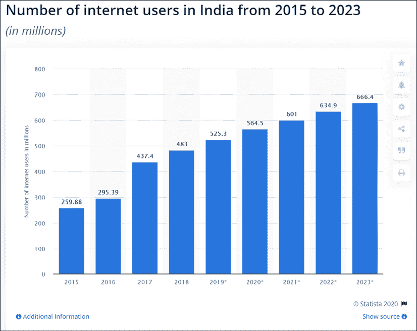
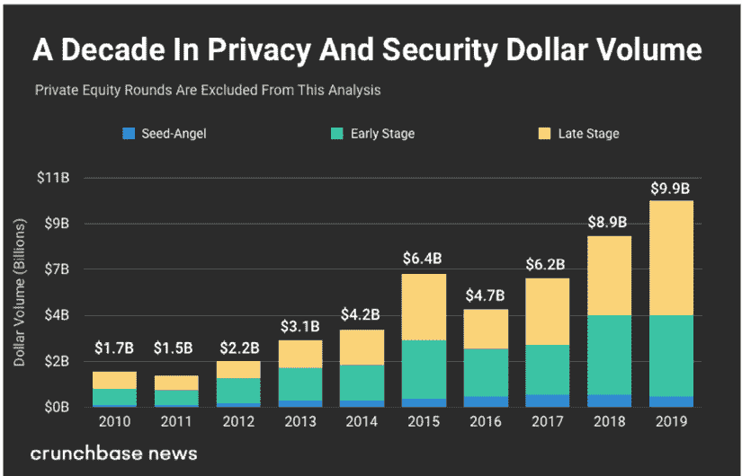
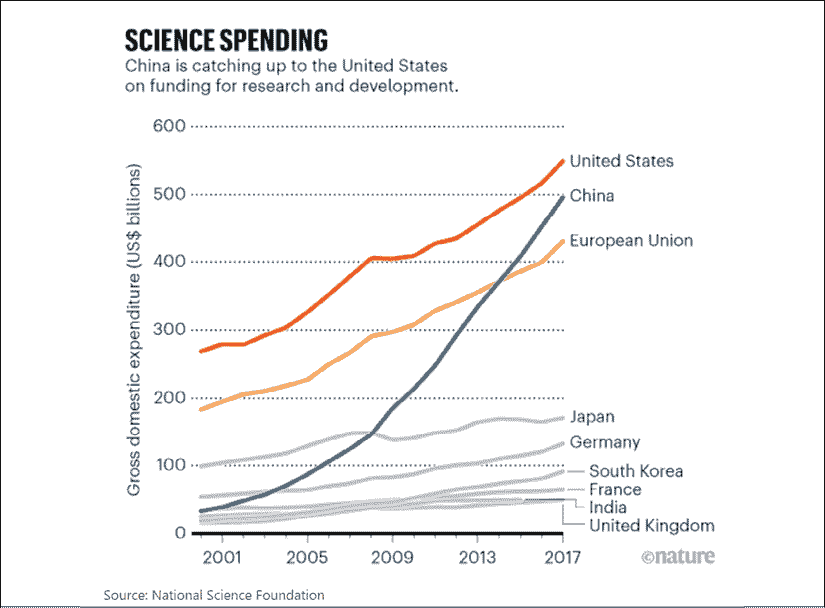

# 16

# 民族国家和网络战争

我们生活在一个数据可能是比原子弹更强大的武器的时代。在全球最大的经济体中，数据正被用来赢得选举。民族国家正在考虑部署网络战，从战术和战略上相互攻击。因此，国家情报和国防机密的数据保护变得极为重要。

根据**国际数据公司** ( **IDC** )发布的报告，我们正在创建的数据预计到 2025 年将达到 175 zettabytes。一个 zettabyte 是十亿 TB，或者 10 21 字节。预计这些数据中的大部分将位于云基础设施上。因此，我们需要确保整个基础设施的网络安全。

我们在*第 3 章*、*数据经济*中看到，数据创造的兴起如何导致了几种技术范式。例如，在经历了几个冬天后，人工智能终于变得相关和可行。由于互联网的成功，数据网络，我们有了区块链，价值互联网。如果没有互联网，相互交流的机器就不会出现。

物联网范式可能是网络专家面临的最大挑战之一。到 2025 年，我们可能已经创造了 175 个 zettabytes，其中 90 个 zettabytes 可以归因于机器之间的交互。机器互联网的网络安全复杂性仍处于初级阶段。

在这一章中，我们将讨论各种技术范例如何为网络罪犯创造可利用的漏洞。在这种情况下，我们将看看量子技术如何成为威胁和救星。通过这样做，我们将了解世界超级大国如何转向技术优势，以确保他们在网络战争中占据主导地位。

让我们先来探讨一下，在移动互联网的帮助下，过去十年的增长是如何为网络罪犯创造了可利用的漏洞的。

# 当成长变得危险时

数据不会自己到达云端。我们需要电信提供商充当数据生成点和存储点之间的管道。电信基础设施作为一个整体也必须保护免受网络犯罪。由于电信基础设施的原因，世界上有几个地方正在接受移动互联网。

例如，仅在印度，2015 年至 2019 年间，超过 2.75 亿人接入了移动互联网。虽然互联网基础设施大多是在过去三十年中创建的，但电信已经发展成为今天的样子，而且发展速度也很快。世界上大部分地区都缺乏保证电信网络网络安全的基础设施。

非洲和亚洲互联网用户的激增创造了前所未有的跨越时刻。截至 2019 年 Q2 奥运会，这两个大洲共有 28 亿人联网。这将在金融服务、医疗保健、生活方式、电子商务、教育以及生活的其他几个方面创造大量机会。

爱立信开展的研究显示，互联网速度只要提高一倍，就能使 GDP 增长 0.3%。然而，所有这些增长都是有代价的。这些农村地区大多缺乏网络安全意识和网络犯罪世界中存在的社会工程技术。

例如，2020 年初，有消息称朝鲜黑客成功攻破了印度库丹库拉姆核电站。这家工厂距离我的家乡印度不到 80 英里。该国许多地区在过去 5 年内才获得移动互联网接入，网络安全意识很低，如果不是不存在的话。

最近，亚马逊首席执行官杰夫·贝索斯通过沙特王储的 WhatsApp 账户遭到黑客攻击。因此，即使是世界上网络意识最强的公民也不能幸免。如果网络罪犯能够成功地锁定世界首富，他经营着一家最大的科技公司，那么非洲农村的一个农民就没有机会了。如果农民在追踪其交易的区块链上，该区块链也是易受攻击的。

我们生活在一个地缘政治战争在网络上进行的世界。当一名伊朗官员最近被美国无人机杀害时，报复行动预计将通过网络攻击进行。

除了移动互联网和物联网的渗透，这构成了黑客的潜在路线，边缘计算可能是另一个需要在网络安全框架方面得到良好支持的技术范式。在边缘计算领域，我们有更多的数据和业务逻辑位于客户端。在一个以移动互联网为先的世界，这可能意味着手机将更加智能，与云的交互将更具选择性。

因此，移动用户需要确保他们非常清楚他们在手机上下载和使用的应用程序。随着边缘计算变得比现在更加规范，它可能会成为网络罪犯的蛮荒之地。想象一下，如果物联网设备开始在边缘互动。在没有中央云基础设施的情况下，设备网络中有大量数据流。

这给网络安全世界带来了过多的新问题。随着所有这些技术范式几乎每天都在发展，它为网络罪犯提供了新的控制机会。世界上的主要国家在技术研发上投入了数十亿美元，以确保他们在战争游戏中保持领先。如今，能够带来数据优势的技术突破胜过核技术的突破。

简要概述了当代和未来的网络安全问题后，让我们重点谈谈新兴市场的增长，以及这如何可能成为网络安全的一个主要盲点。

# 肥沃的土地

为了理解全球网络安全的重要性，设定讨论的背景很重要。过去三十年无疑是数据创新领域不可思议的时期。在此期间，也许我们已经创新了创建和交换数据和价值的方法，但也许未能充分创新以保护数据。

我们在第三章、*数据经济*中看到了阿帕网的发展如何导致了互联网的崛起。互联网无疑为一系列主要由数据驱动的基于互联网的应用和商业模式奠定了基础。搜索引擎、社交媒体和消息应用变得普遍:

图 1:2014-2023 年全球移动应用收入。资料来源:统计数据

我们也看到了由苹果和谷歌引领的生态系统的崛起。手机变成了我们可以放在口袋里的个人电脑，取代了音乐播放器和游戏机等设备。截至 2019 年，移动应用市场规模为 4610 亿美元，预计到 2023 年将接近 1 万亿美元。上图显示了这种增长的程度。

直到 2010 年左右，这些发展大多在世界发达经济体中最为引人注目。由于手机的普及，新兴国家的农村人口可能是在过去 10 年才接触到基于手机的业务。

非洲的 M-Pesa 可能是第一个出现在新兴世界的模式，在那里，电信提供商和移动电话联合起来创造了一个可扩展的业务。我们当时并不知道手机对发达国家各行各业的影响有多大。

然而，M-Pesa 是世界各地几个组织值得注意的完美案例研究。这是随后由移动互联网推动的横跨非洲、亚洲和拉丁美洲的大规模包容浪潮的开端。在所有这些情况下，第一步是移动渗透，其次是互联网渗透。

M-Pesa 在非洲的跨越时刻激发了中国的创新浪潮。阿里巴巴和腾讯推出了利用中国互联网普及率突然上升的业务。阿里巴巴的支付部门支付宝在 2013 年取代贝宝成为世界上最大的移动支付平台。

在接下来的 5 年里，它将创造前所未有的增长。到 2019 年，支付宝的月活跃用户数增长到 6.08 亿。2019 年，中国移动支付的规模为 40 万亿美元，其中 90%以上是在支付宝或腾讯的微信平台上。2019 年阿里巴巴的光棍节销售额为 380 亿美元，而美国黑色星期五和网络星期一的销售额为 160 亿美元。由于移动互联网的渗透，中国的增长导致了前所未有的消费主义。这激发了亚洲其他地区的增长措施。

在过去的两三年里，我们已经看到了印度和东南亚的新趋势。在印度，三个关键因素推动了增长。

亚洲首富凯什·安巴尼通过 Reliance Jio 在中国掀起了一场移动互联网革命。在发起 Jio 的 3 年内，全国农村地区的 2 亿人获得了互联网接入。根据麦肯锡关于数字印度的报告，到 2018 年，该国有 5.6 亿移动互联网用户。来源:[https://www . McKinsey . com/~/media/McKinsey/Business % 20 functions/McKinsey % 20 Digital/Our % 20 insights/Digital % 20 India % 20 technology % 20 to % 20 transform % 20a % 20 connected % 20 nation/MGI-Digital-India-Report-April-2019 . ashx](https://www.mckinsey.com/~/media/McKinsey/Business%20Functions/McKinsey%20Digital/Our%20Insights/Digital%20India%20Technology%20to%20transform%20a%20connected%20nation/MGI-Digital-India-Report-April-2019.ashx )

印度增长背后的第二个原因是围绕身份、数字银行和支付的政策和政府驱动的基础设施。2016 年 12 月，当政府禁止某些面值的纸币时，该国的数字经济受到了去货币化努力的提振。这与名为“Aadhaar”的生物识别卡的推出同时发生。

超过 11 亿印度人拥有 Aadhaar 卡。实施身份解决方案带来了前所未有的数字金融包容性。这也与政府支持的支付基础设施相吻合，即所谓的统一支付基础设施 ( **合众国际社**)。下图突出了印度互联网用户的增长:

图 2:2015-2023 年印度互联网用户

这种增长的第三个原因，也可能是最有趣的原因，是世界各地的科技巨头都将印度视为最后的前沿。例如，亚马逊和沃尔玛已经接管了印度的电子商务市场，以牵制中国的阿里巴巴。然而，阿里巴巴通过 Paytm 拥有印度支付市场超过 50%的份额，而沃尔玛在 2018 年收购 PhonePe 后，其在支付市场的份额在不到 2 年的时间里升至 42%。

最近，我和我投资的公司的首席执行官就印度的数据安全和隐私问题进行了一场辩论。他认为，印度、东南亚和非洲等地区的人们非常重视数据隐私和安全。我认为，在印度一座寺庙外用 QR 码和 Paytm 应用程序推车卖花的女士不关心或不考虑数据安全。她只关心钱到达她的银行账户，并认为支付技术是安全的，不会让她失望。

为什么这些发展与网络安全的讨论相关？全球的移动互联网催生了新的商业模式，使得普通人比以往任何时候都更容易受到网络犯罪的攻击。以前从未对技术设备有过任何了解的人已经转向智能手机、移动互联网、支付钱包、二维码和移动交易，所有这些都发生在 5-10 年内。

伴随着全球迅猛的增长，人们严重缺乏对网络风险的认识。互联网不再仅仅是一个信息网络。随着电子商务和支付应用变得无处不在，互联网已经演变成一个财富网络。因此，我们需要一个由技术支持的框架来保护这些在过去十年中接受创新的人。

我们已经讨论了移动互联网上以人为主导的通信和交易的增长如何产生新的网络风险。现在让我们来看看机器互联网是如何制造漏洞的。

# 机器的年龄

我们讨论了不同的技术范例，这些范例有可能让世界向网络罪犯敞开大门。然而，在未来 5 年内，超过 70%的数据将来自机器以及机器之间的通信。这可能会给数据安全带来重大挑战，因为物联网生态系统对网络风险的理解还处于萌芽阶段。

人工智能和物联网的发展引发了机器人领域的一个新主题。由智能驱动的机器前所未有地开始接管以前由人类完成的单调工作。当一项关于人类将在多长时间内被机器夺走工作的统计数据发布时，社交媒体通常会活跃起来。

机器在未来的工作中肯定有真正的位置:当手头的任务涉及到像浏览数千页文本这样的事情时，技术确实让我们人类变得更容易。我在普华永道的日子里，我们正在探索人工智能的使用，以帮助我们审查数千页的监管和法律文本，并提供与关键战略问题相关的见解。

亚马逊和阿里巴巴已经在仓库中部署了机器人，以提高物流效率。我们还从富士通的 Dave Snelling 那里了解到，他们的量子退火炉为宝马的机器人提供了动力。所以，存在机器肯定能比人类表现更好的用例。然而，我经常反驳大肆宣传的社交媒体关于机器接管的说法，因为我相信我们可以通过变得更像人类来击败机器。

尽管有这些技术的发展，我们离人工智能还有一段距离。要让机器能够感同身受，并在医疗保健或金融服务等领域做出决策时运用判断力，这种场景还需要几年时间。在可预见的未来，人类将在未来的工作中保持相关性。

机器在我们日常生活中的崛起增加了我们对它们的依赖。就在几天前，我的人寿保险费出现了问题，因为我的 Apple Watch 无法与我的手机同步。同步过程对于我的保险提供商接收我的健康状况的详细信息并为我当月的保险费定价非常重要。

在制造业经济中，这一点更加明显。在美国，在制造业中，每 100 名工人有 2 个机器人。这一比例在韩国最高，制造业中每 100 名人类工人有 7.1 个机器人。这一比例预计将在未来十年内飙升。因此，机器会一直存在。下面这张来自 Statista 的图表显示了全球工业化经济体中机器的崛起:

图 3:机器人工人密度最高的国家

机器和物联网的兴起开启了新的可能性。我能够跟踪家中每台设备的耗电量。每个设备都会根据使用情况发出信号，然后被智能机器捕获。这台机器从这些信号的模式中学习，警告我我的洗衣机是否磨损，或者我的洗碗机是否需要维修。

甚至我们现在使用的打印机也有自己订购墨水的机制。我们依赖手机将正确的数据发送给正确的服务提供商，以确保我们的生活不受任何干扰。我最近遇到了一个人工智能应用程序，它可以让智能扬声器装满我的超市篮子并订购它。自动驾驶汽车是物联网和人工智能融合的另一个重要用例。

数据时代已经到来，物联网基础设施在各行各业产生数据。使用这种技术捕获的数据然后被存储在云中。区块链可以为这种数据基础设施带来完整性，并有能力确保与正确的利益相关者共享。人工智能可以利用这些数据，并提供见解，让我们的生活变得更加轻松。我们依赖所有这些技术来保持发展。然而，他们也有自己的阴暗面。

2019 年，脸书宣布，在机器发明了自己的语言来相互交流后，他们已经关闭了他们的人工智能计划。我们也许正在进入一个迄今为止只在电影中了解和看到的领域。物联网网络因缺乏网络安全基础设施而臭名昭著。**比特币黄金** ( **BTG** )区块链在 2019 年 1 月遭受了 51%的攻击。据报道，这次攻击导致区块链上价值 7 万美元的双重支出。

过去 5 年中出现的另一个关键技术范例是边缘计算。计算机工程师会同意建筑是周期性的，就像时尚一样。在 20 世纪 90 年代和 21 世纪初，我们有许多应用程序安装在 pc 或笔记本电脑上。他们使用客户机服务器交互，其中有一个胖客户机(安装在 Pc 上)与一个中央服务器通信。

在过去的 15 年里，随着云计算的出现，我们已经看到大多数胖客户端消失了。我们的大多数应用程序都是基于云的，大部分数据和智能都在服务器上。Chrome 操作系统的崛起，以及 Dropbox 和 Google Drive 等存储解决方案，都是同一趋势的例子。我们开始更频繁地使用谷歌文档，而不是安装在个人电脑和苹果电脑上的传统文字处理应用。

然而，这种工作模式假设持续的互联网连接。当我在伦敦地铁上时，我发现我的音乐应用程序或 YouTube 停止播放非常不方便。这就是边缘计算的原因，在边缘计算中，一些数据和大量业务逻辑可以位于客户端。云连接将仅在必要时发生，从而使用户体验更加无缝。

当机器必须在不依赖云基础设施的情况下相互发送微消息时，这可能是一个特别有用的功能。如果没有云基础设施，机器依赖于它们所属的网络的完整性。在这样一个网络开始变得越来越普遍的世界里，我们可能会面临大规模的网络犯罪。

无人驾驶汽车就是一个例子。据说，边缘计算的一个关键用例是自动驾驶汽车行业，预计每天会产生数 TB 的数据。然而，这些数据中的大部分不必实时发送到云中。车辆及其其他车辆网络需要这些数据中的大部分来管理道路上的交通。

总部位于旧金山的初创公司 Renovo 正在开发边缘基础设施，无人驾驶汽车可以在边缘相互交流。当汽车到达充电点时，它们可以连接到云基础设施，并发送该点所需的数据。这使得这个过程更加高效和用户友好，因为只有必要的数据被实时发送到云中。

这是机器通过边缘计算实时捕捉和使用数据的一个很好的例子。然而，想象一下这个汽车网络由于网络中的漏洞而被黑客攻击。黑客不仅可以利用这个网络中的数据，而且如果他们想的话，还可以在路上制造混乱。这是创新如何产生新的数据创建方式的另一个例子，但在如何保护这些数据方面几乎没有行动。

我们在上一章中讨论了这样一个事实，即使用基于 RSA 和 ECC 的加密的互联网和区块链行业在后量子世界中面临着被攻击的风险。到目前为止，本章讨论的大多数创新都是如此。然而，许多这些技术和创新发展甚至没有考虑到一些基本的网络安全防御。

因此，解决这一问题的第一步是在全球范围内提高对网络犯罪的认识。金融普惠、医疗保健、数据访问和支付交易都可能是非洲农民想要互联网的原因。然而，他们需要知道，一旦他们连接到网络，他们的数据是易受攻击的，他们的钱也是如此。就像金融产品的散户投资者意识到使用该产品的相关风险一样，互联网用户也必须了解这样做的风险。

主要发达经济体和新兴经济体已经注意到这些存在的脆弱性。他们明白，能够利用这些弱点使他们在利用敌国公民的情绪方面具有重大优势。利用这些数据漏洞对另一个国家的公民的心态和行为进行微妙的改变，被视为网络战的一大武器。

现在让我们来看看世界上一些最大的经济体是如何进入技术军备竞赛的，以便利用这个世界无意识地创造的数据。

# 网络军备竞赛

新的十年刚刚开始，在我们跨进新的一年之前，地缘政治紧张局势已经升级，因为美国发动了一次无人机袭击，杀死了一名伊朗军事官员 Qasem Soleimani。人们预计伊朗会进行报复，他们也这样做了。然而，军事报复预计只是他们行动计划的一小部分。华盛顿 DC 一直在准备一场大范围的网络攻击，以在该国制造混乱。

CNN 报道称，美国政府官员一直在与 Dragos、CrowdStrike 和 Cloudflare 等网络安全公司合作。创建了几个场景，旨在了解漏洞和威胁的潜在规模。其中一些场景包括对美国电网的攻击，目标是依赖电力的石油和天然气公司。

美国大选计划在今年举行，网络攻击可能对国家的未来产生严重影响。包括微软和 Cloudflare 在内的几家公司已经提出为参与选举的关键利益相关方提供网络安全。然而，这一新趋势在最高层受到的关注表明，网络攻击对美国这样强大的国家能造成多大的损害。因此，世界各国必须准备好应对这一新威胁。

由于技术创新，不乏初创企业正在寻找应对网络攻击的解决方案。2019 年，网络安全公司的投资创下历史新高。下图显示了该领域风险资本投资的增长情况:

图 4:网络安全领域的风险资本投资。来源:[https://news . crunchbase . com/news/about-10b-invested-in-privacy-and-security-companies-in-2019/](https://news.crunchbase.com/news/almost-10b-invested-in-privacy-and-security-companies-in-2019/ )

2019 年，风险资本对网络安全公司的投资达到 100 亿美元，高于 2010 年的 17 亿美元。2019 年，全球网络安全市场规模为 1200 亿美元，预计到 2021 年将增长到 1430 亿美元。虽然网络安全是硬币的一面，但对人工智能、区块链、量子计算和物联网等技术的投资为一个国家提供了超越其经济和地缘政治竞争者和对手的竞争优势。

能够利用这些技术通过物联网更好地捕获数据、使用区块链和量子基础设施更安全地存储数据、使用安全网络进行安全通信以及使用分析做出智能决策的国家比其他国家更具优势。创新型经济的一个标志是它愿意分配给研发的 GDP 的百分比。

R&D 的投资占 GDP 的比例越高，该国对改善其创新生态系统的承诺就越高。让我们快速回顾一下排名靠前的国家的创新生态系统，并比较它们在接下来的创新图表中的表现。

## 美国

毫无疑问，美国一直是科技创新的全球总部。研发投资占 GDP 的百分比可能没有一些斯堪的纳维亚国家高，但硅谷生态系统一直是技术创新和投资的中心。美国 GDP 的庞大规模表明，流入科技领域的资金比世界上几乎任何其他地方都多。多年来，它已经成为其他国家想要效仿的一个案例。

硅谷处于互联网繁荣和萧条的最前沿，危机的幸存者支撑着下一代企业家。2019 年，美国的风险投资在 4，633 笔交易中达到 1050 亿美元。尽管由于贸易战，来自中国的资本流量下降，但 2019 年的风险投资仍高于 2018 年(1030 亿美元)。

需要考虑对人工智能、区块链和量子计算等技术的投资，以评估美国在这些深层技术上的竞争力。让我们具体看看美国的量子计算生态系统，因为这与我们更相关。

相当多的量子计算投资来自大型科技巨头，如谷歌、英特尔、IBM 和微软。例如，谷歌投资了 D-Wave，其量子计算机被量子计算社区广泛使用。同样，英特尔投资了 QuTech，并开始了为期 10 年的合作，以开发容错量子计算机。

微软和 IBM 大部分时间都在内部进行量子计算研究。IBM 在这一领域非常活跃，并定期发布其进展。在 CES 2020 上，它宣布将其 28 量子位机器的量子量从去年的 16 增加到 2020 年的 32。

就连美国的学术机构也已经相当深入地参与了量子计算领域的 R&D。滑铁卢大学在 2002 年成立了量子计算研究所，由黑莓创始人迈克·拉扎里迪斯在 T4 的资助下成立了 T2 IQC T3。根据量子计算的出版物数量，马里兰大学是另一个得分很高的美国学术机构。

为了在量子技术领域占据领先地位，美国总统唐纳德·特朗普于 2019 年 8 月签署了《国家量子倡议法案》。这为量子计算研究拨款 12 亿美元。带着所有这些意图，你会认为美国一定是量子计算行业的领导者，但事实并非如此，因为全球创新的规模正在向东方倾斜。在量子通信方面，中国拥有巨大的优势。

## 中国引领世界

历史上，中国被认为是技术世界的模仿者。然而，在过去十年里，随着中国企业走向全球化，中国让世界其他国家措手不及。这给这个国家带来了前所未有的资本，他们在将部分资本分配给技术创新方面做得很好:

图 5:国家在技术创新上的支出。来源:https://www.nature.com/articles/d41586-020-00084-7

过去十年，中国的风险投资一直在增长。2018 年，中国在 5，356 笔交易中投资了 1070 亿美元，但由于贸易战，这一数字在 2019 年的 3，348 笔交易中降至 490 亿美元。然而，这并没有真正阻止中国缩小与美国在 R&D 投资差距的进程。

上图显示了中国在技术创新方面与美国的差距。但是，在量子计算方面，他们无疑是世界领导者。2017 年，中国在量子计算方面申请的专利是美国的两倍。量子技术 70%的专利授予了中国大学。美国占据第二位，拥有 12%的专利。

中国的习主席已经承诺在量子计算领域投资数十亿美元，以期在该技术领域取得全球主导地位。阿里巴巴首席执行官马云已经在包括量子计算在内的多项技术上投入了 150 亿美元。按照这种速度，到 2030 年，中国将在追求量子计算的过程中把世界其他国家甩在身后，无论是从投资还是从结果来看。

现在让我们简单看看中国在这个领域已经取得的成就。中国的大学对研发工作做出了巨大贡献。下图生动展示了中国大学和公司对量子计算领域的贡献:

图 6:基于出版物数量的量子计算领域领先的学术机构和组织。来源:[https://quid . com/feed/量子计算三大领先学术机构](https://quid.com/feed/the-three-leading-academic-institutions-in-quantum-computing)

中国科学技术大学在潘建伟的领导下，在量子计算研究方面取得了长足的进步。被誉为“量子之父”的潘是中国科学技术大学在量子通信领域的开拓者。中国科学技术大学的量子通信网络使用卫星连接北京和上海等八个城市。

2016 年，潘领导中国发射了世界上第一颗量子卫星 Micius。通过这颗卫星，北京和维也纳之间使用量子加密技术进行视频通话。显然，中国在量子通信方面处于领先地位。然而，他们在量子计算领域仍在追赶美国和欧洲。

现在让我们看看欧洲和英国在量子技术方面的努力。

## 欧洲和英国

随着中国和美国努力争取全球主导地位，在量子科学上投入了数十亿美元，欧洲和英国在相对适度的研究努力下稳步取得进展。

**UKRI** ( **英国研究与创新**)处于英国量子计算研发和生态系统发展的前沿。UKRI 的**国家量子技术计划** ( **NQTP** )在该技术上的总投资刚刚超过 10 亿英镑。该计划将涵盖整个量子行业的以下方面:

*   专注于使用量子技术的产品和服务。
*   资助行业主导的研究活动。
*   确保量子项目的丰富供应链。
*   风险资本和早期投资。

NQTP 计划在四个中心投资了 1 . 2 亿英镑，重点关注量子计算中的不同集群:

*   伯明翰大学领导的传感器和计量学将致力于量子传感器和测量技术。
*   QuantIC hub 的量子增强成像是在格拉斯哥、布里斯托尔、爱丁堡、牛津、赫瑞瓦特和斯特拉斯克莱德大学的参与下建立的。
*   国家量子信息技术中心由牛津大学领导。它是,专注于药物发现、随机数生成和量子通信等应用。
*   由约克大学领导的量子通信中心，在布里斯托尔大学的参与下，正专注于量子密钥分发，T2，QKD 和 T4。由于他们的努力，我们也许能够在量子技术保护下的手机上进行银行交易。

在英国推动量子研究和发展之后，欧洲不想落后。2018 年 10 月，欧盟委员会向量子计算投入了 10 亿€，称之为“量子技术旗舰”欧洲研究委员会正在与布里斯托尔大学密切合作，利用量子计算解决现实生活中的挑战。

旗舰项目的第一阶段将持续到 2021 年，拨款为 1.32 亿€。这笔资金将用于四个领域的 20 个项目:

*   量子通信
*   量子模拟
*   量子计算
*   量子计量和传感

来源:[https://EC . Europa . eu/digital-single-market/en/quantum-technologies](https://ec.europa.eu/digital-single-market/en/quantum-technologies )

对 2021 年后技术的资助将是欧洲地平线 2020 计划的一部分。

除了这些生态系统建设的努力，欧洲一直是量子计算创新的关键中心。例如，荷兰一直是量子技术的重要中心。认识到这一点，甚至微软也在中国建立了自己的量子实验室。

到目前为止，我们已经研究了数字世界中创新的步伐和数据创建的速度所带来的风险。我们已经看到了民族国家如何投资数十亿美元，在技术上领先，从而在数据竞赛中处于领先地位。同样值得讨论的是量子网络在这种情况下可能扮演的角色。

# 围绕量子网络的大肆宣传

在讨论中国对量子通信的关注的部分，我们看到他们能够开创量子加密通信信道，这些信道不会受到黑客的攻击。量子加密是一个很好的进步。然而，量子网络上的信息流被誉为安全通信的圣杯。

想象一个没有人能窃听你信息的互联网。想象一下，在互联网上，你可以自由地交流和交易，而不必担心数据安全。这是可能的，因为量子比特一旦被观测到就会失去它们的状态。因此，当有黑客企图时，消息的发送者和接收者可以识别它。这种技术范式对军事和国防通信的影响不可低估。

量子网络可以被想象成由三个相距 50 到 100 公里的量子设备组成的网络。中国在 Micius 制造了第一颗量子卫星，欧洲试图紧随其后。荷兰代尔夫特理工大学正致力于创建一个量子网络，它可能成为互联网的未来。

量子纠缠可以用来创建量子网络。第一步是创建所谓的“纠缠节点”这是通过在这些节点之间交换纠缠质子的过程来实现的。一旦这些节点纠缠在一起，整个量子位就可以在它们之间传输，而不需要通过网络发送量子位。

这正是第一颗量子卫星 Micius 所做的，以便在几个地面站之间进行通信。纠缠光子对是用晶体和激光制造的。这些纠缠在一起的光子对被分开并传输到不同的地面站。因此，量子信息可以在这些位于 1203 公里外的德令哈和丽江市的站之间传输。

这被誉为比使用最好的光纤技术效率高一万亿倍的成就。然而，Micius 实验每秒传输 600 万个纠缠对，其中只有一对到达地面。因此，还有很多工作要做。

尽管有这些挑战，利用纠缠的特性是最安全的交流方式。奥地利量子光学和量子信息研究所和荷兰代尔夫特理工大学合作开发了一个量子网络原型。

该团队致力于使用激光操纵钙离子，以创建一个具有两种能量状态叠加的量子位。该离子还发射出一个光子，其极化状态中编码有一个量子位。由于量子比特是纠缠的，它们可以被传输到相隔一段距离的两个量子站，并可以用于通信。

在实验过程中，研究小组测试了一种叫做纠缠交换的过程。在这个过程中，两个节点会将一个纠缠光子传送到中间的一个站。光子将在中间的站被测量，这将导致它们失去与离子的纠缠。然而，这个过程导致两个离子相互纠缠在一起。

这些团队现在正在考虑建立一个跨越荷兰三个城市的网络，该网络将使用纠缠交换来传输量子信息。量子网络要成为主流显然还有很长的路要走。现在还为时尚早，很难说量子网络将是互联网的未来。然而，世界各地的科学家现在正有规律地取得进展，显示出有希望的迹象。

如果承诺成真，那么我们也许能够为互联网建立一个安全的基础设施。我们还可以建立一个安全的机器互联网，例如可以存在于边缘的自动驾驶汽车，而不必依赖云基础设施来做出决策。

# 结论

在过去的 30 年里，人类已经成为一个网络种族，完全依赖互联网谋生。我可以想象没有电、食物甚至水的一天。但是没有网络的一天感觉是不可想象的。我们生活在一个孩子们把关掉无线网络视为惩罚的时代。一个已经停止工作的带保险丝的灯泡被认为是一个不能再上网的灯泡。

我们与智能扬声器交谈，提醒我们并播放我们最喜欢的歌曲，从而留下我们在线的一部分。我们将我们的健身数据存储在云基础设施上，希望这能降低我们的保险费，或者帮助我们赢得计步比赛。由于支付和汇款技术，我们能够随心所欲地向世界各地的朋友和家人汇款。

我们有如此多的数据放在网上，我们经常忘记它有多安全。作为一个个体，我们的数据被黑客窃取的想法可能会很可怕。然而，想象一下一个国家的数据被黑客窃取的场景。如果黑客能够控制公民身份、国防信息、国家电网和核电站(不胜枚举)，这可能会带来灾难。

各国不再需要精密的机枪、无人驾驶飞机或原子弹来伤害他们的敌人。有计划、有组织的大规模网络攻击比零星的无人机攻击更能让一个国家屈服。在这一章中，我讨论了为什么创新让我们所有人都容易受到这样的网络威胁。

然而，随着广泛的意识努力和一些技术突破，我们可能能够将我们所有的数据转移到一个安全的状态。第一个挑战是，谁会先到达那里？第二个挑战是，量子技术能不负众望吗？

现在说量子网络将是互联网的未来还为时尚早。我们在世界各地的科学实验中都看到零星的小规模成功。然而，为了在合理的时间框架内产生有意义的影响，量子空间中涉及的几个方面需要取得更广泛的成就。

有很多炒作，但在所有的炒作中，仍有希望。现在让我们在下一章快速回顾一下到目前为止提出的关键讨论点。